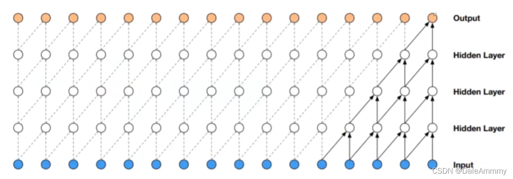
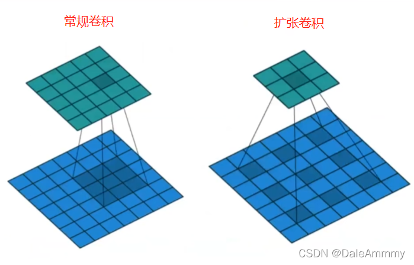

2017年Google提出[WaveNet: Google Assistant's Voice Synthesizer](https://towardsdatascience.com/wavenet-google-assistants-voice-synthesizer-a168e9af13b1)，这是一个基于一维卷积的时序处理算法，并且应用到了Google语音助手上。他的核心就是：扩张因果卷积。
## 何为因果卷积
通俗来说，当前时刻的果一定是之前种下的因。现在的数据一定是之前数据演变来的。那么我们去做一个卷积，$x_0$和$x_1$卷积得到${x_0}^{'}$，$x_1$和$x_2$卷积得到${x_1}^{'}$，那这个时候就会发现，0时刻数据和1时刻数据关联起来，1时刻数据和2时刻数据关联起来了，但这也是一个问题，当前时刻怎么可以和下一时刻产生关联呢？所以我们需要做一个padding处理，即$x_0$之前填充一些0，$x_n$之后填充0，那么$x_0 x_1$以及之前填充的0一起卷积得到${x_1}^{'}$，这样就不会时空错乱。
## 何为扩张卷积
纠正时序错位问题后，这种卷积方式还有一个最大的问题，就是感受野太小。

比如我们这样辛苦卷了4次，他才只能捕捉到5个序列数据，之前我们的填空例子都至少需要捕捉13个序列数据才能捕捉到，如果继续增加卷积层数那对计算量的要求是非常大的，所以提出了扩张卷积的办法：

常规卷积的dilation=1，3*3的kernel只会扫到3*3的面积，但如果dilation=2，3*3的kernel就会扫到5*5的区域。

引用[知乎：WaveNet的Pytorch实现](https://zhuanlan.zhihu.com/p/231108835)的图：
如果我们每层的dilation=2^n，那么就能够捕捉到整个序列的信息。这个时候我们抽取到的数据就非常具有全局性。然后我们把抽出来的数据进行进一步处理即可。
