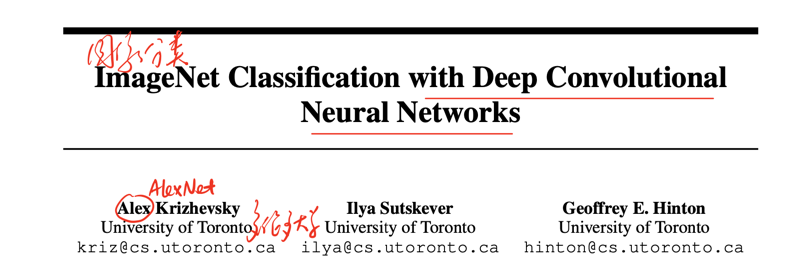
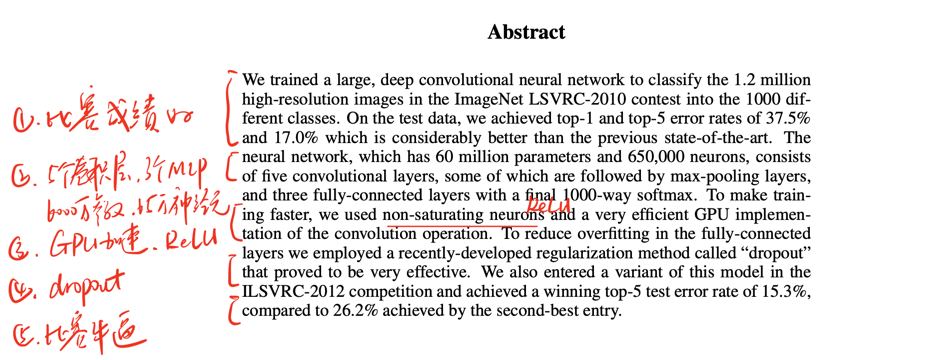
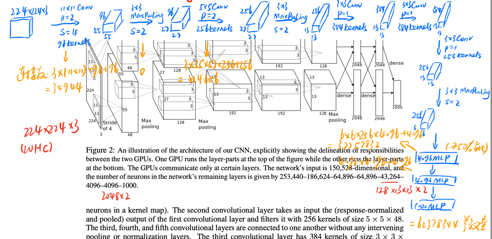

[ImageNet Classification with Deep Convolutional Neural Networks](https://proceedings.neurips.cc/paper/2012/file/c399862d3b9d6b76c8436e924a68c45b-Paper.pdf)

### 原文训练条件

2 x GTX 580 (3Gb per GPU)

### 模型地位
2012年提出，TOP5高达15.3%提升

### Title and Authors


这篇是卷积网络开启图像分类的开山之作，作者是来自多伦多大学的Alex，因此这个网络也被叫做AlexNet。

这篇文章的思路非常简单，既然是图像的1000分类任务，并且传统方法不好，就提出可以用卷积网络抽feature map再用全连接层做分类。

### Abstract


几乎所有发表在会议上的论文Abstract写作结构都是类似的。在后面我们会看到很多这样的写作结构。首先第一句简单介绍一下模型的成绩。接着开始介绍模型的结构。然后介绍一下模型的特点。最后再吹一下在某个或某些任务上多么多么厉害。

**这些基础模型论文提出的很多想法现在看来都是过时的，为了省一点工作量，也为了节省大家时间，因此就讲网络结构以及可以改进的点**

### 网络结构



在AlexNet中，如何绘制网络图（表）还没有统一的审美定式。在这里我重构了一下网络的逻辑。现在模型的参数量可以直接调包计算，但这里还是需要给大家讲一下具体怎么算的，这样才能在自己设计模型的时候知道如何改进。

- 输入224 * 224 * 3的图像
- 11x11卷积，96kernels，padding2，stride4 -> 55 * 55 * 96
- 3x3最大池化，stride2 -> 27 * 27 * 96
- 5x5卷积，256kernels，padding2 -> 27 * 27 * 256
- 3x3最大池化，stride2 -> 13 * 13 * 256
- 3x3卷积，384kernels，padding1 -> 13 * 13 * 384
- 3x3卷积，384kernels，padding1 -> 13 * 13 * 384
- 3x3卷积，256kernels，padding1 -> 13 * 13 * 256
- 3x3最大池化，stride2 -> 6 * 6 * 256
- （张量拉长）
- 4096kernels MLP
- 4096kernels MLP
- 1000kernels MLP（1000分类任务）

> 卷积参数计算

以第一个11x11卷积为例，他的参数量$3\times11\times11\times96+96=34944$，它表示3个通道，每个通道11x11卷积运算，形成96个通道

> 池化参数计算

池化并不涉及可学习参数

> MLP参数计算

以第一个全连接层为例，他的参数量是$6\times6\times256\times4096+4096=37752832$，它表示6 * 6 * 256的图被拉长后，映射到4096个神经元上。

第二个全连接层，他的参数量是$4096\times4096+4096=16781312$

可以发现，AlexNet第一个MLP的参数量非常庞大达到了37M，第二个全连接层也达到了16M的量级，而整个模型的参数不过62M，全连接层的参数量占了整个模型50%以上。因此优化参数的主要方向就是如何优化这个线性网络。（当然卷积网络也大有优化空间，但是卷积网络的优化主要是提升效果，而全连接层的优化是提速瘦身减负）

### 代码

```python
import torchvision.models
# 加载预训练模型把pretrained改为True即可
torchvision.models.AlexNet(pretrained=False)
```