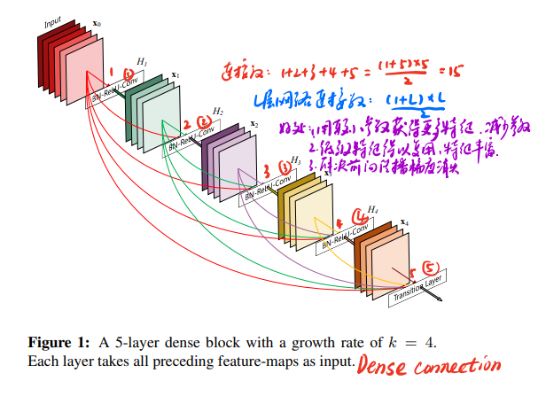
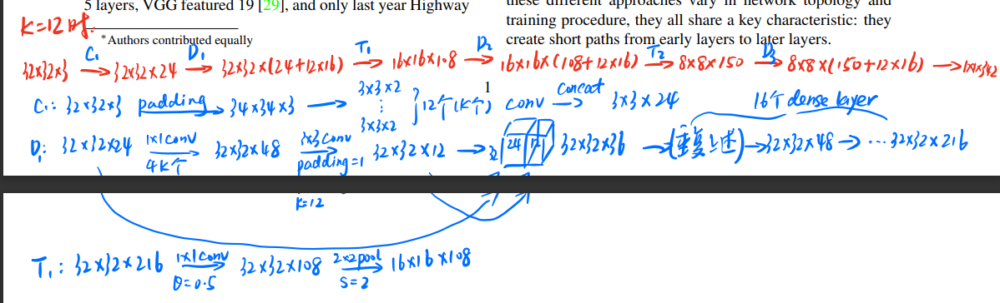
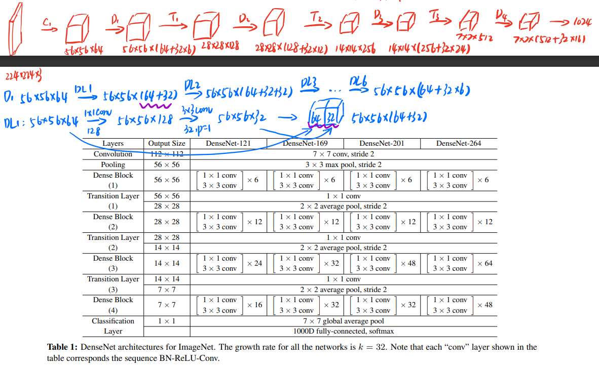
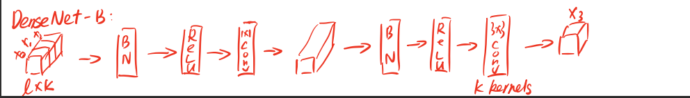
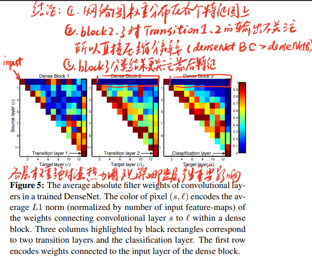

[Densely Connected Convolutional Networks](https://arxiv.org/abs/1608.06993)

### 模型地位

2017CVPR best paper，基于ResNet，short paths（参考文献11 13 17），特征复用（参考文献23 40 41），创建结构级联，通过稠密连接对残差学习有了更深的理解。

DenseNet仅用了ResNet 1/3的参数量，效果就超越了ResNet。

### 稠密连接

block内部示意图：



所谓的稠密连接，就是把前面网络层的输出作为后面网络层的输入，增强模型对特征的抽取能力。和ResNet残差连接不同的是，ResNet只有一层残差连接，而稠密连接把前面k层的结果都统一整合输入。

### DenseNet结构

在看整体结构前，需要知道每一步的分解结构。具体的有C D T。



把这些结构最终组合起来就可以得到DenseNet的结构。



DenseNet的稠密连接，本质上就是把feature map堆叠在后面，增加通道数。

论文提出了DenseNet-B，DenseNet-C，DenseNet-BC。其中DenseNet-BC-190成绩最好，并且DenseNet的性能随着k和L的增大而提升。



### 有意思的结论



作者通过对每一层网络稠密连接权重的计算可视化发现：

- 网络图的权重分布在各个特征图上
- block2 3对Transition1 Transition2的输出不关注，所以直接压缩分辨率的做法（denseNet-BC效果优于denseNetB）
- block3分类结果更关注靠后的特征

### 代码

```python
import torchvision.models
# 加载预训练模型把pretrained改为True即可
torchvision.models.densenet121(pretrained=False)
```