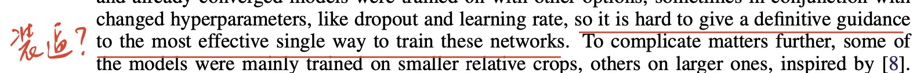
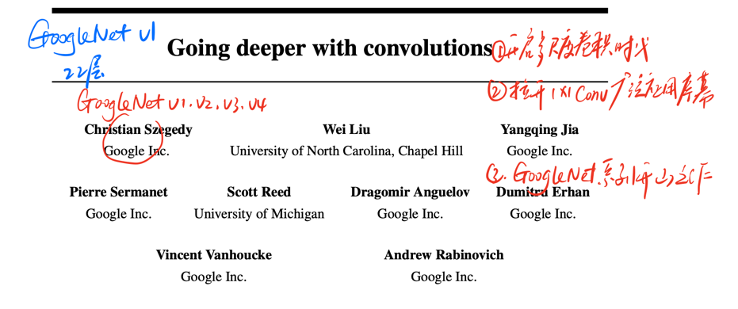
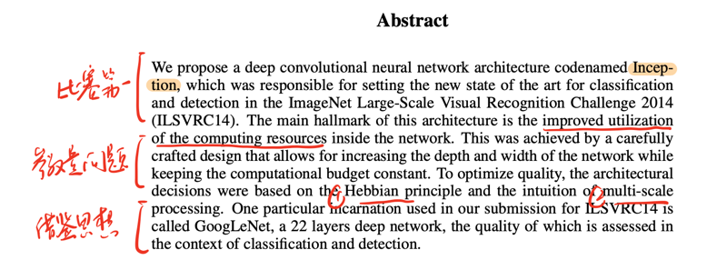
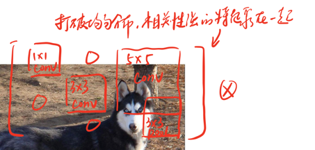
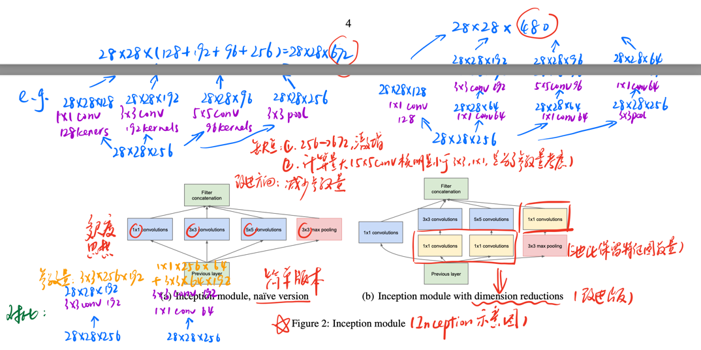
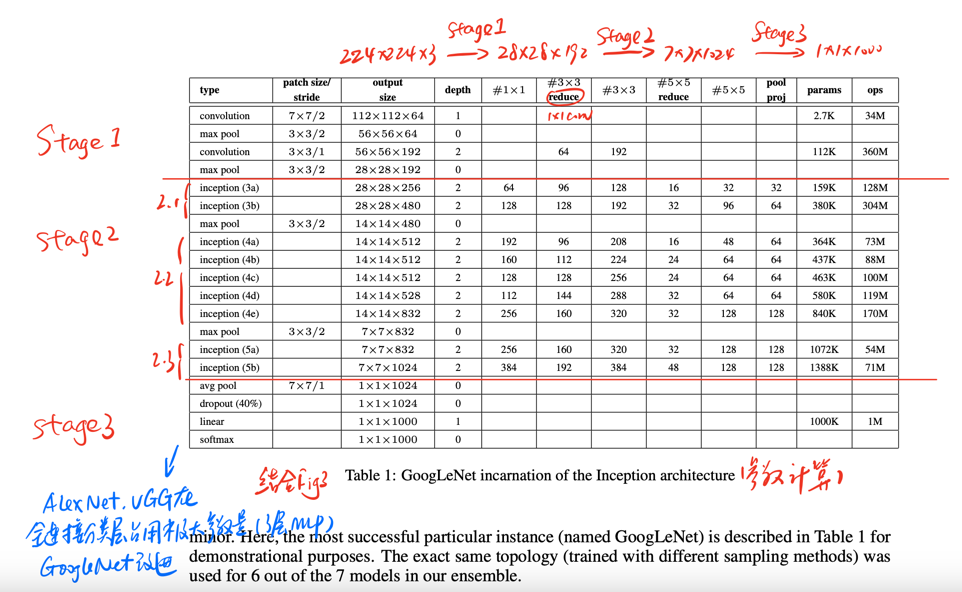

[Going deeper with convolutions](https://arxiv.org/abs/1409.4842)

### 原文训练条件

GoogleNet系列主打有钱任性，如图：

### 模型地位
2014年提出，TOP5高达6.6%提升

和vgg同年提出，效果并没有vgg出色，但是随着后续googlenet_v3的提出，一个集大成者的时代统御者就横空出世了。

### Title and Authors

这篇文章作者单位放眼看去，一众Google Inc.（谷歌公司），因此该模型架构也被称作GoogleNet。其中一作贯穿整个GoogleNet系列。

通过题目不难看出，GoogleNet的基本思想和vgg是类似的，即加深网络，用更强大的算力抽取更多特征，获得更好的效果。

### Abstract

这篇摘要并没有特别需要讲明的东西，只有最后，作者提到本文借鉴了多尺度卷积的思想，至于这个多尺度是怎么回事，论文有图说明，但是在看论文图之前，先尝试用一种简单粗暴易于理解的方式来看看：

所谓多尺度卷积，作者就是用不同大小卷积核抽取图片特征再concat到一起形成一个多通道feature map。因为作者发现，有一些相似的图分类难度大，主要是因为用同样尺寸的卷积核抽取特征，实际上对于某些特定部位，用更大或者更小的卷积核效果更好：

### Inception结构

作者提出了两个Inception结构，一个是naive（普通版），一个是dimension reductions（改进版）。具体的尺寸和结构在上面已经做好批注：

可以发现改进版和普通版最大的区别在于用1x1卷积把通道数改变后再用普通版里多尺度卷积核进行卷积计算。简单来说，就是在普通版的基础上增加了1x1卷积改变通道，减少参数量。

### 网络结构

整个网络的设计分3个阶段，阶段一就是最传统的，卷积池化卷积池化。最大的特色在阶段二。

我们以池化作为分割点，阶段二又可细分为2.1，2.2，2.3三阶段。具体Inception结构已经展开讲过，就不再赘述。

三阶段就是分类层，可以发现在GooleNet_v1一改AlexNet和VGGNet的三层mlp，换成1层softmax(linear)。正如AlexNet和vgg计算的那样，替换掉4096层线性层，将会极大的减少参数量。在vgg也看到，增加卷积层对参数的影响十分有限。

因此在替换掉mlp极大瘦身后，GooleNet_v1非常用力的加深卷积层（横行和纵向同时加深），用来提升模型抽取特征的能力。

### 代码

由于在日常使用时往往使用GooleNet_v3，因此v1就不做代码示例。