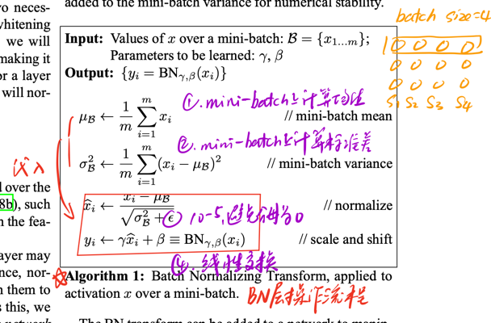

[Batch Normalization: Accelerating Deep Network Training by Reducing Internal Covariate Shift](https://arxiv.org/abs/1502.03167v3)

### 模型地位

2015年，最大的贡献是提出了Batch Normalized思想，一个即插即用的工具，不仅CV，在NLP中（Layer Normalized, LN）也有广泛应用，可以说是以一己之力加速了网络发展。

### Title and Authors

为了解决内部协变量偏移设计从而加速神经网络训练的BN层。

最直观的加速数据，在GoogLeNet v1的基础上，增加BN层，收敛提速数10倍。

### Abstract

摘要首先提出，数据分布的变化是导致训练困难的重要因素。深度学习和机器学习的核心，都是学习一种概率分布，如果数据分布十分混乱，拟合效果差也是理所当然。也因此，很多学者在这个时期在努力设计不同的权值初始化的方式，如果权值初始化做得好，对特定数据集就有非常好的提速效果。

第二，作者认为调低学习率，初始化权值可以解决这个问题，但是速度非常慢。

因此，作者就希望可以提出一种方式，让保持高学习率加速模型的同时，还不用初始化权值，也能获得极好的学习效果。

接着，作者说这个BN层的设计可以加速14倍，并且还能提高学习精度。

### Batch Normalization的优点

在摘要部分作者提到，BN可以保持大学习率还不用设置各自权值初始化的方式，是一个大通解。

此外，BN还可以不用L2正则或者较小的weight decay，也不用dropout，更可以不用LRN。LRN的抛弃表示AlexNet彻底推出历史舞台。

### 内部协变量偏移是什么

我们用最简单的input layer - hidden layer - output layer结构做例子。我们可以通过数据标准化的办法保证input layer数据分布差异得到控制。但是随着网络的加深，进入hidden layer之后，训练往往不受控制，本来规整的数据进入网络逐渐变得不规整，并且hidden layer i和hidden layer k之间的数据分布差异是不可以标准化解决的。这就是内部协变量偏移。

### Batch Normalization的本质

一共有两步计算：

- 去均值

$$mean(x- \bar x) = 0$$

- 标准差规范化

$$std(\frac{x}{std(x)}) = 1$$

所以总的步骤就是：

$$\hat x_i = \frac{x_i-\mu_B}{\sqrt{\sigma_B^2+\epsilon}}$$

这里的$\sigma_B^2$是方差，$\mu_B$是均值，$\epsilon$只是为了让分母不为0，人为加的一个非常小的数（1e-5）。

### Sigmoid(BN)组合拳

当batch dataset经过BN后，数据分布会变得规整。例如[1,2]就变成[-1,1]。

并且，把这些值放在sigmoid上，会发现刚好在线性区域，不会出现梯度消失。这可以算作BN的另一个优点。