[Rethinking the Inception Architecture for Computer Vision](https://arxiv.org/abs/1512.00567)

### 模型地位

2015年提出，TOP5 accuracy从v2的4.9%下降到3.5%，重做v1的inception结构，推翻v1部分工作，提出了多个inception结构的改进设计，是GoogLeNet后来使用最广的模型，也是这个系列的巅峰之作。

### Title and Authors

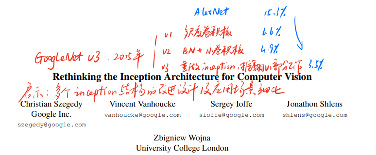

标题非常简单，重新思考inception结构在CV的应用。因此这篇研究最最最核心的点，就是如何重新设计inception，以及为什么要这么设计。

### Abstract

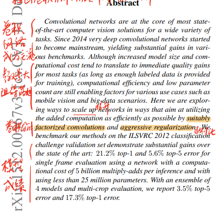

摘要部分，作者首先提到参数量大是阻碍卷积网络发展的主要原因。这里的潜台词就是我们希望降低参数量。接下来，作者就提到，可以通过卷积分解和正则化的方式来实现，因此推出了新inception结构，并且屠榜。

因此，GoogLeNet_v3解决的是v1和VGG落地困难问题，具体而言，他增加了v2的Batch Normalization层提高效果，并且提出了4个卷积网络的设计准则。

### 4个模型设计准则

> 个人浅见：这四个准则很可能是做完了消融实验，然后回头来补的，典型的先拿到结果再推原因，因为完全没有理论证明，是彻底的经验之谈。

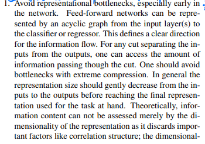

准则1. 避免信息瓶颈。这个准则的意思是，池化层会将特征图变小，信息就会损失。（这个是显然的）

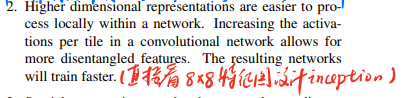

准则2. 采用高维度的表示方法更容易处理网络局部信息。（有点强行解释）

关于准则2，具体直接看论文的Fig7

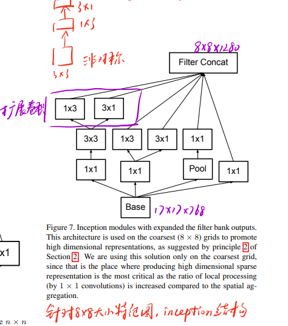

对于3x3卷积，他分解成了1x3和3x1两个非对称矩阵。

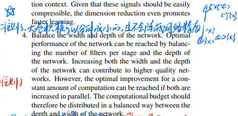

准则3就是说的这个事，大卷积核可以分解成小卷积核，并且不会降低网络的精度。这里的分解除了上面的3x3分解成1x3和3x1，也有5x5分解成2个3x3。

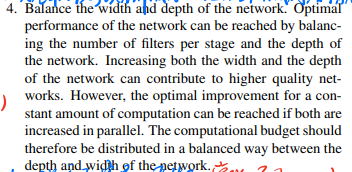

准则4. 考虑深度和宽度的平衡。这个是常识。

基于这4个准则，GoogLeNet_v3的核心昭然若揭，5x5分解成两个3x3已经是VGG的研究，如何设计这样的非对称卷积分解将是核心创新点。

> 关于5x5分解成2个3x3如何降低28%参数，可以查看[VGG论文精读](paper_read/cv/ILSVRC/vgg/)

### 非对称卷积设计

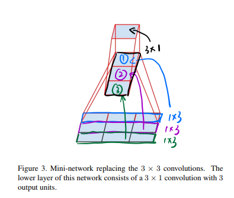

如果用3x3的卷积核对这个3x3的feature map卷积，会得到一个1x1的结果，如果先用1x3抽取3次，得到一个3x1的feature map，再用一个3x1的卷积最终也会得到一个1x1的结果。这就是分解卷积的示意。

### Inception结构变化

> v1版inception

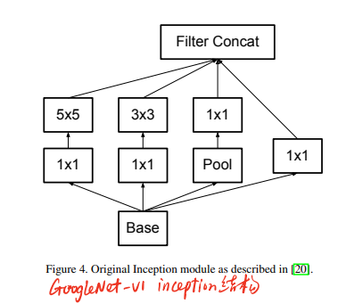

> v2版inception

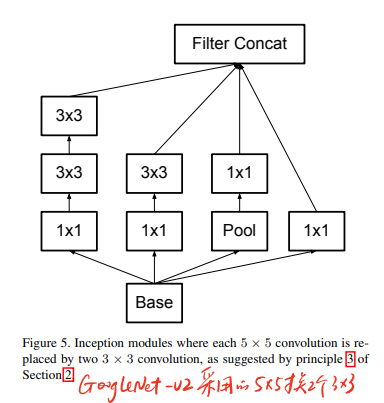

v2的改进在于用3x3替换5x5卷积。

> v3版inception

v3在非对称卷积的基础上，对inception结构进行了细致化的设计。

对于17x17的feature map，使用如下的inception结构：

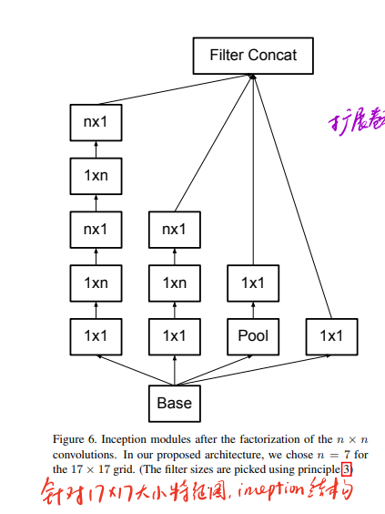

对于8x8的feature map，使用如下的inception结构：


### 推翻v1的辅助分类层

在v1的inception堆叠模式里，会输出一些辅助分类层，即提前把结果输入一个分类网络得到一个分类结果，这是为了防止模型过深导致梯度消失，并且作者相信越底层的模型，抽取的特征没有那么抽象，往往可以聚焦更底层的抽取能力。

在v3里，作者推翻了这个设计，作者认为：

- 辅助分类层在初期并没有作用，不存在提升底层提取能力
- 移除了第一个辅助分类层并不影响结果
- 辅助分类层的作用实际上就是正则作用
- 在针对17x17的inception结构后接入辅助分类层。

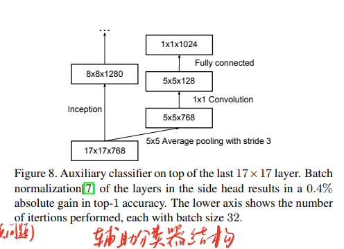

### 根据准则1，优化池化信息瓶颈

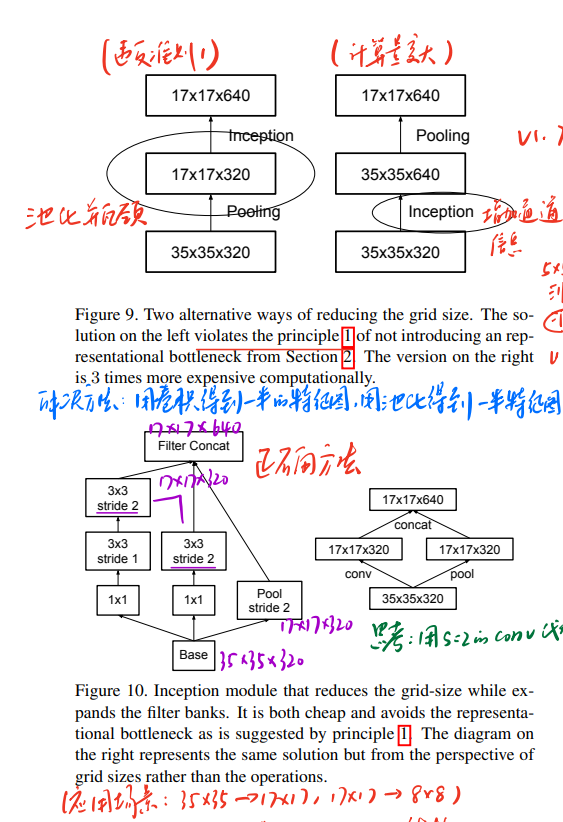

图9展示了池化瓶颈的问题，因为先池化再inception会导致信息损失，因此直接用inception结构在池化前抽一次特征才是符合准则1的设计。

除了数据流顺序设计以外，图10解决方法是卷积和池化得到的特征图进行融合，最大程度保证信息涵盖。

### Inception-v2

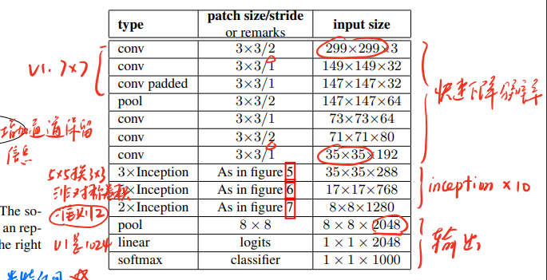

首先迅速的降低分辨率，然后使用设计的inception结构抽取特征，最终再接入分类网络输出分类结果。

> 思考：如何适应低分辨率图片？

以(79,79)图片为例，如果直接resize(79,79) -> (299,299)会失去精度，因此可以把第一个卷积层的s=2改为1，用于(151,151)的图像，再移除第一个池化层，用于(79,79)

### 标签平滑

作者认为非0即1的标签结果会导致过拟合，客观的想确实也有道理，例如一个图片分类是桌子，难道他和木头，椅子这些就没有一点关系吗。以4分类为例，label=(0,1,0,0)，作者通过标签平滑的方式，得到最终的平滑标签$(\frac{0.001}{4}, 1-0.001+\frac{0.001}{4}, \frac{0.001}{4}, \frac{0.001}{4})$，有点削峰填谷的意思。

在论文中作者用交叉熵计算进行了推导，本质上，就是让真实标签逼近平滑后的预测标签，例如让[0,1,0,0]逼近[0.05, 0.9, 0.05, 0]

### 代码

```python
import torchvision.models
# 加载预训练模型把pretrained改为True即可
torchvision.models.inception_v3(pretrained=False)
```
