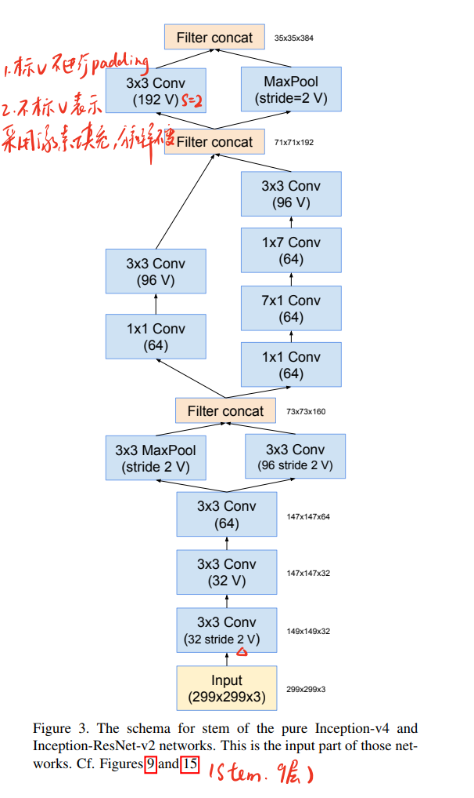
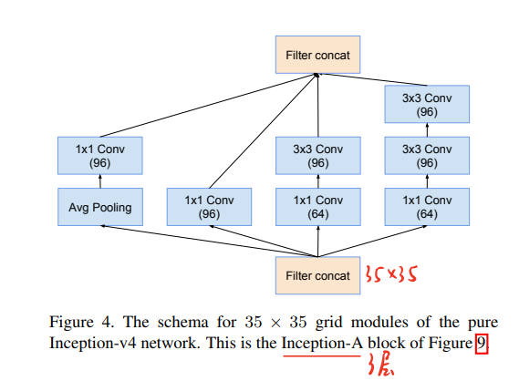
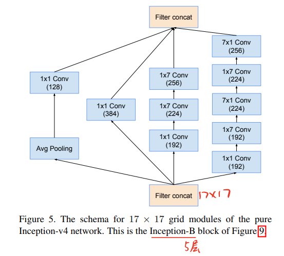
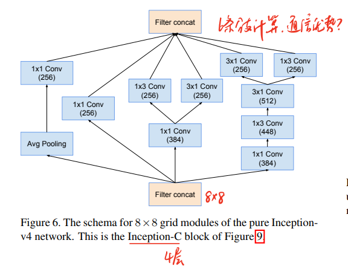
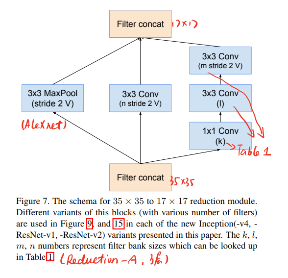
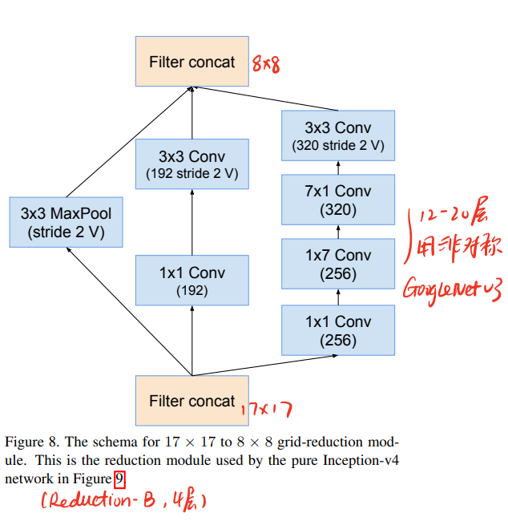

[Inception-v4, Inception-ResNet and the Impact of Residual Connections on Learning](https://arxiv.org/abs/1602.07261)

> 这篇论文一共20张图，其实看图就能明白网络设计

### 模型地位

2017年GoogLeNet的收官之作，在ResNet的基础上，对GoogLeNet_v3的inception结构进行了进一步的设计。并且在ILSVRC屠榜。不过，v4的设计已经背离了通用网络的设计初衷，变成了一个为了ILSVRC屠榜而存在的模型，因此人们对v4的评价褒贬不一，(我自己是从来没用过v4)，从结果上看，更常被人们使用的网络仍然是v3。

### Inception-v4 & Inception-ResNet

从标题看，设计了两种Inception结构，分别是Inception-v4和Inception-ResNet

$$Inception-v4  \left\{ 
    \begin{aligned}
    &Stem  \cr 
    &Inception-A/B/C \cr 
    &Reduction-A/B
    \end{aligned}
\right.$$

$$Inception-ResNet  \left\{ 
\begin{aligned}
    v_1  \left\{ 
    \begin{aligned}
    &Stem  \cr 
    &Inception-A/B/C \cr 
    &Reduction-A/B
    \end{aligned}\right.
    \\
    v_2 \left\{ 
    \begin{aligned}
    &Stem  \cr 
    &Inception-A/B/C \cr 
    &Reduction-A/B
    \end{aligned}\right.
\end{aligned}\right.$$

> Stem

> Inception-A

> Inception-B

> Inception-C

> Reduction-A

> Reduction-B

