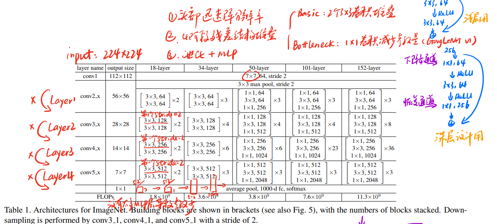
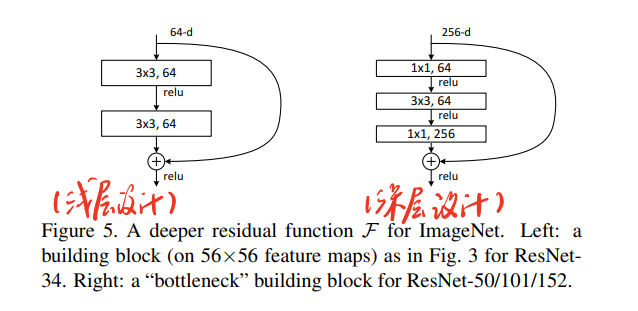
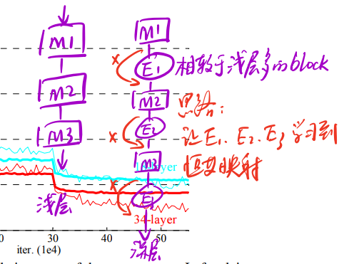

[Deep Residual Learning for Image Recognition](https://arxiv.org/abs/1512.03385)

### 模型背景

2015年arVix上刊登了一篇《Highway Network》，参考LSTM网络，对网络设计进行了优化：

> 正常网络： x -> Net -> y，$y=H(x.W_H)$

> Highway Network：x -> Net1,Net2 -> y，$y=H(x,W_H) \cdot T(x,W_T)+x \cdot C(x,W_C)$，这里的$T(x,W_T) C(x,W_C)$都是权重

实际上，对于Highway Network，可以只用一个权重：$y=H(x,W_H) \cdot T(x,W_T)+x \cdot (1-T(x,W_T))$，恒等映射如下：

$$y = \left\{ 
    \begin{aligned}
    &x & &T(x,W_T)=0 \cr 
    &H(x,W_H) & &T(x,W_T)=1
    \end{aligned}
\right.$$

用Highway Network的思想，就可以把网络做的更深，因为当$H(x,W_H)$梯度消失时，还有另外的一个调节参数。可是，由于$T(x,W_T)$是带参的，实际上可以进一步优化。这就是ResNet做的工作。

### 模型地位

2016年横空出世，把残差网络发扬光大，让网络的层数可以达到1202层，是现在所有深层网络的核心。但它不是第一个提出残差网络的。

ResNet融合了3x3卷积（VGG），block堆叠（GoogLeNet），分辨率下降通道数翻倍（VGG）的思想，设计了更深更好用的网络。

### 残差学习（Residual learning）

网络结构：x -> block -> H(x）

$$F(x) = W_2ReLU(W_1X)$$
$$H(x) = W_2ReLU(W_1X)+X$$

让网络拟合H(x) - x，而不是H(x)，但整个block仍然拟合H(x)

> 为什么拟合F(x)让block更容易学到恒等映射？

$$H(x) = F(x) + x = \left\{ 
    \begin{aligned}
    &x & & F(x)=0 \cr 
    &others 
    \end{aligned}
\right.$$

当深层网络为0也不影响H(x)。换言之，不会存在梯度消失。
$$\frac{\partial H}{\partial x} = \frac{\partial F}{\partial x} + 1$$

为了保证x和F(x)维度相同：

- 全0填充
- 遇到size变化的block网络映射到相同的size
- 所有block的x都采用网络映射

### ResNet结构

ResNet的设计取消了MLP堆积，导致参数量极速下降，最直观的体现在，34层的ResNet参数比19层的VGG还要少。





可以用下图抽象表示深层设计和浅层设计：



### 代码

用resnet18示例

```python
import torchvision.models
# 加载预训练模型把pretrained改为True即可
torchvision.models.resnet18(pretrained=False)
```


