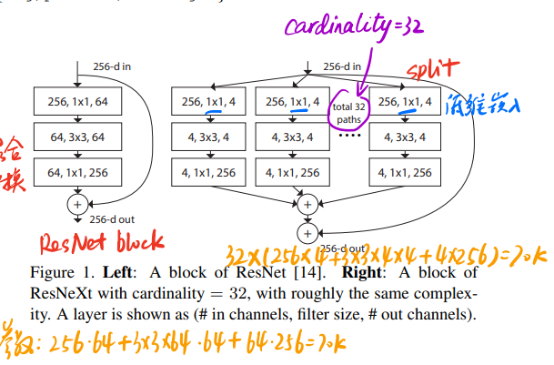
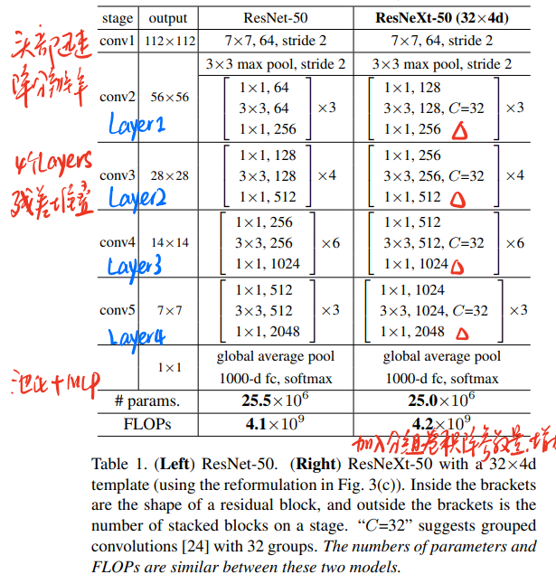
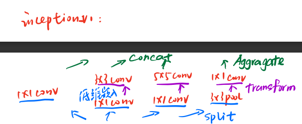
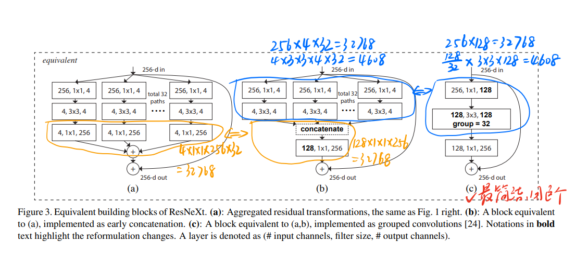

[Aggregated Residual Transformations for Deep Neural Networks](https://arxiv.org/abs/1611.05431)

### 模型地位

ResNeXt是ResNet加上分组卷积的改进版。ResNet的作者何凯明并不是本文的一作。ResNeXt身上有VGG，ResNet，Inception的影子，它提炼了split-transformer-merge思想，提炼block堆叠思想，引入cardinality指标为CNN设计提供思路。

所谓split-transformer-merge，即聚合变换，文章介绍了有三种等价的block形式。

ResNeXt由于其强大的深度学习能力和深层网络设计，1K分类的数据集已经不足以发挥其全部潜力，甚至使用了5k分类的数据集。发布至今，仍然是非常强大的分类模型，有非常广泛的应用基础。

### 聚合变换



论文图1展示了这种聚合变换的形式，左边是ResNet的block结构，右边是ResNeXt，两边的参数量是一样的，但是右边的卷积核数量变得更多。对于左边而言，一共有64+64+256=384个卷积核，右边有(4+4+256)*32=8448个。相同的参数，增加了更多的卷积核，就赋予模型更强的抽取特征的能力。

对于单个神经元：

- split：X分解为0个元素 <=> 低维嵌入
- Transforming：每个元素进行变换，次出对应$w_ix_i$乘法
- Aggregating：对D个变换后的结果进行聚合，其实对应$\sum$求和，即$\sum_{i=1}^Dw_ix_i$

### ResNeXt结构



整体设计的思路仍然是迅速降低分辨率后通过深度网络抽取特征，然后全连接层+softmax实现分类。

在这里可以看到inception-v1的影子：



inception-v1仍然是分组，用不同的卷积核卷积然后聚合的过程。只是设计实现更复杂，不能用同样的block堆叠。

在增加残差结构后，网络示意图如下：



左1是32个cardinality堆叠的残差网络，参数量4x1x1x256x32=32768个，实际上这个模式可以优化成中间形态，把最后一层给合并成一个4x32，1x1，256的网络层，这样参数仍然是4x32x1x1x256=32768，同样的思路可以把第一层合并，最终得到右边最简单的形态。中间是没有合并的，只是图画在一起。

### 代码

以论文ResNeXt-50(32x4d)为例，实际上改成ResNeXt101这样更大的预训练模型。

```python
import torchvision.models
# 加载预训练模型把pretrained改为True即可
torchvision.models.resnext50_32x4d(pretrained=False)
```
