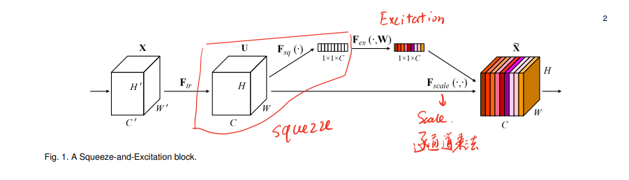
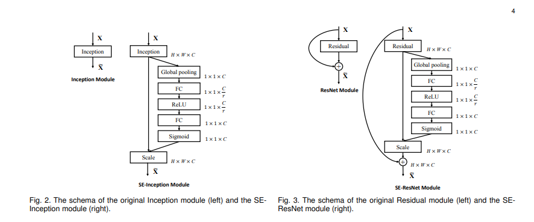

[Squeeze-and-Excitation Networks](https://arxiv.org/abs/1709.01507)

### 模型地位

ILSVRC最后一年（2017年）的榜1大哥，实际上它并不是一个特定结构的模型，SENet和Batch Normalization，ResNet一样，更像是一个即插即用的插件。在传统的CNN架构中，通常采用卷积层和池化层来提取图像特征。然而，这种方法并没有明确地对特征通道之间的关系进行建模，导致一些通道对于特定任务的贡献相对较小，而其他通道则更重要。SE模块旨在解决这个问题。简而言之，SENet就是希望通过引入注意力机制，让模型对更重要的feature map给予更高关注。任何一个模型引入SE Module都可以称为SENet。

### SE Module设计



整个SE Module可包括Squeeze（压缩），Excitation（激励）和Scale（加权）三个子模块。

> Squeeze

压缩操作是为了降低特征图的维度，这样做可以把整个feature map的信息融合到一个特征向量中，可以捕捉不同通道之间的权重关系。

想要实现融合到一个特征向量里也非常简单粗暴，直接进行一个全局平均池化即可。

> Excitation

激励操作的核心在于把通道的特征向量映射到$Y_1$上，即激活这个向量使得在高维空间拥有更丰富的表示可能。方式也非常简单，直接使用一个线性层激活即可。即：$Y_1 = ReLU(W_1Z)$

然后把这个$Y_1$再次进行特征变换和抽取，得到$Y_2=Sigmoid(W_2Y_1)$。不过这里的Sigmoid函数是否真的科学在今天看来，是存疑的。

总而言之，在excitation部分可以通过以下计算得到每个通道的权重向量：

$$Y_2=Sigmoid(W_2ReLU(W_1Z))$$

$$Z = GlobalAvgPool(X)$$

> Scale

将学习到的权重向量$Y_2$应用于输入的特征图$X$上的每个通道。对每个通道$X$，将其特征图$X_c$与权重$Y_{2c}$相乘得到加权feature map：

$$X^{\prime}_c = X_c \cdot Y_{2c}$$

最后，将所有加权的特征图重新组合起来，得到最终的输出特征图$X^{\prime}$

因此整个SE module可以表示为：

$$X^{\prime} = Scale(X) = X\cdot Sigmoid(W_2ReLU(W_1 GlobalAvgPool(X)))$$

### Inception & ResNet即插即用



### 代码

由于SE Module并不是一个网络结构，因此手动实现一下，在实际使用的时候只需要修改MLP网络即可。

```python
import torch.nn as nn
import torch.nn.functional as F
def SENet(input,linear1_output_dim, linear2_output_dim):
    #全局平均池化
    x = nn.AdaptiveAvgPool2d((1,1))(input)
    x = x.view(1, -1)
    #第一个全连接层
    x = nn.Linear(根据输入自己写, linear1_output_dim)(x)
    x = F.relu(x)
    #第二个全连接层
    x = nn.Linear(linear1_output_dim, linear2_output_dim)(x)
    x = F.sigmoid(x)
    # 修改shape完成最后的权重相乘
    x = x.view(input.shape[0], input.shape[1],1, 1)
    x = input * x
    return x
```