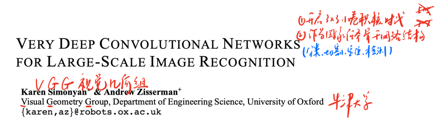
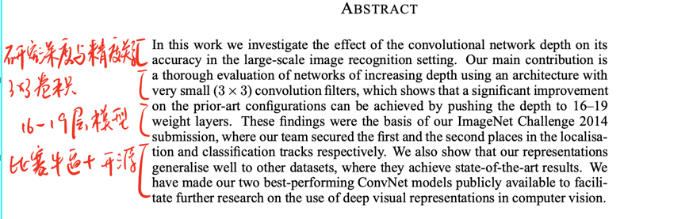
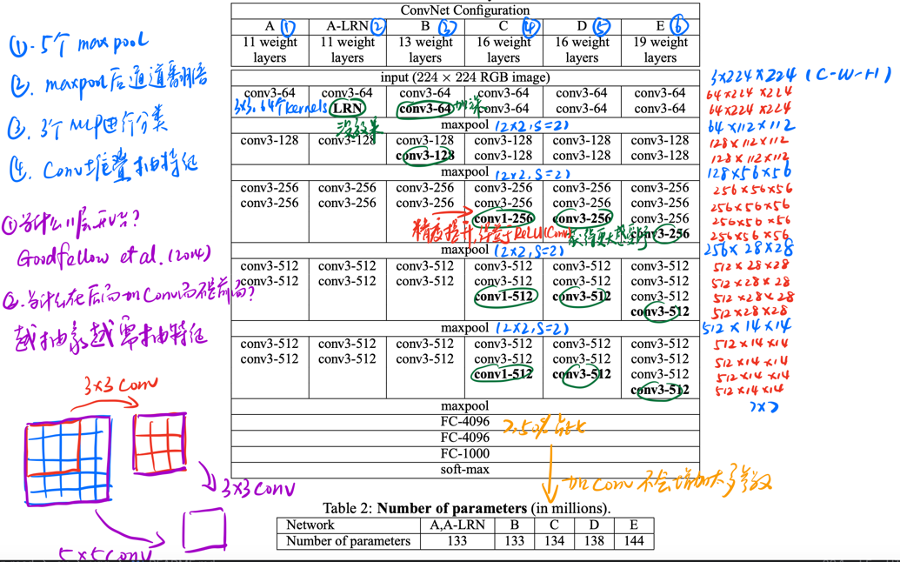
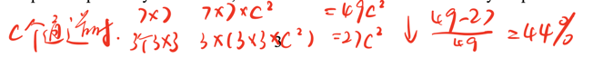

[VERY DEEP CONVOLUTIONAL NETWORKS FOR LARGE-SCALE IMAGE RECOGNITION](https://arxiv.org/abs/1409.1556)

### 原文训练条件

4 x Nvidia Titan (6Gb per GPU)

### 模型地位
2014年提出，TOP5高达7.3%提升

至于2013年，模型提升不大，所以提及很少。

### Title and Authors


该论文是牛津大学VGG视觉几何组提出来的，因此被称作VGGNet。前面的AlexNet也是用作者名字命名，由此可见这两篇论文的历史地位。并且VGG网络设计思想甚至在2023年的今天依然在很多论文可以看到。

### Abstract


VGG主要的贡献在摘要部分可以略知一二。首先，VGG认为小卷积核的效果比大卷积核更好，在AlexNet使用了11x11的卷积，在VGG之后，几乎不会再看到如此大的卷积。并且模型有11-19层几种设计，更适应不同的下游任务。

### 网络结构


可以发现一共有六种模型设计，其中A，A-LRN，B就不过多展开了。LRN技术如今看更是已经被时代抛弃。所以看CDE三个结构就行。

具体维度的变化在图中已经写明，3x224x224的图片进入网络后，通过卷积抽feature map扩大通道数然后用最大池化降一倍分辨率，接着继续卷积通道数翻倍，然后池化降一倍分辨率，如此循环，最终变成512x14x14的feature map。

最后一层池化后，把这512个7x7的特征图拉长，送入线性层分类。可以发现线性层的设计依然沿用AlexNet，因此参数依然非常大。

在Table2可以看到，从A到E，增加了数层卷积结构，参数变化非常小，所以这也为后人疯狂进行卷积堆积提供了思路。当然，一直堆卷积也会存在很多问题，最直观的问题就是梯度消失，后面会有文章专门解决。

作者在文中提出，两个3x3卷积可以等价一个5x5卷积，三个3x3卷积可以等价一个7x7卷积。这样做一方面，小卷积核捕捉局部信息更精准，另一方面，可以减少参数：



3个3x3卷积参数比一个7x7卷积设计下降了44%。

### 代码

```python
import torchvision.models
# 加载预训练模型把pretrained改为True即可
torchvision.models.vgg16_bn(pretrained=False)
```