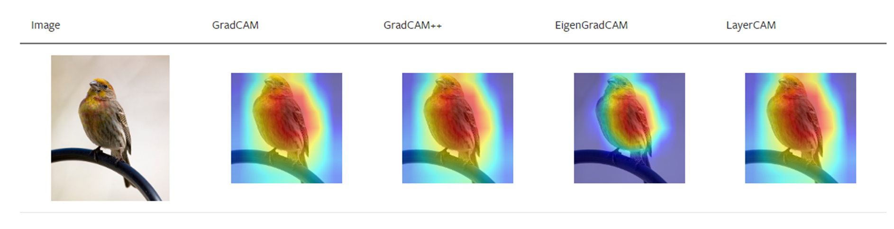
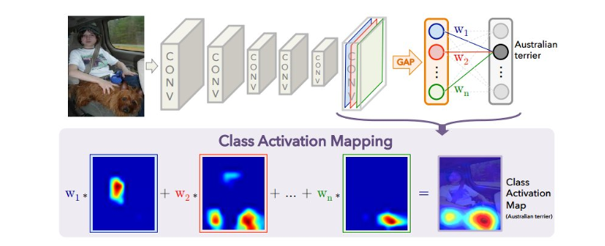
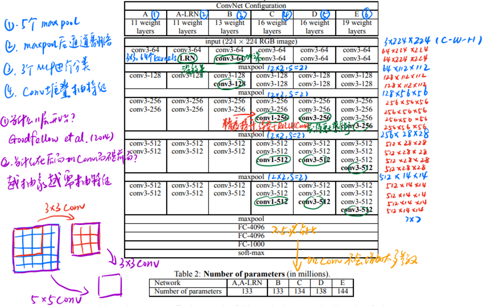
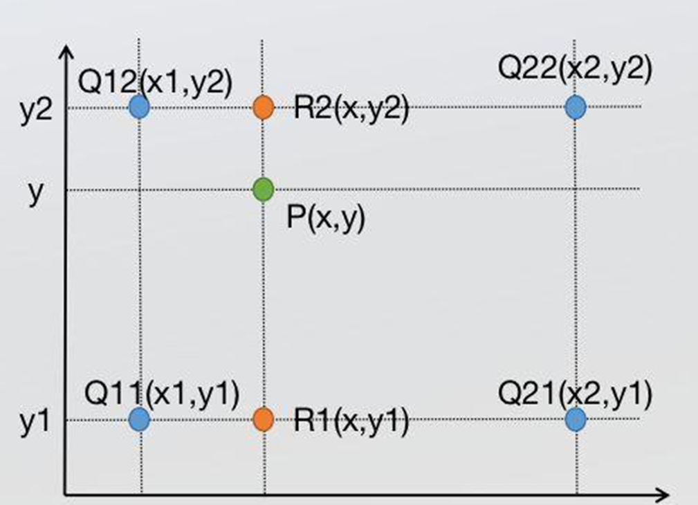
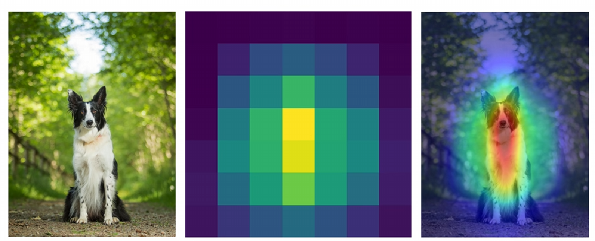
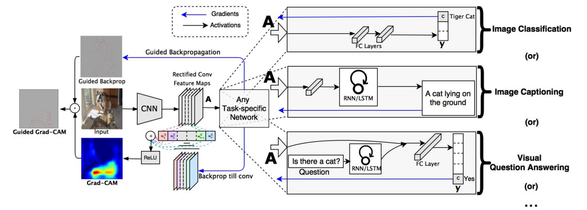
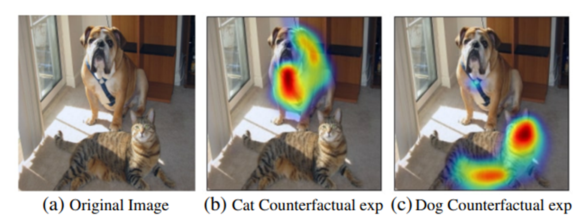
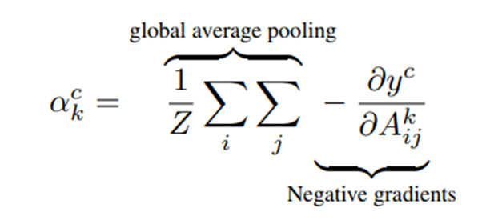
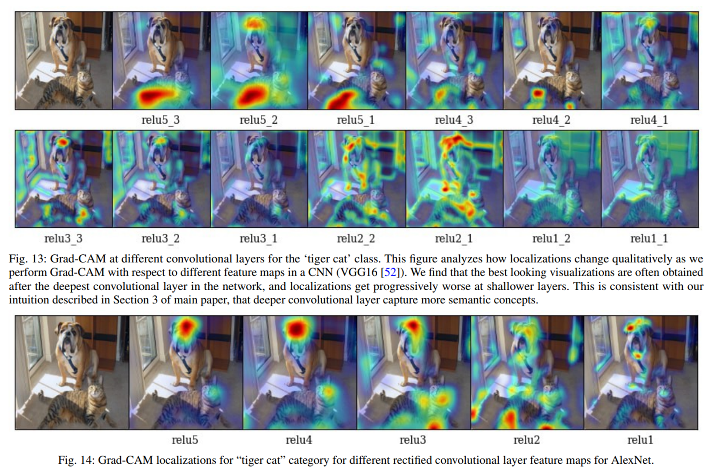

> 原文链接

[learning deep features for discriminative localization](https://arxiv.org/abs/1512.04150)

[Grad-CAM: Visual Explanations from Deep Networks via Gradient-based Localization](https://arxiv.org/abs/1610.02391)

[Grad-CAM++: Improved Visual Explanations for Deep Convolutional Networks](https://arxiv.org/abs/1710.11063)

[Score-CAM: Score-Weighted Visual Explanations for Convolutional Neural Networks](https://arxiv.org/abs/1910.01279)

[LayerCAM: Exploring Hierarchical Class Activation Maps for Localization](https://ieeexplore.ieee.org/document/9462463)

## 背景知识

计算机视觉模型往往被认为是一个黑匣子。类激活热力图是一种技术，用于可视化CNN在分类任务中关注的图像区域。它通过使用全局平均池化层代替传统的全连接层，结合卷积特征图和分类权重，生成热力图来显示哪些图像区域对特定类的激活贡献最大。

CAM 提供了一种简单有效的可视化方法，使得我们能够理解 CNN 模型的决策过程。不需要对模型结构进行大量修改，可以在训练好的模型上直接应用。有助于发现模型在分类过程中可能存在的错误和偏差，帮助理解数据集中的模式和特征。同样也可用于可视化模型在医学图像上的关注区域，辅助诊断。

## 基于mmlab的API

[MMPretrain的图像分类任务解决方案](cv/cls/)有CAM可视化相关API教程。

## 效果预览

## 核心图文

- 通过前向传播，获取输入图像在最后一个卷积层的特征图。
- 对每个特征图进行全局平均池化，得到每个特征图的全局平均值。
- 使用分类层的权重对全局平均池化后的特征进行加权。将加权后的特征图进行加权和求和，得到热力图。热力图的每个位置对应原图中一个区域的激活程度。
- 将生成的热力图上采样到原图的尺寸，使其与原图对齐，便于可视化。

> CAM相较于传统视觉分类网络的改动

如前文所述，不需要对模型结构进行大量修改，但同样存在一些变化。见上图，蓝色卷积层的所有特征值平均池化为一个值，其他卷积层都进行同样计算，可获得线性分类层的输入。这里和VGG这类卷积网络有一定区别，VGG网络线性层的输入是把最后一层卷积层全部展开，形成一个一维向量，如下图：

而CAM则是取消了展平操作，直接计算平均值作为一个线性层特征值输入。

这种做法的优点很明显，极大减少了计算量，我们知道VGG这类网络设计，线性层的参数数量对于模型整体参数量占比极大。但缺点也非常明显，如果使用改进的CAM可视化，则需要对模型底层代码进行改动，改写最后一层的操作。这一点在后面的改进算法中得到解决。

> 上采样（还原）操作

众所周知，最后一层卷积层往往是一个分辨率极低的图像，即使使用CAM获得在该图像上的热力图显示，依然无法匹配原图。因此我们需要把图像还原到原图像尺寸。这里使用的是非常经典的双插值，该算法和电脑、手机上对图像进行自由缩放应用广泛。

$$f(R_1)=\frac{x_2-x}{x_2-x_1}f(Q_{11})+\frac{x_2-x}{x_2-x_1}f(Q_{21})$$
$$f(R_2)=\frac{x_2-x}{x_2-x_1}f(Q_{12})+\frac{x_2-x}{x_2-x_1}f(Q_{22})$$
$$f(P)=\frac{y_2-x}{y_2-y_1}f(R_{1})+\frac{y_2-x}{y_2-x_1}f(R_{2})$$

简单来说，就是先横向按比例计算一次，再纵向按比例计算一次。

最终效果如图：

> GradCAM改进

这幅图右边的细分任务可以暂时不管，核心算法在左侧。和CAM相比，GradCAM全部照搬原网络结构，这意味着不需要对模型代码进行更高。在得到线性层（卷积层展平）后，进行全连接层通过矩阵乘法得到多分类对应不同类别概率。这一步即图中Any Task-specific Network。

得到概率后，GradCAM的思想是，他对某具体类别（视觉模型判断的最终分类结果，例如这个图片是一只狗，那就对狗的结果操作）进行全面反向求导，即对特征图里每一个数值进行求导。因为在神经网络中，所有的参数都是可以进行反向求导计算的（这也是可以更新所有参数的原因），因此可以得到这个类别在之前卷积层最后一层所有特征图上的权重。这个权重矩阵和最后一层特征图的尺寸是一致的，因为本身就是在特征图上对每一个数值进行的求导计算。

然后对这样计算得到的梯度特征图进行全局平均，即CAM的操作，再缩放到原来尺寸的图片上，即可实现可视化。

这篇论文有一个非常有意思的实验，如果把刚刚求得的权重取负号，再画热力图，那么狗的热力图就会画到猫上，这个反应的就是图像上和狗最无关的区域。例如我们在做工业质检模型，这样做可能画出的就是安全区，这样就是和缺陷最无关的区域。对于一些细粒度的研究这个有一定应用前景。

GradCAM算法无法对浅层网络进行类别判定，只能对深层模型进行可视化。这个缺陷在LayerCAM改进。