> 原文链接

["Why Should I Trust You?": Explaining the Predictions of Any Classifier](https://arxiv.org/abs/1602.04938)

## 背景知识

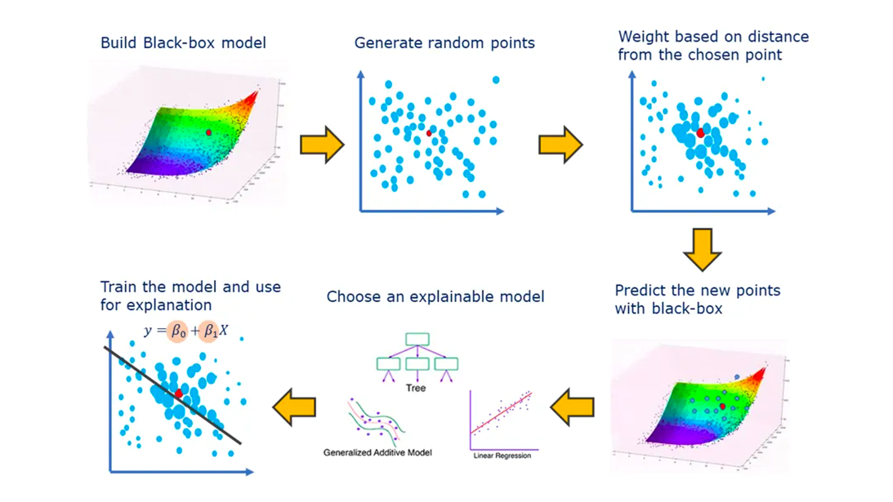

原来的模型是一个黑盒子，拟合的分类边界在高维空间非常复杂，那么只选择其中的一个待测样本，把这个数据的邻域数据生成出来，把这些数据生成出来后输入到原模型中获取这些邻域样本的预测结果，进而可以用他们的特征和原模型的预测结果去训练一个线性模型，那么这个线性模型近似的在局部领域拟合出原模型行为，这个线性模型训练得到的权重就可以反应各个特征的重要性以及每个特征的贡献程度。当然线性模型只是一个选择，可以选择决策树这些解释性非常好的模型。梳理一下，这是原模型的决策边界非常复杂，那我们弱水三千只取一瓢，只选取某一个样本，某一个待测样本，然后从他的领域生成一些领域样本，与待测样本近的权重高，与待测样本远的权重低，然后把这些样本统统输入到原始模型中获取预测结果，然后选择一个非常简单的可解释性模型去在局部拟合出原模型，那这个拟合出的可解释性的模型呢，通过它的权重，通过它的解释性，我们就可以分析出那些特征重要，那些特征不重要，那些特征对模型结果产生较大正向贡献，或那个特征对模型结果产生较大负向贡献。

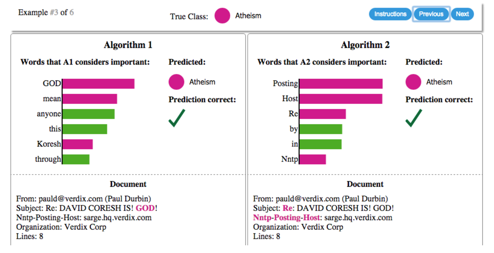

得到了每一个特征的重要性，就可以得到可解释的结果。这是基督教和无神论的案例，一封邮件到底是基督教还是无神论相关的呢。这里两个模型都预测了正确的结果，但是算法2用lime做可解释性分析，发现这些单词对结果影响大，但是这些单词都是英文中的废话单词，就证明这些单词是没什么信息量的，因此虽然它的预测结果可能是正确的，但是它没有学到和人类常识一致的特征，它的决策过程是错误的，打开模型的黑盒子，他们的脑回路是不一样的。

> LIME for Table

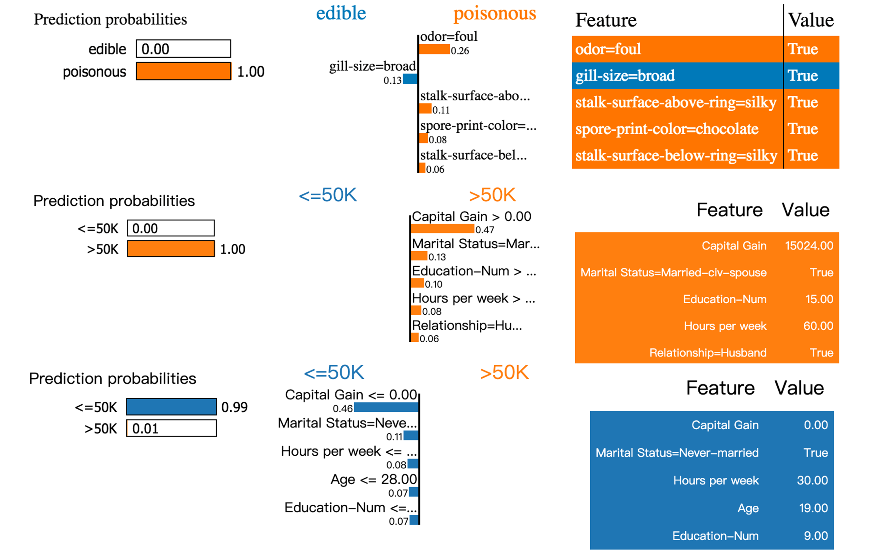

先选一个待测样本，然后对这个特征做扰动。扰动越大的样本距离原始样本比较远权重就比较小，扰动越小的样本距离原始样本比较近权重就比较大，然后把这些样本输入原始模型得到预测结果，再把这些预测的结果作为标签，把这些扰动的样本作为特征训练一个可解释性模型，做可解释性分析，得到每一个特征的权重。比如（最下面图）这个人它没有资本收入，年纪也比较轻，所以模型认为它是一个穷人，（第二张图）它有大量资本收入，因此模型认为它超过50k的可能比较大。如果要做一个银行风控系统就可以用这一套可解释性方法来分析出为什么风控系统会判定他是一个穷人。对于医疗也是一样，到底是什么样的特质让模型认为它是患了某一种疾病。

> LIME for Image

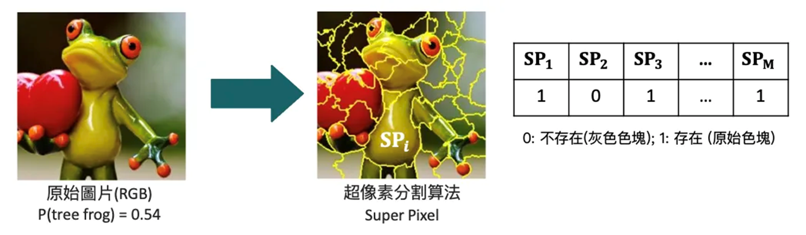

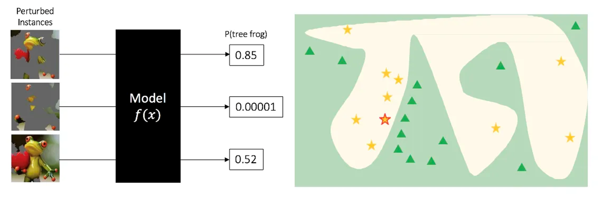

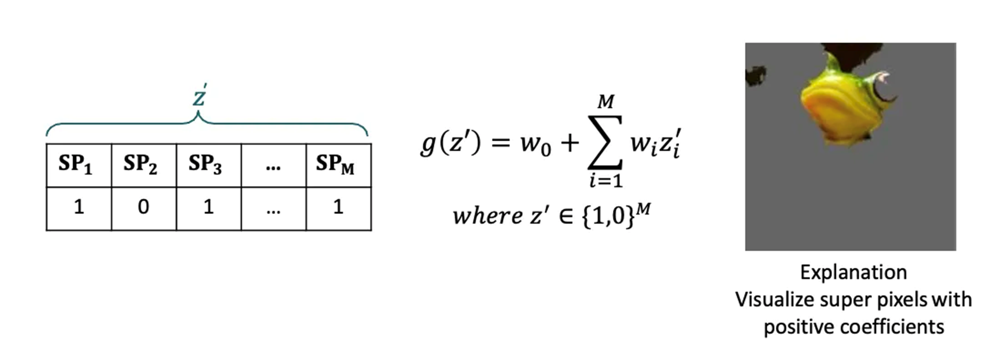

图像数据就比较麻烦了，因为图像是RBG三通道矩阵，很难直接在像素层面进行扰动，得自己去设计一套扰动的范式。就是得自己去设计一套扰动的范式。这里用一个比较简单的办法，就是对原图做聚类，把原图做分块，把原图分成m个图块，每个图块都可以存在或者不存在，如果存在就按原图的像素，如果不存在就直接抹成灰色，每个图块都有两种可能性，因此m个图块就有2的m次方个扰动样本。把这2的m次方个领域样本输入到原始模型中获取原始模型的预测结果，原始模型预测的结果的这个点肯定是在原始模型的决策面上，那么就可以用领域样本的可解释性特征和对应的原始模型的预测结果作为标签去训练一个线性分类的模型。比如这张图片原始模型预测它是树蛙的置信度是0.85，那么0.85就作为标签，m维向量就作为特征，0.00001作为标签，m维向量作为特征，0.52作为标签，m维向量作为特征，然后训练一个线性分类模型，然后把这个线性分类模型拿到原图上就可以分析出那些图块对预测是树蛙比较重要的。

> LIME for Text

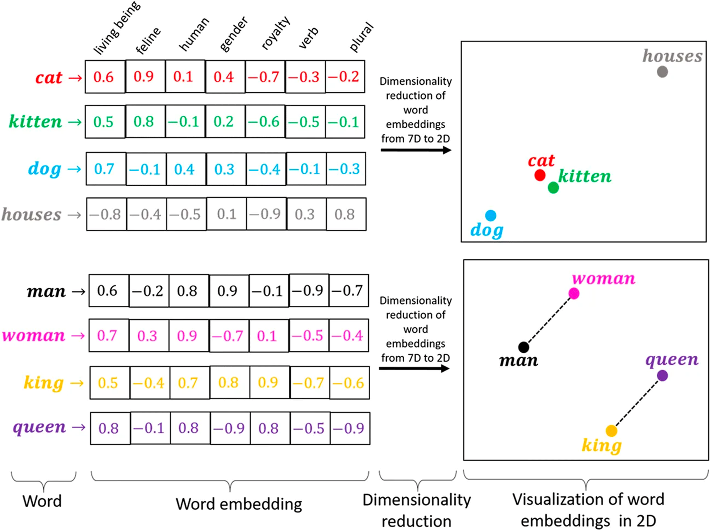

如果我们用词向量来做，词向量是非常不可解释的，人类根本看不懂词向量代表的含义，例如bert-base模型，词向量是768维，即一个单词被映射到一个768维的空间中，这768个实数没人知道他们分别代表什么含义，它们和人类的常识如何对应，llm中更是动辄上千维的词向量。所以我们可以把这个待测样本变成可解释特征，unigram模型。

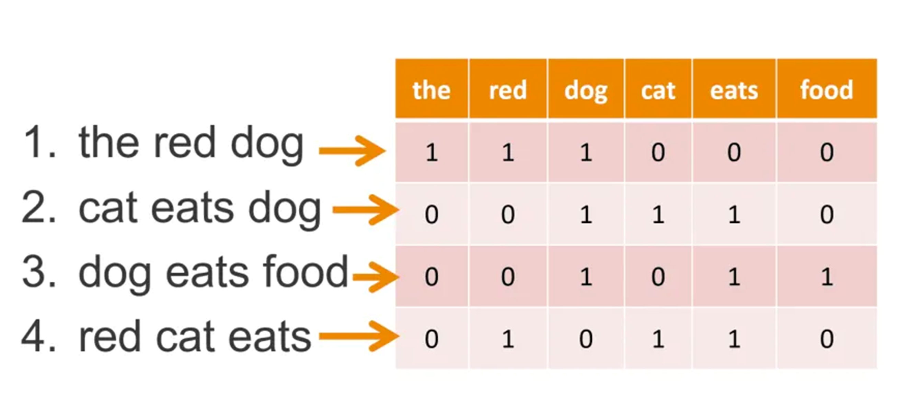

比如这里有6个词，每一句话都可以变成一个6维向量，每一句话都变成了一个词袋模型，unigram向量，一个6维向量就可以作为可解释特征去训练可解释模型。原始的词向量可能非常复杂，这里就变成了人类可以理解的可解释的特征，只有6个维度的可解释特征。

> 整体过程

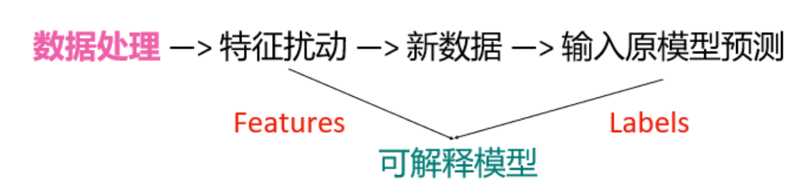

我们来整理一下，首先我们要获取原始的待测样本，如果是图像，那么就用超像素分割方法把他变成m个图块，得到特征扰动结果，然后对扰动后得到的每一个数据输入到原模型中得到预测结果，原始模型预测完毕后用m维向量作为特征，原始模型预测结果作为标注，当然这里是带权重的，离待测样本近的权重高，离待测样本远的权重低，然后训练一个可解释性模型，这个可解释性模型的权重就可以反应到这个领域内那些特征比较重要。说白了，就是把原始待测样本变成人类可以理解的可解释的特征，在这个可解释的空间进行扰动，还得把他恢复成原始特征的输入维度输入到原始模型进行预测，然后把特征和原始模型预测来拟合一个可解释模型。

> Submodular Pick(SP) Algorithm

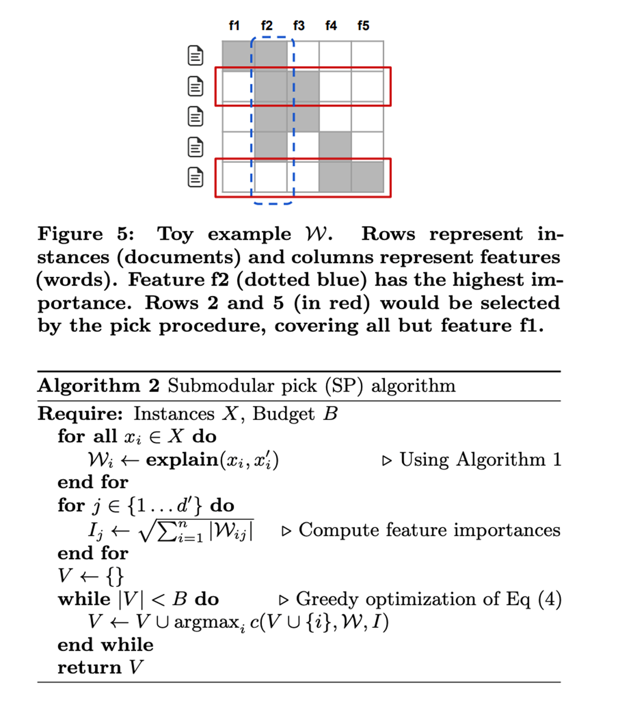

那么三种模态数据讲完了，论文里还提到一个不错的创新点，就是相比于其他可解释性算法而言，它可以选择出有代表性样本，人类的耐心和时间都是极其有限的，现在好多人都不看电影了，直接抖音看电影解说，甚至还要倍速播放，人类的耐心和时间都是极其有限的，对于一个机器学习模型而言，我们能不能用有限个样本去代表这个模型，能反应出这个模型方方面面的性能。在论文中有一个这样的研究，假如说这里每一行代表一个邮件，每一列代表一个单词，那么会发现f2这个单词在4个邮件都出现了，那么我们选择这个红框，f2和f3都包含进来了，在选择这个红框，f4和f5也覆盖进来了，所以我们时间有限耐心有限，只选择这两个样本就可以反应这个模型。当然也可以把样本1也选上，3个样本就可以反应出这个模型的全貌。

> Optimize LIME

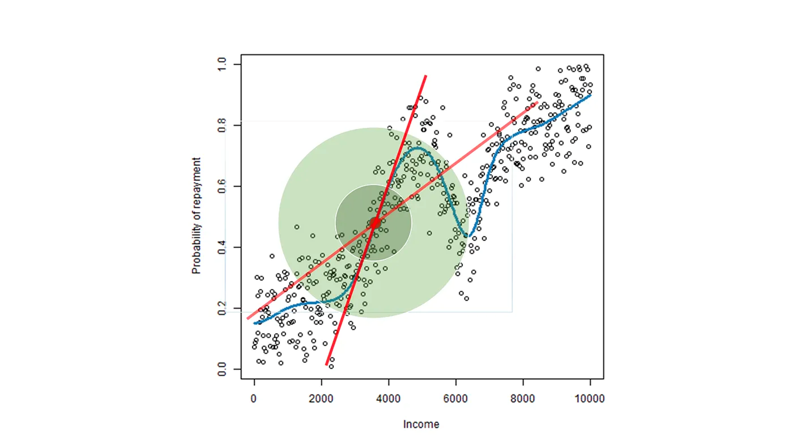

Lime可以兼容任何一种机器学习算法，完成特征重要度的排序，可以构造设计可解释特征并且用这些可解释特征进行分析。是一个非常自由的算法，例如我想知道这个人用苹果手机还是安卓手机对他有没有帕金森结局有没有影响这种天马行空的特征，都可以用lime进行可解释分析。但是成也萧何败也萧何，虽然人工可以设计可解释特征，但人工设计的可解释特征真的科学吗？不一定吧。局部线性特征可能也无法完全拟合代表原模型，不同样本领域权重如何计算这些都是lime的核心挑战。针对这些问题后人做出了一些改进。例如灵活选择待测样本的半径，在原始论文中这个核的大小是kw参数决定的，不同核大小得到的可解释模型分类边界是不一样的，那么optime lime就提出可以自适应的去调节，得到最适合的半径，给每一个领域样本分配最适合的权重。

## 论文精读

### Title and Authors

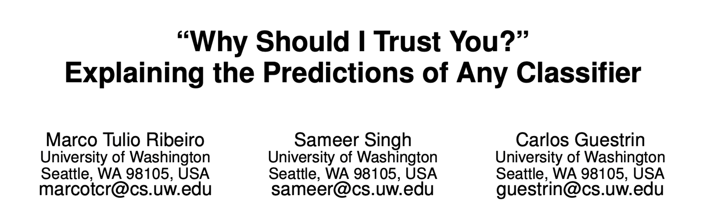

这篇论文发表在KDD2016上，这个会议是一个比较神奇的学术会议，图神经网络里面比较经典的node2vec也是发表在这个会议上，这个会议主要做知识发现也就是知识图谱，图神经网络这个领域非常多的论文发表在这个会议上，当然这个lime也是和知识相关，和知识挖掘相关的。lime他是local interpretable model-agnostic explanations的缩写简称，关于这四个单词后面会详细介绍。model-agnostic表示通用的，和模型无关的，表示lime是一种解释任何机器学习模型的通用范式，甭管你是什么模态的数据，解决什么样的任务，分类还是回归都可以用lime这一套来解释。local指的是只能拟合出模型局部，只能拟合出待测样本的局部行为，interpreteble指的是它的结果是人类可理解的，人类是知道背后的含义的，符合人类的常识的。

### Abstract

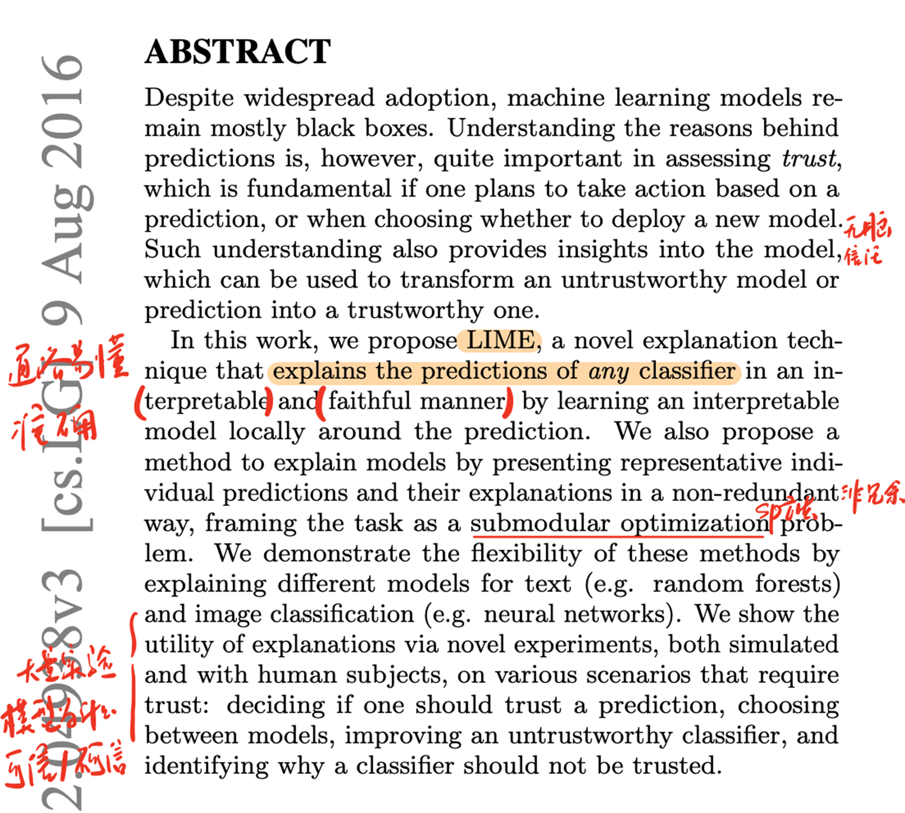

虽然机器学习被广泛应用了，但是大多数机器学习都是黑箱子，了解这个模型的决策过程对人类增加模型可信度是非常重要的，只有可信它，才能让它做出决策，才能够真正部署一个模型，比如无人驾驶，智慧医疗，金融风控等，这些都是跟人类生命财产密不可分的行业，所以要想部署模型，必须要人类可信赖它才行。不仅如此，如果可信的话，我们还可以帮助这个模型变得更可信，变得更好，通过这个可解释的见解，人类还可以改进模型，把不可信的模型变得可信。

在这篇论文中，我们提出了lime，这是一种新颖的方法可以对任何模型做可解释性分析，通过一种通俗易懂又准确的范式，这里的interpretable和faithful manner是贯穿全文的一个主题，通俗易懂指的是可解释模型输入的特征本身是可以理解的，比如判断一个人是否生病，诸多身体症状就是可解释特征，人类可以理解出这个特征指的是这个人是否头痛，健忘，发热等。而可信指的是模型判断的重要特征是真的很重要，必须和模型高度保持一致，这样才能拟合原始模型的行为。通过什么方法呢，通过在预测模型的局部的领域学习一个可解释的模型，我们还可以通过这个方法选择出一些有代表性的样本来反应模型全局行为，选择的这些样本是非冗余的，因为人类的时间和精力都是有限的，所以可以选择出一些有代表性的样本，这些样本间是非冗余的，用的SP方法。我们做了大量的实验来证明模型为什么可信和不可信，这是kdd会议的特色，所有在kdd的论文都有大量的篇幅讲消融实验。

### Related work

这个KDD会议就是这样神奇，把一个放在前面的工作放到最后。

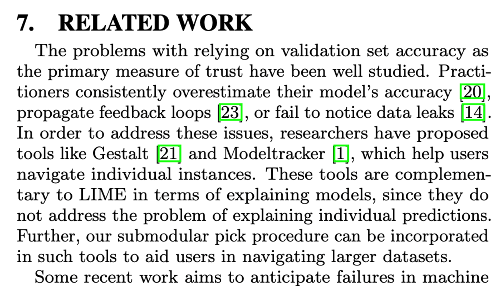

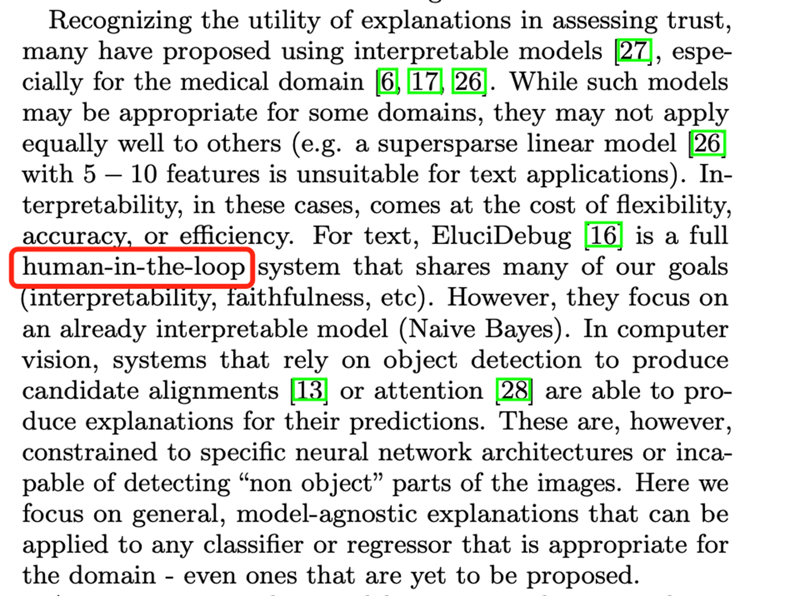

在传统的机器学习中，人类只是一股脑把数据喂到模型中，就不管了，当作一个纯黑箱子，但是在human-in-the-loop的范式里，人类需要像一个教导老师一样，帮助模型去发现错误改进错误，这也是一个active learning，主动学习。

### 1. Introduction

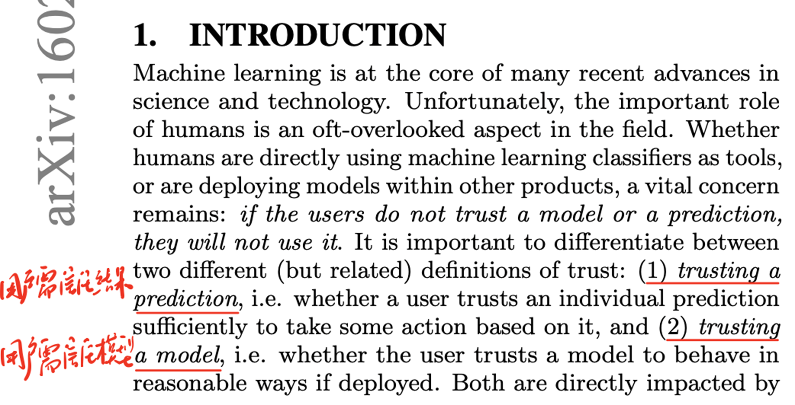

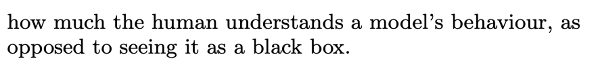

机器学习成为了近年来科学技术发展来的重要来源之一，但不幸的是，人这个重要的因素经常被忽视，因为是机器去学习，机器智能决策，所以人的主观因素就被忽视。但是人作为机器学习的部署者，人的因素其实非常重要。算法的可信度决定用户体验，这里存在两种方式的可信，一种是相信结果，一种是相信模型。例如去看病，影像模型告诉病人得了帕金森，针对这个预测结果，病人关心为什么会预测得了这个病，是通过影像中那些区域来判定的。这就是prediction，预测结果的层面。那如果我是这个医院的医生，我需要去相信这个模型，这个模型在什么情况下适用，对那些人群适用，会不会存在误导，会不会存在数据集和预测集图像域不一致等等，这是医生要考虑的，这样才能决定要不要部署这个模型到实际的工作中。这样，一个是病人关心，一个是医生关心，这两个都会显著影响人类对模型认知。而不是把它看作一个黑箱子，要知其然也要知其所以然。

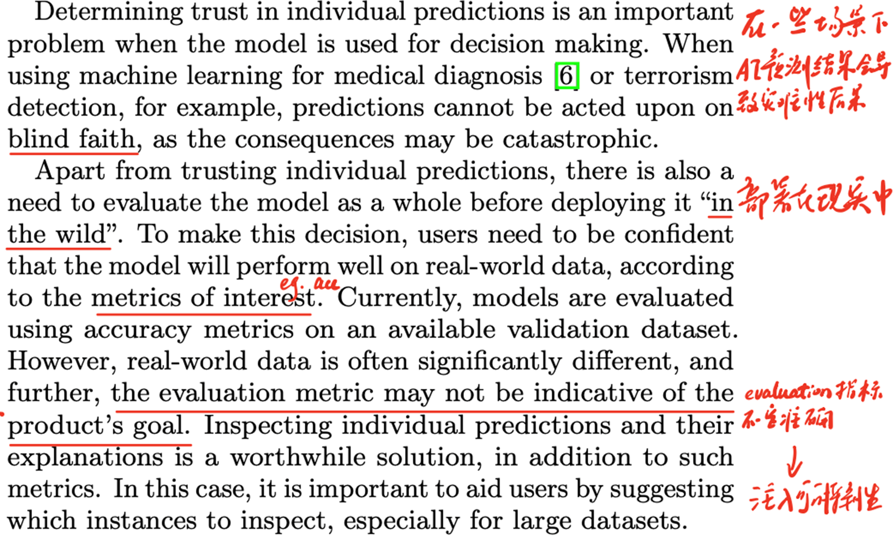

给模型注入人类对信息是非常重要的，在一些非常重要的领域不能无脑信任它，cannot blind faith，不然结果可能是灾难性的，所以要增进对模型的了解和解释。还有一个问题就是要把训练得到的机器学习模型部署到真实环境中，in the wild，这里就会存在很多问题，你训练的数据和真实用户上传的数据可能根本就不是来自同一个图像域。比如医院用的MRI图像，结果用户上CT图像，那么就会存在很多问题，即使都是CT，你用胸腔的CT图像训练得到的模型，用户上传腹部的CT影像也不行。如果你只是用传统的机器学习评价指标，那很有可能坏模型也能有不错的表现，因为你的测试集和训练集是来自同一个分布的。也就是说传统的这些评价指标并不一定真的科学，所以我们需要注入可解释性。我们还可以从海量样本中挑选出有代表性的样本或者异常样本，这也依赖于可解释性分析。

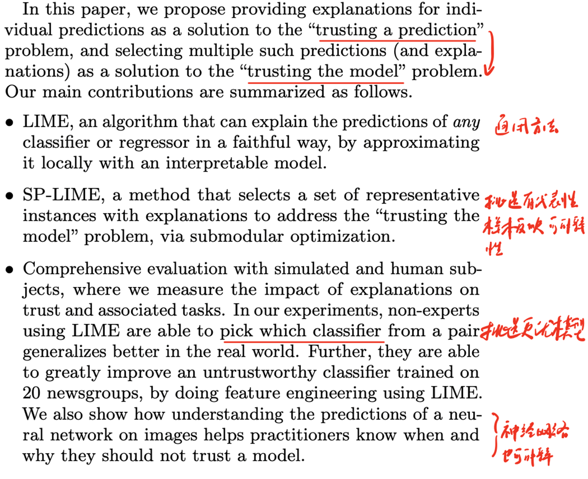

这篇论文，我们提出预测单个模型预测结果的方法，叫做trusting a prediction，进而我们可以从数据中挑选出有代表性的样本，来反应模型的全局可解释性，叫trusting the model。这篇论文主要提出两个方法，一个是lime，一个是sp lime，其实就是sp方法，挑选出有代表性的样本来反应全局可解释性。lime就是一个通用的解释模型的方法。这篇论文做了全面的实验，包括模拟实验和人工实验，都被详尽的探讨了，在实验中，就算是没有机器学习背景的小白也可以借助lime从一堆模型中选择出最优模型，甚至可以通过特征工程去改进模型，而且对于深度神经网络这样的非常不可解释的模型，lime仍然可以给出一个很好的解释，并且可以帮助从业者增加模型信心。该不该信任这个模型，什么时候信任这个模型。

### 2. The case for explanations

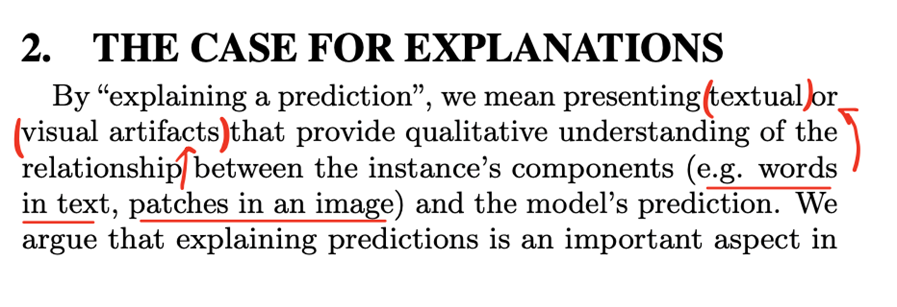

首先解释一下什么叫可解释性，如果我们想要解释一个模型的预测结果，如果是文本数据，需要给出人类可以理解的单词对模型预测结果的影响，所以展示给人类的应该是以单词为粒度的特征重要性，如果是图像数据，那么就是图块为粒度的图块重要性，都会给出一个定性的人类可以理解的解释，他们称之为可解释元素，例如文本中的单词和图像中的图块。

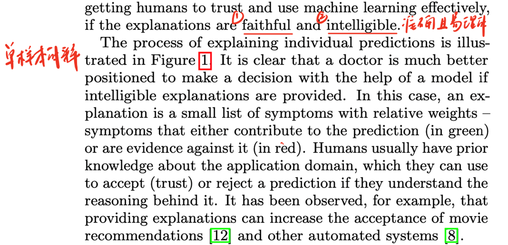

如果是一个普通的机器学习数据集，我们一般是如何解释的呢？

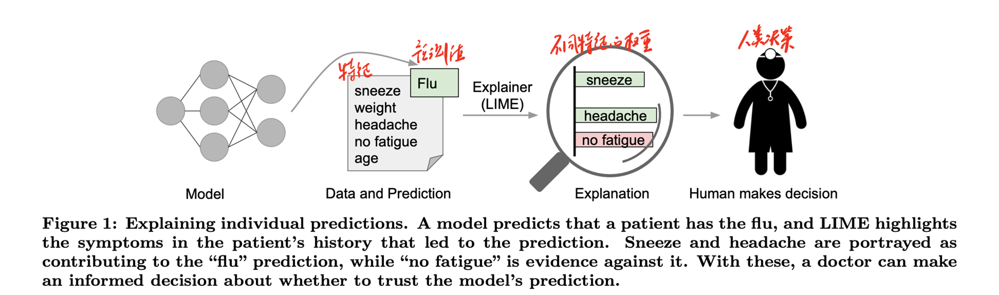

例如这个模型预测我们感冒了，那么它到底是以那些特征为理由判断我们生病的呢。人类有很多特征，那么它预测我们感冒，如果模型富有解释性的话，就应该得到这样一个结果，比如这个人打喷嚏了，头疼了，这些特征对模型预测为感冒有正向贡献，它没有劳累身体还可以，就对模型预测为感冒有负向贡献，那么把这个结果给医生看，人类是有先验知识的，医生是有医学知识的，它知道打喷嚏和头疼背后意味着什么，那么人类就可以根据自己的先验知识判断接不接受这个模型的预测结果。

已经有很多研究证明了，在自动系统里面引入可解释性，可以增加人类对算法的接受程度，这是单个样本预测结果的解释，同样也可以解释整个模型。

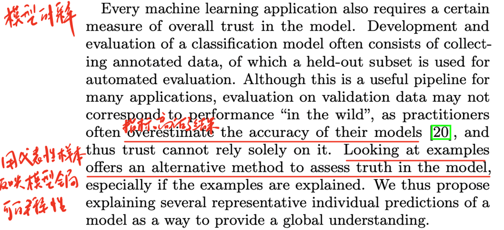

那刚刚也说了，通常人们通过一个验证集和测试集，在这些集上测量各种指标，准确率啊，f1socore啊去判断这个模型到底靠不靠谱，但是我们也提到了，这些指标是被过高估计的，一旦部署到真实场景中这些模型可能非常拉垮，所以我们不能只看这些统计数字，还是要到基层去解决实际问题。我们想的办法就是选取一些有代表性的样本来反应全局的可解释性。

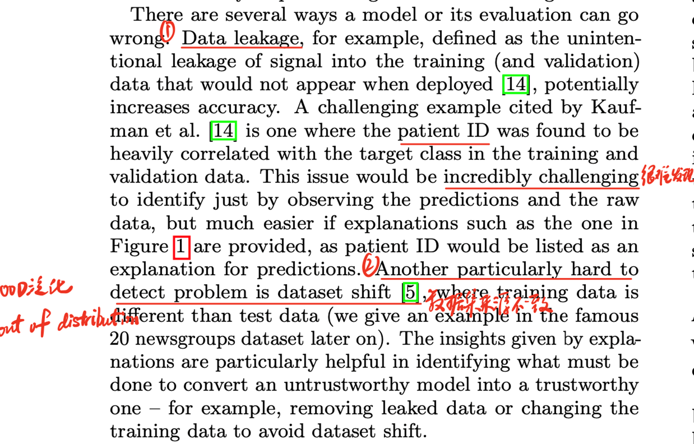

还有一种情况叫数据泄漏。比如我们判断一个人是不是帕金森，如果我们在训练集中把病人的身份证号当作很重要特征输入，但是我们知道这个模型部署在真实场景中，这个身份证号对判断生病结局没有任何帮助，但是在训练中如果包含了病人的id这些，模型会错误的学习这个特征，这就是数据泄漏。再比如我们判断一个人是不是发烧，我们把这个人是否吃退烧药放到特征里面去学，吃退烧药和发烧这两件事是有高度相关性的， 这相当于在样本中就把标签泄露给了模型，这也是数据泄漏，这两种情况都是要避免的。如何发现数据泄漏呢，如果只是单纯去看原始数据，其实很难发现，incredibly challenging，很难去发现，但如果使用了lime这样的方法，就可以理解模型为什么预测病人得帕金森，为什么发烧，这个人吃退烧药，身份证号就可以作为一个非常重要的特征展示在图里，我们就知道模型为什么做出决策。另一个非常大的挑战是dataset shift，现在论文更多的说法叫ood泛化，out of distribution，这个就是训练的图像来源和真实场景图像来源根本不一样，我们不能把极端情况下特定情况下训练的模型去用在一个非常不符合训练集环境的图像域里面，你不能高中学几何代数然后高考考偏微分方程。如何让模型泛化的更好，训练的一个基础模型解决更广泛的问题，这也是人工智能的一个前沿问题和底层问题。这种情况怎么发现呢，其实也是难发现，但是通过lime还是可以一定程度解决这个问题。可以把泄漏的特征和明显不一致的样本剔除掉。

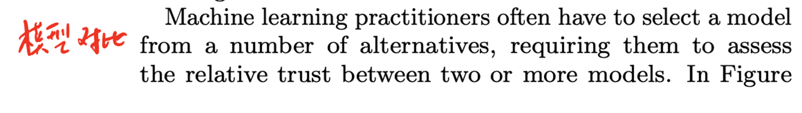

还可以比较不同的模型，两个模型可能对同一个样本的预测结果是一样的，如果都预测病人以后会得帕金森，但是这两个模型为什么预测这个结果呢，虽然预测结果一样，那有的人可能是瞎蒙的，有的人可能是认真推导算出来的，我们可以通过可解释性分析来比较这两个模型的好坏，比如图2

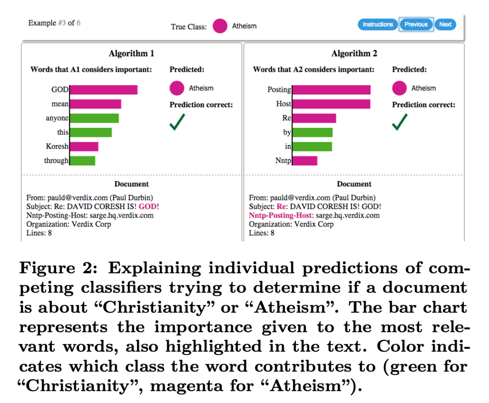

这是两个算法来识别邮件是基督教相关的还是无神论相关的，那么算法1依据这些特征来判断，算法2依据这些特征来判断，但是发现算法2依赖的这些特征都是英文的废话，一些stop words停顿词，所以我们认为算法1比算法2更好，甚至算法2在预测集上准确率更高，但是通过lime我们打开黑箱子，了解模型脑回路，算法1是比算法2更科学的，更符合人类的常识。所以准确率高不能说明什么，还是要看脑回路。当然这个脑回路很难定量衡量那个更好，所以只有把人类也加进去，所以后面会提到一个概念，human in the loop，在训练过程中人类也要参与，不能当甩手掌柜，要teacher forcing，分析错了要纠正模型，分析对了为什么会对，强化这个脑回路，有则改之，无则加勉。

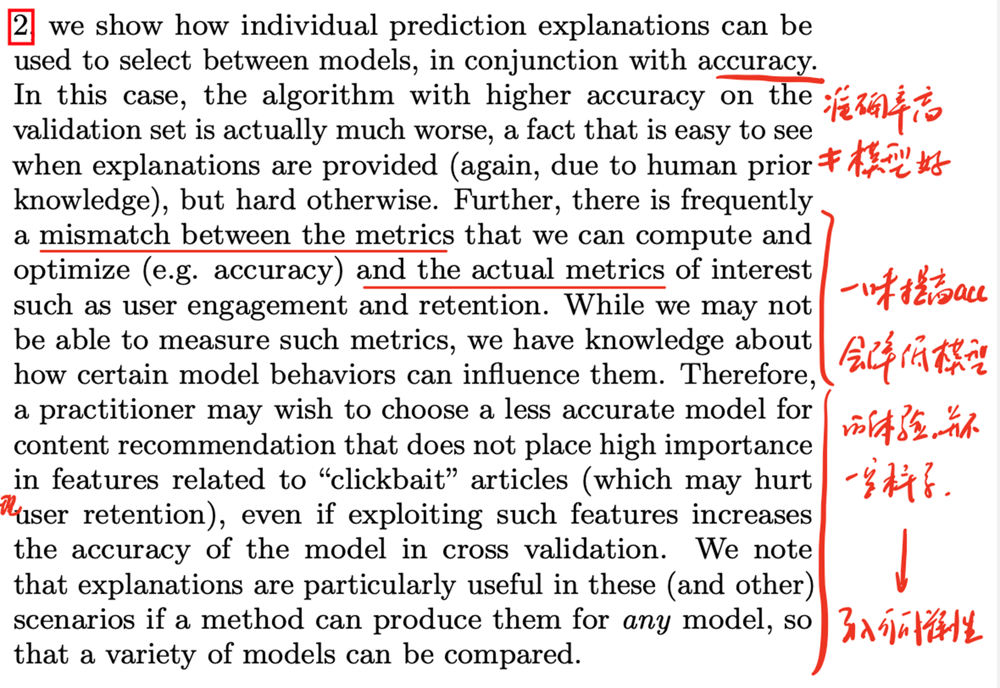

这个指标呢是不一定科学的，一味的去追求准确率可能会带来一些牺牲。这里存在一个trade-off，就是这个准确率不能直接衡量这个产品产生的价值，如果这个模型一味的追求准确率而用了一些错误的特征，牺牲用户体验的特征，例如诱导用户点击弹窗广告，那么用户点击了可能会增加算法的准确率，但是用户存在一个胁迫，劫持的过程，牺牲了用户体验，会影响用户留存。但是算法不知道，算法是死的，所以这个时候也要引入可解释性，不能一味看冰冷指标，而是要看脑回路。

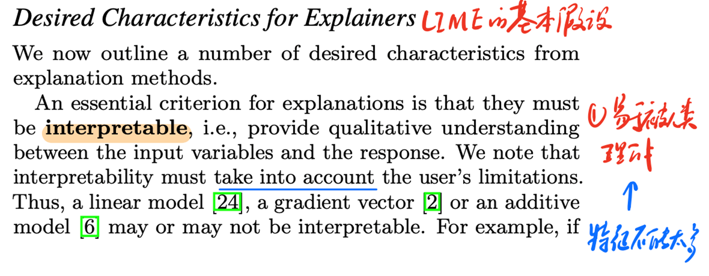

接下来是lime的基本假设，第一条就是易于被理解，而且特征数量不能很多，因为不能一上来给人类看成千上万个特征，哪怕用的是线性模型这种非常简单的模型，也不能搞太多特征在里面，需要给人类一个抓手。

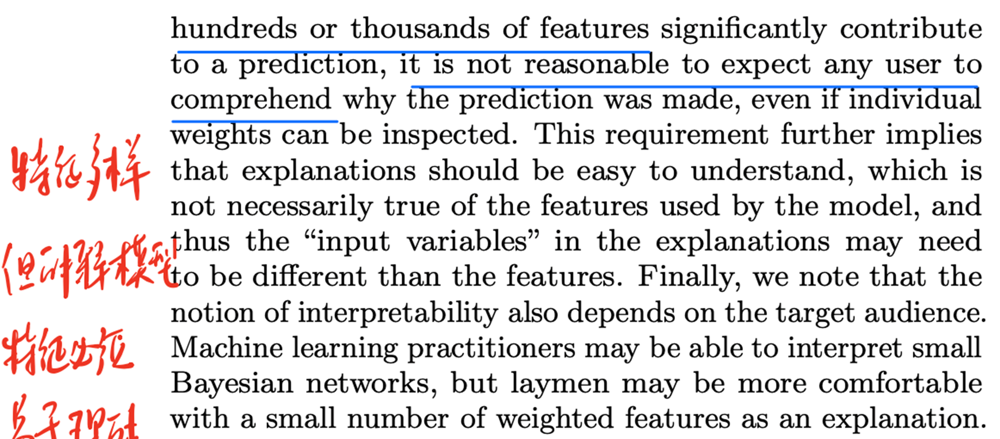

第二点就是训练原模型的特征可能难以理解，例如词向量，卷积放缩，这些训练原模型的特征可以难以理解，但是训练可解释模型必须易于理解。例如uni gram词袋模型，超像素分割后的图块存不存在等。对于外行，laymen，需要足够的简单直观。就好像我们在这里讲论文，可能有这方面工作经验的人一下就能明白你在说什么，但是如果没有从事过相关工作，就必须让他们也能理解，让他们足够舒服。be more comfortable，对于解释而言，让外行进入舒适区是一个非常重要的事。

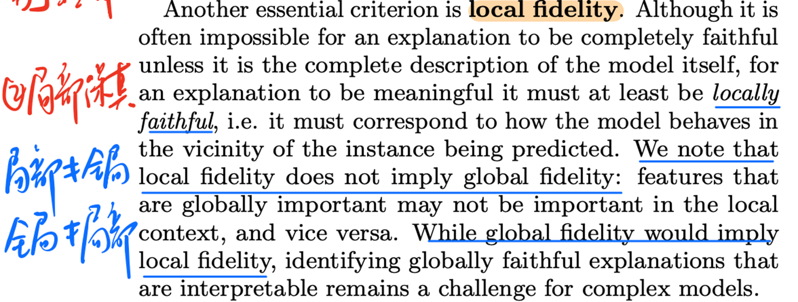

这是第一条，必须易于理解。第二条，必须局部保真。就是可解释模型拟合出来直线必须和原模型的决策边界尽可能贴近，原模型认为重要的可解释模型也要认为重要。虽然在高维非线性空间里很难真正拟合出原模型行为，但是在局部领域里必须足够准，足够faithful，足够的local fidelity。局部的fidelity不一定全局fidelity，全局fidelity也不一定局部fidelity，就是局部重要的特征全局不一定重要，全局重要的特征局部也不一定重要，但从主观上，还是要尽可能做到局部保真。

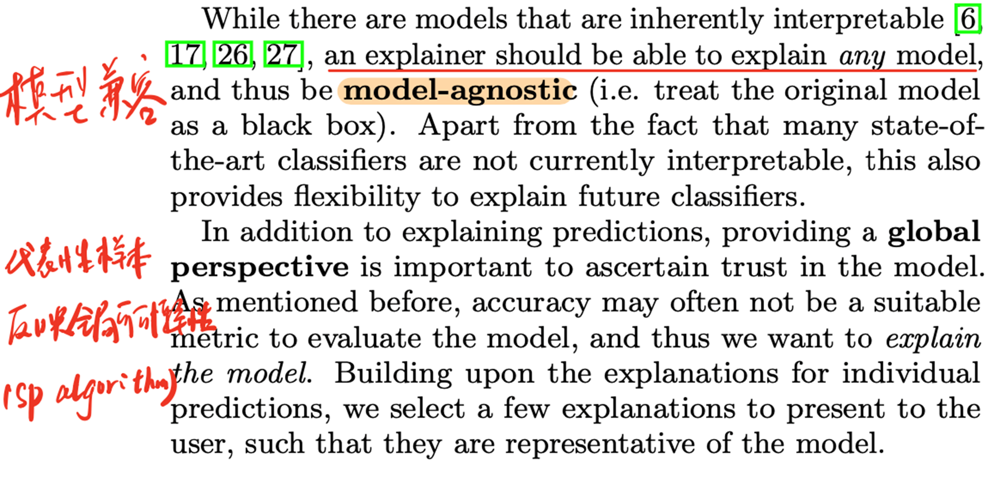

实现了以上两点，就得到了一个model-agnostic，与模型无关的通用的机器学习模型可解释方法，虽然我们挑选出的可解释模型，例如决策树，逻辑回归，线性回归等，但是它得能应用于各种模型中，意思是你可以从这些可解释性好的模型随便挑一个去座位拟合你原始模型局部线性领域的可解释模型。因此你可以用它对现在一些非常好的sota算法，state-of-the-art算法，做可解释分析，甚至对现在不存在，未来才存在的算法做可解释性分析。

这是对单个预测结果的可解释性，如果是多个呢。我们可以用多个有代表性的单个预测结果来反应整个模型的可解释性，来实现global perspective，全局视角。用若干有代表性的单个样本来反应整个模型的可解释性。

### 3. Local Interpretable Model-agnostic Explanations

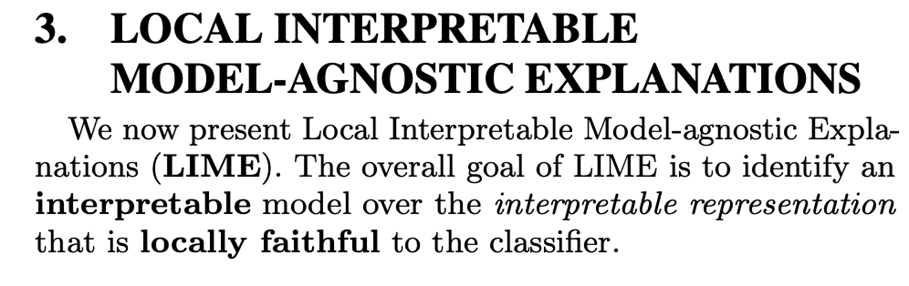

第三章就是lime算法的基本原理

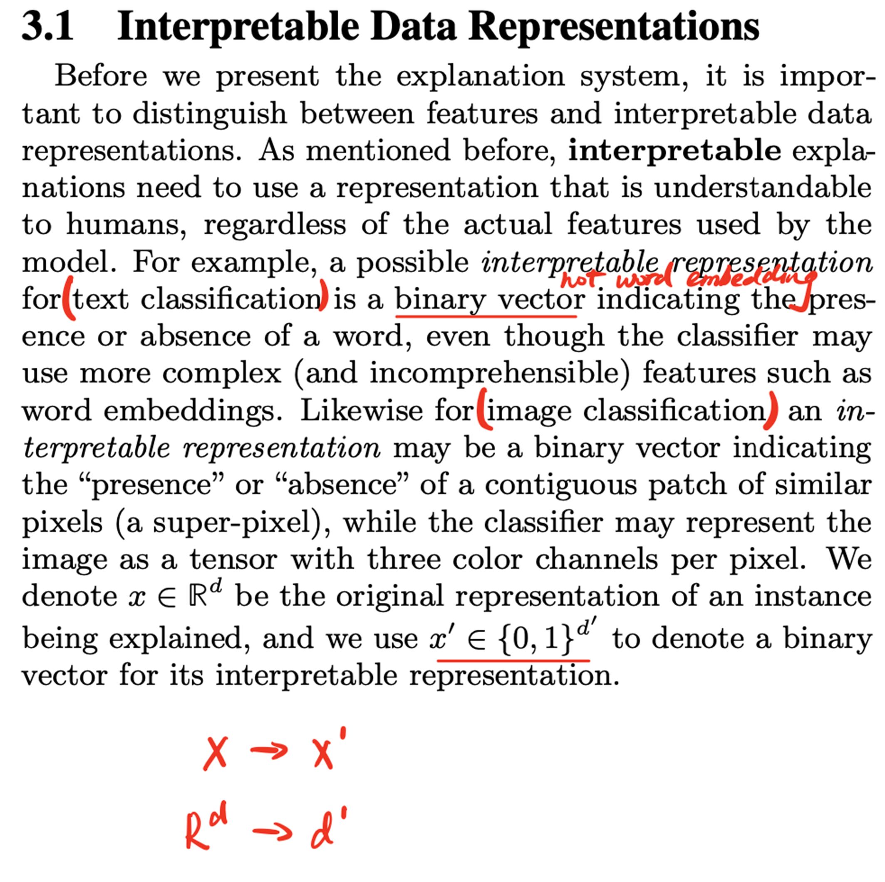

那首先，要把原始的这个待测样本变成可解释特征，所以这里面有两种特征，一种是训练原模型的特征，一种是训练可解释模型的可解释特征。在文本上呢，可解释特征就是binary vector，unigram词袋模型，而不是使用非常复杂的word embedding，因为word embedding是训练原模型的非常不可解释的特征，而我们现在用binary vector，unigram词袋模型可解释特征来训练可解释模型，这些特征是人类可以理解的。如果是在图像域里，可解释特征就是很多图块出现或者不出现，保留原始像素还是抹去。原模型训练用的特征是d维的，例如d维的word embedding，图像的张量，而现在它变成了d撇维的向量，向量中的每一个元素都是非0即1的，我可以称之为d撇维的01向量，也就是binary vector，来表示可解释特征。

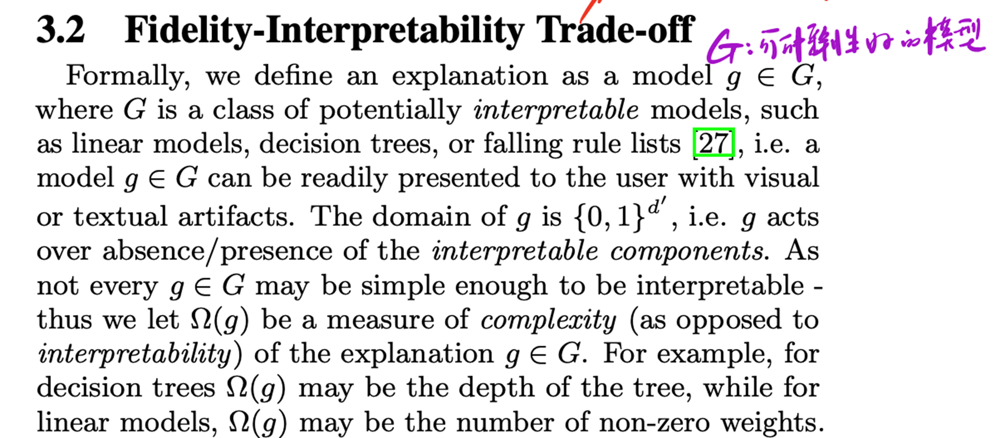

3.2表示的是，可解释模型本身呢，你想让他复杂，它的可解释性就低了，你想让他简单，它的可解释性就高，但是拟合模型的能力就弱了。所以这里存在一个trade-off权衡。这里的G表示可解释性好的模型，例如决策树这些，g是里面的一个算法。输入的特征是d撇维的01向量，被称之为interpretable components，这些元素存在或者不存在，欧米茄g用来反应这个模型本身的复杂度。这里存在一组trade-off，你想让可解释模型拟合效果好，他就要复杂，但是可解释性就差了，你想让他可解释性好，拟合效果就一般。

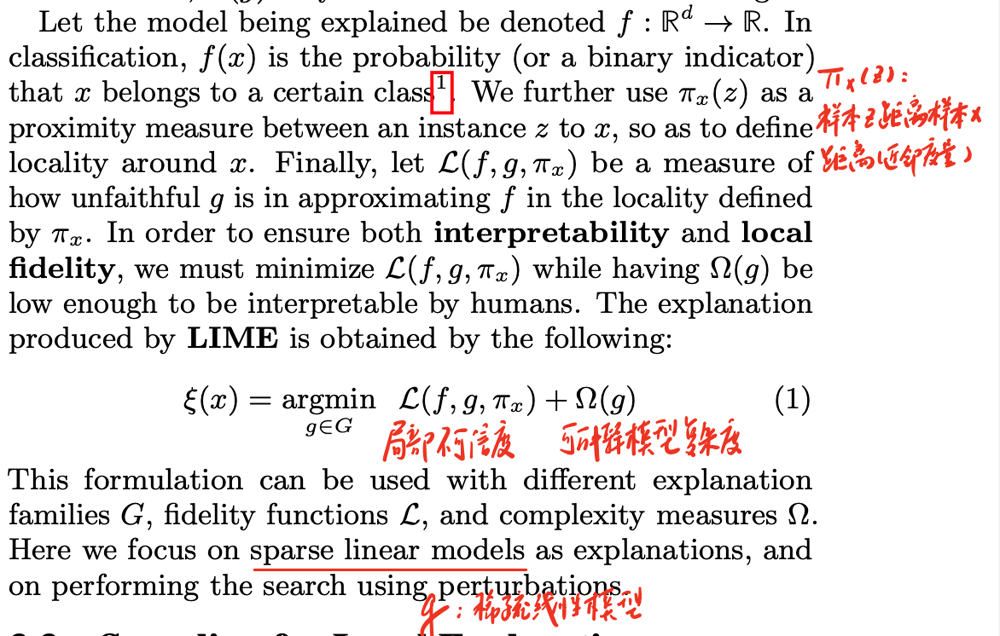

原模型是输入d维向量得到一个预测结果，我们用派xz来表示样本z距离样本x的距离，近邻的度量指标，我们可以用L来反应模型的局部不可信度，就是拟合的那根直线有多贴近原模型决策边界，欧米茄用来反应可解释模型的复杂度，用来反应这个可解释模型是否容易被人类理解。我们的lime就是要最小化这两项之和，就是既要让它可信，又要让它通俗可理解，又要让它拟合的准又要让它易于被人类理解可解释。它可以用在各种各样的潜在可解释性好的模型中，各种各样的局部不可信的函数中，各种各样的模型复杂度中。在下文中，我们要聚焦这个sparse linear models作为小g，啥叫sparse linear models就是这个模型中很多特征的权重很小或者为0，叫做稀疏的线性模型。

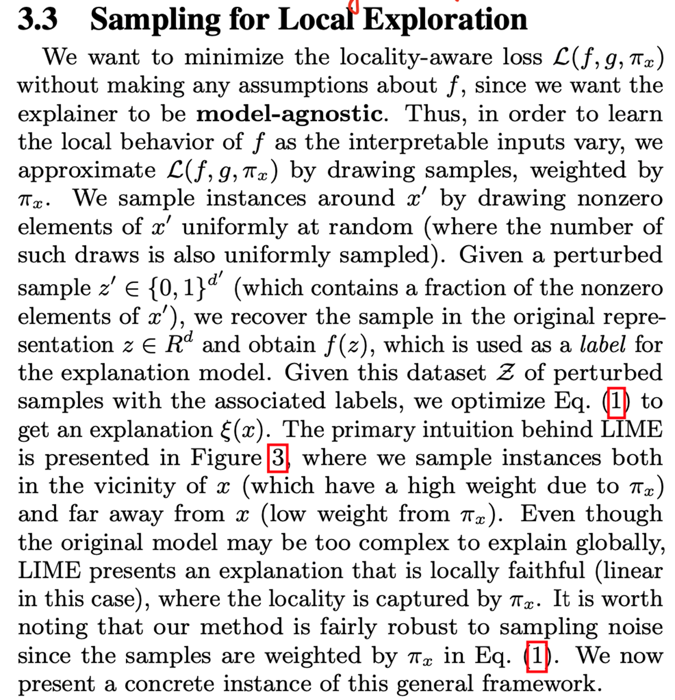

首先是待测样本，是d维特征，首先要把d维特征变成d撇维的01向量，然后对这个01向量做扰动，有些0变成1，有些1变成0，做扰动那么待测样本周围就生成了一堆邻域数据，我们把邻域数据恢复成d维向量，然后放到原模型中预测，得到labels，然后用可解释模型小g训练扰动后的d撇维特征，并以原模型预测结果作为标注，然后就可以从可解释模型中看到它学到的特征权重中那些特别重要，对模型预测结果产生较大贡献。并且这里还有一个权重问题，距离待测样本比较近的样本权重比较大，比较远的权重比较小，距离通过pai来反应。

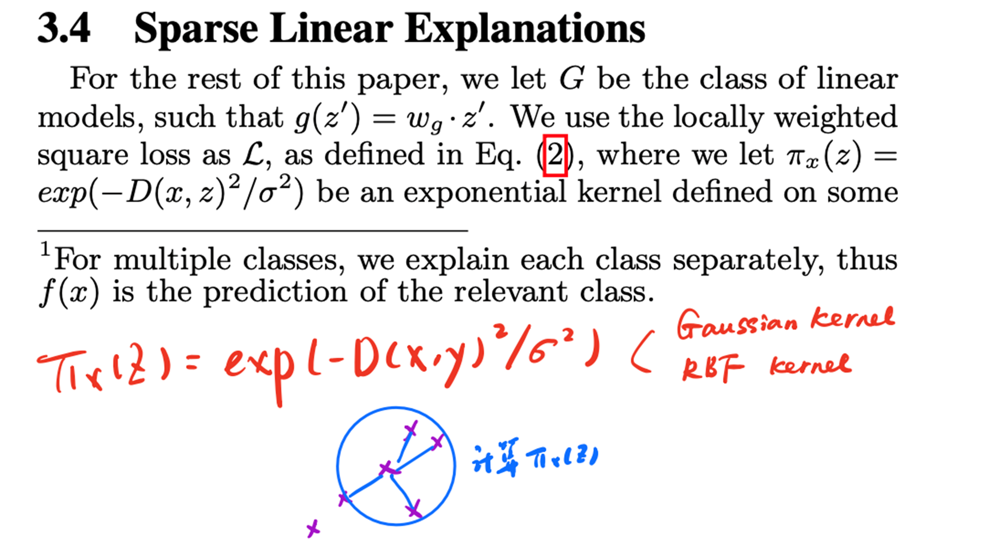

接下来是sparse linear explanations，这个距离可以通过这样一个高斯核或者rbf核，以待测样本为圆心画一个圆，以圆里面的样本来计算它的距离。

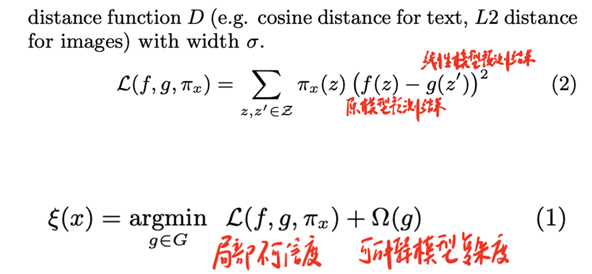

这里的话你会发现，如何去计算这个不可信度，就是把它的距离乘以一个残差，残差就是原模型预测结果减去线性模型预测结果的差的平方，但是这里其实有个问题，距离越远，局部不可信度越大，我们最终是要最小化这个局部不可信度，所以靠近的样本权重比较大。

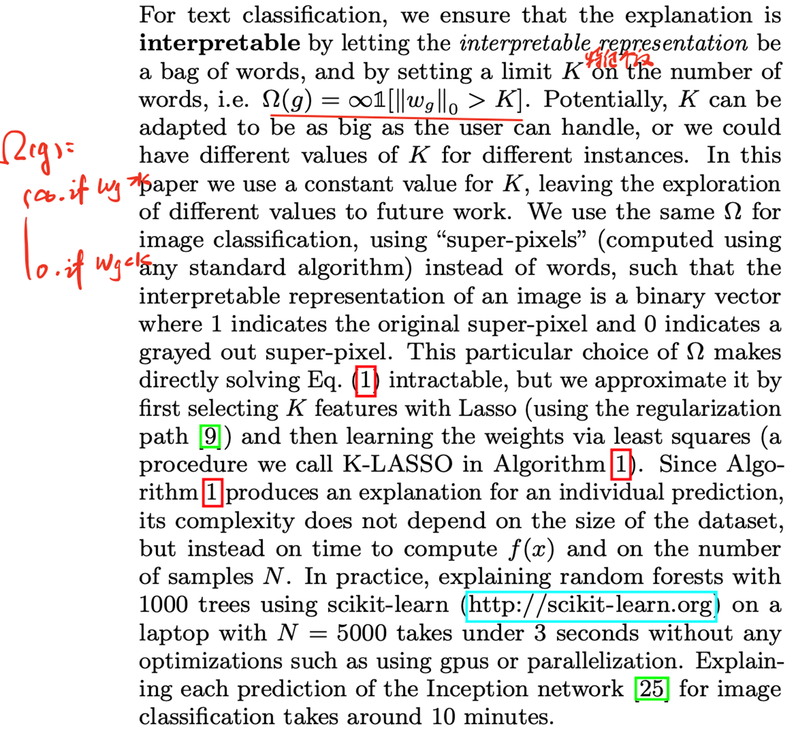

对于文本分类呢，使用特征是可解释的，可解释的特征个数是K，可解释模型的复杂度用这个式子计算，无穷大乘以一个这个东西是不是大于K，如果是的话等于无穷大，不是的话等于0，这个K可以自己设定，可以很大，也可以很小，但为了人类方便理解，所以K在这里用一个常数。对于图像而言，这个欧米茄就是超像素图块的个数。这个方法实际上和数据集的尺寸是无关的，不管多大的数据集都可以用这个方法做分析。并且是非常快的，在笔记本上用scikit learn训练1000颗树组成的随机森林算法，5000个邻域样本只需要3秒就可以计算得到，也不需要GPU或者并行计算。对于图像数据，则需要10分钟左右。这里需要提出，这个时间是作者用它自己的设备去跑的，我们自己在跑的时候可能比这个还要快，毕竟设备的处理效能也在进步。

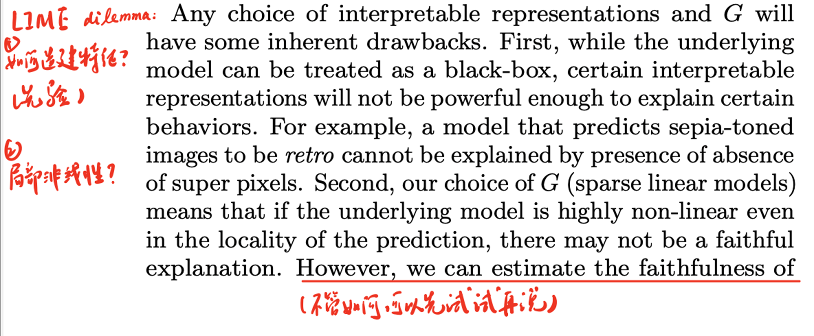

lime中最难的一个步骤就是把原始特征变成可解释特征，这一步需要人类的先验知识，比如图块这里用的是超像素分割算法，但是这个算法并不对应任何语意，还是需要人类自己去设计binary vector，去设计这个可解释特征。第二个就是原始模型本身在高维空间非线性，如果在邻域空间也是非线性的呢。作者这里没有去说如何解决或者论证这个问题，只给出了一个建议，就是不管怎么，先跑一下看看再说，并且可以选择线性模型以外的更好的可解释性模型，这算是未来的工作。所谓纸上得来终觉浅，绝知此事要躬行。

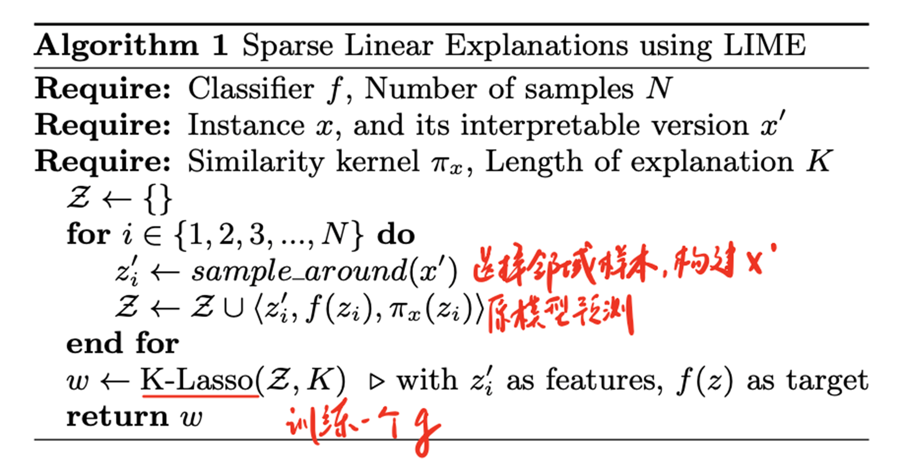

看看它的伪代码，选择邻域样本，构建可解释特征x撇，然后把这些邻域样本输入原模型进行预测得到大Z，大Z就是标签，k就是特征，然后训练一个可解释模型，这里是K-Lasso。zi撇作为特征，原模型预测的结果作为标签，训练一个足够拟合原模型的线性模型。

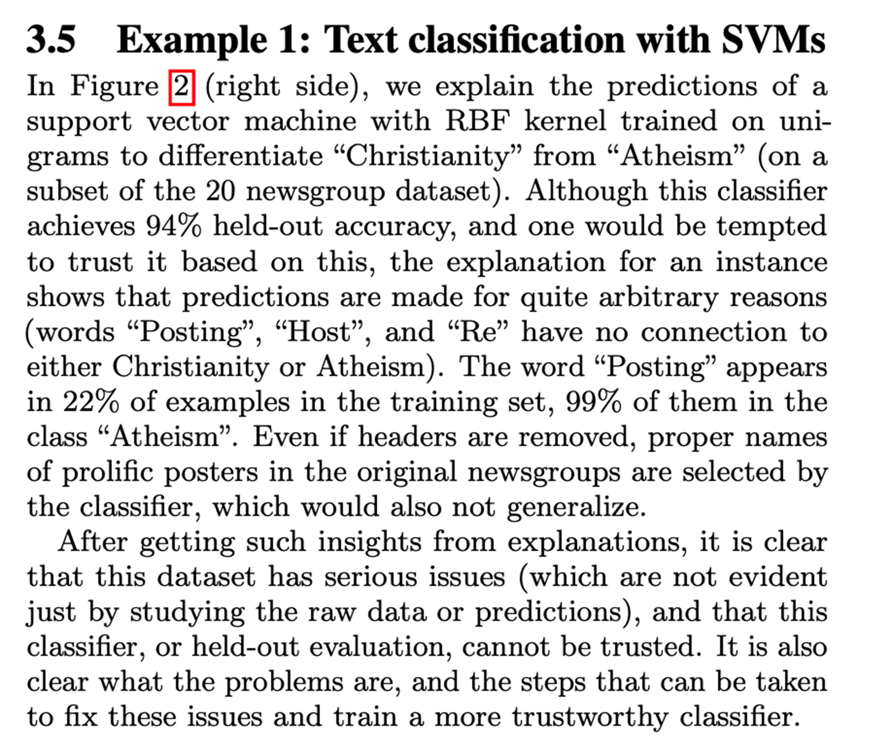

3.5其实就是刚刚那个判断文本是基督教还是无神论那个例子，是在20 newsgroup dateset这个文本分类数据集上训练，虽然这个分类器在测试集上有高达94%的准确率，但是可以发现它其实相信了很多没有信息量，非常不好的特征，这些词是英语中的废话词，和基督教或者无神论的语意没有任何关系。并且你看它相信posting这个特征，但是posting在22%的样本中都出现了，这些样本99%都是无神论的，所以虽然这个词跟无神论出现了，但是因为数据中存在这个bias，所以模型会学到这个特征，误认为posting和无神论是高度相关的一个词。虽然hearders和proper names，标题和人名都被抹去，但仍然会误导模型。用lime就可以发现模型中的bias并且发现metrics，评估函数是否科学。

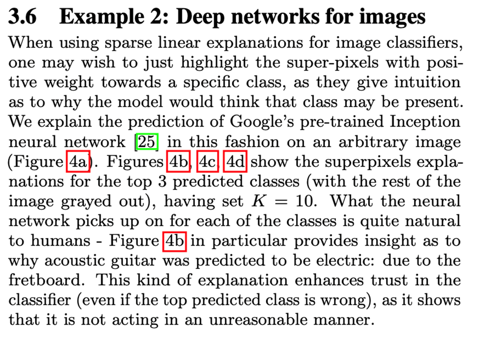

第二个是图像分类的神经网络，指定可解释特征图块个数K=10，用的是google net网络。

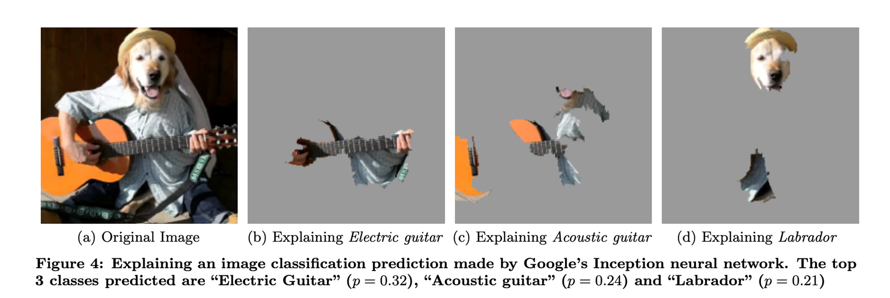

看一下这个图吧，可以看到电吉他关注的区域，声学吉他模型关注的区域，拉布拉多狗关注的区域。所以你会发现对深度神经网络这种非常不好解释的模型用lime也能很好做解释，只要你超像素图块选择足够好。这里例子你会发现吉他有锯齿，狗可能少了个眼睛，这是超像素分割算法的锅，实际上我们可以选择更好的分割算法，因为这里的核心并不是分割，而是把图像变成易于理解的图块特征。

### 4. Submodular Pick for Explaining Models

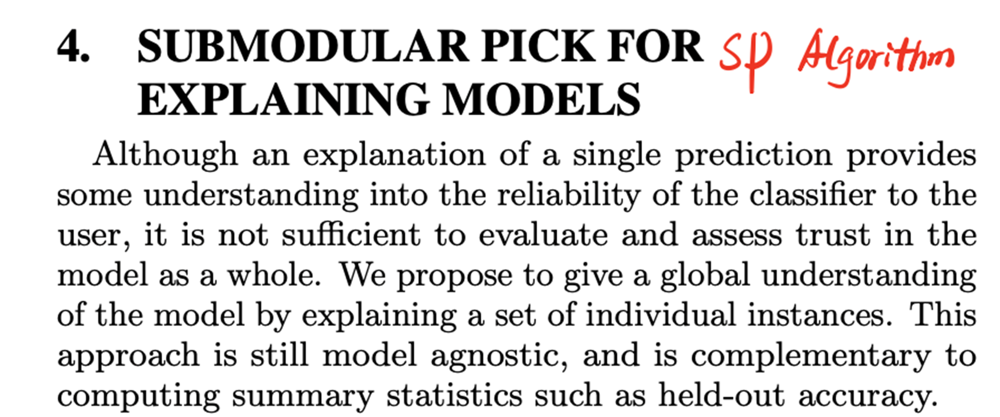

第四部分就是选取有代表性的样本来解释模型，通过有代表性的样本就可以反应模型全局的insights。

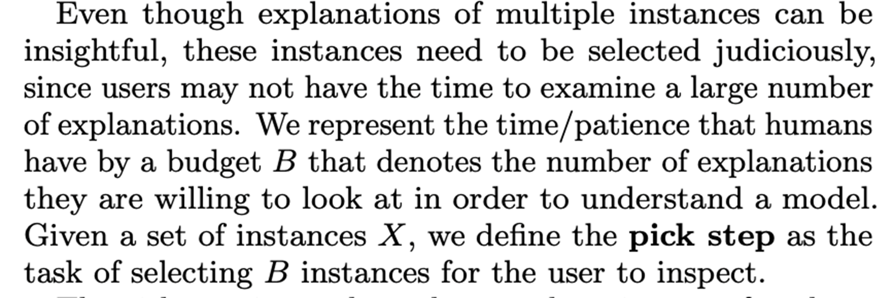

假如说测试集有X个样本，我们要选择B个样本来代表整个模型的预测结果，该怎么选呢？

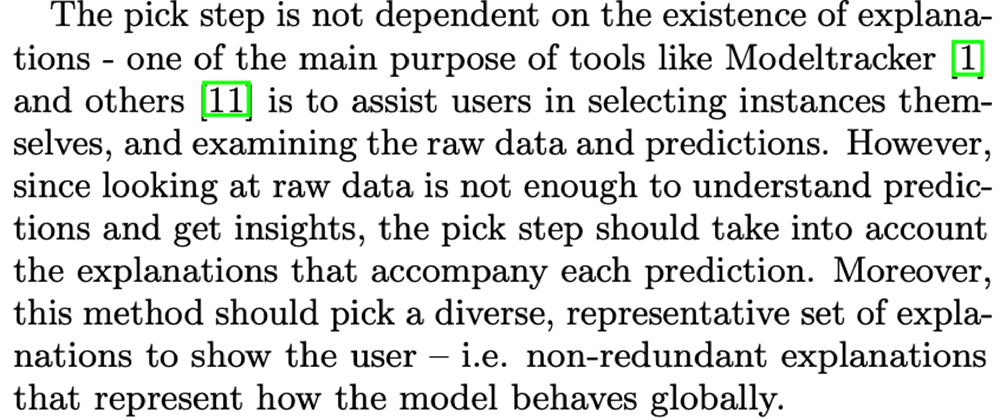

还是需要看这些样本的可解释，不能只看原始数据和预测结果，并且选出来的这些样本必须多样，还不能有冗余。

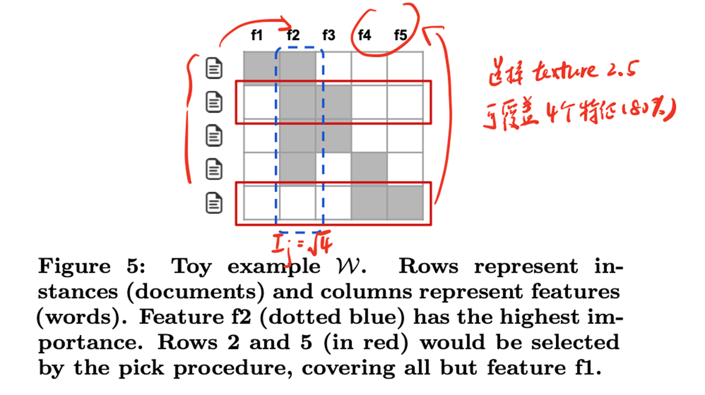

这里举了个例子。假设这里五个样本，X=5，我们要从五个样本里选出两个有代表性的样本，B=2，那有五个可解释特征对应五个单词吧，对于第二个特征，第二个单词，会发现它在4个样本中出现了，比较有代表性，就从具有第二个特征的样本中选一个出来，第一个红框选出来，f2和f3就覆盖了，我在从这个样本没有覆盖到的，f4和f5中选一个第二个红框的样本出来，这样我就从五个样本中选了两个有代表性样本，能够覆盖到四个特征。也就是你首先得计算每一个特征的代表性，f2有4个灰格，f3f4有两个灰格，那么f2的代表性就比较大，我们可以用Ij来反应出来，Ij等于根号权重求和，这里就是根号4，然后我们就可以从代表性比较高的包含这个特征的样本中去选，不断的去贪婪的尽可能覆盖更多的代表性的特征，就实现了选出有代表性样本的任务。

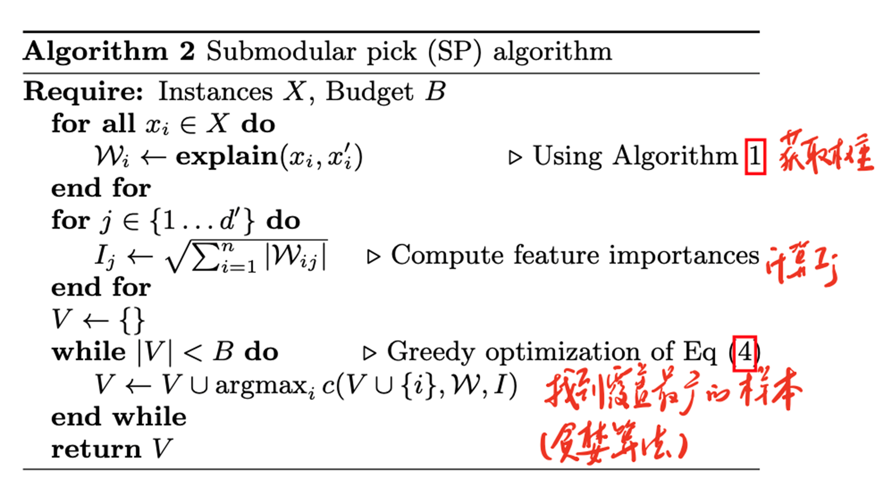

看一下算法，首先获取数据集中每一个样本每一个可解释特征的权重，然后计算每一个特征的代表性Ij，找到使得可解释性特征代表性覆盖最广，求和最大的样本，比如刚才的第二个和第五个样本，他们的特征是互不重合，互不冗余的，而且是足够多样的，那么就用极有限的B尽可能多的覆盖了代表性。我如果已经选了第二个样本了，就不再选第三个样本了，因为都是f2和f3，就冲突和冗余了。

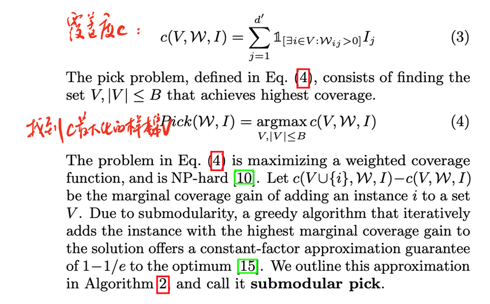

特征覆盖度就用c，这个公式计算，例如刚才把第二个样本选了，特征覆盖度就是2，第五个再选了就是4，我们的工作就是要找到使得c最大化的样本集V，可以通过贪婪的方式去迭代的把当前能够使得c边际增加最大的样本选进来，这其实是图覆盖的数学问题，他是NP-hard的问题，它有1-1/e可以收敛到最优点。这样的一种方法被称作submodular pick，也就是sp方法。

### 5. Simulated User Experiments

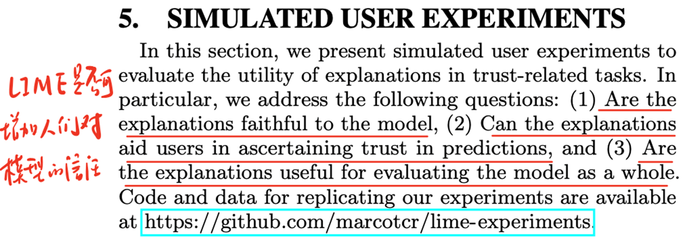

第五部分就是模拟实验，整个第五章都是simulated，没有人参与，它可以帮我们解决这三方面的问题，lime认为的特征是否原模型也认为重要，这是解决的faithful问题。lime给出的解释能否增进人们对他的信任和理解。第三个问题是选取出的有代表性的特征能否从全局上反应模型特征。

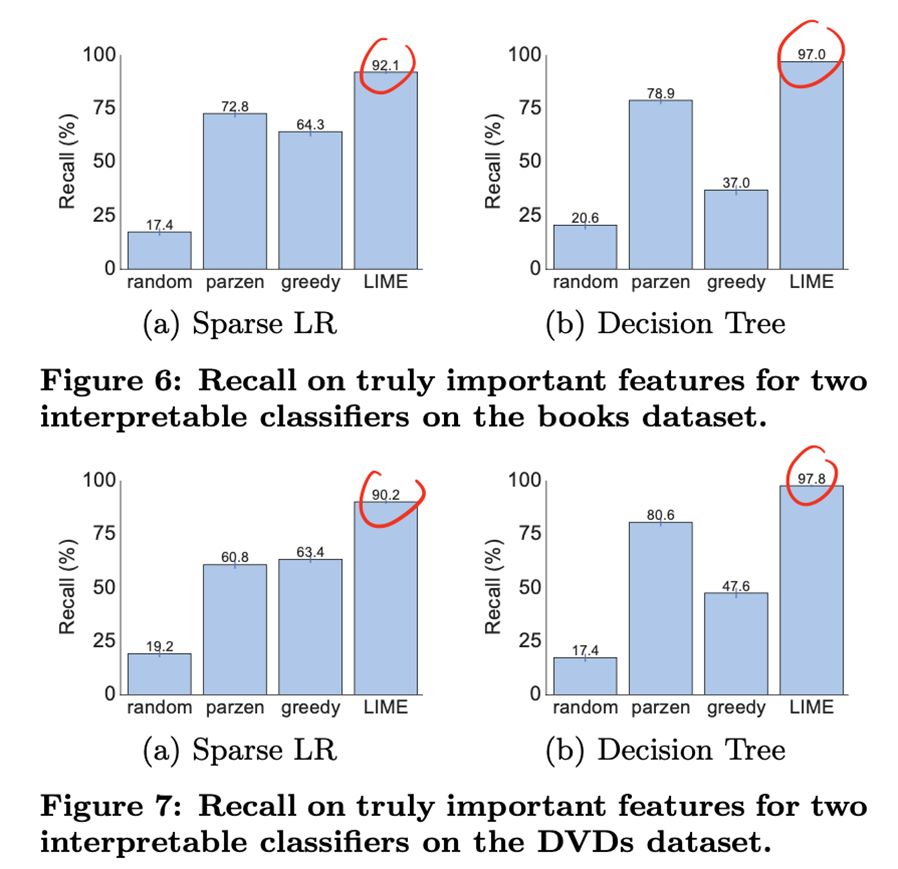

在books和DVDs两个数据集上，分别使用决策树，逻辑回归，最近邻，支持向量机和随机森林训练，用lime，parzen，greedy和random选择出他们认为重要的特征，比较这些方法是否真的是原始模型看重的特征。因为这些原始模型都是可解释性比较好的模型，因此他们自身就可以看出哪些特征比较重要，他们自身重要特征如果都被lime选出来了，就说明lime是一个很不错的特征重要度选取方法。这里recall就是真的重要的特征有多少被lime发现出来了，不管在哪个数据集，90%以上的特征都被lime找出来了，这就说明lime是一个非常不错的metrics。

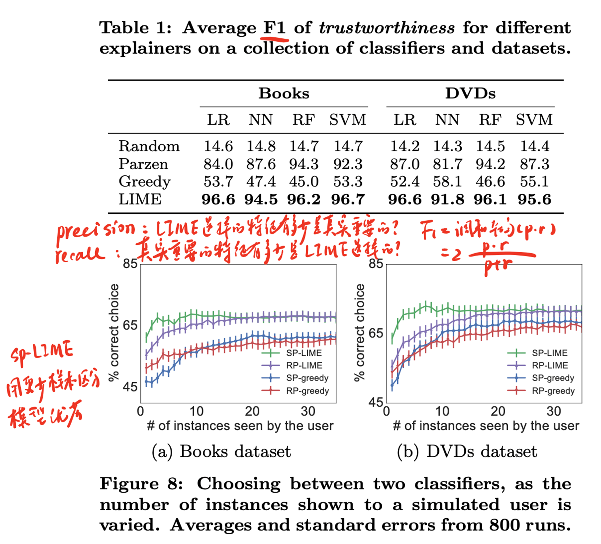

这个表指的是先算一个precision，lime选出来的特征有多少是真的这些模型中用到的特征，然后真的模型有多少重要特征被lime挑出来了，这是recall，然后对precision和recall求一个调和平均数，就得到了f1score，这里lime是最高的，所以lime是一个非常好用的方法。下面的图是用SP方法，用sp和lime的方法，用更少的代表性样本就可以区别分出模型的优劣。这就说明我们挑选出来的样本是非常有信息量，非常有代表性的。

### 6. Evaluation with Human Subjects

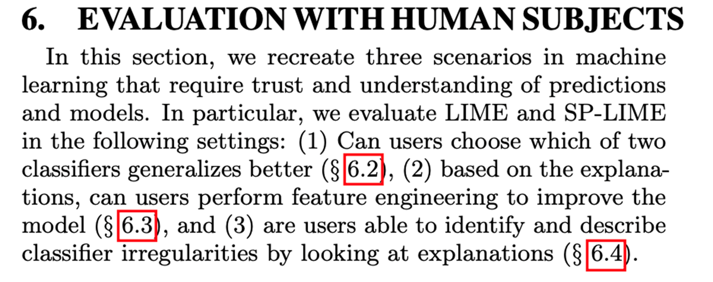

第五章是模拟实验，第六章就是人工实验。找志愿者做实验。它能够帮助我们解决哪些问题呢，第一条就是从不同模型中挑出更好的模型，第二就是根据解释来做特征工程，进一步提升和改进模型，第三就是根据解释发现模型的异常，就是模型可能预测正确，但是它的脑回路真的正确吗，它依赖的特征真的是正确的特征吗？

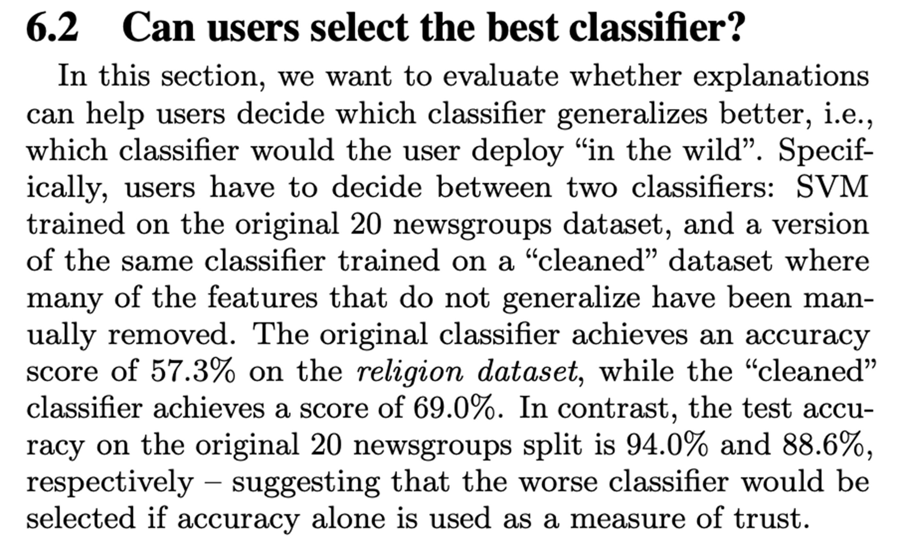

6.1是作者说它在之前的20 newsgroup数据集上又收集了一个religion dataset。6.2就是准确率高的模型不一定真的靠谱，在测试集上，第一个模型是94%，第二个是88.6%，94这个模型它在20 newsgroup表现非常不错，但是拿到religion dataset上一下就不行了，这就说明准确率高的模型不一定真的靠谱。

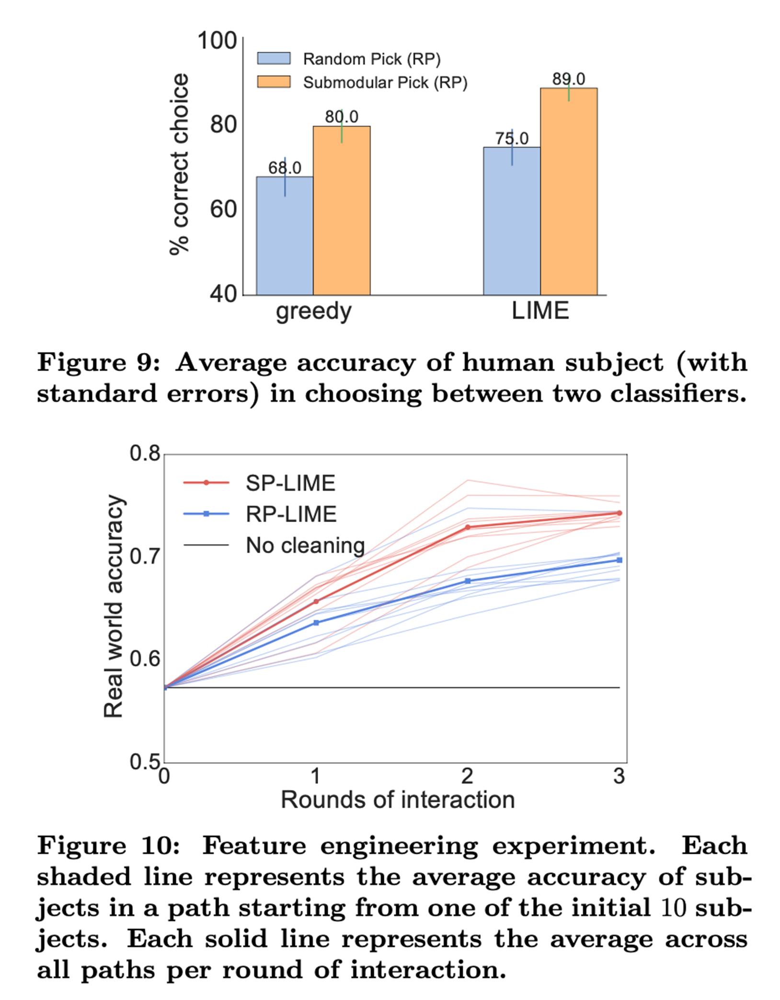

然后招募了一些小白，完全没有背景知识的人，来让他们判断哪个模型更好。发现通过特征解释，人类可以挑选出更优的模型，sp是要比rp要好的，黄色比蓝色好，其次lime是要比greedy要好的，这就说明加了解释之后人类可以挑选出更好的模型。下面这个图反应了lime的可解释性分析可以帮助人类去改进特征工程，进一步优化模型性能，让它变得越来越好，sp也要比rp要好，lime比no cleaning要高。

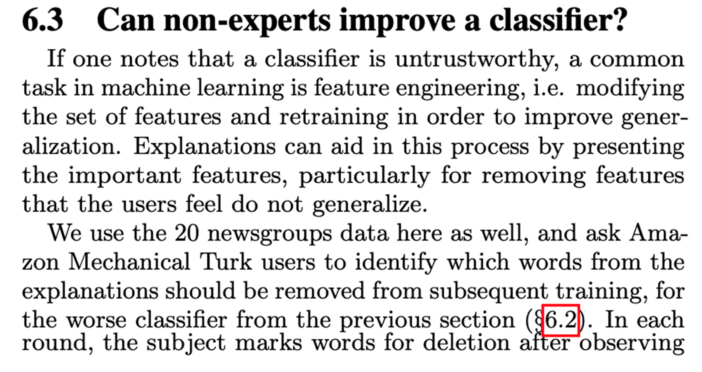

刚才的其实就是6.3节的内容，通过lime的可解释分析，可以人工剔除一些不靠谱特征，特征工程是机器学习里面非常重要的一步，在data science里广泛流传一句叫garbage in, garbage out，你给算法喂进去烂特征烂数据它只能学到烂模型，那么特征工程就是把先验知识整合到模型中，把特征的信息充分暴露开。

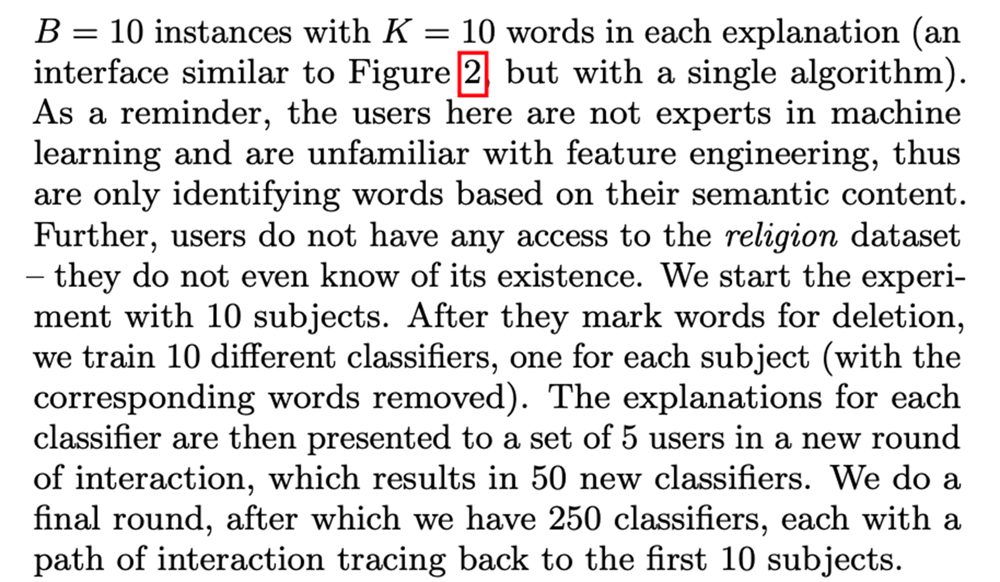

就让这些小白，即使不是机器学习专家，他们甚至不知道religion dataset的存在，他们只是在改原来20 newsgroup的特征，把烂特征去掉，但是可以导致他们在真实数据集上的性能更好，并且到最后很多人都会选出同样的特征，这种高度一致的共识其实就表示所有用户收敛为一个相似的正确模型，英雄所见略同。

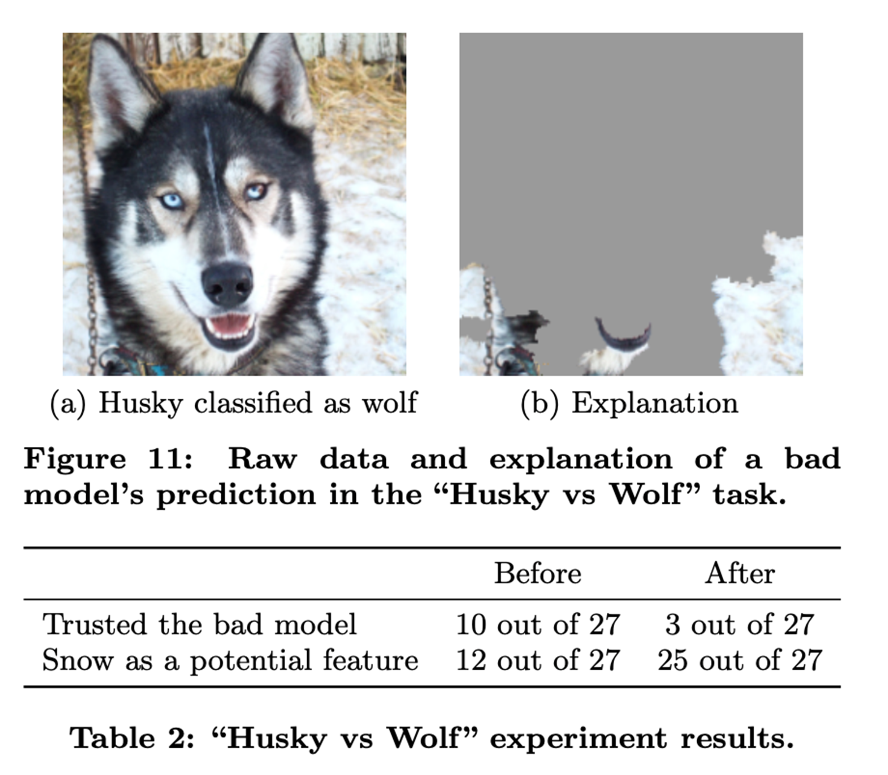

6.4是给人类展示解释，加深人类对模型的理解。这里构建了一个样例数据集，有狼有哈士奇，所有的狼都是雪地背景，所有的哈士奇都是草地背景，那训练出来的这个模型就学到了这个bias，它会认为有雪地的都是狼，有草地的都是哈士奇，例如这个张图，本来是哈士奇，因为是雪地，所以被认为是狼，通过解释可以看出模型重点关注的区域就是背景的雪地。同样的做个实验，给不同的志愿者看这些原图预测结果和模型解释。在给他们看解释前后分别问他们是否相信这个坏模型，以及让用户分析一下为什么会预测它是狼还是哈士奇，在看这个解释之前，27个人里面有10个人相信了这个坏模型，可能他们也分不清哈士奇和狼，但是看了这个解释后，有7个人弃暗投明，通过解释发现这个模型实际是不靠谱的。在27个人里面有12个人提到了可能是雪地作为一个潜在特征，看了解释后25个人都认为雪地是一个潜在特征。那就证明了这个可解释分析可以帮助人们加深对模型的了解，特别是烂模型预测错误的了解，你就知道它到底相不相信这个算法，为什么相信，以及模型是怎么做出预测的。
