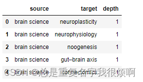
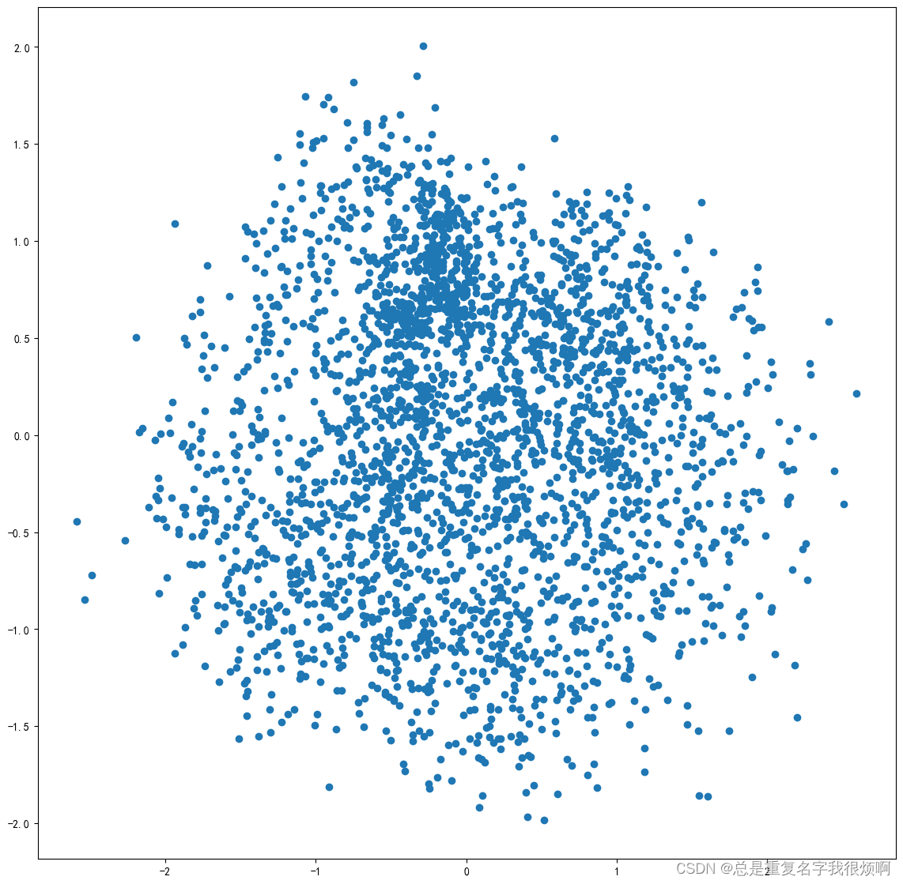
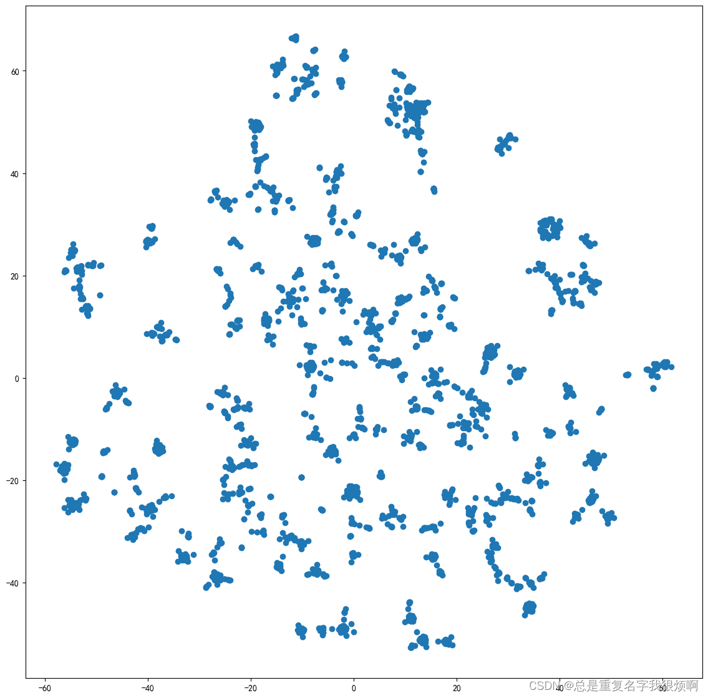
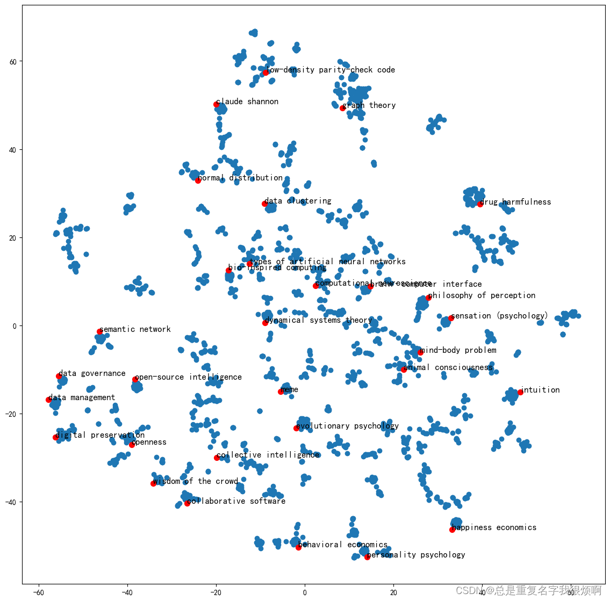
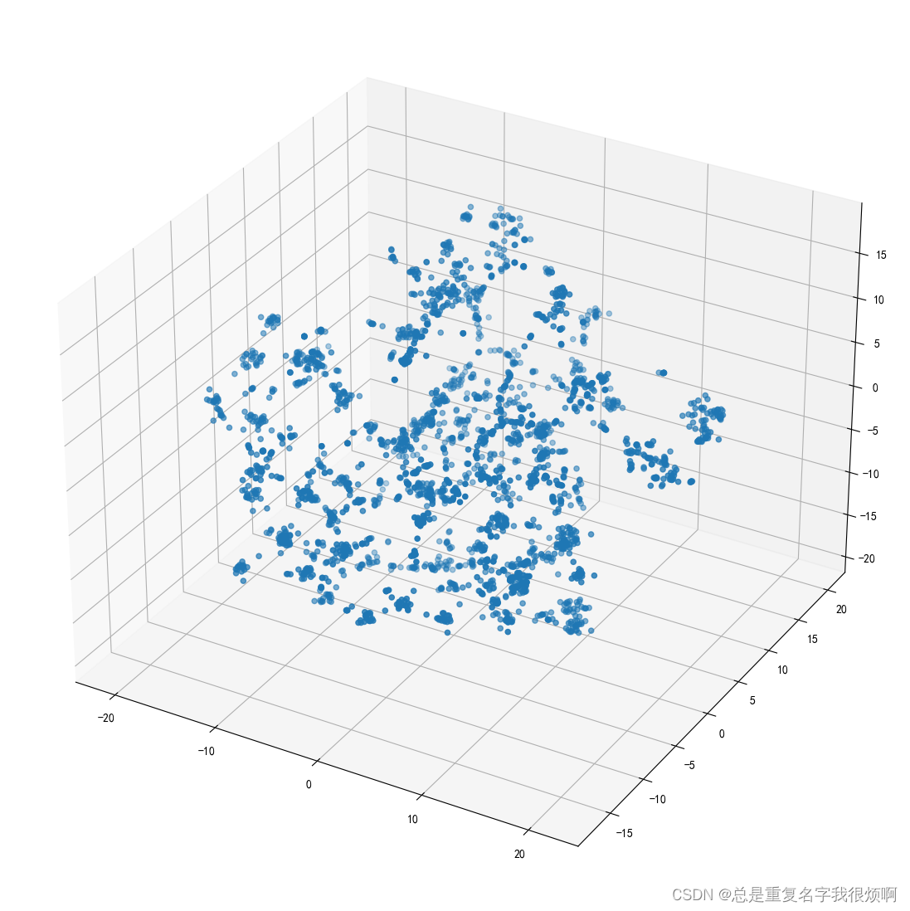

> 环境配置

|工具包| 作用 |
|--|--|
|networkx  | 图网络可视化分析 |
|pandas  | 数据分析 |
|numpy  | 数据分析 |
|tqdm | 进度条|
|gensim | 自然语言处理相关工具(word2vec)|
|scikit-learn | 机器学习(PAC降维, TNSE降维)|

```python
!pip install networkx pandas numpy tqdm gensim scikit-learn -i https://pypi.tuna.tsinghua.edu.cn/simple
```

> 导入工具包

```python
import networkx as nx

import pandas as pd
import numpy as np

import matplotlib.pyplot as plt

import warnings
warnings.filterwarnings('ignore')

from tqdm import tqdm
import random
from gensim.models import Word2Vec
from sklearn.decomposition import PCA
from sklearn.manifold import TSNE

plt.rcParams['font.sans-serif'] = ['SimHei']
plt.rcParams['axes.unicode_minus'] = False
```

> 获取数据


[图关系爬虫网站](https://densitydesign.github.io/strumentalia-seealsology/)

爬取网站信息指令：

> https://en.wikipedia.org/wiki/Deep_learning  
https://en.wikipedia.org/wiki/Brain_science  
https://en.wikipedia.org/wiki/Granger_Analysis

```python
df = pd.read_csv('seealsology-data.tsv', sep='\t')
df.head()
```


> 构建无向图

```python
G = nx.from_pandas_edgelist(df, 'source', 'target', edge_attr=True, create_using=nx.Graph())
# nx.draw(G)
```
> 生成随机游走节点序列函数

```python
def get_randomwalk(node, path_length):
    """
    输入起始节点和路径长度，生成随机游走节点序列
    node: 当前节点
    path_length: 序列长度
    return: 随机游走节点序列
    """
    # 保存起点节点
    random_walk = [node]
    
    for i in range(path_length-1):
        # 汇总邻接节点
        temp = list(G.neighbors(node))
        temp = list(set(temp)-set(random_walk))
        
        # 如果没有邻接节点，走到一条思路就结束
        if len(temp) == 0:
            break
        
        # 选择一个邻接节点并游走过去
        random_node = random.choice(temp)
        random_walk.append(random_node)
        # 重置当前节点为游走后的新节点
        node = random_node
    
    return random_walk
```
> 测试函数

```python
get_randomwalk('deep learning', 5)
>>['deep learning',
 'vector quantization',
 'rate-distortion function',
 'white noise']
```

> 生成随机游走序列

```python
gamma = 10 # 每个节点作为起始节点生成随机游走序列的个数
walk_length = 5 # 游走序列的最大长度

random_walks = []

# 遍历每个节点
for n in tqdm(all_nodes):
    # 每个节点生成gamma个随机游走序列
    for i in range(gamma):
        random_walks.append(get_randomwalk(n, walk_length))

random_walks[1]
>>['brain science',
 'neurophysiology',
 'computational neuroscience',
 'galves–löcherbach model']
```

> 训练word2vec模型

```python
model = Word2Vec(
                vector_size=256, # embedding维度
                window=4,        # 左右窗口宽度
                sg=1,            # 使用skipgram模式
                hs=0,            # 不分层softmax
                negative=10,     # 负采样
                alpha=0.03,      # 学习率
                min_alpha=0.0007,# 最小学习率
                seed=14,         # 随机种子
)
model.build_vocab(random_walks, progress_per=2)
model.train(random_walks, total_examples=model.corpus_count, epochs=50, report_delay=1)
```

> 分析word2vec结果

```python
# 查看每个节点的embedding
print(model.wv.get_vector('brain science'))

# 查找相似词语
print(model.wv.similar_by_word('brain science'))
```
> PAC降维，可视化全部词条的二维embedding

```python
# 导入节点的嵌入向量
X = model.wv.vectors

pca = PCA(n_components=2) # 输入2维
embed_2d = pca.fit_transform(X)

embed_2d.shape
>>(2880, 2)
```

> 可视化

```python
plt.figure(figsize=(14,14))
plt.scatter(embed_2d[:, 0], embed_2d[:, 1])
plt.show()
```


> 可视化某些词条的二维embedding

用PageRank找到重要度前30的节点：

```python
pagerank = nx.pagerank(G)
node_importamce = sorted(pagerank.items(), key=lambda x:x[1], reverse=True)

# 关注前30重要的
n = 30
term_chosen = []
for each in node_importamce[:n]:
    term_chosen.append(each[0])

# 输入词条，输出词典中的索引号
term2index = model.wv.key_to_index
```
> 可视化

```python
plt.figure(figsize=(14,14))
plt.scatter(embed_2d[:,0], embed_2d[:,1])

for item in term_chosen:
    idx = term2index[item]
    plt.scatter(embed_2d[idx, 0], embed_2d[idx, 1], c='r', s=50)
    plt.annotate(item, xy=(embed_2d[idx,0], embed_2d[idx,1]), c='k', fontsize=12)
plt.show()
```

> 更好用的降维，TSNE降维可视化

```python
tsne = TSNE(n_components=2, n_iter=1000)
embed_2d = tsne.fit_transform(X)

plt.figure(figsize=(14,14))
plt.scatter(embed_2d[:,0], embed_2d[:,1])
plt.show()
```



```python
plt.figure(figsize=(14,14))
plt.scatter(embed_2d[:,0], embed_2d[:,1])

for item in term_chosen:
    idx = term2index[item]
    plt.scatter(embed_2d[idx, 0], embed_2d[idx, 1], c='r', s=50)
    plt.annotate(item, xy=(embed_2d[idx,0], embed_2d[idx,1]), c='k', fontsize=12)
plt.show()
```



> 在3维空间可视化

```python
tsne = TSNE(n_components=3, n_iter=1000)
embed_3d = tsne.fit_transform(X)

plt.figure(figsize=(14,14))

ax = plt.axes(projection="3d")
ax.scatter3D(embed_3d[:,0], embed_3d[:,1], embed_3d[:,2])
plt.show()
```

