> 原文链接

[DeepWalk: Online Learning of Social Representations](https://arxiv.org/abs/1403.6652)

> 阅读前的建议

对Word2Vec和自然语言处理词嵌入过程有一定的了解，如果之前不了解，直接阅读[NLP编码](nlp/n2l/)直到编码部分内容结束。

## 背景知识

> DeepWalk诞生背景和想要解决的问题

在DeepWalk诞生之前，往往是通过人工干预，创造的特征工程来进行图机器学习，在这种情况下面临两个问题：

（1）特征工程的好坏决定模型的好坏。并且特征工程并没有统一的标准，对于不同的数据集所需要做的特征工程是不一样的，因此图数据挖掘的模型的稳定性并不好。

（2）人工特征工程无非关注节点信息、边信息、图信息，且不论是否全部关注到，假设可以做到所有信息全部兼顾（实际上不可能）这样近乎完美的特征工程，但是节点的多模态属性信息无法得到关注。这意味着，即使是完美的特征工程，仍然只能兼顾到有限信息，数据挖掘的深度被严重限制。

DeepWalk想要通过这么一种算法，把图中每一个节点编码成一个D维向量（embedding过程），这是一个无监督学习。同时，embedding的信息包含了图中节点、连接、图结构等所有信息，用于下游监督学习任务。

 为什么可以借鉴NLP里面的方法？
图数据是一种具有拓扑结构的序列数据。既然是序列数据，那么就可以用序列数据的处理方式。这里所谓的序列数据是指，图网络总是具有一定的指向性和关联性，例如从磨子桥到火车南站，就可以乘坐3号线在省体育馆转1号线，再到火车南站，也可以在四川大学西门坐8号线转。这都是具备指向关系。那么，我们把“磨子桥-省体育馆-倪家桥-桐梓林-火车南站”就看作是一个序列。当然，这个序列是不唯一的，我们可以“四川大学望江校区-倪家桥-桐梓林-火车南站”。也可以再绕大一圈，坐7号线。总之，在不限制最短路径的前提下，我们从一个点出发到另外一个点，有无数种可能性，这些可能性构成的指向网络，等价于一个NLP中的序列，并且在这个图序列中，相邻节点同样具备文本信息类似的相关性。

> Embedding编码应该具有什么样的特性？

在前文已经有过类似的一句话，**embedding的信息包含了图中节点、连接、图结构等所有信息，用于下游监督学习任务。** 其实这个更是一个思想，具体而言，在NLP领域中，我们希望对文本信息，甚至单词的编码，除了保留他单词的信息，还应该尽可能保留他在原文中的位置信息，语法信息，语境信息，上下文信息等。因为只有这个基向量足够强大，用这个向量训练的模型解码出来才能足够强大。例如这么两句话：

Sentence1：今天天气很好，我去打篮球，结果不小心把新买的水果14摔坏了，但是没关系，我买了保险，我可以免费修手机。

Sentence2：我今天去修手机。

很显然，第一句话包含的信息更多，我们能够更加清晰的理解到这个事件的来龙去脉。对计算机而言也是一样，只有输入的信息足够完整，才能有更好的输出可靠性。

放到图网络里，假设有两个节点u和v，他们在图空间的信息应该和在向量空间的信息保持一致，这就是embedding最核心的特征（假设u和v在图空间是邻接点，那么在向量空间他们也应该是距离相近的；如果八竿子打不着关系，那么在向量空间应该也是看不出太多联系）。把映射的向量放在二维空间或者更高维空间进行下游任务的设计，会比图本身更加直观，把图的问题转化成了不需要特征工程的传统机器学习或者深度学习问题。

> 什么是随机游走（Random Walk）

首先选择一个点，然后随机选择它的邻接节点，移动一步之后，再次选择移动后所在节点的邻接节点进行移动，重复这个过程。记录经过的节点，就构成了一个随机游走序列。

Question：为什么要随机游走？

Answer：一个网络图实际上可能是非常庞大的，通过无穷次采样的随机游走（实际上不可能无穷次），就可以”管中窥豹，可见一斑“。从无数个局部信息捕捉到整张图的信息。

Random Walk的假设和Word2Vec的假设保持一致，即当前节点应该是和周围节点存在联系。所以可以构造一个Word2Vec的skip-gram问题。

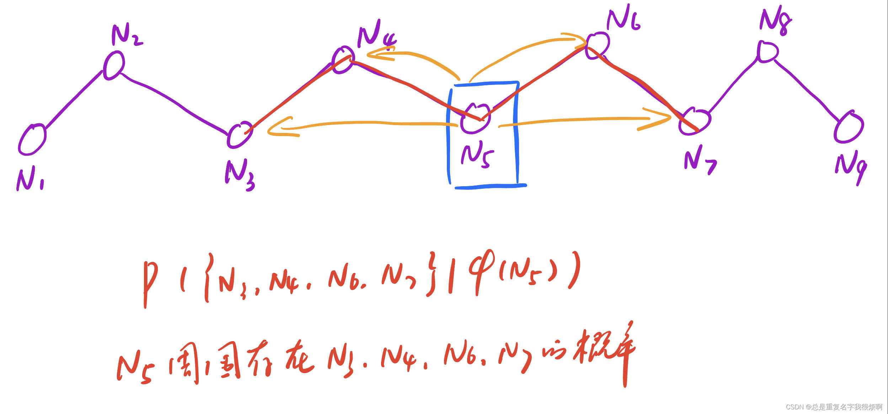

> 思考

- 实际上这个Totally Random Walk并不是一个最优解，因为节点之间的权重不一样，实际上在游走的过程中可以加一些规则干预，让游走得到的序列看上去更有道理。但是DeepWalk是完全均匀随机游走的，Node2Vec在这方面做了改进，后续会看到。
- 由于计算量的限制，这个随机游走的长度并不是无限，所以对于一个巨大的网络，虽然管中窥豹可见一斑，但这也注定了当前位置和距离非常远的位置是完全无法构成任何联系信息的，这和Word2Vec的局限性是一致的，在图神经网络GCN中，解除了距离限制，好像Transformer解除了RNN的距离限制一样，极大释放了模型的潜力，后续也会讲到。
- DeepWalk是一个非常成功的思想试验，但是它无法解决多模态的信息表达，因此没有真正踏入深度学习的蓝海，仍然是传统机器学习的向前优化迈出的伟大一步。

> DeepWalk的整体流程

Step1: 输入一个图

Step2: 采样一个随机游走序列

Step3: 训练Node2Vec模型（构造skip-gram任务）

Step4: 霍夫曼编码（一种softmax方式，解决分类过多的问题，一种工程trick，并不算DeepWalk的理论核心）

Step5: 得到最终每个节点的图嵌入向量

因此DeepWalk一共有2个模型。其一是skip-gram的词嵌入模型，需要训练一个词嵌入表（skip-gram损失函数）；其二是霍夫曼编码涉及到的每一个二叉树的权重参数（交叉熵损失函数）。

## 论文精读

### Title and Authors

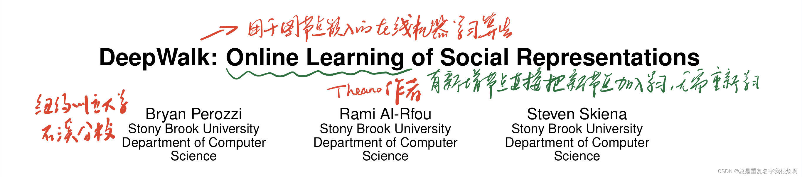

论文的题目是DeepWalk: Online Learning of Social Representations，用于图节点嵌入的在线表示学习算法。那么其实就有两个信息，一个是Online Learning，一个是Social Representations。

对于Online Learning的理解，个人认为应该是它已经训练好了一个embedding模型，如果有新增节点，只需要把新增节点再导入重新训练一下就行，不需要对整张图重新学习。

对于Social Representations，所谓表示学习，其实就是把图节点表示成向量投喂给后面的模型学习，也就是图节点嵌入的学习，也是一种机器学习（参考类似的embedding模型，属于是一类无监督学习）。

第二作者是早期深度学习框架Theano的作者之一，所以这篇文章能够借鉴到一些深度学习的思路也不奇怪啦。

### Abstract

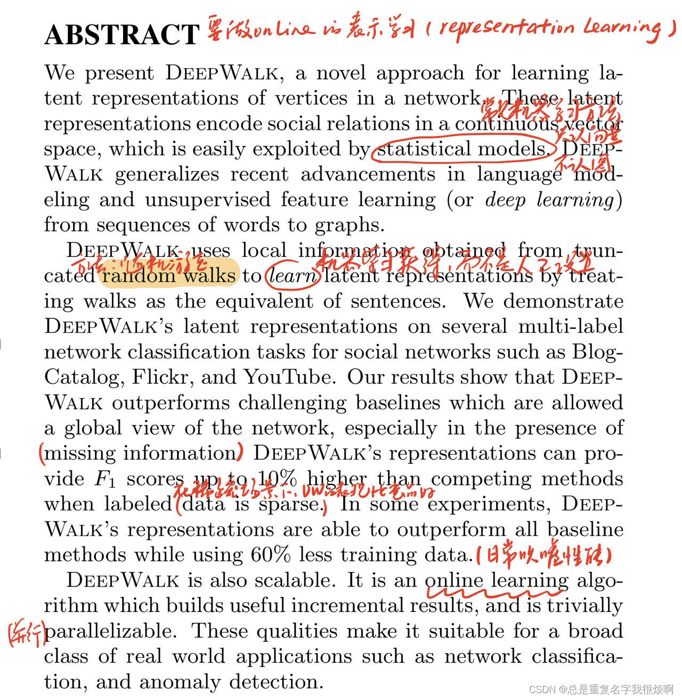

首先，文章说，这个DeepWalk算法，是常见统计模型的拓展。所谓统计模型，其实就是机器学习，统计了大量数据的分布情况和内在联系，构建了一个空间映射关系。所以作者也认为，DeepWalk也属于机器学习的拓展。

第二段第三段提到，DeepWalk是一个随机游走的方法去学习，这表示这个图嵌入的过程是机器学习得到的，而不是人工去设置特征，并且在稀疏矩阵的情况表现比其他常规的模型好很多（而统计模型其实最讨厌的就是稀疏矩阵，等于是迎难而上），此外还具备并行化的特点。

所以总而言之，DeepWalk想要做的，是一个表示学习的问题，它认为多模态数据无法直接导入统计机器学习进行分类或者其他下游任务，必须要把他们表示成向量的形式。并且利用它这个方法encoding出来的向量是一个非常强大的向量，用少的数据就可以达到之前模型的效果，并且在一些常规模型不好处理的场景下它具备优势。

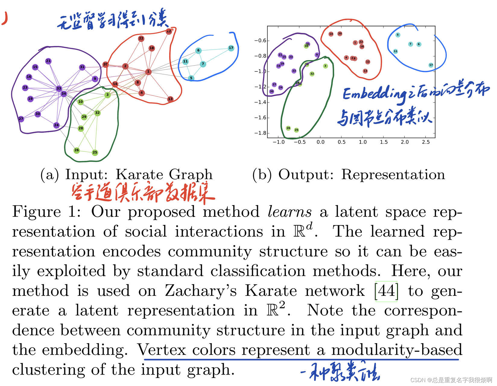

Fig1是这篇论文最经典的一张图，属于是开幕暴击。首先它选择了空手道俱乐部的数据集，这个数据集的每个节点实际上有很多的信息，它通过一种聚类的方法把这个空手道俱乐部各个节点做了个分类并且用不同颜色表示出来。然后它用embedding的方法把这些节点表示成向量，并且绘制在了二维图表中，可以发现embedding出来的向量空间分布其实和真实数据分布是类似的。但是统计机器学习是可以学习向量数据的，就好像打破了次元壁，可以通过对向量的空间切割，把这些节点做一个分类，实现了图节点级别的操作朝向量级别操作可靠转移。

### 1. Introduction

Introduction还是会介绍一些背景的东西，好好阅读有助于我们理解这篇文章的创新到底在哪。

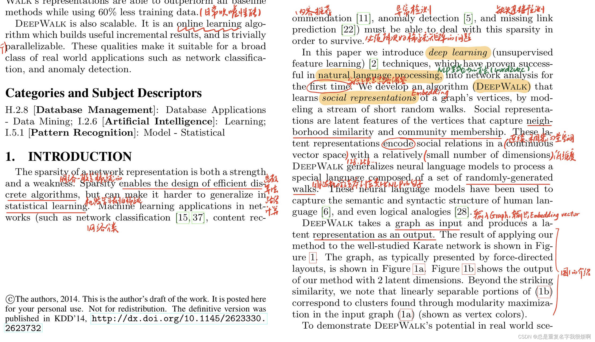

首先，作者说，图网络一般来说都是比较稀疏的，这种稀疏的特性有好处也有坏处，好处在于如果你想要做最短路径计算（用邻接矩阵）就非常方便；坏处在于如果你想用机器学习去做图信息的学习和挖掘，这会遇到不小的阻力，因为机器学习最怕的就是稀疏矩阵。文章认为在图网络的分类任务中，包括推荐，异常检测，连接预测之类的，都必须解决矩阵稀疏性的问题。

> 拓展

我们在做机器学习的时候，最容易遇到过拟合的情况，因此在对模型进行优化的时候，我们通常是加入一个正则化在里面。正则化一般有L1正则和L2正则。通俗易懂的来讲，加入正则化项之后可以让模型出错的时候受到惩罚，迫使模型朝着正确的方向发展。实际上，正则化的加入在数据层面是使得学习矩阵变得稀疏，帮助模型进行更好的特征筛分。例如文本处理时，如果将一个词组作为一个特征，那么特征数量会达到上万个。在预测或分类时，那么多特征显然难以选择，但是如果代入这些特征得到的模型是一个稀疏模型，表示只有少数特征对这个模型有贡献，绝大部分特征是没有贡献的，或者贡献微小（因为它们前面的系数是0或者是很小的值，即使去掉对模型也没有什么影响），此时我们就可以只关注系数是非零值的特征。这就是稀疏模型与特征选择的关系。但是，如果模型本身就全是0，这个时候是明显欠拟合的，这意味着我们花费大量的计算资源开销去计算很多无关紧要的东西。因此，机器学习在原则只允许我们把稠密矩阵变的稀疏，而不允许我们直接利用稀疏矩阵。

然后，文章说可以借鉴NLP里面已经相当成功的word2vec方法，用一种随机游走的方法找到节点序列，把这个序列看作是NLP里文本序列，这样就可以把节点映射成一个连续稠密低维的向量空间。实际上这里的低维是相较于一言不合数十万几十万的节点数量而言，在使用的时候一般是映射成128 256 512维这样。

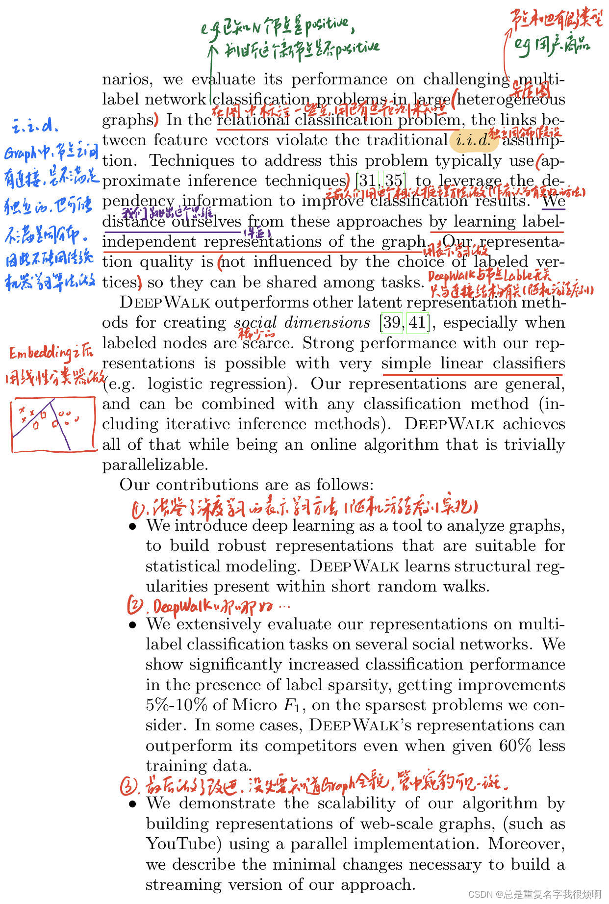

作者用异质图（heterpgenous graph）的分类任务来证明这个方法的潜力，异质图就是这个图的节点和边有很多类别，拳击俱乐部数据级是这样，或者电商数据，用户 商品 卖家这些节点也是不同类别。具体而言，作者在图中embedding了一些节点，然后用这些标注的数据来预测未标注的节点。

作者在这里还提出了这么做的一个关键好处。传统机器学习一般需要数据满足独立同分布假设，所谓独立同分布，就是数据和数据之间不存在关联，他们是独立存在的，例如房价，这个房子就是这个价格，他旁边的房子是另外的价格，这两个房价之间不存在互相影响的关系。但是对于图网络而言，节点之间相互连接，是不满足独立性假设的，并且同分布也无法论证。因此，机器学习直接学习节点在根本上来说是有巨大理论缺陷的。作者总结了DeepWalk之前人们通常用一种相似推理的技术做这样一件事情（言外之意就是我的DeepWalk来了你就歇菜了），然后作者用了一个及其猖狂的表达：We distance ourselves，意思就是，“我们觉得你们这些方法用来用去都是在一个思维怪圈里，你们没有找到最根本的突破口，我们根本不参与你们的这些讨论，我们直接用表示学习来做。”然后作者说DeepWalk是一个无监督学习，与节点的label无关，只和图的结构和节点连接信息有关。本质上这是因为他所有的计算都是基于随机游走序列做的，所以图的拓扑结构会得到极大表示。

在Introductio部分最后，文章说embedding之后接一个简单的线性分类器就可以完成分类任务，类似Fig1那样，并且提出了本文的三个贡献。主要是第一点，文章借鉴了深度学习表示学习的方法，用随机游走序列实现了词嵌入向量计算。第二点就是自卖自夸。第三点表示还做了一些改进，对于DeepWalk而言，无需知晓图的全貌，管中窥豹可见一斑就是对这个模型最大的诠释啦。

### 2. Problem definition

这里开始，除了要学习论文算法的思想，还需要学习实际问题的数学抽象表达。

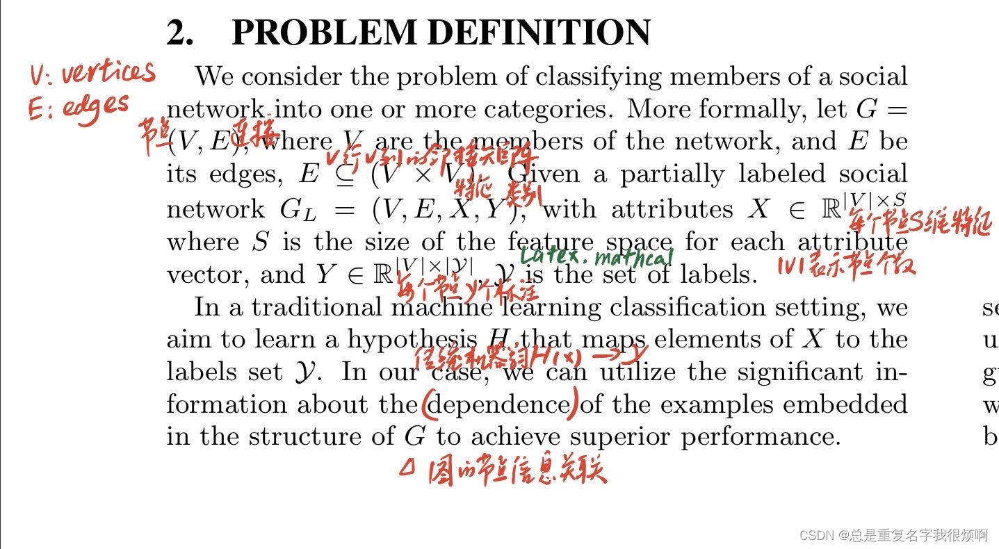

首先，一个图最基本可以表示成节点和连接的关系，并且根据节点连接的关系可以写出一个邻接矩阵，由于每个节点有自己的特征和类别，所以图可以抽象成如下函数表达：

$$G=(V,E,X,Y)$$

这里存在两个大写的Y，为了区分，作者在表示所有节点labels信息集合时使用$Y$，在表示每个节点对应的具体label使用$\mathcal Y$。

接下来，作者介绍了传统机器学习实际上就是构建一个$H(X) \rightarrow \mathcal Y$这样的映射关系，在图机器学习中，其实就是要充分学习节点的依赖关系。

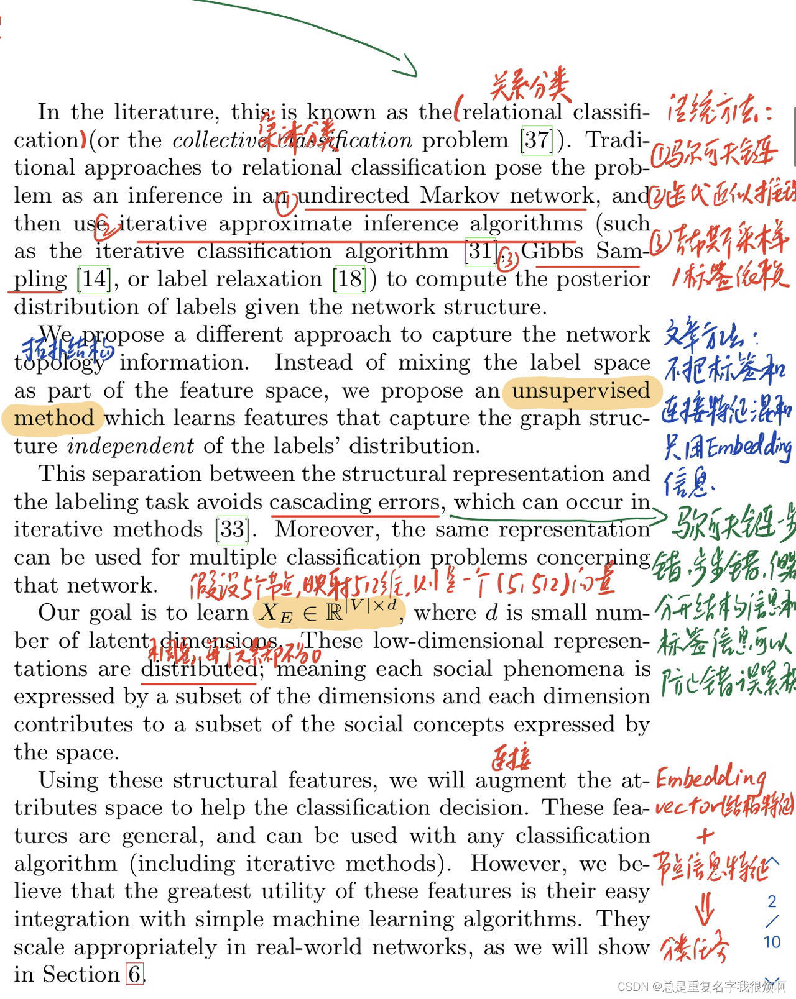

作者接下来介绍了常见的图网络中关系分类或者集体分类方法。所谓关系分类或者集体分类，其实就是群体的多标签或者双标签分类任务，通过训练集训练一个标签预测模型，然后输出未标注数据的标签类别。由于前文说过，图的学习并不能直接使用传统机器学习的方法，因此在图节点关系的建模中，传统方法是通过一个无向马尔可夫链，迭代近似推理，配合吉布斯采样的一种方式。感兴趣的可以去了解一下[吉布斯采样](https://blog.csdn.net/weixin_38502514/article/details/122435056)，这是专门服务于马尔可夫链的一种采样技巧。但是显然文章认为基于无向马尔可夫链的方式是有问题的，作者认为最大的问题在于马尔可夫链如果一步错，就会满盘皆属步步皆错，存在很大的错误积累风险。针对这样的问题，作者表示，可以不把标签和连接特征混合，只用embedding的信息表示拓扑结构和空间位置信息即可，这样等于把一步计算拆分成了两步，可以增加一定容错。

最后一段作者对这样一个说法进行了补充，完整的任务流程应是：获取Embedding Vector来表示结构特征，再融合节点的信息特征，最后输入一个简单模型完成分类任务。

### 3. Learning social representations

整个第三节其实也都是一些综述类的东西，让我们更好的理解他提出一些概念。

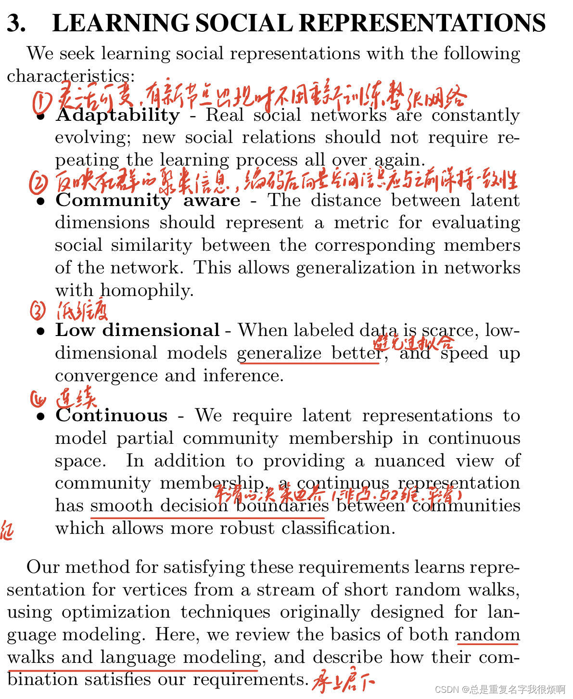

这一部分就是简单介绍了一下这个embedding应该具备什么样的特性。或者说，什么样的embedding才是好的embedding。那么作者给出了4个关键词。

1、灵活可变，适应能力强。这是因为图网络往往伴随着动态变化，如果我们对当前时刻训练出来的词嵌入模型只能对当前时刻有效，那么无时无刻更新的网络就没办法进行词嵌入编码了。因此，首先这个编码过程必须是一个训练好一个模型，然后来新的，就在旧模型基础上更新，无需对整张图进行重新学习。

2、社群信息，反应聚类关系。这点其实就和Fig1对应，即embedding出来的节点向量把他映射到空间部分时应该保持和原图网络相类似的空间信息。

3、低维度。由于他训练出来的是一个稠密的矩阵，即每一个数值都有一定的客观意义，因此如果维度过高，则会过量抽取图节点信息，低维度是为了避免过拟合。

4、连续。这一点说明embedding出来的节点向量在空间的分布应该有一个平滑的决策边界，我们进一步去说，应该是一个非凸、低维、平滑的决策边界。关于凹凸性，数学证明的过程非常繁琐，在数学推论部分会补充这部分的推论，这里直接说结论，凸函数是只要沿着梯度方向走到底，就一定是最优解，大部分传统机器学习的问题都是凸函数；非凸更符合实际的情况，意味着沿着梯度方向走到底，只能说明是局部最优，不一定是全局最优，大部分深度学习都是非凸。这里我想要强调非凸主要是给后续讲到图深度学习埋下一个伏笔。

#### 3.1 Random Walks

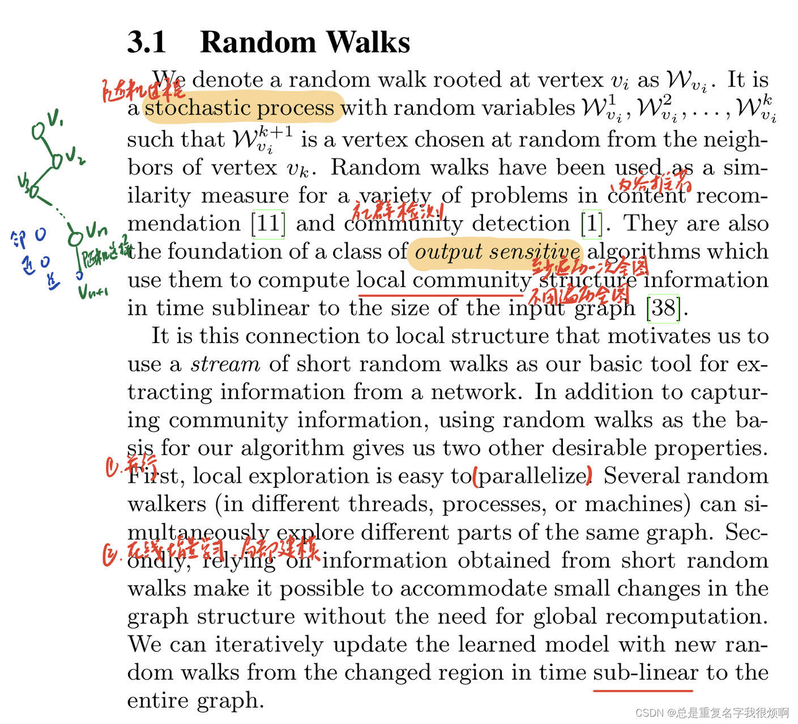

第一段说的是随机游走的过程。当他走到Vn这个节点，想要走到下一个时，就在Vn节点的相邻节点随机选择一个作为下一个的目的地，并且V1，V2，...，Vn...这串节点序列被保存下来用作后续的学习输入。作者并不是第一个提出随机过程的人，因此他也说了一下随机过程算法的一些应用，包括在内容推荐和社群检测都有使用的先例。并且作者提到随机游走有两种方式，一种是遍历全图的，一种是不需要遍历全图的。DeepWalk就属于不需要遍历全图的。

第二段作者提出随机游走过程有两个好处。其一是可以并行化处理。文章的语言来解释，就是这个随机的过程可以同步进行，你走你的，我走我的，我们互不影响，我们都记录下各种遍历的节点序列就可以。其二就是对之前说过的在线增量学习做了更详细的解释，是一个sub-linear的过程，所谓sub-linear，就是当出现新增节点的时候，只需要对新增节点附近的子图做一个新的学习即可，不需要对全图进行全部重新学习。

#### 3.2 Connection: Power laws
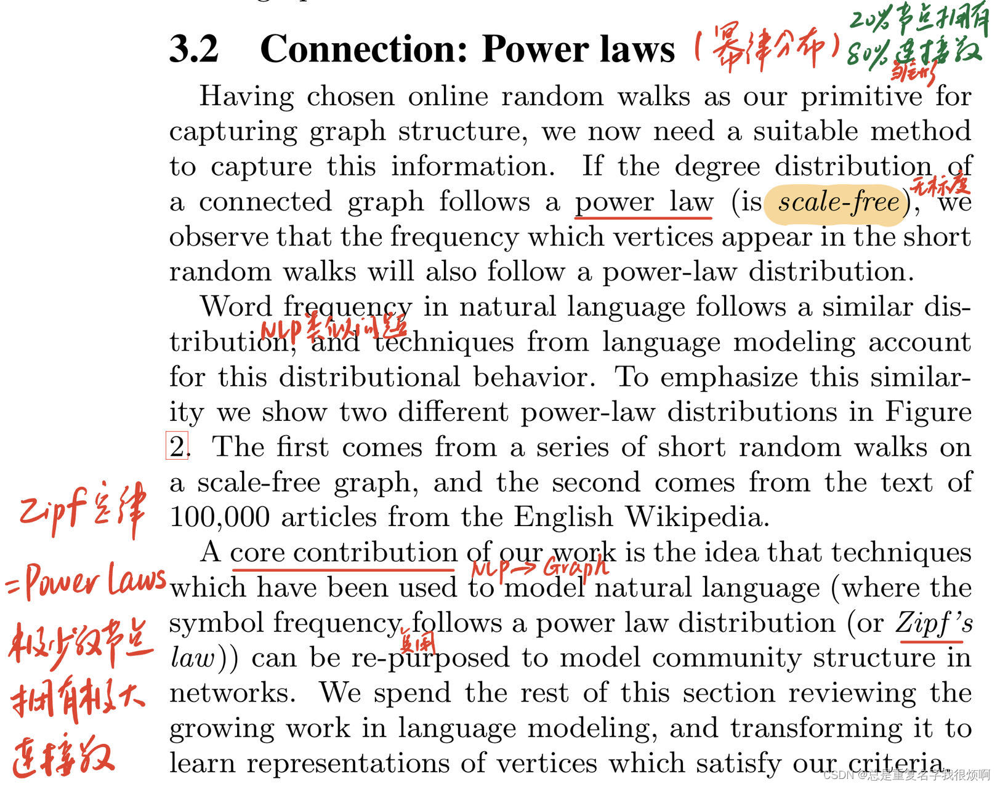

在3.2部分，文章再次把图和NLP进行了比较。文章说文本材料是符合幂律分布的。这里结合Fig2来看。

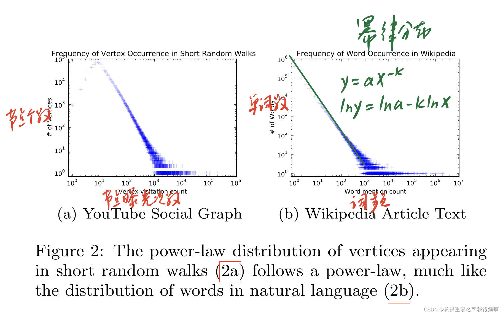

左侧是图网络的连接频率图，右图是维基百科文本信息的词频图。这两个在分布规律上是保持一致的。我们发现他的坐标轴都是科学计数法，因此我们把它改写成对数坐标轴，单词数为y，词频为x，那么这样的线性关系可以写成:

$$lny=-klnx+lna$$

还原成普通表示：

$$y = ax^{-k}$$

这就是幂函数的表示方式，因此叫做幂律分布。

这个分布表示，小部分的节点拥有大部分的连接。这个也很好理解，举个具体的例子，假如这是一个门户网站的图，那么Google，baidu等是不是拥有绝大多数的访问量，一些小网站则鲜有访问。在文本中也是一样的道理，例如a the and这类词，他们出现的频率会远远大于power-law这种词汇。正是节点和文本有这种相似性，因此把NLP的编码思路套用在图编码中是存在可行性的。

#### 3.3 Language Modeling
这部分其实主要就是介绍Word2Vec模型，并且把Word2Vec的似然估计放到了图中。

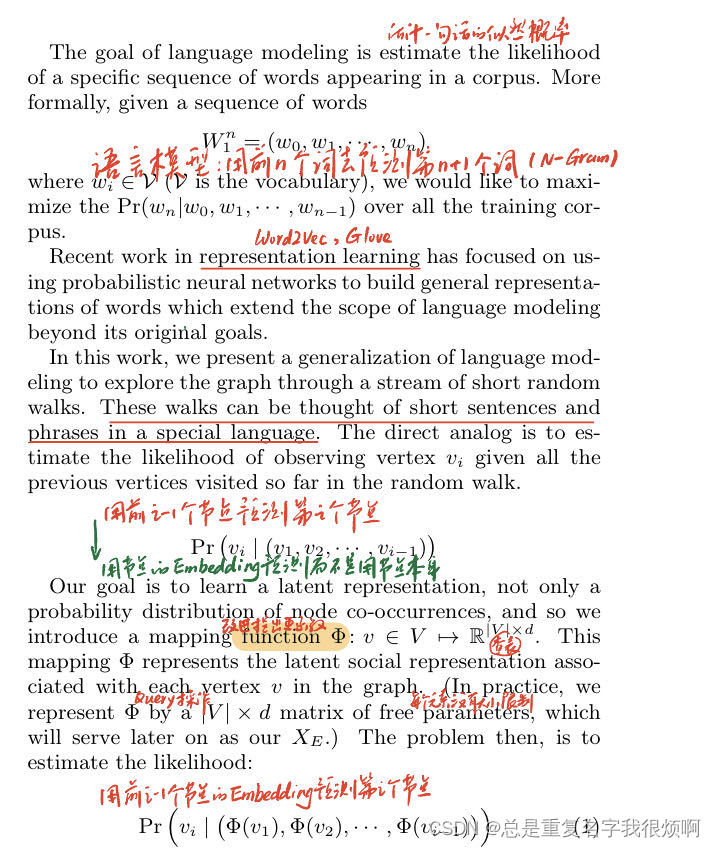

在这一节开始，作者说最开始语言模型的目标，就是构造一个似然函数来估计一句话的最大似然概率，也就是用前n个词去预测第n+1个词，这在自然语言处理部分叫做N-Gram模型，这个N就是前面多少个词。在[NLP系列文章机械分词和隐马尔可夫链（HMM）](https://blog.csdn.net/D_Ddd0701/article/details/122506622?spm=1001.2014.3001.5501)部分有关于这个N-Gram的具体计算规则，感兴趣的可以点超链接去看看。

近年的一些表示学习的工作（主要就是Word2Vec和Glove）把这个语言模型的目标改变了。并且DeepWalk认为，可以用随机游走获得的节点序列前面i-1个节点去预测第i个节点，这样就和语言模型对应上了。但是和自然语言一样，我们不能用节点本身去预测，要用一个embedding成向量的输入模型。

最下面一段就是说如何进行这样一个过程。首先DeepWalk要提出一个$\Phi$函数，这个函数其实就是一个向量Query表，里面是每一个节点V对应的向量d。我们在进行模型输入的时候，可以查询这个向量表找到这个节点的d维向量，然后用向量把他表示出来，这样预测节点的问题就变成了基于向量的联合概率模型。

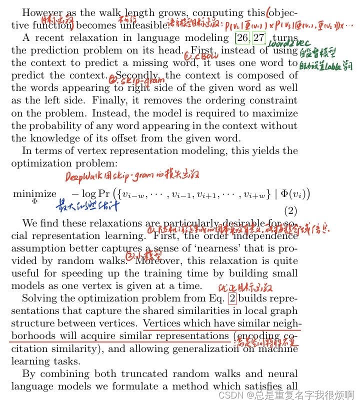

在这种情况下（用i-1个节点预测i个节点，暂且叫他i-Node模型？吧），需要优化的目标函数变成了：

$$F=P(v_2|\Phi(v1)) * P(v3|(\Phi(v1), \Phi(v2))) * \dots * P(v_{i-1}|(\Phi(v1), \Phi(v2), \dots ,\Phi(v_{i-2})))$$

这个函数存在两个显著问题：（1）因为联合概率的每一项都是小于1的数，因此当i足够大的时候，F=0；（2）当i越大，计算的开销越大。所以这样一个目标函数显然不是最优选择。

针对这个问题，作者再次提到Word2Vec这类语言模型，他通过自己设置标签进行自监督学习，并且还能关注到上下单词语义关联，还节省计算开销。并且word2vec一共有两种训练模式：

（1）CBOW，用左右两侧的上下文对中间词进行预测，假定有一句话Hope can set you free，windows=3，因此模型第一个训练出来的样本来自Hope can set,CBOW模式下将Hope set作为输入，can作为输出，在模型训练时，Hope can set都使用的one-hot编码，Hope:[1,0,0,0,0]，can:[0,1,0,0,0], set:[0,0,1,0,0]。用变换矩阵35相乘得到31的【表示矩阵】。这里的3是最后得到的词向量维度。【表示矩阵】再和【变换矩阵】shape(5，3)相乘得到5x1的目标矩阵，在这里我们希望他是[0,1,0,0,0]。然后窗口按序向后移动重新更新参数，直到所有的语料被遍历完成，得到最终的【变换矩阵】。

（2）Skip-Gram：用中间的词预测两侧上下文。假定有一句话Hope can set you free，windows=3，因此模型第一个训练出来的样本来自Hope can set。skipgram模式下将can作为输入，Hope set作为输出。输入can[0,1,0,0,0]reshape(5,1)和变换矩阵3x5相乘得到3x1的表示矩阵，这个表示矩阵和许多不同的5x3的变换矩阵相乘得到5x1目标矩阵。

DeepWalk采用的就是Skip-Gram模式。在这种情况下，他的极大似然估计可以表示成公式2的形式：

$$min -logP({v_{i-w}, \dots ,v_{i-1}, v_{i+1}, \dots , v_{i+w}}|\Phi (v_i))$$

这个公式的意义是，中间这个节点是3时，左右w步的节点分别是12、45的概率。

作者认为用Skip-Gram模式进行表示学习有两个好处：（1）随机游走生成的图本身没有意义，但是他可以捕捉到这个节点附近的一些拓扑结构；（2）因为只关注当前节点的临近w个节点，因此模型的计算开销不大。

因此，经过skip-gram之后，embedding过程就变成了优化目标函数的过程，由于随机游走可以捕捉到小范围内的拓扑结构信息，因此学习之后的向量是可以和真实节点的空间特征保持一定的相似性。

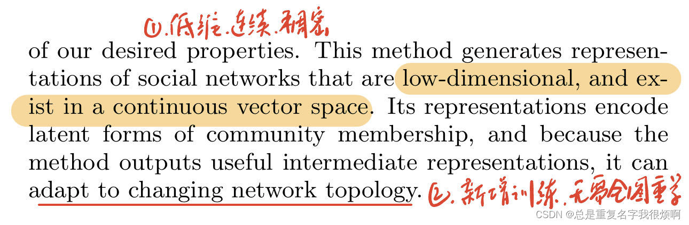

并且这个训练的向量也有两个特点：（1）低维、连续、稠密、（非凸）；（2）是新增训练，有新数据就喂新数据增量训练，无需对全图重复训练。

### 4. Method
#### 4.1 Overview & 4.2 Algorithm: DeepWalk & 4.2.1 SkipGram
其实这部分的核心就是要看懂DeepWalk的伪代码，知道他的流程，好在这个算法非常简单。

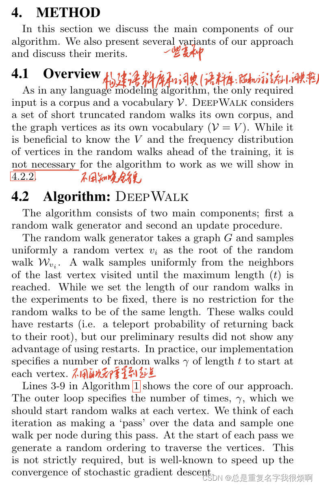

在Overview里，作者提出DeepWalk也需要和自然语言处理算法一样，构建自己的语料库和词库。这里的语料库就是随机游走生成的序列，词库就是每个节点本身。从这一点上看，其实图的Skip-Gram会更简单一点，因为词会涉及到分词，切词，例如”小明天天吃饭“，是小明还是明天，如果词库做不好，切割做不好，会非常影响模型性能；如果是英文单词，好一点的做法会切分#-ed -#ing这样的分词，但是节点都是一个一个单独的，不存在这样的问题。

4.2小节其实就是在介绍他的Algorithm1和Algorithm2，我们直接看伪代码。

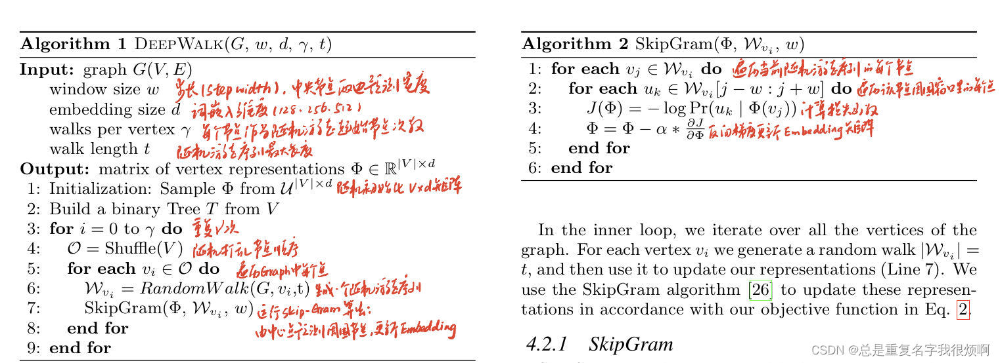

算法1，整体运行逻辑：

输入图和相关参数：

1、需要设置skip-gram的步长w，也就是我们要用当前节点来预测当前节点左边w和右边w个节点。

2、设置词嵌入的维度d，也就是我们希望embedding出来的向量是多少维，根据经验一般是128，256和512。

3、设置每个节点作为随机游走节点的次数$\gamma$

4、设置每个随机游走序列的最大长度t

输出embedding矩阵：

第一步、初始化一个和embedding矩阵同样大小的随机矩阵，大小为(V, d)，表示V个节点，每个节点d维。

第二步、构建一个初始化的Softmax层（暂时不管）

第三步、循环$\gamma$次

在每个循环中：

第一步、随机打乱节点顺序，这是为了防止学习存在惯性，提高模型性能；

第二步、遍历Graph中的每一个节点：

首先对当前遍历的节点生成一个随机游走序列，然后运行SkipGram方法，用该节点的存在embedding矩阵中的嵌入向量预测周围节点，更新embedding。

算法2，SkipGram方法：

首先遍历当前随机游走序列的每个节点，再遍历该节点左右w个节点，然后把左右2w加上当前节点一共2w+1个节点在embedding矩阵中的嵌入向量导入损失函数并求偏导计算当前节点的梯度$\nabla$。

$$\nabla = \frac{\partial -logP({v_{i-w}, \dots ,v_{i-1}, v_{i+1}, \dots , v_{i+w}}|\Phi (v_i))}{\partial\Phi (v_i)}$$

然后反向传播算法更新这个embedding矩阵：

$$\Phi (v_i) = \Phi (v_i) - \alpha\nabla$$

这里$\alpha$是学习率，是一个超参数。关于反向梯度更新损失函数的数学推导过程可以上网搜，有很多大神写过，这里就不再仔细证明了。

直到遍历完这个序列所有节点，更新了这个节点的所有embedding矩阵，才结束这次SkipGram计算，然后进入到下一个随机游走序列再次进行SkipGram计算。

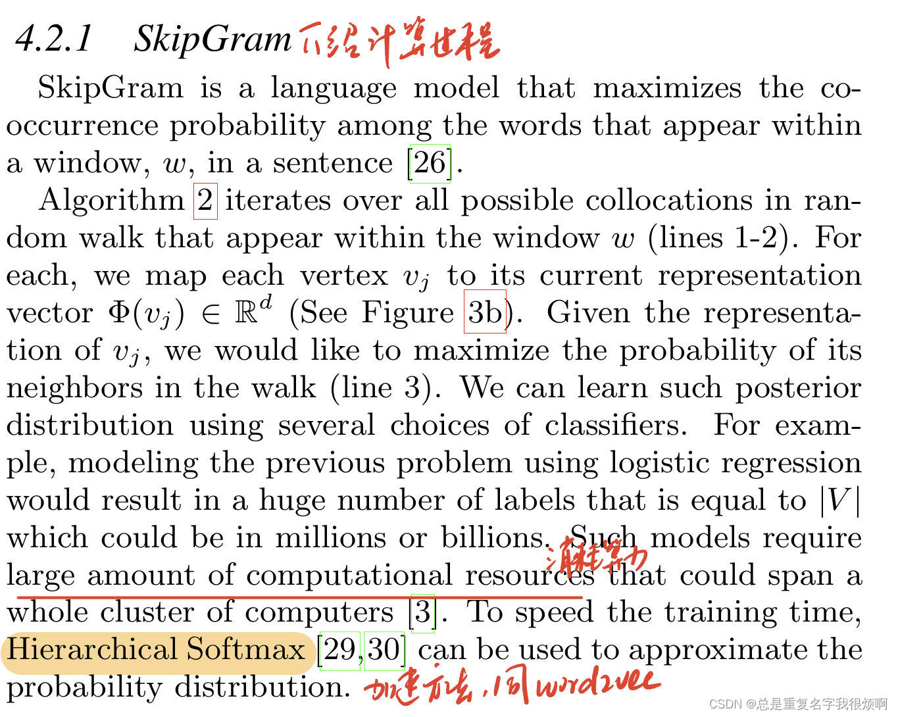

那么现在还有一点没讲明白，也是最核心的，就是这个$\nabla$的P括号里一长串到底是怎么算的。其实非常简单，就是把当前节点的embedding和其他节点的embedding做数量积求和即可。

$$-logP({v_{i-w}, \dots ,v_{i-1}, v_{i+1}, \dots , v_{i+w}}|\Phi (v_i))\\
=-[logP(v_{i-w}|\Phi v_i)+logP(v_{i-w+1}|\Phi v_i)+\dots +logP(v_{i+w}|\Phi v_i)]\\
=-\sum_{a=0 \neq w}^{2w} logP(v_{i-w+a}|\Phi v_i) \\
= -log\prod_{a=0 \neq w}^{2w} \Phi(i-w+a) \cdot \Phi(i)$$

虽然搞明白了计算过程，就是非常简单的矩阵点乘再求和，但是仍然纯在一个显著问题，就是当节点数量非常大的时候，虽然我们一次随机游走消耗的算力不大，但进行分类任务的时候，如果每个节点都是一类，那计算的开销可能会非常庞大。例如我们要对互联网的门户网站进行分析，可能有几千万个门户网站，那每次分类都要分几千万类，这是不太能接受的。word2vec也同样面临这样的问题，因此作者再次借鉴了word2vec的思路，用了一个叫分层softmax的设计。

#### 4.2.2 Hierarchical Softmax & 4.2.3 Optimization

首先需要明确，这里的分层softmax并不属于图嵌入算法的范畴了，这个完全是为了分类任务而设计的一个trick。但是既然放在论文里，就顺带着说一下。

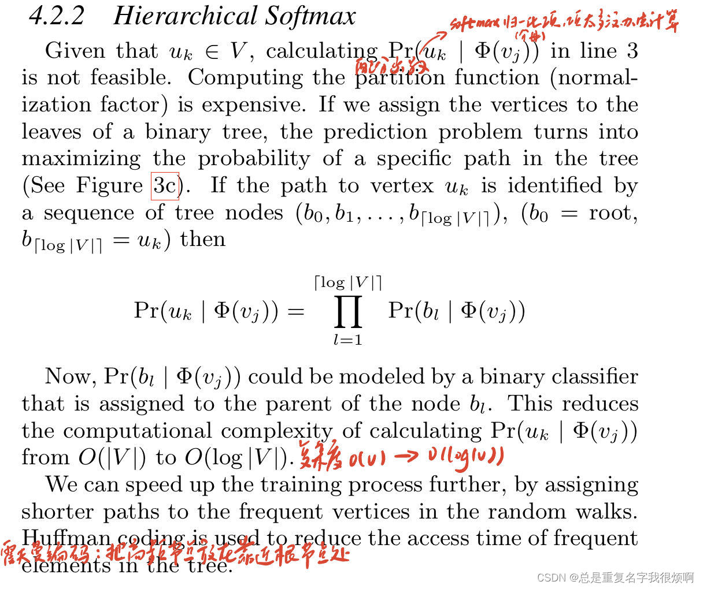

对于多分类任务的常规流程，一般是输入向量，进行逻辑回归，输出一个和输入向量维度相同的输出向量，对这个输出向进行softmax归一化表示类别概率，选择概率最大的作为预测输出。作者认为，softmax归一化的分母计算在多节点的时候非常复杂。假设有n个类别，逻辑回归输出的预测结果是一个n维向量，对于其第k个类别而言，他的softmax计算为：

$$Softmax(x_k) = \frac{e^{x_k}}{\sum_{i=1}^{n}e^{x_i}}$$

> 拓展

假如节点有三个类别，输出向量[1,1,2]，当然我们知道2是最大的，因此大概率属于第三类，但是这样的描述是不科学的，因为你没有描述它的概率。因此使用Softmax后输出的结果是[0.212, 0.212, 0.576]，所以是第三类的概率是57.6%。如果是[10,10,20]，softmax计算后第三个概率是0.999。

但是可以发现，如果有几千万个节点，那么对每个节点都进行一次指数运算，是非常奢侈的一件事。因此作者提出可以用二叉树的方法减轻分类任务计算开销。

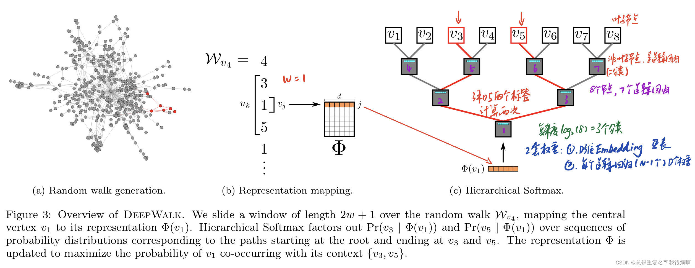

设计的流程为：首先随机游走生成一个4315...的节点序列，设置窗口大小为1，那么需要用1来预测3和5节点，在$\Phi$表中找到1号节点的向量输入二分类器，对于3而言，就会经过3次分类找到v3节点，对于5而言也是经过3次分类最终到v5节点。这两条路径是独立计算、更新损失函数。假设这里D是512维（$shape(\Phi)=(V,512)$），那么每个逻辑回归也是一个512维权重，把词嵌入向量和逻辑回归的输出向量进行一个sigmoid计算，就可以输出它的后验概率，实现二分类任务，进入到下一层：

$$Sigmoid(x) = \frac{1}{1+e^{-x}}
\\P(b_l|\Phi(v_j))=\frac{1}{1+e^{-\Phi(v_j)\cdot\Psi(b_l)}}$$

这里的$b_l$是binary logist regression，$\Psi(b_l)$是逻辑回归输出向量。 Sigmoid计算可以把函数区间压缩到(0,1)，一般来说以0.5作为一个二分类的边界条件。

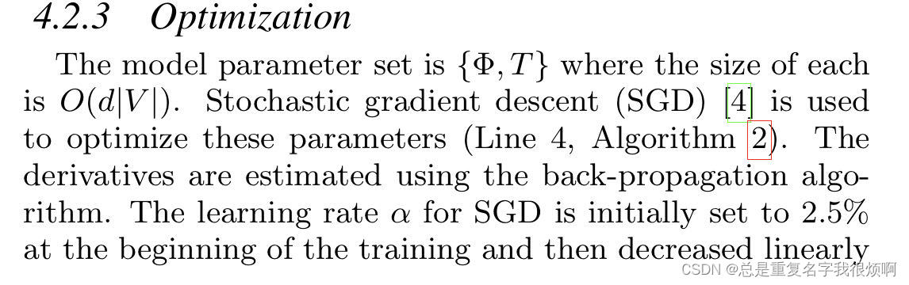

训练部分其实就是一套标准的套话，自己如果写论文可以按照这段话改改。通过随机梯度优化（实际上现在一般深度学习都用Adam），通过反向传播计算梯度然后梯度下降更新参数，把learning rate设置为0.025。

核心的内容就是DeepWalk一共有两套权重需要训练：

（1）D维embedding的$\Phi$表。

（2）N-1个逻辑回归二分类器每一个的D个向量。

至于文章这里提到的霍夫曼编码优化，我个人感觉相较于整个算法设计而言更是不重要中的不重要，完全是一个工程考量，就没有做更多资料的整理，感兴趣可以搜相关资料看看。

#### 4.3 Parallelizability

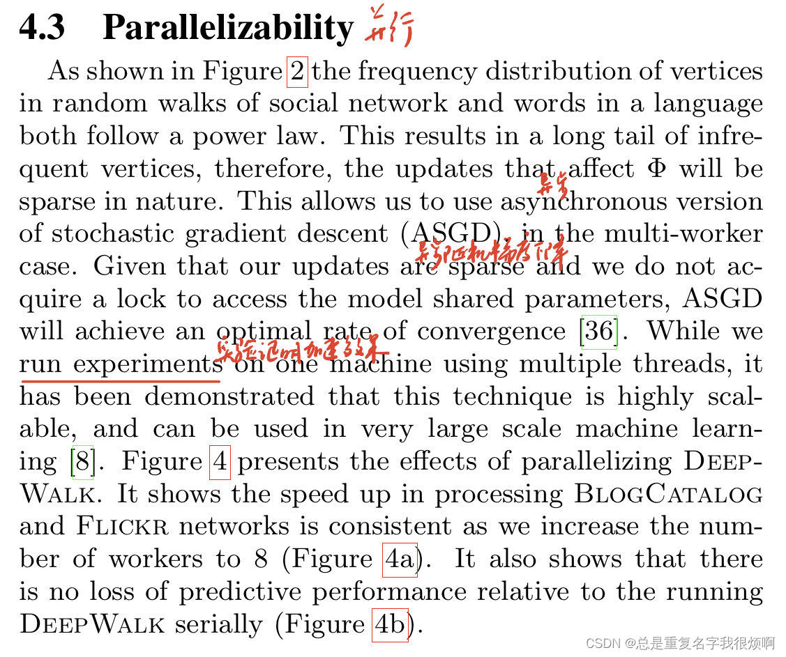

这部分也是工程上的内容，由于我对分布式集群训练的了解确实不多，所以无法给出非常详细的简介。从字面意思理解，这一段主要就是说训练采用了一种异步随机梯度下降的方式，即多个机器集群同时训练，然后向中央机器汇总梯度信息，然后用实验数据证明了这种异步训练加速的效果。

#### 4.4 Algorithm Variants & 4.4.1 Streaming
这里主要讲了一下算法的变种。

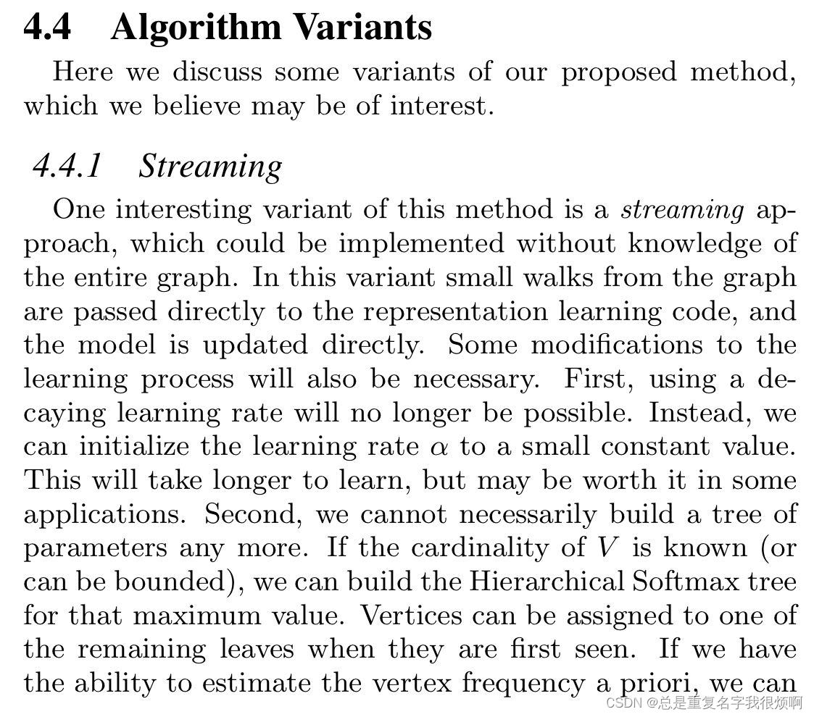

Streaming就是之前提到的，对于一个很大的Graph，并不需要知道整张图的全貌，直接采用随机游走的信息获取局部拓扑信息即可。对于这种情况，学习率$\alpha$就应该是一个非常小的常数，来一个新的节点，就额外构造一个新的叶子节点（见softmax过程）。

#### 4.4.2 Non-random walks
这里提出的思考主要是基于行为惯性，即不同相邻节点之间的联系权重并不一致。比如有100个人，其中99个人打开web of science后就要打开中国知网，有1个人打开web of science后打开了4399小游戏，显然这种情况是非常稀少的。所以随机游走并一定完全随机，可是一个有目的的游走。通过构造这样的信息除了反应拓扑，还能反应权重关系。

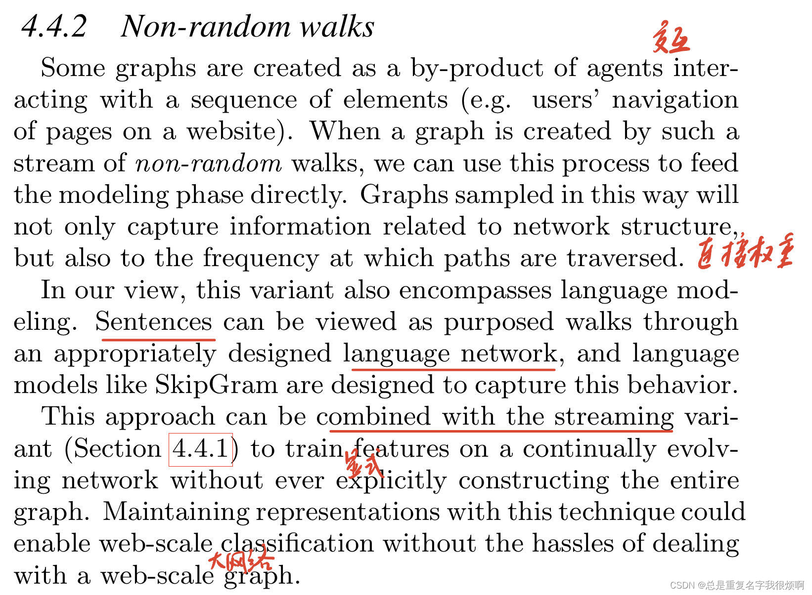

在最后作者说，可以把Streaming这种盲人摸象的模式和不随机游走相结合，来实现互联网这样大规模图的信息挖掘。

### 5. Experimental design & 6. Experiments & 其他内容
这部分就是试验设计、对比模型的一句话介绍、评价指标和数据展示了，并不需要逐字逐句精读这些东西了。主要原因在于现在有更强大的模型可以做图数据挖掘，而这篇文章embedding思路是最重要的，他的图嵌入是后续所有图机器学习、图深度学习的基础。所以深入理解这篇文章做了什么，为什么做，怎么做即可（What, Why, How）。
