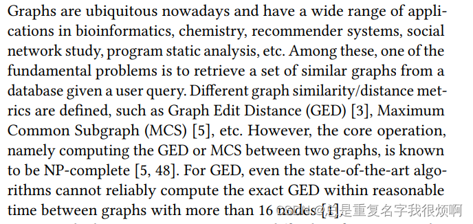
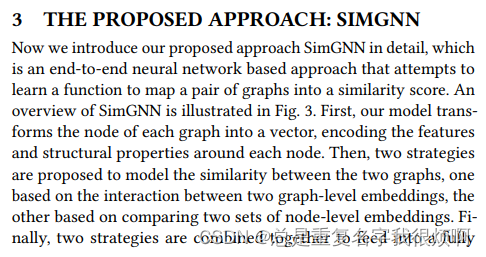

> 原文链接

[SimGNN](https://sci-hub.se/10.1145/3289600.3290967)

> 阅读前的建议

有[GCN](graph/gnn/gcn/)基础。至少完成DeepWalk精读，对节点嵌入有一定理解：[DeepWalk](paper_read/gnn/DeepWalk/paper/)、[Node2Vec](paper_read/gnn/node2vec/paper/)。

## 背景知识

> SVD分解

在大图中，一个节点嵌入矩阵储存的表往往非常庞大，非常不利于后续计算。恰巧在NLP推荐系统方向，通常会使用一种奇异值分解的方法（SVD）来降低大表的维护成本和计算开销。假设这里由1000万的用户，100万个商品，那么如果需要用一张表去统计每个用户对每个商品的喜好程度，那么这张表是一张[1000万,100万]的庞大稀疏表，因为不可能每个用户都对这100万个商品有偏好，如果这个用户就喜欢那么3 4个，那么剩下999996个都是0。对这张表去做用户推荐和信息挖掘，非常困难。

因此，工业界采用的方法是，维护这一张表改成维护[1000万, k][k，100万]两张表，这里的k是一个隐藏关系值，表示用户和商品之间可能存在k个影响因素。假设这里k=10，那么只需要维护[1000万, 10][10，100万]两张表，对于这两张表的计算，首先下降了几个数量级，并且稀疏性也得到了良好改善。或者换个例子，城市有100万人想要购房，有1000万套房，难道让这100万人去挨家挨户看吗，显然过于困难，这个时候安排100个中介去做这个事，那么整件事情的完成效率和质量都会高很多。

因此，在SVD中，最核心的就是找到一个合适的K值，让大表计算变成小表维护。

## 论文精读

### Title and Authors

这是2019年发表在wsdm数据挖掘和信息检索顶会上的一篇论文。论文的题目是SimGNN: A Neural Network Approach to Fast Graph Similarity Computation。可以看出论文有两个重点，第一个是图相似度检测，第二个就是fast，即如何快准狠的实现。

作者是来自加州大学洛杉矶分校，普渡大学和浙大的研究人员。Yunsheng Bai和国内很多知名高校都联合发表过图相似度的文章。但目前技术的瓶颈仍然在大规模数据的产生和处理上（没有统一的规范，类似早期人工特征工程一样群魔乱舞）。

### Abstract

作者首先列举了图相似度的一些应用，并且说传统图匹配方式往往是通过一些连接结构（距离、邻居）去对比，现在图神经网络发展之后，图相似度应该有其他办法。

第二段，作者说想要匹配图相似度，首先需要把图表示成一个向量，即图嵌入，然后对比两个向量的相似度即可；其次，作者认为同样需要对节点做嵌入，这样可以更好的挖掘信息。至此，全文最核心的两件事已经指明：如何把图表示成向量，如何把点表示成向量。

### 1. Introduction

首先，作者介绍了图的相似性计算问题。传统的图编辑距离GED和最大公共子图MCS方法1、耗时；2、无法计算大图。

为了解决这两个问题，目前提出了一些方法。第一种方法，修剪-验证框架。说白了，既然不能计算大图，那就想办法把图变小。通过一系列数据库索引技术和修剪策略，可以将查询的精确图相似度计算总量减少到可处理的程度。但是作者认为，这种方法依然没有简化时间复杂度。第二种方法，直接降低图相似度计算的成本。这种方法并不是想办法计算的更加精确，而是从数学的角度更快去发现近似值，然后停止迭代计算。但是这些方法通常需要基于离散优化或组合搜索进行相当复杂的设计和实现。作者认为时间复杂度依然没有改变。

为了实现快速计算，作者提出了一种SimGNN的算法。这里介绍了训练阶段，预测阶段怎么做。后面算法再展开讲。

这种嵌入的方法应该满足三个条件：

（1）表示不变性。对于一张图，无论邻接矩阵如何变化，表示出来的向量应该是稳定的；

（2）归纳性。对于一张未见全貌的图，也应该可以进行向量表示；

（3）可学习性。这点其实也是普适性的一种说法，即应该对任何的图问题都可以做。

首先设计了一个可学习嵌入函数，将每个图映射到一个向量中，提供了一个全局摘要（图嵌入）。其次，我们设计了一种成对节点比较方法来补充具有细粒度节点级信息的图级嵌入（节点嵌入）。该模型在未见过的图上实现更好的泛化。

这一大段其实就是吹牛逼，基于图嵌入和节点嵌入，这个模型乱杀其他模型。

### 2. Prelimiaries
#### 2.1 Graph Edit Distance（GED）

作者首先介绍了GED的做法。GED其实就是把图转化为最优中心对齐的次数。

论文举例，这幅图需要经过三次编辑。这里的编辑操作只能是插入或删除顶点/边缘或重新标记。

#### 2.2 Graph Convolutional Networks（GCN）

关于这部分的解释，可以参考[GCN理论](graph/gnn/gcn/)部分。个人感觉作者的2.1和2.2写的都过于简单，并没有解释的很清楚。

### 3. The proposed approach: SimGNN

作者提出SimGNN，首先说他是一个end-to-end模型，即端到端格式，其实神经网络几乎都是end-to-end，这个模式表示一条龙服务，即输入到输出全自动，不需要自己再操作什么。至于SimGNN，作者提到，是输入一对图，然后输出他们的相似度得分。

#### 3.1 Strategy one: Graph-Level Embedding Interaction

作者这里讲了具体4步应该怎么做。第一步，就是节点嵌入；第二步，是图嵌入。注意这里作者使用了attention-based这样一个表达，如果看过手撕图神经网络部分，应该知道，图网络中的注意力机制，本质上就是对邻接矩阵做了加权处理。所以本质上也不难、第三步和第四步就是输入向量计算相似度得分。因此，核心仍然是1和2两步。

点嵌入，其实就是GCN。

图嵌入部分。作者提到，图是由一系列点构成的，而点已经被表示成向量了。在这种情况下，计算方式可以非常简单，例如一张图ABC三个节点。那么图向量可以用$（Vector_a+Vector_b+Vector_c）/3$计算得到。但是作者认为应该使用注意力机制，让这三个点带权重。至于权重的计算，传统做法是由连接度来决定，即三个节点，那么中间节点就应该重要。但是作者认为这种说法不一定，不能因为他连接的多他就重要，假如中间是一个海王呢。所以只通过结构或者度去看有失偏颇。

作者首先把N个节点表示分别表示成D维向量，得到一个N行D列的表，然后训练一个D行D列的权重矩阵，右乘这个表就可以得到一个新的N行D列的表，这个表就被富裕了权重。也就完成了注意力机制计算。具体而言：

对于每一个节点n，需要计算这个点和全局特征之间的关系。

> 拓展

在深度学习计算的时候，会自然而然的把一些特征学的特别大，一些特征学的特别小，目前学界仍然没有对这样一件事提出合理的解释，把他当作自然而然存在的自然规律看待。**
在这一步的时候，我们已经通过GCN的方法获得了点嵌入的表示。因此可以通过TopKPooling或者其他手段获得这张图的向量（平均池化、最大值池化等等都可以）。这里池化得到的图嵌入向量应该是由大特征的节点贡献的较多，换言之，这里的图特征向量其实是各个维度上大特征的集中体现，例如一个节点的向量是(0.001, 0.002)，一个节点的向量是(0.9,0.8)，那么平均池化下来（0.45，0.4）其实主要是大特征节点贡献的。
接下来，计算每一个点的嵌入向量和池化向量的相似度。也非常简单，直接算内积即可。不妨假设99个节点都是一个节点的向量是(0.9,0.8)，一个节点是(0.001, 0.002)，那池化下来仍然是(0.9,0.8)，这时那一个节点的内积接近0，非常不重要。

计算好内积，然后通过一个加权，即可代表每个点对应的权重关系。

这张图代表了整个过程。首先输入邻接矩阵和编码向量，通过GCN得到一个点的向量表示。

$$GCN \ Process：H^{k+1} = \sigma (\widetilde{D}^{-1/2} \widetilde{A} \widetilde{D}^{-1/2} H^kW^k)$$

然后池化，attention计算，得到图级别的嵌入向量。

此刻已经得到图Gi和Gj的向量表达hi和hj，作者使用了一种名为NTN的方法来从k个维度考虑图信息。

NTN在这篇论文讲的非常模糊，关于NTN的首次使用是在NLP的推荐系统中，在当时的作用其实就是SVD的进阶。但本质上他们的作用非常类似。因此，在预备知识部分介绍了SVD。回到这里，作者使用了可学习参数的矩阵W和V来完成中介作用。具体而言，NTN分为三个部分。

第一个部分是${CONCAT}_{i->j} \  h_jW_ih_j^T$，这里是对图里相关信息的挖掘；

第二个部分是$V \ {CONCAT}(h_i + h_j)^T$，这里是对两个图特征的融合；

第三个部分是一个偏置项b。

所以，NTN的计算可以归纳为：

$$Y = W_1X + W_2X+b$$

NTN融合了图的信息，虽然用图向量做了组合、重构等操作，但是作者表示这种方式仍然有局限性。两个图之间的差异，例如一些小的结构的差异，是无法体现的。

>例如：男生-王老师-女生这样一条网络，男生考试平均分10分，女生考试平均分90分和男生考试平均分90分，女生考试平局分90分，在前面的计算规则里，这两个网络在全局是完全一样的，但细节实际上完全不一样。同样的，在分子式中，同分异构体也存在这样的问题。

作者认为，这种差异主要是小的结构造成的，全局向量无法发现这样小的结构。

#### 3.2 Strategy two: pairwise node comparison

继续上面的问题，作者在SimGNN中使用了第二个技巧。首先作者认为，在GCN嵌入过程时，输出的结果并不一定是同一维度，假如Gi是8个点，Gj是6个点，那么GCN之后的node embedding表应该是[8, 5][6, 5]这样，作者使用fake padding的方式把这种不一致统一。对少的矩阵填0，使得[6,5]变成[8,5]。

然后，把第一张图的每一个点和第二张图的每一个点计算相似度（乘积）运算。这样就可以得到一个[8,8]矩阵。由于填充了两行0，所以这个[8,8]矩阵的后两列也是0。

接着，把这个[8,8]矩阵，直接reshape成[1,64]，对这64个数直接使用直方图统计，直方图的bins可以自己设计。举例：reshape后的结果[0.1,0.2,0.3,0.4,0.5,0.6,...,0.64]，然后绘制一个直方图，bins定为8吧，0.1-0.8是一个区间，0.9-0.16是一个区间以此类推，然后把这64个数统计他们在直方图上的分布，绘制他们的分布图。这样就得到了每个位置的值[8,8,8,8,8,8,8,8]，这就是pairwise node comparison的输出结果。

把NTN和PNC的结果做一个拼接，这个结果既融合了图级别的信息，也融合点级别的信息，把这样一个结果放到一个MLP中即可实现2分类问题。

### 4. Expriments

从这里开始，后面就是各种数据集跑结果，吹牛逼，就不做精读了。
