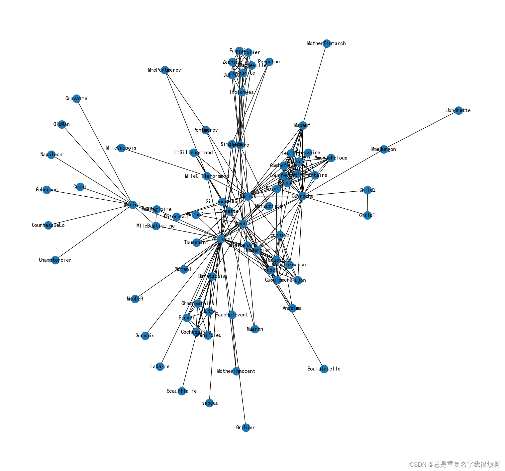
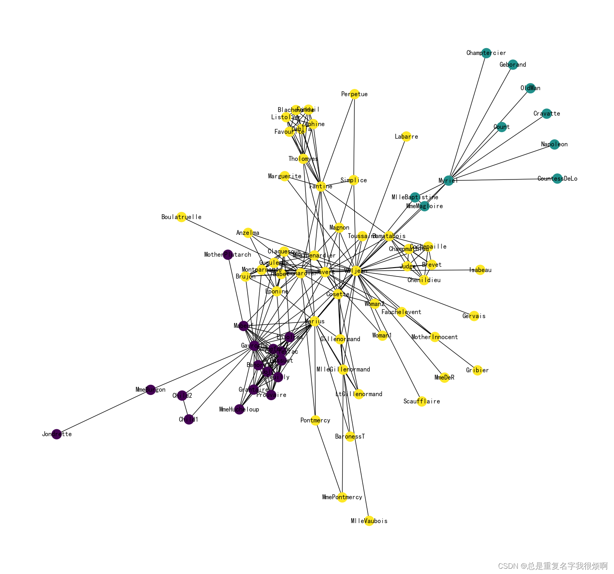
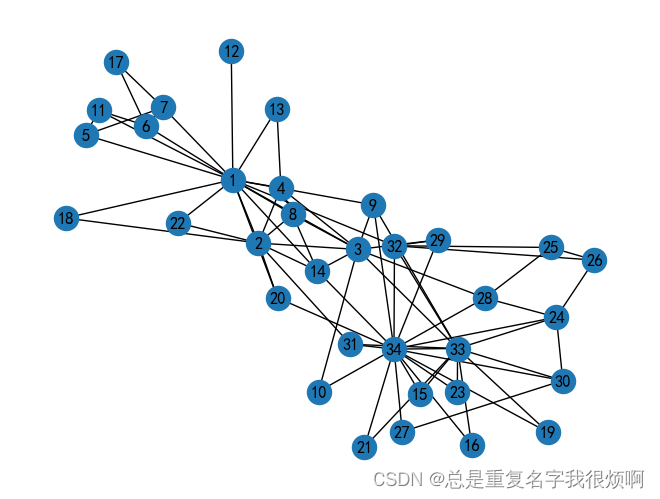
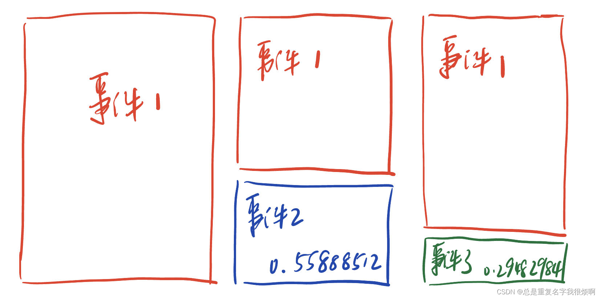
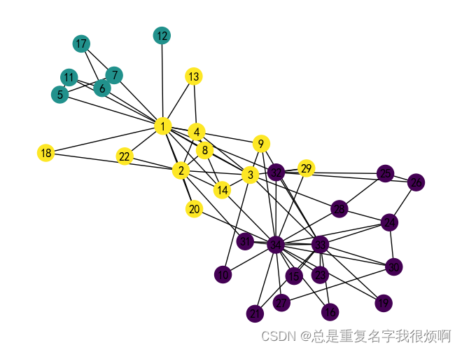

> 环境配置

|工具包| 作用 |
|--|--|
|networkx  | 图网络可视化分析 |
|pandas  | 数据分析 |
|numpy  | 数据分析 |
|node2vec | 现成的node2vec直接调用|
|gensim | 自然语言处理相关工具(word2vec)|
|scikit-learn | 机器学习(KMeans聚类)|
|argparse | 默认参数汇总|
random | 生成随机数和打乱

```python
!pip install networkx pandas numpy node2vec gensim scikit-learn -i https://pypi.tuna.tsinghua.edu.cn/simple
```

## 用node2vec现成工具包实现分析

> 导入工具包
```csharp
import networkx as nx

import pandas as pd
import numpy as np

import matplotlib.pyplot as plt

import warnings
warnings.filterwarnings('ignore')

plt.rcParams['font.sans-serif'] = ['SimHei']
plt.rcParams['axes.unicode_minus'] = False
```
> 导入悲惨世界人物数据集

```csharp
G = nx.les_miserables_graph()
```

> 可视化

```python
plt.figure(figsize=(15,14))
pos = nx.spring_layout(G, seed=5)
nx.draw(G, pos, with_labels=True)
plt.show()
```



> 构建node2vec模型

```python
from node2vec import Node2Vec

node2vec = Node2Vec(G,
                   dimensions=32,   #嵌入维度
                   p=2,             #return参数
                   q=0.5,           #out参数
                   walk_length=30,  #随机游走最大长度
                   num_walks=600,   #每个节点作为起始节点的随机游走个数
                   workers=4)        #并行线程数

# p=1, q=0.5, n_clusters=6, DFS深度优先
# p=1, q=2, n_clusters=3, BFS广度优先

model = node2vec.fit(window=3,      #skpi-gram窗口大小
                    min_count=1,    #设置阈值忽略低频节点
                    batch_words=4,  #每个线程处理的数据量
                    )
X = model.wv.vectors
```

> 节点embedding聚类可视化

```python
from sklearn.cluster import KMeans

cluster_labels = KMeans(n_clusters=3).fit(X).labels_

# 将networkx中的节点和词向量中的节点对应
colors = []
nodes = list(G.nodes)
for node in nodes:
    # 获取这个节点在embedding中的索引号
    idx = model.wv.key_to_index[str(node)]
    colors.append(cluster_labels[idx])

# 可视化
plt.figure(figsize=(15,14))
pos = nx.spring_layout(G, seed=10)
nx.draw(G, pos, node_color=colors, with_labels=True)
```



> 对edge做embedding

```python
from node2vec.edges import HadamardEmbedder
edges_embs = HadamardEmbedder(keyed_vectors=model.wv)

# 计算所有edge的embedding
edges_kv = edges_embs.as_keyed_vectors()

# 查看最相似的节点对
edges_kv.most_similar(str(('Bossuet', 'Valjean')))
>>[("('Bahorel', 'Valjean')", 0.9560104012489319),
 ("('Prouvaire', 'Valjean')", 0.926855742931366),
 ("('Courfeyrac', 'Valjean')", 0.9163148403167725),
 ("('Enjolras', 'Valjean')", 0.900037944316864),
 ("('Combeferre', 'Valjean')", 0.8826196789741516),
 ("('Feuilly', 'Valjean')", 0.8544862866401672),
 ("('Joly', 'Valjean')", 0.8330731391906738),
 ("('MmeHucheloup', 'Valjean')", 0.8265642523765564),
 ("('Grantaire', 'Valjean')", 0.7791286706924438),
 ("('Enjolras', 'Javert')", 0.7411160469055176)]
```

## 动手实现node2vec (核心：alias sampling算法)

> 导入工具包

```python
import networkx as nx

import pandas as pd
import numpy as np

from gensim.models import Word2Vec
import random

import argparse

import matplotlib.pyplot as plt

import warnings
warnings.filterwarnings('ignore')

plt.rcParams['font.sans-serif'] = ['SimHei']
plt.rcParams['axes.unicode_minus'] = False
```
> 输入基本参数信息

```python
def parse_args():
    # 使用parser加载信息
    parser = argparse.ArgumentParser(description='Run node2vec.')
    # 输入文件：邻接表
    parser.add_argument('--input', nargs='?', default='karate.edgelist', help='Input graph path')
    # 输出文件：节点嵌入表
    parser.add_argument('--output', nargs='?', default='karate.emb', help='Embedding path')
    # embedding嵌入向量维度
    parser.add_argument('--dimensions', type=int, default=128, help='Number of dimensions. Default is 128.')
    # 随机游走序列长度
    parser.add_argument('--walk-length', type=int, default=80, help='Length of walk per source. Default is 80.')
    # 每个节点生成随机游走序列次数
    parser.add_argument('--num-walks', type=int, default=10, help='Number of walks per source. Default is 10.')
    # word2vec窗口大小，word2vec参数
    parser.add_argument('--window-size', type=int, default=10, help='Context size for optimization. Default is 10.')
    # SGD优化时epoch输了，word2vec参数
    parser.add_argument('--iter', type=int, default=1, help='Number of epochs in SGD')
    # 并行化核数，word2vec参数
    parser.add_argument('--workers', type=int, default=8, help='Number of parallel workers. Default is 8.')
    # 参数p
    parser.add_argument('--p', type=float, default=1, help='Return hyperparameter. Default os 1.')
    # 参数q
    parser.add_argument('--q', type=float, default=1, help='Inout hyperparameter. Default os 1.')
    # 连接是否带权重
    parser.add_argument('--weight', dest='weight', action='store_true', help='Boolean specifying (un)weighted. Default is unweighted.')
    parser.add_argument('--unweight', dest='unweight', action='store_false')
    parser.set_defaults(weighted=False)
    # 有向图还是无向图
    parser.add_argument('--directed', dest='directed', action='store_true', help='Graph is (un)directd. Default is undirected,')
    parser.add_argument('--undirected', dest='undirected', action='store_false')
    parser.set_defaults(weighted=False)
    
    return parser.parse_args(args=[])

args = parse_args()
```

> 载入图

```python
# 连接带权重
if args.weighted:
    G = nx.read_edgelist(args.input, nodetype =int, data=(('weight', float),), create_using=nx.DiGraph())
# 连接不带权重
else:
    G = nx.read_edgelist(args.input, nodetype=int, create_using=nx.DiGraph())
    for edge in G.edges():
        G[edge[0]][edge[1]]['weight'] = np.abs(np.random.randn())

# 无向图
if not args.directed:
    G = G.to_undirected()
    
pos = nx.spring_layout(G, seed=4)
nx.draw(G, pos, with_labels=True)
```



> Alias Sampling

```python
def alias_setup(probs):
    K = len(probs)
    q = np.zeros(K)
    J = np.zeros(K, dtype=np.int8)
    
    smaller = []
    larger = []
    
    # 将各个概率分为两组，一组的概率值大于1，另一组的概率小于1
    for kk, prob in enumerate(probs):
        q[kk] = K * prob # 每类事件的概率乘以事件个数
        
        # 判断多了还是少了
        if q[kk] < 1.0:
            smaller.append(kk)
        else:
            larger.append(kk)
        
    # 使用贪心算法，将概率值小于1的不断填满
    while len(smaller) > 0 and len(larger) > 0:
        small = smaller.pop()
        large = larger.pop()
        
        J[small] = large
        # 更新概率值，劫富济贫，削峰填谷
        q[large] = q[large] - (1 - q[small])
        if q[large] < 1.0:
            smaller.append(large) # 把被削的土地给穷人
        else:
            larger.append(large)
    
    return J, q
```

```python
# 执行O（1）采样
def alias_draw(J, q):
    K = len(J)
    
    kk = int(np.floor(np.random.rand()*K)) # 生成一个1-k的随机整数
    if np.random.rand() < q[kk]:
        return kk    # 取自己本身事件
    else:
        return J[kk] # 取alias事件
```

```python
def get_alias_edge(src, dst):
    p = args.p
    q = args.q
    
    unnormalized_probs = []
    
    # 论文3.2.2核心算法，计算各条边的转移权重
    for dst_nbr in sorted(G.neighbors(dst)):
        if dst_nbr == src:
            unnormalized_probs.append(G[dst][dst_nbr]['weight']/p)
        elif G.has_edge(dst_nbr, src):
            unnormalized_probs.append(G[dst][dst_nbr]['weight'])
        else:
            unnormalized_probs.append(G[dst][dst_nbr]['weight']/q)
    
    # 归一化
    norm_const = sum(unnormalized_probs)
    normalized_probs = [float(u_prob)/norm_const for u_prob in unnormalized_probs]
    
    return alias_setup(normalized_probs)
```

```python
is_directed = args.directed
alias_nodes = {}

# 节点概率alias sampling归一化
for node in G.nodes():
    unnormalized_probs = [G[node][nbr]['weight'] for nbr in sorted(G.neighbors(node))]
    norm_const = sum(unnormalized_probs)
    normalized_probs = [float(u_prob)/norm_const for u_prob in unnormalized_probs]
    alias_nodes[node] = alias_setup(normalized_probs)
    
    if node==25:
        print('25号节点')
        print(unnormalized_probs)
        print(norm_const)
        print(normalized_probs)
        print(alias_nodes[node])
>>25号节点
[1.2598288084081546, 1.1050425433820839, 0.2577415056206481]
2.622612857410887
[0.48037162818300644, 0.42135176004323077, 0.09827661177376266]
(array([0, 0, 1], dtype=int8), array([1.        , 0.55888512, 0.29482984]))
```


```python
alias_edges = {}
triads = {}

# 边概率alias sampling和归一化
if is_directed:
    for edge in G.edges():
        alias_edges[edge] = get_alias_edge(edge[0], edge[1])
else:
    for edge in G.edges():
        alias_edges[edge] = get_alias_edge(edge[0], edge[1])
        alias_edges[(edge[1], edge[0])] = get_alias_edge(edge[1], edge[0])
```

> 生成随机游走序列

```python
def node2vec_walk(walk_length, start_node):
    # 上一步计算出的alias table，完成O(1)采样
    walk = [start_node]
    
    # 知道生成长度为walk_length的节点序列未知
    while len(walk) < walk_length:
        cur = walk[-1]
        # 对邻居节点排序，目的是和alias table计算时的顺序对应起来
        cur_nbrs = sorted(G.neighbors(cur))
        if len(cur_nbrs) > 0:
            # 节点序列只有一个节点的情况
            if len(walk) == 1:
                walk.append(cur_nbrs[alias_draw(alias_nodes[cur][0], alias_nodes[cur][1])])
            # 节点序列大于一个节点的情况
            else:
                # 看前一个节点
                prev = walk[-2]
                next = cur_nbrs[alias_draw(alias_edges[(prev, cur)][0], alias_edges[(prev, cur)][1])]
                walk.append(next)
        else:
            break
    
    return walk
```
> 采样得到所有随机游走序列

```python
def simulate_walks(num_walks, walk_length):
    walks = []
    nodes = list(G.nodes())
    print('Walk iteration')
    for walk_iter in range(num_walks):
        print(str(walk_iter+1), '/', str(num_walks))
        # 打乱顺序
        random.shuffle(nodes)
        for node in nodes:
            walks.append(node2vec_walk(walk_length=walk_length, start_node=node))
            
    return walks
walks = simulate_walks(args.num_walks, args.walk_length)

# 把node的类型int转化为str
walk_str = []
for walk in walks:
    tmp = []
    for node in walk:
        tmp.append(str(node))
    walk_str.append(tmp)
```
> 利用word2vec训练node2vec

```python
model = Word2Vec(walk_str, vector_size=args.dimensions, window=args.window_size, min_count=0, sg=1, workers=args.workers)
model.wv.save_word2vec_format(args.output)
```
> 可视化分析

```python
model.wv.get_vector('17')
>>array([ 0.18560958,  0.04532452,  0.26840374,  0.03078318,  0.02398106,
       -0.09106599,  0.17842552,  0.06163856,  0.0530385 , -0.14195229,
        0.04106649, -0.1773398 , -0.03475689, -0.15610787,  0.07816559,
       -0.06591983,  0.02470083,  0.02963566, -0.16297406,  0.06844087,
        0.21037795,  0.15360692,  0.11143462, -0.0366699 , -0.29888242,
        0.17556562, -0.04650875,  0.12099634,  0.18204564, -0.06231313,
       -0.3934941 ,  0.16333763, -0.13903633, -0.06437788, -0.13468122,
        0.11245078,  0.29344803,  0.27591076,  0.1982137 , -0.08944517,
       -0.05133532,  0.16017602, -0.02978732, -0.06244398,  0.16406792,
        0.09379737,  0.00436372, -0.23881316, -0.11517377,  0.12249801,
        0.01371407,  0.0331029 ,  0.23663211,  0.17176941,  0.10793246,
       -0.04616706,  0.19773844,  0.03704267, -0.14675048, -0.2599338 ,
        0.08897672, -0.19225457,  0.09435391, -0.0571735 ,  0.04452999,
       -0.12241848, -0.01499153,  0.07220587, -0.15018323, -0.08562861,
        0.18255252,  0.06718722, -0.22175026,  0.11272267,  0.03694518,
        0.01602137, -0.05840521, -0.11858806, -0.00055711,  0.1841024 ,
        0.12401607, -0.18123557,  0.10295101,  0.11569355,  0.07272708,
       -0.02486938,  0.23009172, -0.09448099,  0.26088616,  0.08620758,
       -0.10338984, -0.02792386,  0.00071772,  0.05634106,  0.06651364,
        0.15144321, -0.18755764, -0.21857035, -0.02649569, -0.1717046 ,
       -0.16789995,  0.01954506,  0.12292644,  0.05823366,  0.10581642,
       -0.11863767,  0.09803073, -0.15999381, -0.03844869, -0.00235334,
        0.00488694,  0.05818262,  0.0406672 ,  0.06263107,  0.06486863,
       -0.01384014,  0.15145428,  0.22274497,  0.15133294,  0.14930773,
        0.14660034, -0.01708281,  0.06902762,  0.0583788 ,  0.07930274,
       -0.23277247,  0.0493211 ,  0.09819821], dtype=float32)
```
> 查找相似节点

```python
print(model.wv.most_similar('25'))
>>print(model.wv.most_similar('25'))
print(model.wv.most_similar('25'))
[('26', 0.9905608296394348), ('24', 0.974091649055481), ('28', 0.9634271264076233), ('30', 0.8659281730651855), ('32', 0.8056477904319763), ('27', 0.7184703946113586), ('33', 0.6937069892883301), ('15', 0.6862101554870605), ('23', 0.6689950823783875), ('21', 0.6680737137794495)]
```
> 聚类分析

```python
from sklearn.cluster import KMeans

X = model.wv.vectors
cluster_labels = KMeans(n_clusters=3, random_state=9).fit(X).labels_

colors = []
nodes = list(G.nodes)
for node in nodes:
    idx = model.wv.key_to_index[str(node)]
    colors.append(cluster_labels[idx])
    
pos = nx.spring_layout(G, seed=4)
nx.draw(G, pos, node_color = colors, with_labels=True)
```


