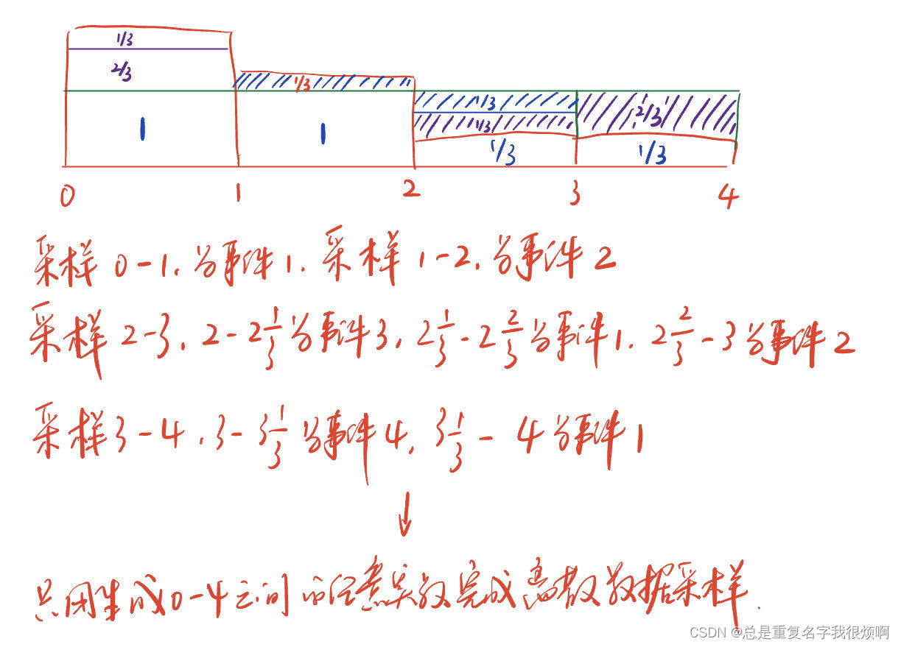
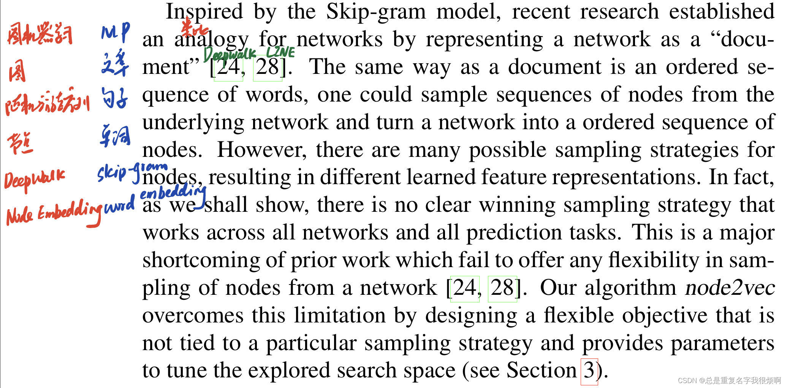

> 原文链接

[node2vec: Scalable Feature Learning for Networks ](https://arxiv.org/abs/1607.00653)

> 阅读前的建议

强烈强烈强烈建议，重要的事情说三遍，完成[DeepWalk论文精读](paper_read/gnn/DeepWalk/paper/)学习，明白它解决问题的背景、思路和做法。~~~~

## 背景知识

>  DeepWalk可能存在改进的方向

在DeepWalk论文4.4节，提出了作者认为的一些改进方向，其中就包括Non-random Walk这一条。具体而言，所谓的随机游走在真实的节点分析中是不贴近实际的。因为节点之前的连接具备偶然性和巧合性，不同节点之间的连接权重应该存在偏差。即当当前节点为“下雨”时，相较于”马拉松“，下一个节点大概率为”打伞“。如果是完全的随机游走，它将有50%的概率选择”马拉松“，这会过度强化一些非强相关联的拓扑信息，导致模型的性能受到影响。

>  如何实现有偏随机游走

这里首先看论文的示意图。游走的前进方向从邻接节点随机选择，细分成了返回上一节点、在上一节点附近徘徊、前进到更远的节点三种状态。并且用p和q两个参数来控制路径。当q非常大的时候，前进的权重很低，若p很小，则会更偏向返回起点；若p很大则更倾向于徘徊。如果q很小，这个时候大概率就会选择x2或者x3前进一步。这样的游走就实现了对权重的考量（2阶随机游走，同时考虑当前位置和前一位置）。

因此，如果p很小，那么t出发前往v后，大概率又会返回t（这里的v不一定是一个，实际上t前往v的1/p就是t的前进概率，可能会有v1 v2 v3...多个节点），所以在这种情况下，这串随机序列将会在以t为中心的小范围里反复游走，这种情况会放大t为中心的小范围拓扑结构信息挖掘（**广度优先，BFS**）；反之，如果q很小，那么将会大概率背上行囊远行，追寻诗和远方（**深度优先，DFS**）。

BFS会更好捕捉一种社交网络关系，也就是挖掘同质社群信息，DFS会更好获取一个节点作为一个中枢的信息，挖掘节点的功能信息。

> node2vec vs DeepWalk的异同

相同：他们都是解决图嵌入的问题，即把图中的节点映射成一个向量，并且这个向量应当包含节点的语义信息，位置信息。
不同：在DeepWalk完全随机游走的基础上，node2vec通过增加pq参数 ，实现有偏随机游走，并且可以通过调整pq的值选择广度优先还是深度优先的信息挖掘模式。

> node2vec的优缺点

优点：
- 通过pq参数实现有偏随机游走，探索节点的社群、功能属性；
- 首次把图嵌入用于Link Preditcion
- 可解释性好，可拓展性好，性能卓越

缺点：（和DeepWalk一样）

- 需要大量随机游走序列训练，并且无法看到全图信息，无法关注到距离非常远的两个节点之间的联系。
- 无监督学习的词向量计算只能编码图的连接信息，不能利用节点的属性特征。
- 没有真正用到神经网络和深度学习，只是思想试验。

> Alias Sampling

node2vec里采用了一种名为alias sampling的采样方法，这是一个用时间换空间的复杂度仅仅O(1)的算法，用来实现离散数据的采样。

这里假设有4个独立事件，他们发生的概率分别是1/2，1/3，1/12，1/12。

那么我们如何用连续数据实现离散事件的采样呢？由于有4个事件，因此我们把每个事件的概率都乘以4，这样就可以把多的部分削减填平到少的部分，使得每个事件的概率都是1。

这里的1，并不是传统意义上概率1，而是为了满足生成连续数据时每个事件的区间长度是1。如果不乘以4，那么就是0-0.25是一个事件区间，看上去会稍微麻烦一点。具体操作如下：

## 论文精读
### Title and Authors

论文的题目是node2vec: Scalable Feature Learning for Networks，可拓展的图嵌入表示学习算法。同样的，三个信息，可拓展的，图嵌入，表示学习。可拓展代表着他可以应对大规模网络，模型的延展性和适应性很好；图嵌入和表示学习在DeepWalk已经有很多介绍，表示把节点信息使用一种机器学习的方式转化成向量信息，而不是人工提取特征进行抽象化表示。

### Abstract

第一段，作者说传统的图预测任务一般需要做人工的特征工程，最近表示学习在解决人工特征工程的弊端方面做出了重要突破，但是现有的表示学习（DeepWalk）在节点特征的多样性表达上并不够好。这一段话言简意赅，潜台词就是，我们要对表示学习做进一步的优化。

第二段作者提出要做node2vec，也是一个把节点映射成一个低维、连续、稠密的向量。但是与DeepWalk不同的是，node2vec的设计采用了一种有偏随机游走的方式，这种方式可以更加灵活的进行词嵌入过程，并且相较于完全随机游走，有偏随机游走可以获得更加丰富的信息表示。

第三段就是简要说一下这个模型多么多么牛逼，各种榜单屠榜。然后总的来说，node2vec是一个通用的特征表示，可以以更好的可拓展性去适应更加复杂的网络情况。

和DeepWalk一样，Abstract部分是典型的三段式结构，工作背景（Why）-我们做的工作（What）-工作的评价（How）。因此node2vec不仅是算法源于DeepWalk，在写法上也有相似之处，并且大量使用we这种主观词汇（不知道国内老师看了有什么想法）。

### 1. Introduction

node2vec的introduction写的比DeepWalk长，多出来的篇幅主要集中在两方面，其一是他做了更多前人工作的总结，其二是推销了更多node2vec的“遥遥领先”。还是一句一句来过。

图网络分析存在两个经典的任务，一个是节点分类任务，比如通过图的信息（用户之间的关联，蛋白质和蛋白之间的结构关系等）去预测一个未知节点属于哪一类（银行业务中是否是老赖？生物信息中是否是蛋白质？电商业务中是否是潜在客户？）

另一个是连接预测任务。例如社交网络中A和B是否可能认识？在基因组学和蛋白质工程中也有类似的问题。作者认为，在实际的分析工作里，往往是节点预测和连接预测共同存在的（DeepWalk只做了节点预测，没有做连接预测）。

第二段作者指出，监督机器学习模型往往需要内涵丰富语义、有区分性、相互独立的特征作为输入。在DeepWalk里也有类似的表达，DeepWalk说的是，数据之间满足独立同分布。这意味着，如果要做分类任务，就必须要构造满足这样要求的特征向量，但是如果人工的去设计这部分内容，一方面回工作量大，任务繁琐，效果不稳定；一方面没有泛用性，例如对银行客户做的特征工程不可能在蛋白质组分预测上重复使用。因此这里就引出需要表示学习的方法，不要人工去添加这些特征了。

第三段作者就介绍了一下表示学习。作者说，表示学习是通过把学习特征这一个任务抽象为一个目标函数，权衡各方面的因素（尽可能包含丰富的语义信息）。这里就存在有监督和无监督的两种实现路径。有监督即输入标注好的数据，给他答案，让机器去学习这一类数据的特点，但这种学习的结果不具备泛化性，往往在特定的任务上表现较好。基于此，作者认为如果想要做一个通用模型去解释图信息，需要采用无监督的学习方式，学习出来的结果通用适配下游任务，可以根据需求再微调。这里作者引用的21和23两篇论文，正好就是NLP领域中，word2vec和glove两大无监督词嵌入模型的论文。有机会写NLP论文精读再带大家逐句过一下这两篇经典之作。

第四段，作者提出现在的技术对无监督学习而言，是不满足的，所以人们提出了基于矩阵分解的图嵌入方法，例如把一个图的邻接矩阵或者拉普拉斯矩阵做PCA主成分分析或者降维，通过这样的方法找到方差最大的方向。参考论文笔记右侧的图，例如本来是一个二维分布的图像，通过降维可以用一个一维的直线去表示这样一个二维特性。从本质上讲，就是协方差矩阵的特征值和特征向量求解。但这种矩阵分解的做法，作者认为是poor performance（表现不好）。这主要是因为目前学界没有非常好的求解矩阵特征值和特征向量的办法，而且面对极大的稀疏矩阵，除了计算开销巨大，常见模型的表现也会收到极大影响。

接下来一段，作者介绍了DeepWalk随机游走的方法，这是一种随机梯度下降的反向传播求解算法，但是问题在于DeepWalk只能看见起始节点临近的拓扑结构，不能知晓全图的结构，并且这种对局部的观察并不符合人类常规思路，正常的游走应该是有偏的，应该是对特定路径有额外权重的。

利用随机游走得到的编码，应该满足两个要求：同一社群节点和同一功能节点编码应该是相似的。因此算法应该即考虑到社群信息（节点分类），也要考虑到结构相似（功能分类，例如是不是中枢节点）信息。其实这段话的潜台词是，我认为应该考虑到这么多东西，实际上也应该考虑到这么多东西，因为我考虑的这些才是最符合真实情况的，但是前人的工作并没有考虑到这么多，我需要对前人的工作做出改进。

因此，作者另起篇幅写了**Present work**，说我们提出了node2vec（其实我个人感觉他这个名字也是为了博眼球，模仿已经大火的word2vec，就像现在各种如日中天的GPT），这是一个半监督自监督模型，也是用word2vec的skip-gram训练方法。但是node2vec工作的改进在于使用了2阶随机游走，也就是2阶马尔可夫性，即下一步往哪游走不仅取决于当前在哪个节点，还取决于上一步的节点。

第二段，作者说node2vec最核心的贡献在于提出一种有偏随机游走，通过调节参数p和q能够进一步统一社群信息和结构信息，并且p和q作为超参数，可以通过炼丹得到最优解。

第三段是node2vec的第二个贡献，除了对图嵌入算法进行了改进以外，还把节点嵌入延展到了连接嵌入，从最初的节点类别预测推广到了连接预测（与前文呼应）。具体的做法这里也简单讲了一下，但我在这不准备展开说，就放在后面正文部分再细看。

第四段总体上没太多看点，前文既然说了node2vec怎么怎么往前迈进一步，这一段就具体说怎么遥遥领先了，在哪哪做了什么试验取得更好的效果，node2vec的下限就是deepwalk的上限之类的。并且node2vec再稀疏标注、增删连接扰动和可拓展性都遥遥领先，同样也可以并行。

接下来的内容就是提出了4点总结：
1. 通过pq参数调整可以获得图的不同信息；
2. embedding向量包含更丰富的语义信息；
3. 节点嵌入延伸到了连接嵌入；
4. 试验效果好。

最后是全文的行文安排，可以自行阅读看看，反正后面的核心内容也会逐字逐句过，所以就不赘述了。

### 2. Related work
来到文献综述部分。

第一段，作者介绍了一下基于手工设计特征的图嵌入（最开始机器学习的样子）。

第二段，作者介绍了一下基于矩阵分解的图嵌入，这里主要介绍了拉普拉斯展开，可以理解成矩阵的二阶信息挖掘。后面提到这种方式主要有两个缺点，一个是复杂大矩阵的特征值求解困难，一个是即使算出了近似解，这个方法的结果也很难拓展到其他领域中去，这意味着每次都要拿着数据计算一下，非常的低能且不环保。并且谱聚类算法的假设甚至都不一定是对的。 （意思就是矩阵分解的方式问题很多，也会被吊打）

第三段，作者介绍了基于随机游走的图嵌入，这里花了很多文字都在介绍word2vec这个东西。

关于word2vec的更多细节内容，以后有机会会在NLP论文精读系列中给大家详细讲解。这里就简单提一下，word2vec是一个自监督模型，他的基本假设是相邻的单词都具有相似的语义，并且这种相似性是共性。然后就有skip-gram和cobw两种学习模型，分别是用中间词预测相邻的词和用相邻的词预测中间词。

作者认为，DeepWalk是非常具有开创性的工作，因为他把NLP的东西迁移到了图机器学习中。并且这些东西确实是可以进行类比的。但是作者认为DeepWalk是一个刚性策略，缺乏采样策略，它采用的是完全随机的游走。这就导致了研究人员无法更加灵活的去探索图空间。因此，作者提到，我们的算法（node2vec）是可以通过调整参数改变搜索空间，实现自由探索。

最后一段作者介绍了一下基于监督学习的图嵌入，这种方法就是直接把标签放进神经网络里进行运算。虽然这里介绍的很少，但是可以预见的是，这种基于监督学习的图嵌入只能解决标签相关的任务，直接训练下游任务，没有很好的预处理过程。

### 3. Feature learning framework
这部分开始介绍node2vec算法。

前面一大段的描述和deepwalk保持一致，讲的是node2vec算法的目标，是计算得到一个表，这个表可以反应每个节点的嵌入向量。然后介绍了skip-gram的损失函数。

假如节点之间互相影响，那么这个联合概率计算将非常复杂，因此作者提出了两个假设方便计算。

其一是周围节点不影响。这意味着节点符合条件独立假设，也就是马尔可夫假设，由于条件独立，因此联合事件发生的概率等于各独立事件概率的乘积。

其二是两两节点之间的影响程度一致。这是使用softmax计算的前提（因为softmax归一化计算默认权重一致），具体的计算公式如下：

在这里使用一个例子对这个公式做更加直观的介绍。

假设我们要用u节点计算n节点与他连接的概率，那么计算过程如下：分子是u节点的嵌入向量和n节点的嵌入向量做点乘再求和，例如u节点是（1，2，3），n节点是（2，1，4），那么点乘求和计算过程：1x2+2x1+3x4=2+2+12=16，然后取对数e^16。下同。

分母则是u的相邻节点的所有归一化。图中u和n p v三个节点相邻，那么就分别用u的嵌入向量和相邻的n p v三个节点的嵌入向量做点乘求和再取对数，再把这三个结果相加求和。

这里的分母可以进一步简化表示。实际上，这个Zu的计算非常复杂，在工程上不具备优势。因此作者提到DeepWalk采用的分层softmax和Word2Vec的负采样可以解决这样的工程问题。

最后一段，作者简单介绍了一下skip-gram在图中是怎么用滑动窗口来实现的。在这里主要是抛出相邻节点的定义问题，当然这些问题在后文会有更加详细的描述，在这里就不过多展开，继续往下看。

#### 3.1 Classic search strategies
这里都是在回答之前的问题，到底那些节点算u的领域节点。经典搜索策略如下。

作者在这里主要介绍了广度优先BFS和深度优先DFS两种搜索策略。在前面预习部分已经介绍过，在小范围内进行拓扑结构挖掘是广度优先，而追寻诗和远方是深度优先。BFS会更好捕捉一种社交网络关系，也就是挖掘同质社群信息，DFS会更好获取一个节点作为一个中枢的信息，挖掘节点的功能信息。

利用BFS模式搜索，同质社群他们的嵌入向量应该是相似的；反之DFS模式搜索，相同节点角色的嵌入向量是相似的。并且作者提到，在真实的情况里，更可能是DFS和BFS两种策略都存在。

作者在这部分最后再次对比DFS和BFS两种搜索模式。简言之，BFS就是在一个小胡同里打转，由于一个节点的围观相邻节点就那么几个，所以转来转去也就他们几个，因此极大关注了微观信息，并且具备较小的方差；DFS就是一路追寻诗和远方，一旦离开了这个胡同，外面的大千世界千奇百怪无所不有，在一个大的空间搜索了连续信息但是无法聚焦局部，由于节点样本多，因此方差大。

在这一部分，作者仔细对比了DFS和BFS两种策略，主要想突出这两种策略各有千秋，各有所长，而实际中又是DFS和BFS的结合，因此需要找到一种平滑的方式可以自由切换DFS和BFS两种策略。

#### 3.2 node2vec
##### 3.2.1 Random walks

这部分其实就是介绍了一下随机游走的数学表达。当前节点v要移动到下一节点x时，如果x和v有连接，则赋予v到x这条边一个权重，如果没有连接则是0。并且这个权重进行归一化，满足v到所有邻居节点的总概率为1。这里的$\pi_{vx}$如果是1，那么这个时候就是一个无权图，即当前节点到其他邻居节点都是一样的概率。

##### 3.2.2 Search bias $\alpha$

作者说，DeepWalk里，用连接权重作为游走的概率，这是一个无法调整的策略，如果用DFS和BFS又显得太极端，因此有没有一个办法可以折中、平滑的去实现策略偏向呢。

第二段，作者说，导入了p和q两个参数，通过一个2阶随机游走的方式，即可实现有偏游走。

游走的前进方向从邻接节点随机选择，细分成了返回上一节点、在上一节点附近徘徊、前进到更远的节点三种状态。并且用p和q两个参数来控制路径。当q非常大的时候，前进的权重很低，若p很小，则会更偏向返回起点；若p很大则更倾向于徘徊。如果q很小，这个时候大概率就会选择x2或者x3前进一步。这样的游走就实现了对权重的考量（2阶随机游走，同时考虑当前位置和前一位置）。

因此，如果p很小，那么t出发前往v后，大概率又会返回t（这里的v不一定是一个，实际上t前往v的1/p就是t的前进概率，可能会有v1 v2 v3...多个节点），所以在这种情况下，这串随机序列将会在以t为中心的小范围里反复游走，这种情况会放大t为中心的小范围拓扑结构信息挖掘（**广度优先，BFS**）；反之，如果q很小，那么将会大概率背上行囊远行，追寻诗和远方（**深度优先，DFS**）。

在这里，作者首先说明，只需要控制三个状态：继续前进，往后退，附近徘徊。就可以实现策略控制的目的。并且再后面详细介绍了p和q两个参数。p是一个控制返回的参数，当p很大，1/p就会很小，这个时候返回的权重就会很低，就会往前或者徘徊。在DeepWalk中，很容易出现原地踏步、反复横跳的情况，通过p参数即可很好的解决这个问题。

q是一个控制前进的参数。作者在这里说，这是二阶马尔可夫游走。值得注意的是，这里的二阶，实际上是当前节点和上一节点。可以思考一下如果是当前节点和下一节点行不行。我个人感觉理论上是可行的，因为这同样是二阶马尔可夫性体现，但是如果是当前节点和下一节点，那么需要考虑的节点就非常多，当前节点和邻接节点全部都要考虑进去计算，这样显然没有当前节点和上一节点这么节省计算开销。

接下来作者主要介绍了有偏随机游走的时间和空间复杂度。在传统的deepwalk随机游走中，空间复杂度就是一个邻接表，这是一个对角矩阵，对角元素是当前节点的邻接节点个数。对于有偏随机游走，空间复杂度是a²，因为他要保存的是当前节点的平均连接数和上一节点的平均连接数，每个节点都是a²，然后乘以节点个数|V|。

至于时间复杂度，可以拆解成$\frac{1}{k}+\frac{1}{l-k}$，这里k是一个人为设定的常数，l表示采集序列长度。这个式子表示一个节点已经被采样的概率是1/k，后面会被重复采样的概率是1/l-k，并且l如果越大，即这个序列越长，这么这个节点被采样到的概率越大。其实这个也是必然的，假如有5个节点他们以某种形式连接，如果序列长度是10000，那么这五个节点大概率是一定会被采样到的，如果序列长度是5，可能稍微反复横跳一下就不会全部采样。

##### 3.2.3 The node2vec algorithm

整个算法的流程第一步是先生成一个随机游走的采样策略，也就是超参数pq和图的输入。第二步是每个节点生成r个随机游走序列，这里的步骤是，首先定义一个序列长度l，然后通过Alias Sampling的算法，来找到当前节点的下一个节点。第三步是把序列放到skip-gram模型训练得到嵌入表。

和deepwalk对比，其实只有一个核心区别，就是随机游走序列的生成。deepwalk是采用完全随机的游走，因此不需要这么麻烦，而node2vec采用的是一个alias sampling的方式实现有偏游走，再下面一段作者仔细说了alias sampling是一个时间复杂度O1的算法，可以大量反复抽样，把离散分布转化为均匀抽样等等。关于这部分，将在代码实现部分给大家做更加细致的讲解。在这里只需要了解到具体的三部流程，以及和deepwalk的区别即可。

#### 3.3 Learning edge features
在这部分主要就是提出除了node embedding以外，还可以做link embedding。

作者说，实际上除了需要对单个点进行研究以外，很多场景是要求判断两个点的连接。

因此，作者提出了一个二元操作的自助法（其实就是自己创造了一个方法）。具体方法如下：

作者给出了4种操作方法：第一种就是把u和v节点的嵌入向量求和取均值，因为u和v都是一个d维向量，所以求和取均值也得到一个d维向量；第二种方法就是u和v的嵌入向量做一个乘法；第三种和第四种分别是L1范数和L2范数。

这部分的内容其实有点人工做特征工程的意思。因此这四种融合信息的方法到底是否科学有效，其实并没有严格的科学论证。从感性的角度理解，他把u和v节点的信息做了一个交叉计算得到新的信息，那么这个信息就具备u和v节点的一些共性。

### 4 Expriments
从这里开始，作者用悲惨世界做为一个例子，做了图信息的表示和挖掘，并且和其他模型做了对比，因此这部分论文就不做逐字逐句精读了，可以直接跳转node2vec代码实战部分，将用代码复现node2vec论文的核心内容。