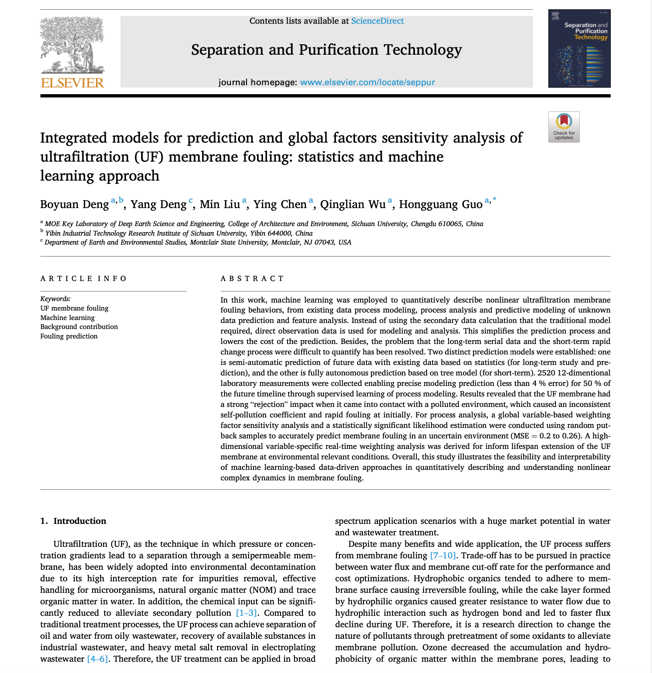

[Integrated models for prediction and global factors sensitivity analysis of ultrafiltration (UF) membrane fouling: statistics and machine learning approach](https://doi.org/10.1016/j.seppur.2023.123326)

