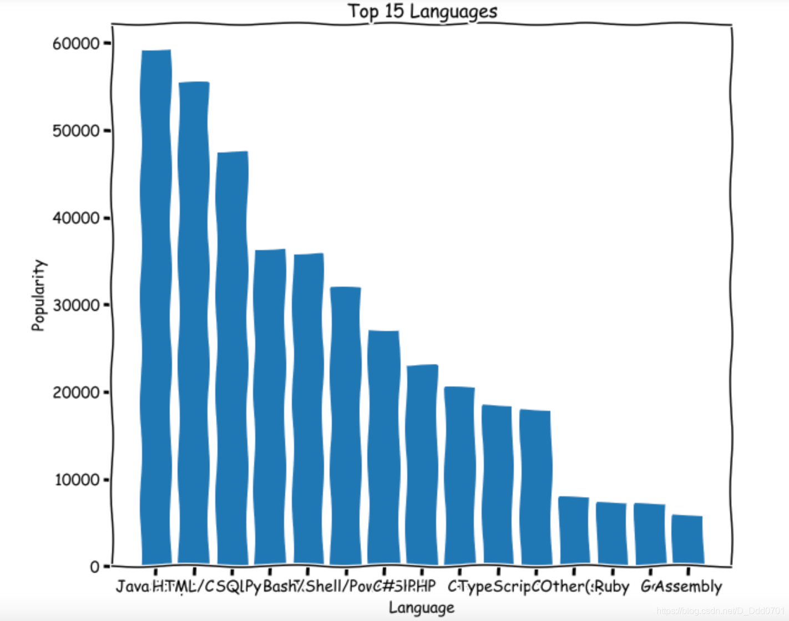

## 利用pandas读取数据
利用pandas从csv文件导入数据：

```python
import pandas as pd
import numpy as np
import matplotlib.pyplot as plt
plt.xkcd()
data = pd.read_csv('data.csv')
data.head()
```
数据结构如图所示：


把LanguagesWorkedWith列具体的语言数量统计一下：
```python
from collections import Counter
language_responses=data['LanguagesWorkedWith']
cnt = Counter()
for l in language_responses:
    cnt.update(l.split(';'))
```

取前15个：`cnt.most_common(15)`
```python
lang=[]
popularity=[]
for c in cnt.most_common(15):
    lang.append(c[0])
    popularity.append(c[1])
```
## 提取后的数据绘制柱状图
绘制柱状图：`plt.bar(x,y)`

```python
plt.bar(lang,popularity)
plt.title('Top 15 Languages')
plt.xlabel('Language')
plt.ylabel('Popularity')
```

发现x轴数据无法完全展示，这里有三种解决方案：

方案1:放大图表`plt.figure(figsize=(10,8))`

方案2:x轴文字倾斜60度`plt.xticks(rotation=60)`

方案3：翻转x，y轴`plt.barh(lang,popularity)`

希望可以是从大到小而不是从小到大排列，则需要对数据倒置。
```python
lang.reverse()
popularity.reverse()
```
