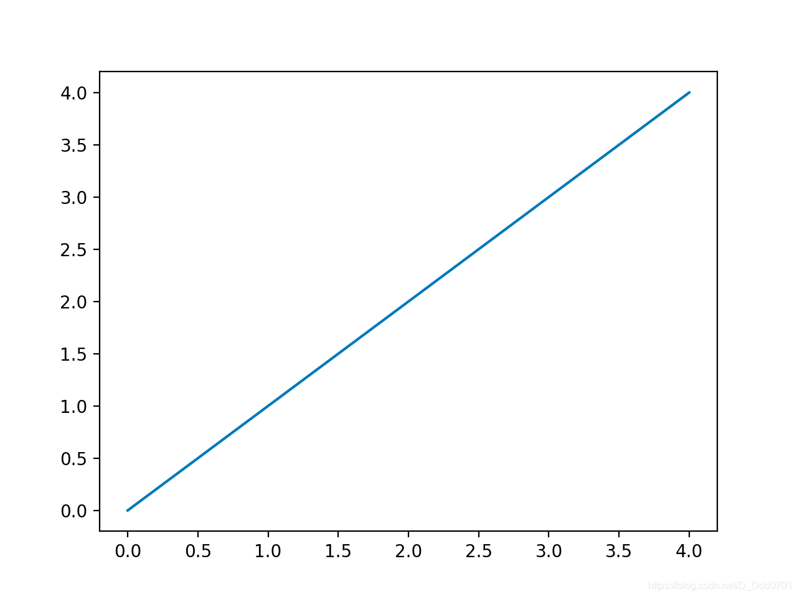

# 绘制你的第一张图
```python
import matplotlib.pyplot as plt

x=[0,1,2,3,4]
y=[0,1,2,3,4]

plt.plot(x,y)
```
此时对应{(x,y)=(0,0),(1,1),(2,2),(3,3),(4,4)}

但plt.plot(x,y)只是绘制命令，若要展示则需要加入show语句。

```python
import matplotlib
import matplotlib.pyplot as plt

x=[0,1,2,3,4]
y=[0,1,2,3,4]

plt.plot(x,y)
plt.show()
```
结果如下：
