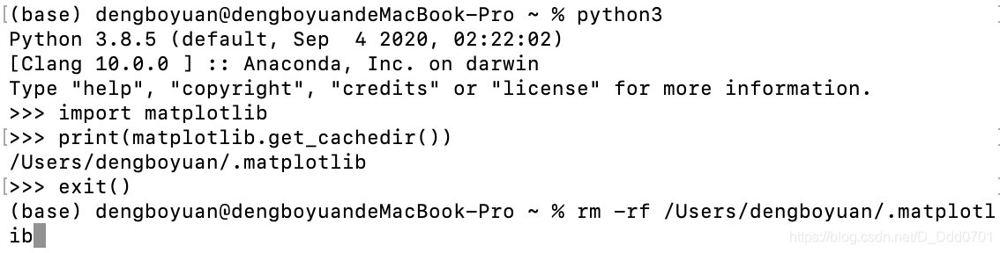

## Matplotlib安装
方法一：windows环境中命令行安装：pip install matplotlib；mac环境中pip3 install matplotlib。

方法二：使用anaconda环境。

## MacOS系统下matplotlib中文字体无法显示的问题
matplotlib默认字体没有中文。


所以需要使用以下代码调用中文字体：
```python
plt.rcParams['font.sans-serif'] = ['SimHei']
```
在调用的过程中可能出现如下情况：


## 解决办法
一、查看matplotlib字体路径

这里提供两种方法：

1、终端查看：


在终端中进入python3环境，然后输入

```python
import matplotlib    
print(matplotlib.matplotlib_fname())
```
找到自己的matplotlib字体文件夹路径。

2、PyCharm或Jupyter

创建python文件（以Jupyter举例），输入以下代码查看路径
```python
import matplotlib    
print(matplotlib.matplotlib_fname())
```
查询结果如下所示：


二、下载SimHei字体

这里提供两个下载链接：

1、[国内字体下载网站](http://www.xiazaiziti.com/210356.html)

2、[官网字体下载](https://www.fontpalace.com/font-download/SimHei/)

三、将下载好的SimHei.ttf移动到第一步查询到的目录中

这里目录地址是：/Users/dengboyuan/opt/anaconda3/lib/python3.8/site-packages/matplotlib/mpl-data/fonts，注意名称一定是SimHei.ttf

四、清理matplotlib缓冲目录

打开终端，进入python环境，输入
```python
import matplotlib
print(matplotlib.get_cachedir())
```
获取缓冲目录地址：/Users/dengboyuan/.matplotlib


PyCharm和Jupyter同上。

在终端中输入：`exit()`**退出python环境**

使用`rm -rf 路径`删除缓冲文件（注意空格）：



五、修改原始文件

打开路径：/Users/dengboyuan/opt/anaconda3/lib/python3.8/site-packages/matplotlib/mpl-data找到matplotlibrc文件做以下修改：
```python
font.family:  sans-serif
#去掉前面的#
font.sans-serif: SimHei, DejaVu Sans, Bitstream Vera Sans, Computer Modern Sans Serif, Lucida Grande, Verdana, Geneva, Lucid, Arial, Helvetica, Avant Garde, sans-serif
#去掉前面的#，手动添加SimHei
axes.unicode_minus: False  # use Unicode for the minus symbol rather than hyphen.  See
                           # https://en.wikipedia.org/wiki/Plus_and_minus_signs#Character_codes
#去掉前面的#，把True改为False
```
六、重启Jupyter


不需要`plt.rcParams['font.sans-serif'] = ['SimHei']`就可以自动显示中文，至此中文显示的问题已经解决。