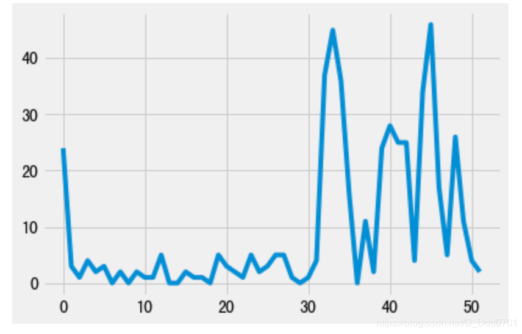
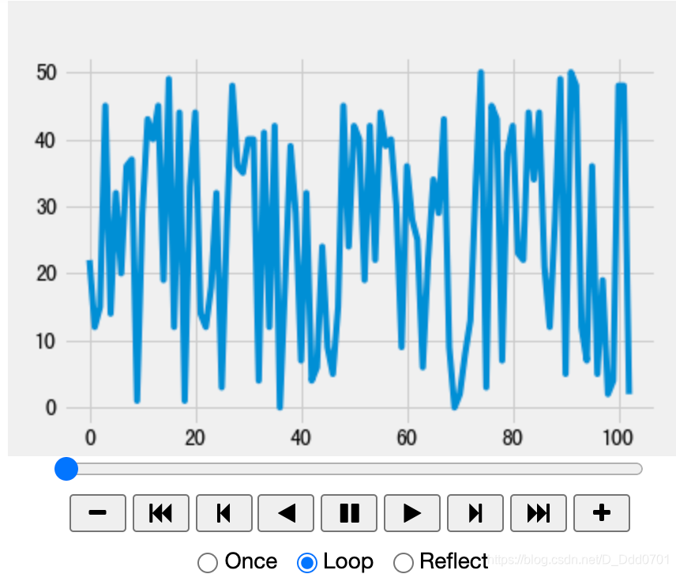

## 传统绘制方式

```python
import pandas as pd
import matplotlib.pyplot as plt
```

```python
plt.style.use('fivethirtyeight')
x = [0,1,2,3,4,5]
y = [0,1,2,3,4,5]
plt.plot(x,y)
```
对于这一类已经给定的数据是可以这么绘制的，但如果是实时数据，例如股票，传感器回馈数据等，应该如何处理？
## 使用迭代器设置一个实时数据

```python
import random
from itertools import count
```

```python
index = count()
x1=[]
y1=[]
def animate(i):
    x1.append(next(index)) #next(index)是一个计数器，0，1，2...
    y1.append(random.randint(0,50))
    plt.plot(x1,y1)
for i in range(50):
    animate(i)   
```


## 让程序自动化运行

```python
import pandas as pd
import matplotlib.pyplot as plt
from IPython.display import HTML
from itertools import count
import random
from matplotlib.animation  import FuncAnimation
```

```python
plt.style.use('fivethirtyeight')
index = count()
x1=[]
y1=[]
def animate(i):
    x1.append(next(index)) #next(index)是一个计数器，0，1，2...
    y1.append(random.randint(0,50))
    plt.cla() #plt.cla()可以控制实时图线条颜色不变化
    plt.plot(x1,y1)
ani = FuncAnimation(plt.gcf(),animate,interval=1000)
# plt.gcf()获取控制权
# 调用animate函数
# interval=1000：间隔1000毫秒（1秒）
HTML(ani.to_jshtml())
```


## 获取实时数据存入文件再载入notebook
上述案例的数据源来自于random和count函数，那么如果是载入外部接口或者实时获取的数据源呢？
### 设计一个实时获取数据的外部文件

```python
import csv
import random
import time
```

```python
x_value = 0
y1 = 1000
y2 = 1000
fieldname=["x","y1","y2"]
with open('data.txt','w') as csvfile:
    csv_w = csv.DictWriter(csvfile,fieldnames=fieldname)
    csv_w.writeheader() #写入表头
while True:
    with open('data.txt','a') as csvfile:
        csv_w = csv.DictWriter(csvfile,fieldnames=fieldname)
        info = {
            "x" : x_value,
            "y1" : y1 ,
            "y2" : y2 ,
        }
        x_value += 1
        y1 = y1 + random.randint(-6,10)
        y2 = y2 + random.randint(-4,5)
        csv_w.writerow(info)
    time.sleep(1) #设置运行间隔1s
```
只要这个程序运行，就会每间隔1s生成一组实时数据储存在data.txt文件内。
接下来读取该文件数据绘制连续变化的实时数据图：

```python
import pandas as pd
import matplotlib.pyplot as plt
from itertools import count
import random
from matplotlib.animation  import FuncAnimation
```

```python
plt.style.use('fivethirtyeight')
def animate2(i):
    dfa = pd.read_csv('data.txt')
    x = dfa.x
    y1 = dfa.y1
    y2 = dfa.y2
    plt.cla()
    plt.plot(x,y1,label='Stock1')
    plt.plot(x,y2,label='Stock2')
    plt.legend()
ani2 = FuncAnimation(plt.gcf(),animate2,interval=1000)
# plt.gcf()获取控制权
# 调用animate函数
# interval=1000：间隔1000毫秒（1秒）
plt.show()
```
**建议在pycharm中运行，jupyter notebook只能显示100个数据。**


