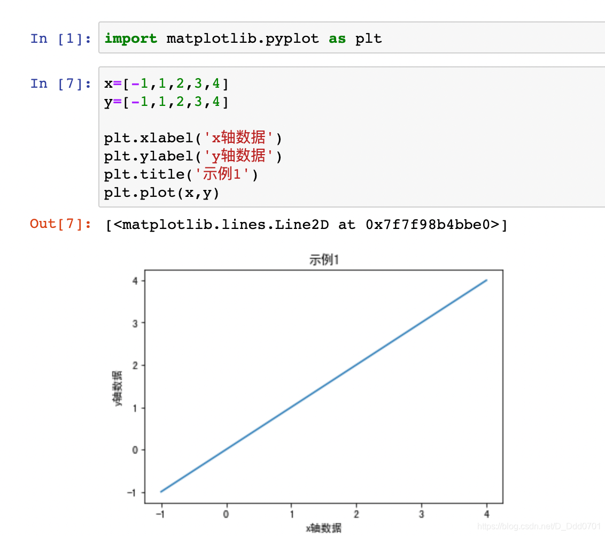

标题命名：`plt.title('标题内容')`

x轴命名：`plt.xlabel('x轴名字')`

y轴命名：`plt.ylabel('y轴名字')`

**注意：**

**这里的plt是`import matplotlib.pyplot as plt`或`from matplotlib import pyplot as plt`这里声明的plt，在使用的时候需要如此声明。**

**若是`from matplotlib import pyplot`则需要完整写出，例如`pyplot.xlabel('x轴名字')`**

建议使用jupyter编写，在jupyter交互式笔记本下可以不用`plt.show()`即可展示图形，下面做一个demo：
```python
import matplotlib.pyplot as plt
x=[-1,1,2,3,4]
y=[-1,1,2,3,4]

plt.xlabel('x轴数据')
plt.ylabel('y轴数据')
plt.title('示例1')
plt.plot(x,y)
```
