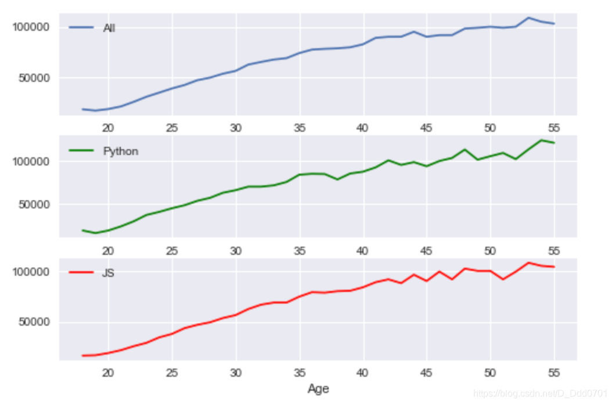
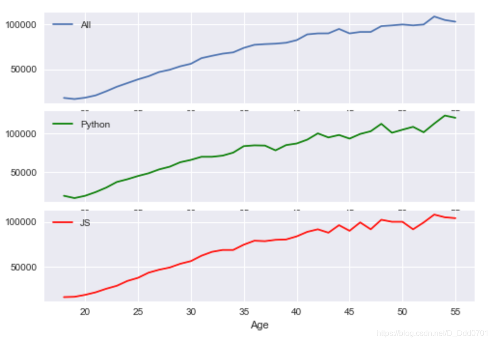

在一些情况下需要在一个`fig`中绘制`a、b、c`图，所以需要图表的多重绘制
## 传统方法绘制
```python
import pandas as pd
import matplotlib.pyplot as plt
```

```python
plt.style.use('seaborn')
data = pd.read_csv('data.csv')
data.head()
```


把数据提取出来并绘制图表：

```python
ages = data.Age
all_dev = data.All_Devs
py= data.Python
js = data.JavaScript
plt.plot(ages,all_dev,label='All')
plt.plot(ages,py,label='Python')
plt.plot(ages,js,label='JS')
plt.legend()
plt.xlabel('Age')
plt.ylabel('Sal')
```


那么如何把这一幅图三条信息分别绘制成图呢？
## 开启多重图表

```python
fig,ax=plt.subplots(nrows=2,ncols=1)
# 一个fig存在2行1列的小图
```


为了更好识别这两张图，用ax1和ax2分别命名：

```python
fig,(ax1,ax2)=plt.subplots(nrows=2,ncols=1)
```
### 把数据导入多重图表
导入图表的方式：把`plt`改为`图片名`
```python
fig,(ax1,ax2)=plt.subplots(nrows=2,ncols=1)
ax1.plot(ages,all_dev,label='All')
ax2.plot(ages,py,label='Python')
ax2.plot(ages,js,label='JS')
ax1.legend()
ax2.legend()
```


同理，如果是三张图：

```python
fig,(ax1,ax2,ax3)=plt.subplots(nrows=3,ncols=1)
ax1.plot(ages,all_dev,label='All')
ax2.plot(ages,py,label='Python',color='g')
ax3.plot(ages,js,label='JS',color='r')
ax1.legend()
ax2.legend()
ax3.legend()
```


### 共享x轴
由于三幅图的x轴数据相同，所以可以共享x轴，使图表看起来更简洁:`sharex=True`

```python
fig,(ax1,ax2,ax3)=plt.subplots(nrows=3,ncols=1,sharex=True)
ax1.plot(ages,all_dev,label='All')
ax2.plot(ages,py,label='Python',color='g')
ax3.plot(ages,js,label='JS',color='r')
ax1.legend()
ax2.legend()
ax3.legend()
ax3.set_xlabel('Age')
```


### 共享y轴

```python
fig , (ax1,ax2,ax3) = plt.subplots(nrows=1,ncols=3,sharey=True)
ax1.plot(ages,all_dev,label='All')
ax2.plot(ages,py,label='Python',color='g')
ax3.plot(ages,js,label='JS',color='r')
ax1.legend()
ax2.legend()
ax3.legend()
ax3.set_xlabel('Age')
ax1.set_ylabel('Salary')
```


## 动态加载
如果在绘制图表之前并不知道几行几列，设置`nrows`和`ncols`显然不可取，此时可以采用动态加载写法。

```python
fig = plt.figure()
ax1 = fig.add_subplot(311)
# 311代表3行1列第1个
ax2 = fig.add_subplot(312)
# 312代表3行1列第2个
ax3 = fig.add_subplot(313)
# 313代表3行1列第3个
ax1.plot(ages,all_dev,label='All')
ax2.plot(ages,py,label='Python',color='g')
ax3.plot(ages,js,label='JS',color='r')
ax1.legend()
ax2.legend()
ax3.legend()
ax3.set_xlabel('Age')
```


换一个参数：

```python
ax1 = fig.add_subplot(221)
ax2 = fig.add_subplot(222)
ax3 = fig.add_subplot(223)
```

```python
ax1 = fig.add_subplot(221)
ax2 = fig.add_subplot(222)
ax3 = fig.add_subplot(212)
```


## 网格模式绘制更加复杂的布局

```python
ax1 = plt.subplot2grid((6,1),(0,0),rowspan=2,colspan=1)
# 设置一个6行1列的布局
# ax1从0行0列开始跨越2行，1列
ax2 = plt.subplot2grid((6,1),(2,0),rowspan=2,colspan=1)
# ax2从2行0列开始跨越2行，1列
ax3 = plt.subplot2grid((6,1),(4,0),rowspan=2,colspan=1)
# ax3从4行0列开始跨越2行，1列
ax1.plot(ages,all_dev,label='All')
ax2.plot(ages,py,label='Python',color='g')
ax3.plot(ages,js,label='JS',color='r')
ax1.legend()
ax2.legend()
ax3.legend()
ax3.set_xlabel('Age')
```


继续设计更加自定义的分布：

```python
ax1 = plt.subplot2grid((6,1),(0,0),rowspan=1,colspan=1)
ax2 = plt.subplot2grid((6,1),(1,0),rowspan=3,colspan=1)
ax3 = plt.subplot2grid((6,1),(4,0),rowspan=2,colspan=1)
```


绘制成之前示例的样子：
```python
ax1 = plt.subplot2grid((4,2),(0,0),rowspan=2,colspan=1)
ax2 = plt.subplot2grid((4,2),(0,1),rowspan=2,colspan=1)
ax3 = plt.subplot2grid((4,2),(2,0),rowspan=2,colspan=2)
```


## 一种科研绘图更常用的方法
```python

fig, axes = plt.subplots(2,2) #创建包含2行2列子图的figure
 
x = ['横','轴','坐','标']   # x坐标不一定非得是数字，字符串也可以
y1 = [1,2,3,4]
y2 = [2,4,5,8]
# 在第一行第一列的子图中作图
axes[0,0].plot(x,y1,color='b',linestyle='--',marker='<',label='第一条线')
axes[0,0].plot(x,y2,color='tab:orange',linestyle='-.',marker='o',label='第二条线')
axes[0,0].legend()   #显示legend
axes[0,0].set_xlabel('横轴')
axes[0,0].set_ylabel('纵轴')
axes[0,0].set_title('折线图')
 
x = np.arange(0,1,0.2)
y1 = x**2
y2 = x**3
# 在第二行第二列的子图中作图
axes[1,1].scatter(x,y1,color='r',marker='D',label='二次函数')
axes[1,1].scatter(x,y2,color='g',marker='1',label='三次函数')
axes[1,1].legend()
axes[1,1].set_xlabel('xlabel')
axes[1,1].set_ylabel('ylabel')
axes[1,1].set_title('散点图')
```
