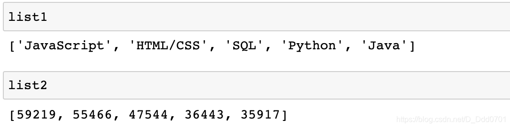
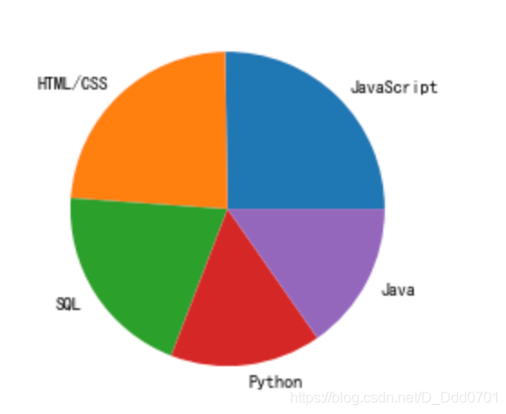
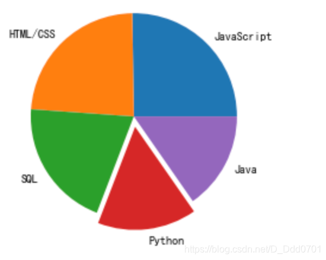
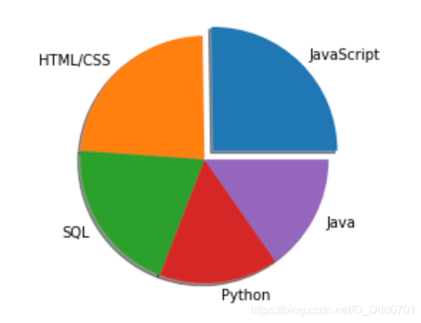
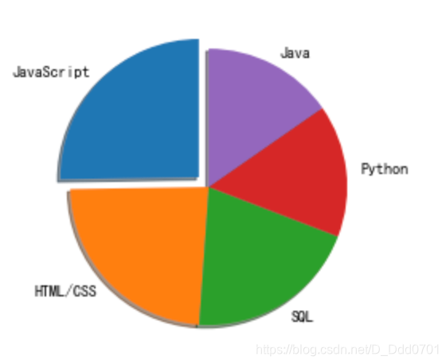
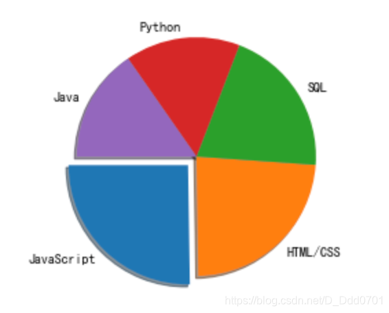
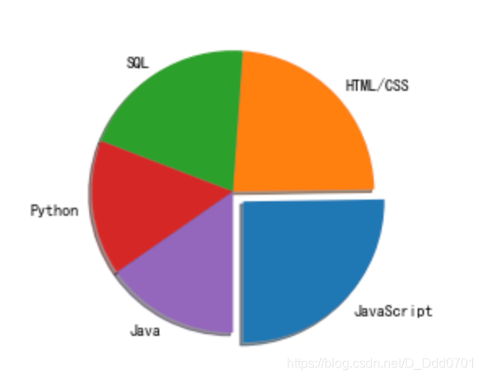
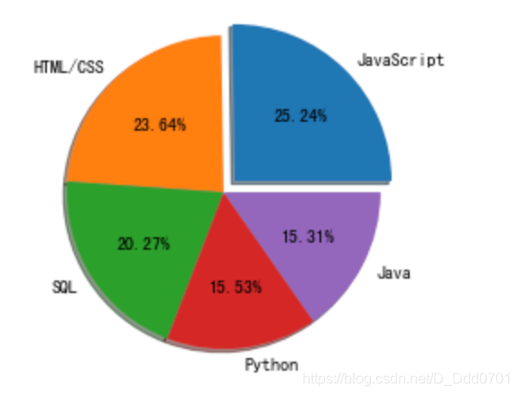
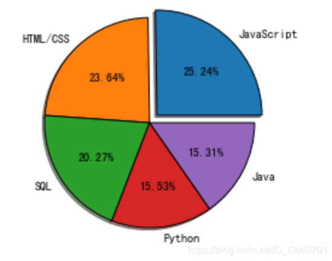
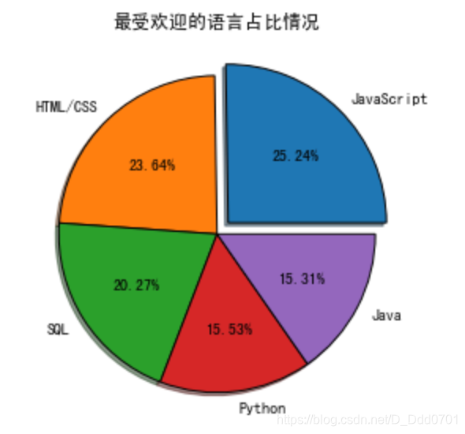

## 绘制第一张饼图
先输入数据：
```python
import matplotlib.pyplot as plt
list1 =['JavaScript','HTML/CSS','SQL','Python','Java']
list2 = [59219,55466,47544,36443,35917]
```

用Pie模式生成饼图：`plt.pie(数值类型,labels='对应名称')`

```python
plt.pie(list2,labels=list1)
```

## 加入爆炸效果
爆炸效果参数：`explode=explo`

```python
explo = [0,0,0,0.1,0]
# 选择排名第4的数据
plt.pie(list2,labels=list1,explode=explo)
```

```python
explo = [0.1,0,0,0.1,0]
# 选择排名第一和第三的数据
plt.pie(list2,labels=list1,explode=explo)
```
## 加入阴影
阴影参数：`shadow=True`
```python
explo = [0.1,0,0,0,0]
plt.pie(list2,labels=list1,explode=explo,shadow=True)
```

## 自定义位置
自定义位置参数：`startangle=0`，以逆时针方向旋转。

当`startangle=90`时，第一块的位置在左上角：



当`startangle=180`时，第一块的位置在左下角：



当`startangle=270`时，第一块的位置在右下角：



## 显示百分比
百分比参数：`autopct='%1.2f%%'`
这里的%1.2f表示小数点后2位精度，%%表示显示百分号（第一个百分号是转译符）

```python
explo = [0.1,0,0,0,0]
plt.pie(list2,labels=list1,explode=explo,shadow=True,startangle=0,autopct='%1.2f%%')
```


## 改变图片边界
边界控制参数：`wedgeprops={'edgecolor':'black'}`
该写法表示边界颜色用黑色勾勒。

```python
explo = [0.1,0,0,0,0]
plt.pie(list2,labels=list1,explode=explo,shadow=True,startangle=0,autopct='%1.2f%%',wedgeprops={'edgecolor':'black'})
```


## 增加标题
标题和其他图一样`plt.title('标题')`
为了让标题更适应移动端显示，可以加入`plt.tight_layout()`开启紧致模式

```python
explo = [0.1,0,0,0,0]
plt.pie(list2,labels=list1,explode=explo,shadow=True,startangle=0,autopct='%1.2f%%',wedgeprops={'edgecolor':'black'})
plt.title('最受欢迎的语言占比情况')
plt.tight_layout()
```

