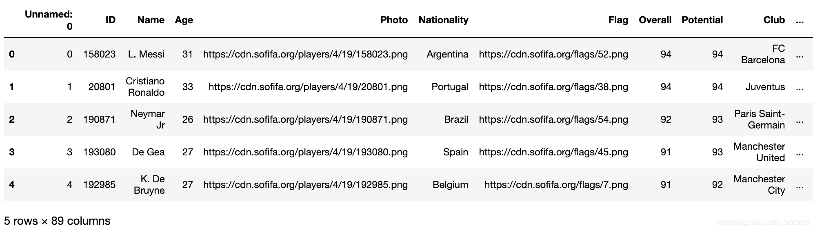
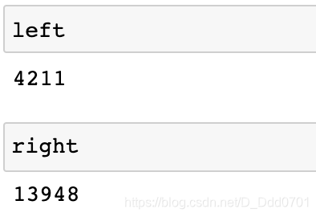
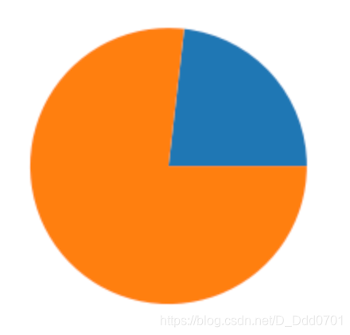
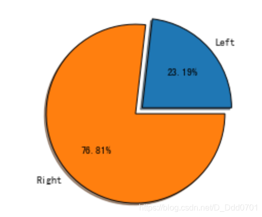
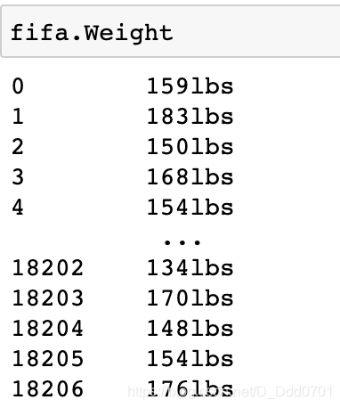
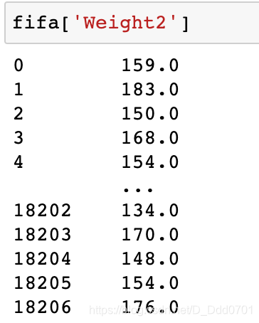
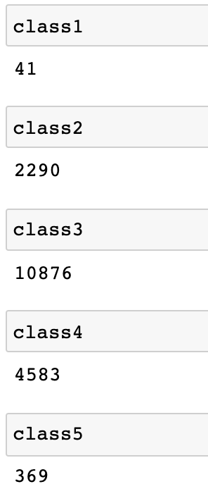
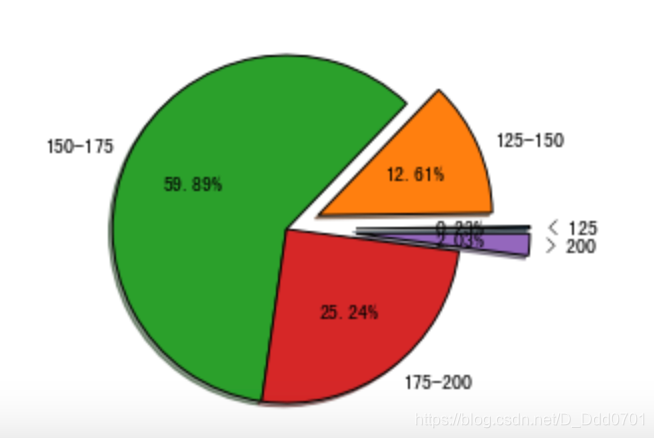
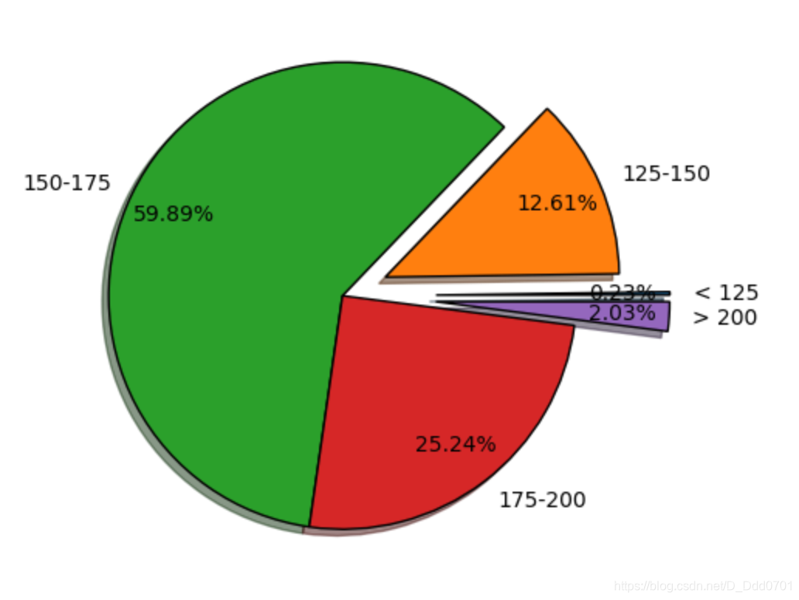

## 利用Pandas导入数据

```python
import pandas as pd
import numpy as np
fifa = pd.read_csv('fifa_data.csv')
fifa.head()
```

筛选出喜欢用左脚、右脚踢球球员数量：

```python
left = fifa.loc[fifa['Preferred Foot']=='Left'].count()[0]
right = fifa.loc[fifa['Preferred Foot']=='Right'].count()[0]
```

## 绘制饼图

```python
plt.pie([left,right])
```


接着开始美化：

```python
labels = ['Left','Right']
explo=[0.1,0]
plt.pie([left,right],labels=labels,explode=explo,shadow=True,startangle=0,autopct='%1.2f%%',wedgeprops={'edgecolor':'black'})
```

## 对有字符串的Weight数据绘制
先看看数据：

直接用带有'lbs'字符串的数据绘制饼图显然不行，这里提供两种思路：

1、`.strip('lbs')`

2、`.replace('lbs','')`

用思路1具体处理一下：
```python
def func1(d1):
    if type(d1)==str:
        return int(d1.strip('lbs'))
fifa['Weight2']=fifa.Weight.apply(func1)
```

## 对不同Weight分类
```python
class1=fifa.loc[fifa.Weight2 < 125].count()[0]
class2 = fifa.loc[(fifa.Weight2 >= 125) & (fifa.Weight2 < 150)].count()[0]
class3 = fifa.loc[(fifa.Weight2 >= 150) & (fifa.Weight2 < 175)].count()[0]
class4 = fifa.loc[(fifa.Weight2 >= 175) & (fifa.Weight2 < 200)].count()[0]
class5 = fifa.loc[fifa.Weight2 > 200].count()[0]
```

数据存入列表`list= [class1,class2,class3,class4,class5]`
## 对处理后对数据绘制饼图

```python
labels = ['< 125 ','125-150','150-175','175-200', '> 200']
explo=[0.4,0.2,0,0,0.4]
plt.pie(list,labels=labels,explode=explo,shadow=True,startangle=0,autopct='%1.2f%%',wedgeprops={'edgecolor':'black'})
```

**这里发现最小的比例太小，显示不明显，可以修改画布大小**
```python
plt.figure(figsize=(8,5),dpi = 100)
```
再用`pctdistance=0.8`控制间距

```python
plt.pie(list,labels=labels,explode=explo,pctdistance=0.8,shadow=True,startangle=0,autopct='%1.2f%%',wedgeprops={'edgecolor':'black'})
```
