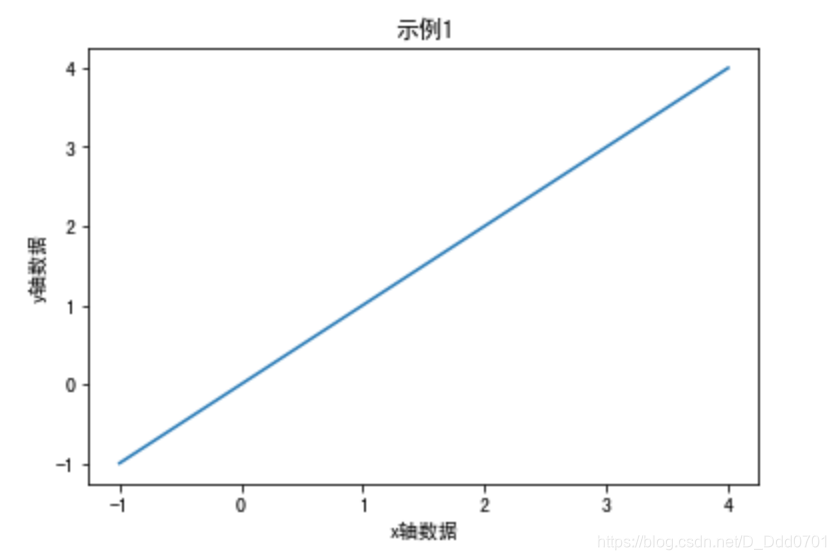
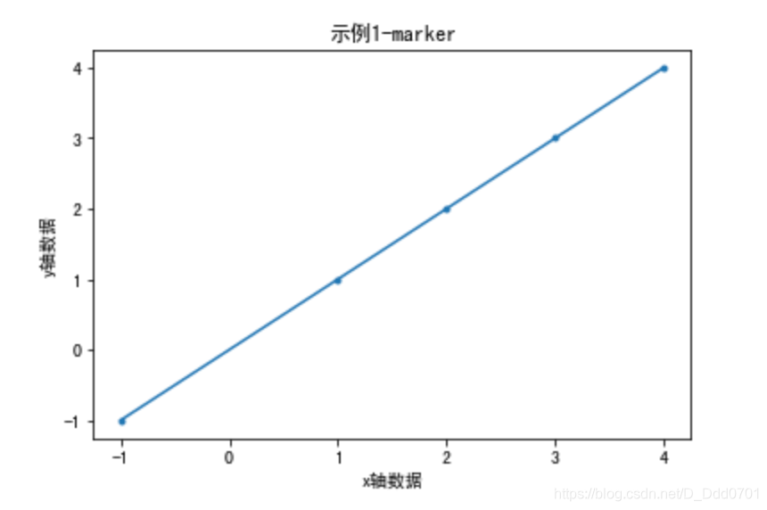
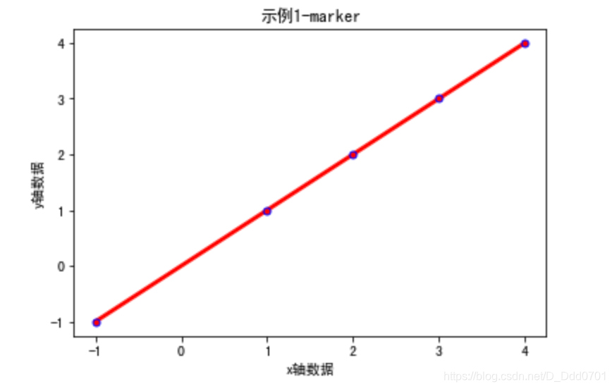
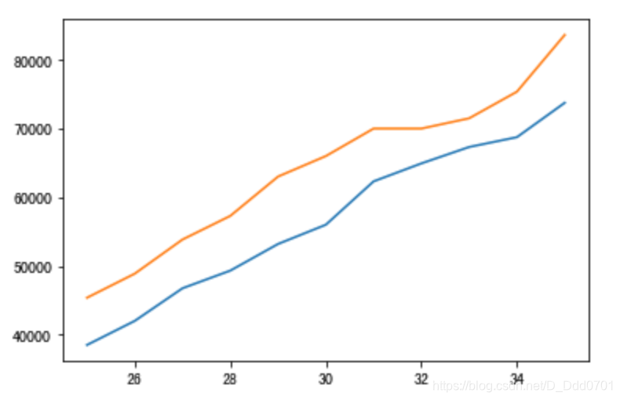
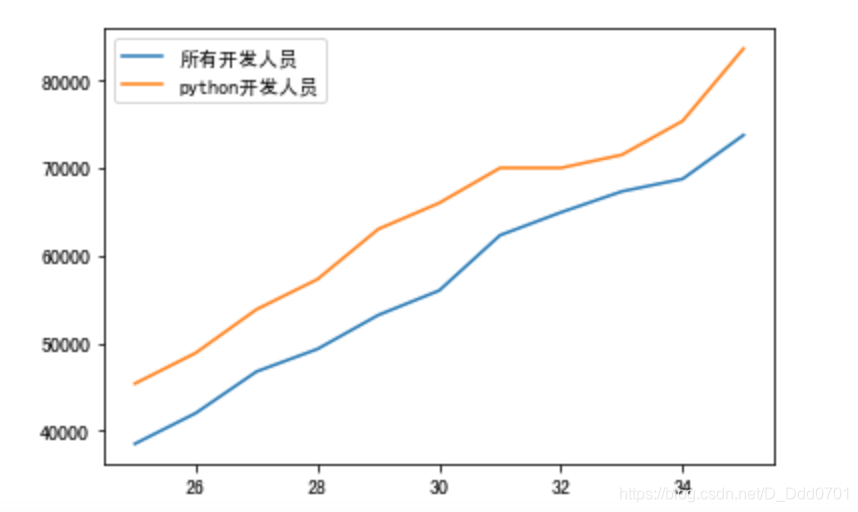
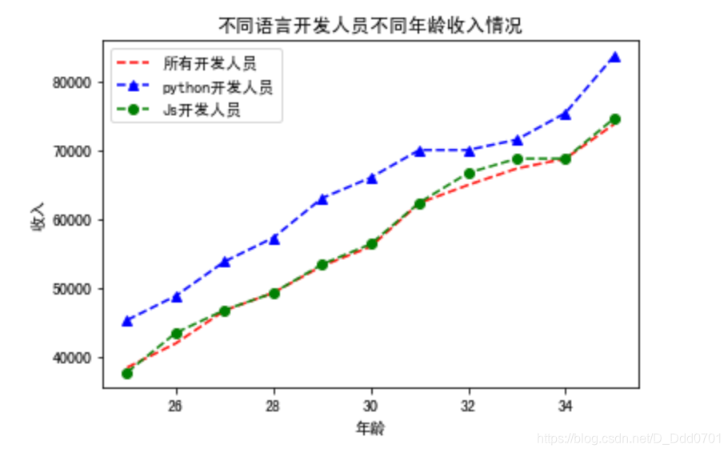
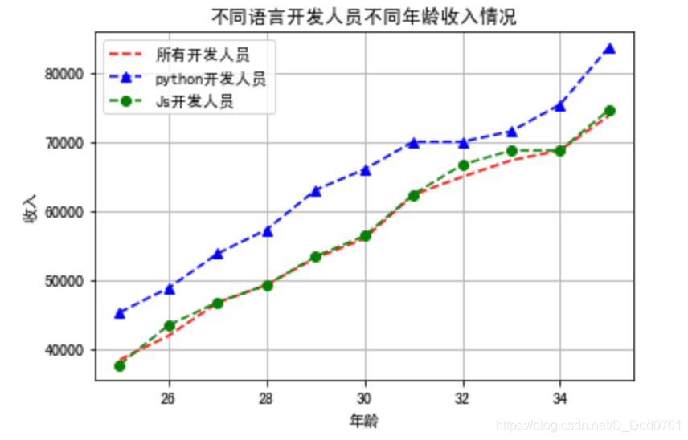
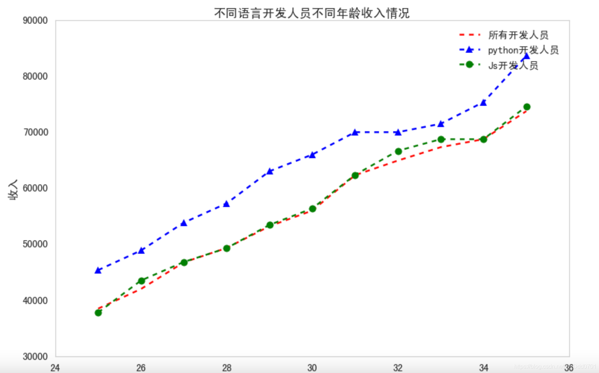
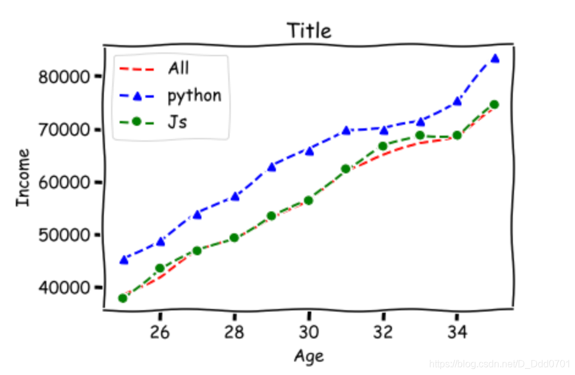

## marker，数据点标示

```python
from matplotlib import pyplot as plt

x=[-1,1,2,3,4]
y=[-1,1,2,3,4]

plt.xlabel('x轴数据')
plt.ylabel('y轴数据')
plt.title('示例1')
plt.plot(x,y)
```

工作中绘制折线图往往需要把数据点用不同的细节标示出来，此处则应设置marker参数：
```python
plt.plot(x,y,marker='.')
```
把刚才的plot语句增加marker参数后：

点的大小调节用markersize参数：`plt.plot(x,y,marker='.',markersize=10)`

点的颜色调节用color参数：`plt.plot(x,y,marker='.',color='red')`，这里的color可以使用HEX码自行设定，如`plt.plot(x,y,marker='.',color='#2614e8')`

线对粗细用linewidth参数：`plt.plot(x,y,marker='.',linewidth=3)`

点边界颜色调节用markeredgecolor参数：`plt.plot(x,y,marker='.',markeredgecolor='blue')`

线形调节用linestyle参数：`plt.plot(x,y,marker='.',linestyle='dashed')`

**总体效果：**
`plt.plot(x,y,marker='.',markersize=10,color='red',linewidth=3,markeredgecolor='blue')`


## 绘制多条折线
```python
from matplotlib import pyplot as plt
dev_x = [25, 26, 27, 28, 29, 30, 31, 32, 33, 34, 35]
dev_y = [38496, 42000, 46752, 49320, 53200, 56000, 62316, 64928, 67317, 68748, 73752]
py_dev_y = [45372, 48876, 53850, 57287, 63016,65998, 70003, 70000, 71496, 75370, 83640]
plt.plot(dev_x,dev_y)
plt.plot(dev_x,py_dev_y)
```
用两个plot语句就能在一张图纸上绘制两个折线图：

为了让哪条线对应的是哪个数据更加明显，需要增加图示，使用label参数：`plt.plot(x轴数据，y轴数据, label='名字')`

对上图代码进行补充：
```python
from matplotlib import pyplot as plt
dev_x = [25, 26, 27, 28, 29, 30, 31, 32, 33, 34, 35]
dev_y = [38496, 42000, 46752, 49320, 53200, 56000, 62316, 64928, 67317, 68748, 73752]
py_dev_y = [45372, 48876, 53850, 57287, 63016,65998, 70003, 70000, 71496, 75370, 83640]
plt.plot(dev_x,dev_y,label='所有开发人员')
plt.plot(dev_x,py_dev_y,label='python开发人员')
plt.legend()
```
**注意：使用label参数后要显示图示，需要增加一条`plt.legend()`语句。由于我是用jupyter notebook编写，可以省略`plt.show()`语句，如果不是交互式笔记本在运行程序时需要最后增加`plt.show()`语句才能显示可视化图表。**

这里增加第三条数据，再用marker优化一下图表：
```python
from matplotlib import pyplot as plt
dev_x = [25, 26, 27, 28, 29, 30, 31, 32, 33, 34, 35]
dev_y = [38496, 42000, 46752, 49320, 53200, 56000, 62316, 64928, 67317, 68748, 73752]
py_dev_y = [45372, 48876, 53850, 57287, 63016,65998, 70003, 70000, 71496, 75370, 83640]
js_dev_y = [37810, 43515, 46823, 49293, 53437,56373, 62375, 66674, 68745, 68746, 74583]
plt.plot(dev_x,dev_y,'r--',label='所有开发人员')
plt.plot(dev_x,py_dev_y,'b^--',label='python开发人员')
plt.plot(dev_x,js_dev_y,'go--',label='Js开发人员')
plt.legend()
plt.title('不同语言开发人员不同年龄收入情况')
plt.xlabel('年龄')
plt.ylabel('收入')
```

**这里使用了简化写法:（fmt模式）**
```python
plt.plot(dev_x,dev_y,[fmt],label='所有开发人员')
#  fmt=[颜色][marker][linestyle]
#  'go--'表示color='green',marker='o',linestyle='dashed',linewidth=2,markersize=12
```
具体可以根据自己matplotlib版本参考官方文档：[3.3.2matplotlib.pyplot中plot参数](https://matplotlib.org/3.3.2/api/_as_gen/matplotlib.pyplot.plot.html?highlight=plot#matplotlib.pyplot.plot)
## 开启网格功能
为了更清晰地获取图片数据信息，需要用grid参数开启网格功能：`plt.grid()`
```python
from matplotlib import pyplot as plt
dev_x = [25, 26, 27, 28, 29, 30, 31, 32, 33, 34, 35]
dev_y = [38496, 42000, 46752, 49320, 53200, 56000, 62316, 64928, 67317, 68748, 73752]
py_dev_y = [45372, 48876, 53850, 57287, 63016,65998, 70003, 70000, 71496, 75370, 83640]
js_dev_y = [37810, 43515, 46823, 49293, 53437,56373, 62375, 66674, 68745, 68746, 74583]
plt.plot(dev_x,dev_y,'r--',label='所有开发人员')
plt.plot(dev_x,py_dev_y,'b^--',label='python开发人员')
plt.plot(dev_x,js_dev_y,'go--',label='Js开发人员')
plt.legend()
plt.title('不同语言开发人员不同年龄收入情况')
plt.xlabel('年龄')
plt.ylabel('收入')
plt.grid()
```

## 利用风格文件美化图表
首先查看一下有什么风格：`print(plt.style.available)`

['Solarize_Light2', '_classic_test_patch', 'bmh', 'classic', 'dark_background', 'fast', 'fivethirtyeight', 'ggplot', 'grayscale', 'seaborn', 'seaborn-bright', 'seaborn-colorblind', 'seaborn-dark', 'seaborn-dark-palette', 'seaborn-darkgrid', 'seaborn-deep', 'seaborn-muted', 'seaborn-notebook', 'seaborn-paper', 'seaborn-pastel', 'seaborn-poster', 'seaborn-talk', 'seaborn-ticks', 'seaborn-white', 'seaborn-whitegrid', 'tableau-colorblind10']

现在使用一个风格对比一下：
```python
plt.plot(dev_x,dev_y,'r--',label='所有开发人员')
plt.plot(dev_x,py_dev_y,'b^--',label='python开发人员')
plt.plot(dev_x,js_dev_y,'go--',label='Js开发人员')
plt.legend()
plt.title('不同语言开发人员不同年龄收入情况')
plt.xlabel('年龄')
plt.ylabel('收入')
plt.style.use('tableau-colorblind10')
plt.rcParams['font.sans-serif'] = ['SimHei']
```

还可以用动漫风格：`plt.xkcd()`，但要注意 **`plt.xkcd()`没有中文字库，只适用于纯英文图表。**
```python
from matplotlib import pyplot as plt
dev_x = [25, 26, 27, 28, 29, 30, 31, 32, 33, 34, 35]
dev_y = [38496, 42000, 46752, 49320, 53200, 56000, 62316, 64928, 67317, 68748, 73752]
py_dev_y = [45372, 48876, 53850, 57287, 63016,65998, 70003, 70000, 71496, 75370, 83640]
js_dev_y = [37810, 43515, 46823, 49293, 53437,56373, 62375, 66674, 68745, 68746, 74583]
plt.xkcd()
plt.plot(dev_x,dev_y,'r--',label='All')
plt.plot(dev_x,py_dev_y,'b^--',label='python')
plt.plot(dev_x,js_dev_y,'go--',label='Js')
plt.grid()
plt.legend()
plt.title('Title')
plt.xlabel('Age')
plt.ylabel('Income')
plt.show()
```
