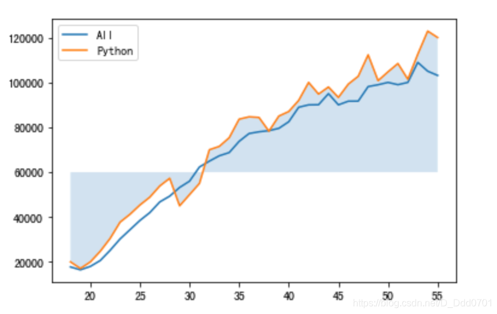

## 利用pandas导入数据

```python
import matplotlib.pyplot as plt
import pandas as pd
data = pd.read_csv('data.csv')
```
数据结构如图：

## 绘制折线图
```python
plt.plot(data['Age'],data['All_Devs'],label='All')
plt.plot(data['Age'],data['Python'],label='Python')
plt.legend()
```

## 增加阴影
阴影参数：`plt.fill_between()`
```python
plt.fill_between(data['Age'],data['Python'])
```

会发现这样反而导致折线图很不清晰，这里可以调整透明度：`alpha=0.2`
```python
plt.fill_between(data['Age'],data['Python'],alpha=0.2)
```

## 设置临界线
临界线设置为60000:`overall_mid=60000`

```python
overall_mid=60000
plt.fill_between(data['Age'],data['Python'],overall_mid,alpha=0.2)
```

## 条件语句筛选阴影位置
```python
plt.fill_between(data['Age'],data['Python'],overall_mid,where=(data['Python'] > overall_mid),alpha = 0.2)
```

这里看上去有些突兀，可以用渐变参数优化：`interpolate=True`
```python
plt.fill_between(data['Age'],data['Python'],overall_mid,where=(data['Python'] > overall_mid),interpolate=True,alpha = 0.2)
```

## 增加更多细节
可以用`color=‘颜色’`控制阴影区域颜色，`label`增加标签。
```python
plt.fill_between(data['Age'],data['Python'],data['All_Devs'],where=(data['Python'] > data['All_Devs']),interpolate=True,alpha = 0.2,label='Python > All')
plt.fill_between(data['Age'],data['Python'],data['All_Devs'],where=(data['Python'] <= data['All_Devs']),interpolate=True,alpha = 0.2,color='red',label='Python <= All')
```


