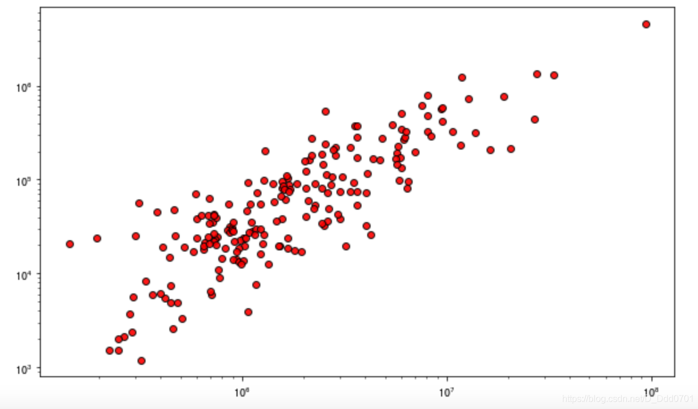

散点图绘制：`plt.scatter(x数据,y数据)`

```python
plt.scatter(x,y,s=100,color='red',edgecolor='black',alpha=0.8)
# s是size，点的大小
plt.grid()
```

还可以用不同颜色聚类：
```python
x = [5, 7, 8, 5, 6, 7, 9, 2, 3, 4, 4, 4, 2, 6, 3, 6, 8, 6, 4, 1]
y = [7, 4, 3, 9, 1, 3, 2, 5, 2, 4, 8, 7, 1, 6, 4, 9, 7, 7, 5, 1]
colors = [447, 445, 449, 447, 445, 447, 442, 5, 3, 7, 1, 2, 8, 1, 9, 2, 5, 6, 7, 5]
plt.scatter(x,y,s=100,c=colors,edgecolor='black',alpha=0.8)
plt.grid()
```

如果颜色不直观，或者混乱，还可以增加更多图示细节：
```python
x = [5, 7, 8, 5, 6, 7, 9, 2, 3, 4, 4, 4, 2, 6, 3, 6, 8, 6, 4, 1]
y = [7, 4, 3, 9, 1, 3, 2, 5, 2, 4, 8, 7, 1, 6, 4, 9, 7, 7, 5, 1]
colors = [7, 5, 9, 7, 5, 7, 2, 5, 3, 7, 1, 2, 8, 1, 9, 2, 5, 6, 7, 5]
plt.scatter(x,y,s=100,c=colors,edgecolor='black',alpha=0.8)
plt.grid()
cbar = plt.colorbar()
cbar.set_label('Label')
```

## 从Pandas导入数据
先看看数据结构：
```python
df = pd.read_csv('2019-05-31-data.csv')
df.head()
```

绘制散点图：`plt.scatter(df.view_count,df.likes)`

## 细节优化

```python
plt.figure(figsize=(10,6))
plt.scatter(df.view_count,df.likes,c='red',edgecolors='black',linewidths=1,alpha=0.9)
plt.xscale('log')
# 数据堆叠在一起，采用对数坐标更加明显
plt.yscale('log')
```

但这里想把`df.ratio`元素加入到散点图内：

```python
plt.figure(figsize=(10,6))
plt.scatter(df.view_count,df.likes,c=df.ratio,edgecolors='black',linewidths=1,alpha=0.9)
plt.xscale('log')
plt.yscale('log')
cbar = plt.colorbar()
cbar.set_label('Like&Dislike')
```
