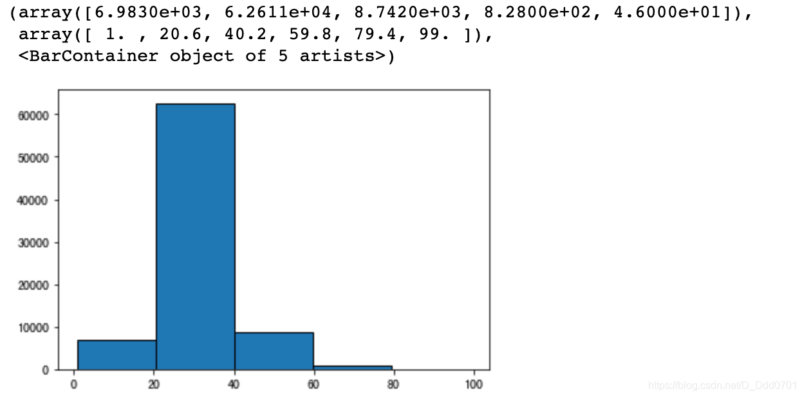

## 导入数据

```python
minutes = [1, 2, 3, 4, 5, 6, 7, 8, 9]

player1 = [1, 2, 3, 3, 4, 4, 4, 4, 5]
player2 = [1, 1, 1, 1, 2, 2, 2, 3, 4]
player3 = [1, 5, 6, 2, 2, 2, 3, 3, 3]
```
## 绘制简单堆叠图

```python
plt.bar(minutes, player1)
plt.bar(minutes, player2)
plt.bar(minutes, player3)
```

很明显这里的堆叠图存在问题，有一些数据被掩盖无法显示。这里就需要**设置索引**。
```python
index_x = np.arange(len(minutes))
w= 0.15
plt.bar(index_x-w,player1,width=w)
plt.bar(index_x,player2,width=w)
plt.bar(index_x+w,player3,width=w)
```


这种堆叠方式需要自行设置宽度，可以选用更简单的方法：`stackplot`。

```python
plt.stackplot(minutes, player1, player2, player3)
```

丰富一下细节：
```python
labels=['class1','class2','class3']
colors = ['Blue','Red','Green']
plt.stackplot(minutes,player1,player2,player3,labels=labels,colors=colors)
plt.legend()
```
**显示标签需要加入`plt.legend()`**

可以修改标签位置，以免与图片内容有重叠部分`plt.legend(loc(坐标))`
```python
plt.legend(loc=(0.1,0.8))
```

## 更多使用方式

```python
ages = [18, 19, 21, 25, 26, 26, 30, 32, 38, 45, 55]
```
这组数据如果用柱状图绘制，因为没有重复，所以每一个柱子高度都是一致的。这里可以借助分组功能：`plt.hist=(数据, bins=频次)`

```python
plt.hist(ages,bins=4)
```

这样就可以把数据均衡的切成四个范围。

**这里四个范围是18-27.25，27.25-36.5，36.5-45.75，45.75-55**

加入分界线会更加明显：`edgecolor=‘颜色’`
```python
plt.hist(ages,bins=4,edgecolor='black')
```

当然，这里的bins也可以自己手动输入：

```python
bins=[20,30,40,50,60]
plt.hist(ages,bins,edgecolor='black')
```

## 实战案例
从pandas导入数据：
```python
data=pd.read_csv('data.csv')
data.head()
```

分成五组看看：
```python
plt.hist(data.Age,bins=5,edgecolor='black')
```

自定分组：
```python
bins=[10,20,30,40,50,60,70,80,90,100]
plt.hist(data.Age,bins,edgecolor='black')
```

由于y轴数据比较大，这里可以采用科学计数法：`log=True`

```python
bins=[10,20,30,40,50,60,70,80,90,100]
plt.hist(data.Age,bins,edgecolor='black',log=True)
```

**这里可以非常清晰的看到两张图的不同之处，采用科学计数法后可以看到80-90岁比90-100岁的少，而不采用的图在80-100岁区间非常模糊。**

### 增加平均值辅助线
平均值辅助线：`plt.axvline=(中位数)`

```python
median_age=data.Age.mean()
plt.axvline(median_age,color='red',label='Median')
plt.legend()
```
