## 传统字符串表现效果
```python
import matplotlib.pyplot as plt
from datetime import datetime,timedelta
# 因为是时间序列，所以需要使用datetime
```

```python
x = ['2019-5-24','2019-5-25','2019-5-26','2019-5-27','2019-5-28','2019-5-29','2019-5-30','2019-6-30']
y = [0,1,3,4,6,5,7,3]
plt.plot(x,y)
```
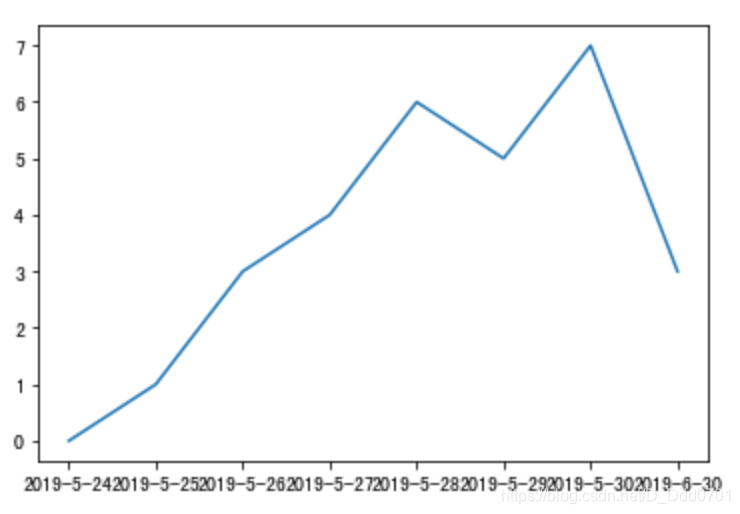
如果是用`plt.plot`这种传统方式绘制，下方时间看着比较乱，原因是因为`plt.plot`默认用字符串`str`的方式。除此之外，**字符串还存在一个最重要的问题：2019-5-30到2019-6-30实际上间隔了一个月，但是在折线图上是相邻的两个单元。**
## 采用plt.plot_date方式

```python
x = [
    datetime(2019,5,24),
    datetime(2019,5,25),
    datetime(2019,5,26),
    datetime(2019,5,27),
    datetime(2019,5,28),
    datetime(2019,5,29),
    datetime(2019,5,30),
    ]
y = [0,1,3,4,6,5,7,3]
plt.plot_date(x2,y)
```
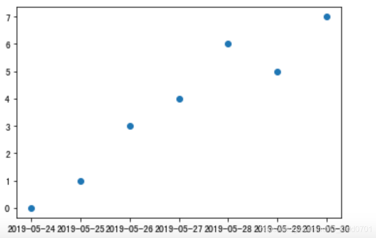
乍一看好像没有不同，只是x轴数据的属性是`datetime`，不是`str`而已。现在把点用折线连接起来。
```python
plt.style.use('seaborn')
plt.plot_date(x,y,linestyle='solid')
```
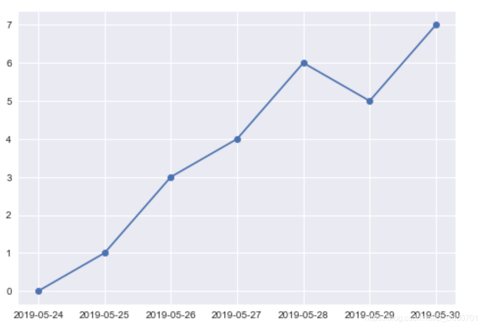
但是数据量变大，x轴数据依然会存在模糊不清的问题，例如：

```python
x2 = [
    datetime(2019,5,24),
    datetime(2019,5,25),
    datetime(2019,5,26),
    datetime(2019,5,27),
    datetime(2019,5,28),
    datetime(2019,5,29),
    datetime(2019,5,30),
    datetime(2019,6,24),
    datetime(2019,6,25),
    datetime(2019,6,26),
    datetime(2019,6,27),
    datetime(2019,6,28),
    datetime(2019,6,29),
    datetime(2019,6,30),
    ]
y2 = [0,1,3,4,6,5,7,0,1,3,4,6,5,7]
plt.plot_date(x2,y2,linestyle='solid')
```
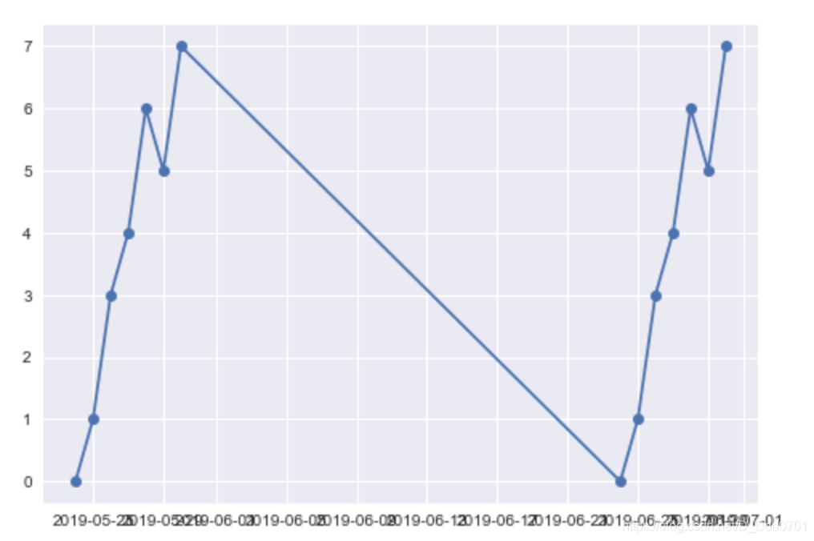
虽然这里解决了时间间隔一个月，折线图会显示出一个月的间隔期，但这里x轴的问题就非常明显了。接下来开始讨论解决办法：
## x轴显示模糊解决办法

```python
plt.plot_date(x2,y2,linestyle='solid')
plt.gcf().autofmt_xdate()
# gcf是获得图表的控制权，gca是获得坐标轴控制权
# plt.gcf().autofmt_xdate()可以自动调整x轴日期格式
```
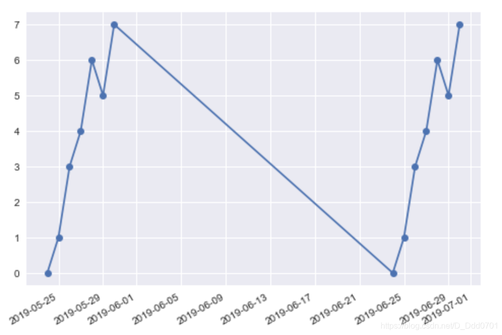
当然，也可以自己设置日期格式：
```python
from matplotlib import dates as mpl_dates
plt.plot_date(x2,y2,linestyle='solid')
plt.gcf().autofmt_xdate()
date_format=mpl_dates.DateFormatter('%b,%d %Y')
# 用月份-日期-年份格式
plt.gca().xaxis.set_major_formatter(date_format)
```
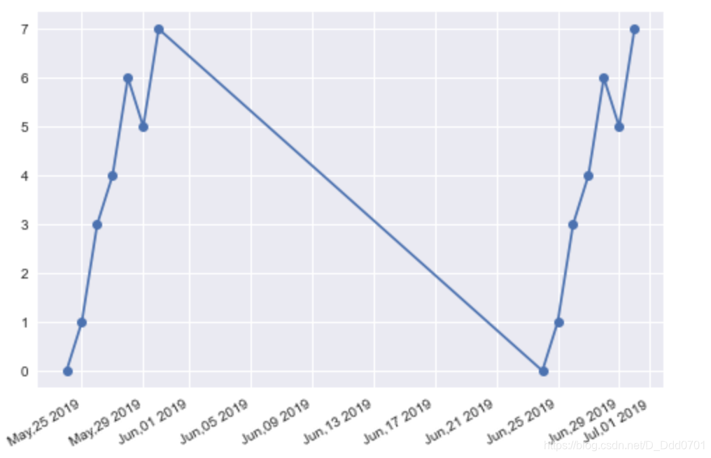
## 利用Pandas导入金融数据分析
```python
import pandas as pd
import matplotlib.pyplot as plt
from datetime import datetime,timedelta
from matplotlib import dates as mpl_dates
```

```python
df = pd.read_csv('data.csv')
df.head()
```
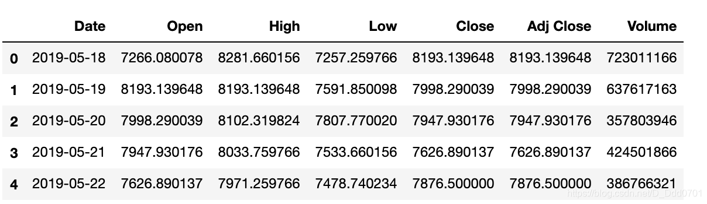
**注意，这里的时间并不一定是datetime格式，需要查看一下**

```python
df.info()
```
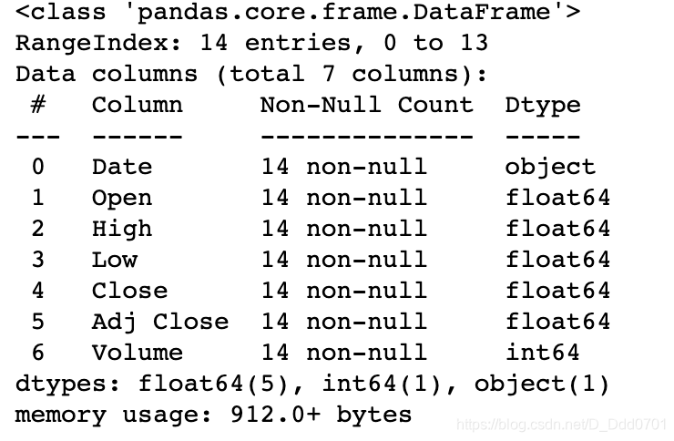
果然，是字符串格式，需要调整格式到datetime：

```python
df.Date = pd.to_datetime(df.Date)
df.info()
```
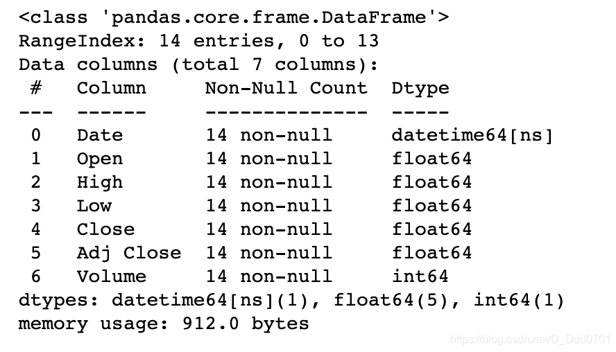
把时间序列排序看一下有没有问题

```python
df.sort_values('Date',inplace=True)
df.head()
```
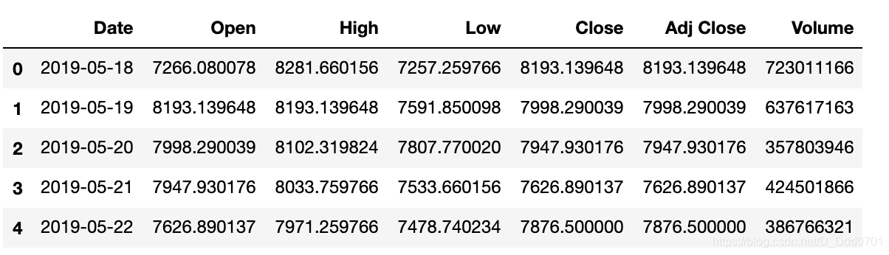
接下来开始绘制走势图：

```python
plt.plot_date(df.Date,df.Close,linestyle='solid')
plt.gcf().autofmt_xdate()
```
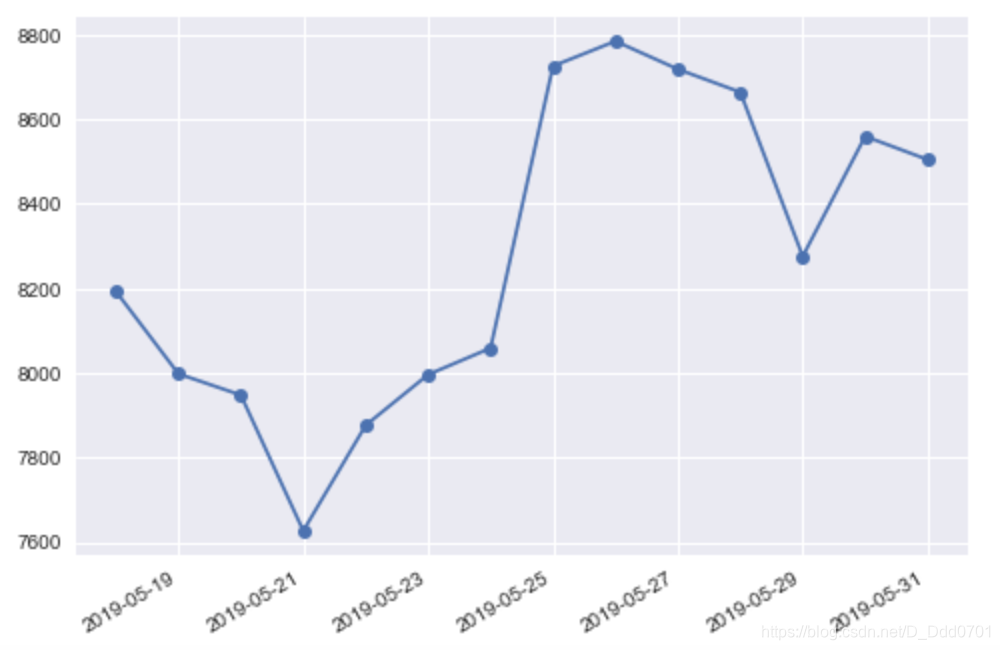
丰富更多细节：

```python
plt.plot_date(df.Date,df.Close, linestyle='solid')
plt.gcf().autofmt_xdate()
date_format = mpl_dates.DateFormatter('%b,%d %Y')
plt.gca().xaxis.set_major_formatter(date_format)
plt.title('Bitcoin Price')
plt.xlabel('Date')
plt.ylabel('Price USD')
```
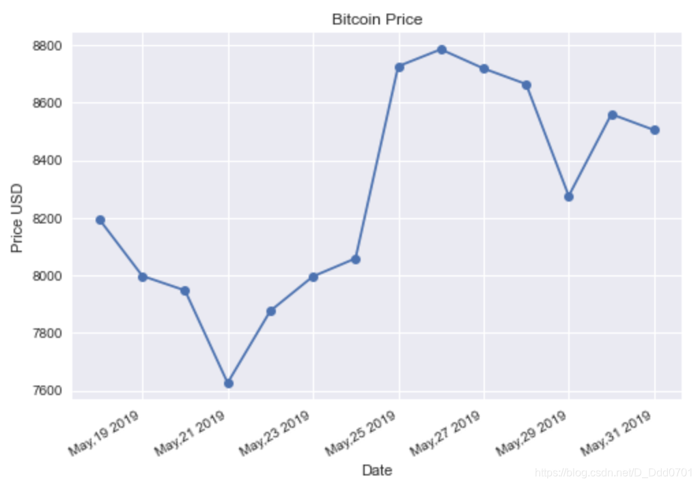

