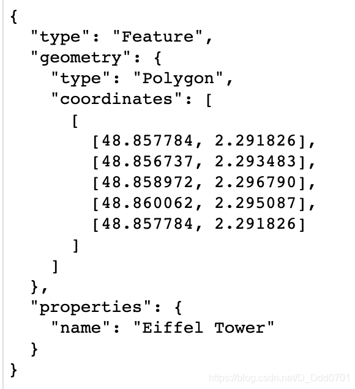
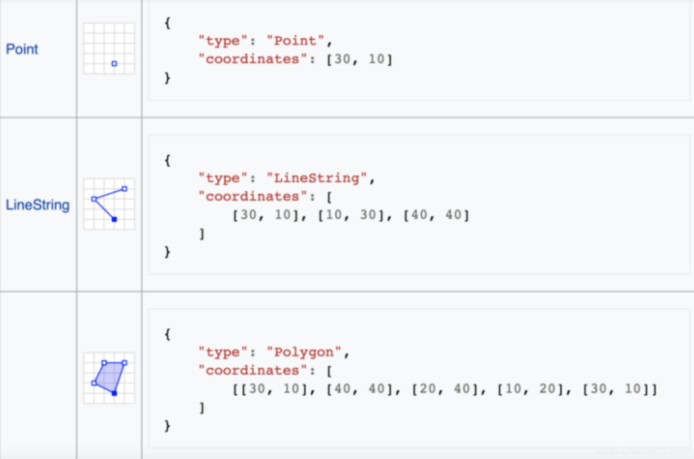
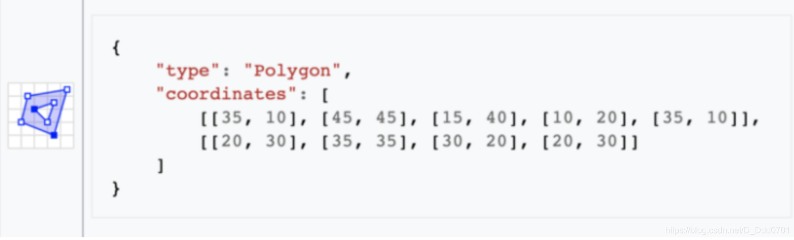

```python
import pandas as pd
import numpy as np
import plotly
import plotly.graph_objects as go
import chart_studio.plotly as py
import plotly.express as px
```
在绘制地图时，需要数据信息，但这个数据需要gps信息（经纬度坐标），如果没有则需要补充geojson信息。

例如，csv文件内的成都并不代表地图上的成都，csv文件的成都只是一个字符串，要让程序识别出这是地图上的成都应该包括成都的范围（经纬度的跨度等）。

这里例举一个具体的例子：




为了确定这个多边形的范围，我们用5个点去圈定他，这样就在一个空间内形成了多边形的地理信息。所有的区域信息可以总结为以下几点：




