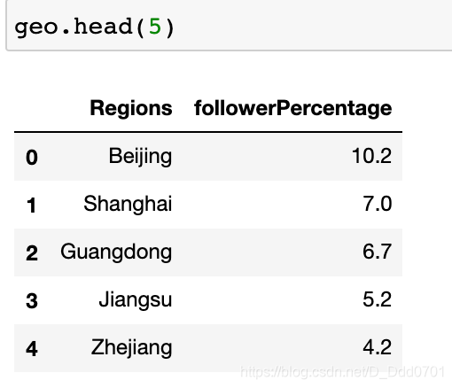
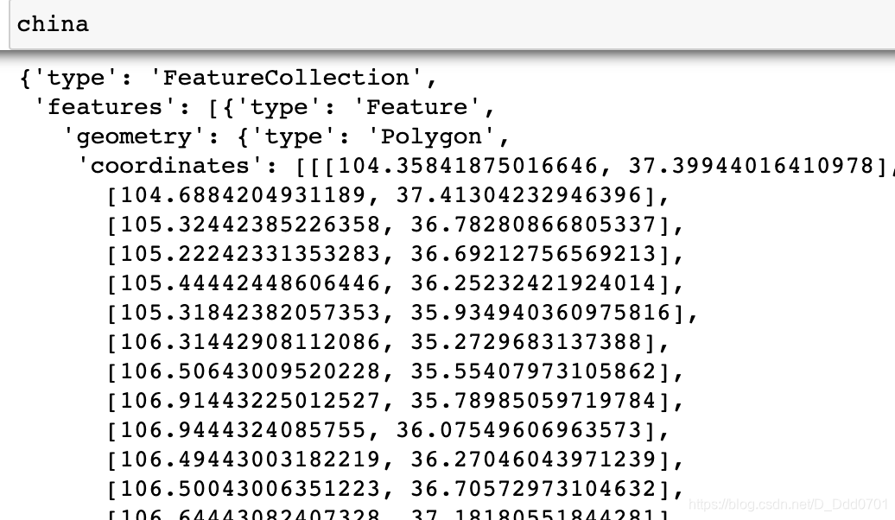
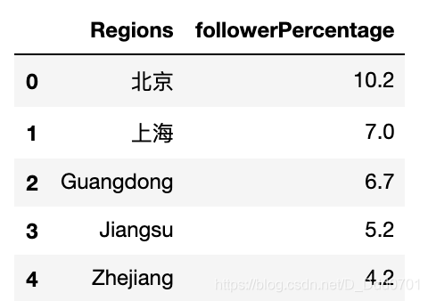

这里准备了一份数据：
```python
geo = pd.read_csv("Geography.csv")
```


那么我们知道，要在地图上定位只有两种办法：1、给出指定的(x,y)坐标；2、geojson格式文件。显然对市给出坐标太过困难，所以这里选择第2种方式。

网上已经有人给出了一份全国市级地区的geojson文件，我们直接调用。
```python
import json
with open('china_geojson.json') as file:
    china = json.load(file)
```


绘制图片：

```python
# geojson=geojson数据
# locations=地图对应的id信息
# z=数值
fig = go.Figure(go.Choroplethmapbox(geojson=china,locations=geo.Regions,z=geo.followerPercentage
                                   ,colorscale='Cividis'))
# 直接绘制是不能显示的，必须需要fig.update_layout()渲染s
fig.update_layout(mapbox_style="carto-positron",mapbox_zoom=3,mapbox_center = {"lat" : 35.9 ,"lon" : 104.2})
fig.update_layout(margin={"t":0,"b":0,"l":0,"r":0})
```
但是因为Geography.csv文件中给的地标都是英文，我们更希望可以用中文展示：
```python
geo2 = pd.read_csv('Geography2.csv')
geo2.head(5)
```


把之前的数据的北京和上海改成中文再运行一次：

```python
fig = go.Figure(go.Choroplethmapbox(geojson=china,locations=geo2.Regions,z=geo2.followerPercentage
                                   ,colorscale='Cividis'))
fig.update_layout(mapbox_style="carto-positron",mapbox_zoom=3,mapbox_center = {"lat" : 35.9 ,"lon" : 104.2})

fig.update_layout(margin={"t":0,"b":0,"l":0,"r":0})
```
发现，北京和上海都无法显示了。

这是因为我们的geojson文件id也是英文的，这里如果改成中文的北京上海就会和geojson的不匹配，所以无法显示。

如果修改id成中文就可以正确显示了。