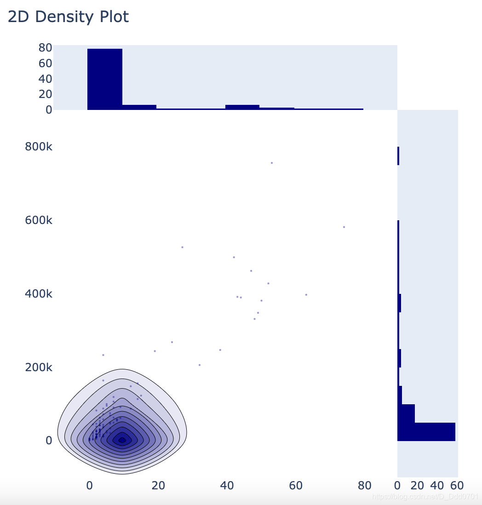
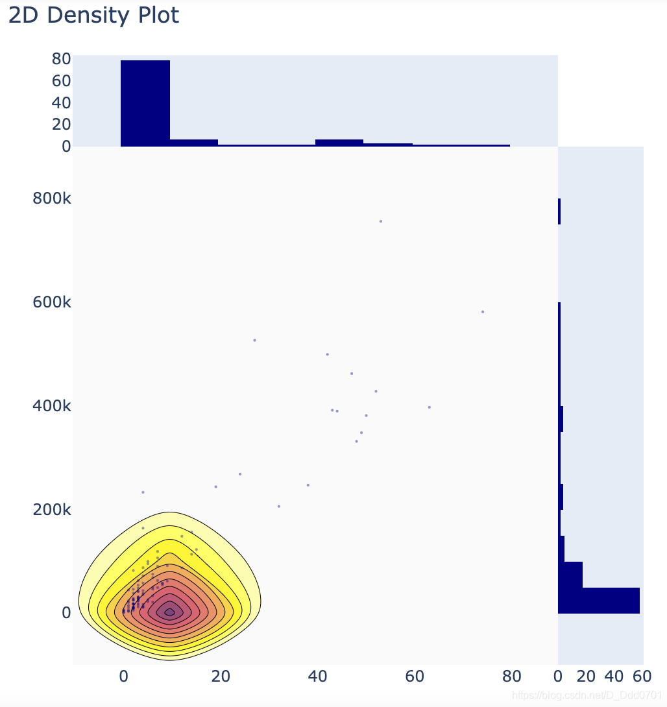
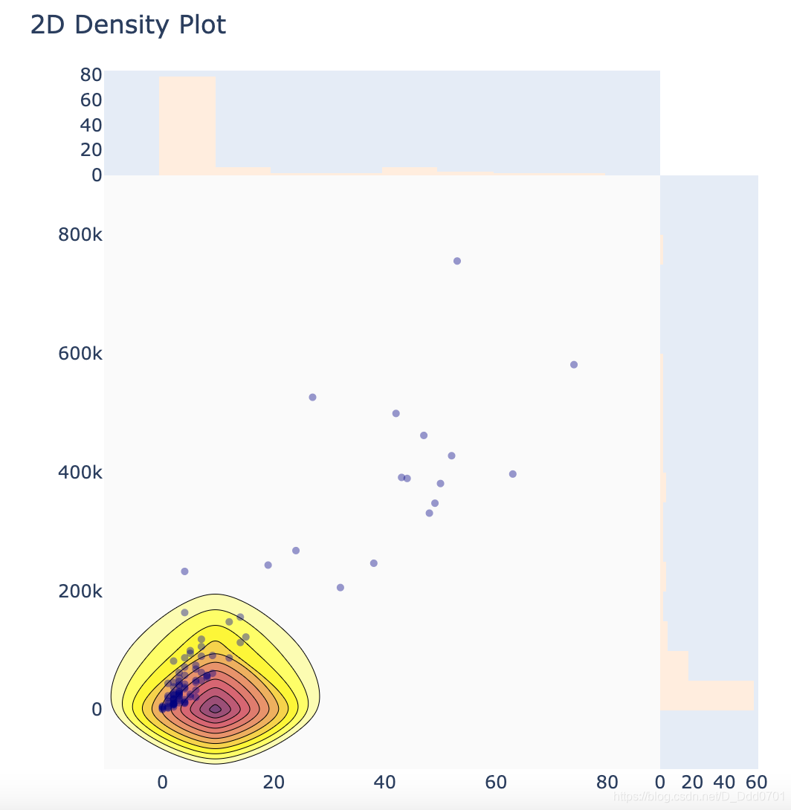

数据沿用[PUGB游戏数据](Visualization/Plotly/plot_with_data/)的数据文件。

```python
from plotly.offline import download_plotlyjs , init_notebook_mode,plot ,iplot
import plotly.graph_objs as go
import pandas as pd
pubg = pd.read_csv("PUBG.csv")
df_pubg = pubg.apply(pd.to_numeric,errors = 'ignore')
df_new_pubg = df_pubg.head(100)
```
```python
import plotly.figure_factory as ff
```
2维图表需要两组数据：

```python
x = df_new_pubg.solo_Wins
y = df_new_pubg.solo_TimeSurvived
```
设置参数：
```python
colorscale = ['#7A4579','#D56073','rgb(236,158,105)',(1,1,0.2),(0.98,0.98,0.98)]
```
先不加入参数看看绘制效果
```python
fig=ff.create_2d_density(x,y)
iplot(fig ,filename='histgram_subplot')
```


通过调色板进行颜色优化：

```python
fig = ff.create_2d_density(x,y , colorscale= colorscale)
```


这里的密度图和直方图的颜色并不一致，接下来调整直方图颜色：

```python
fig = ff.create_2d_density(x,y , colorscale= colorscale ,hist_color='rgb(255,237,222)' , point_size= 5)
```

