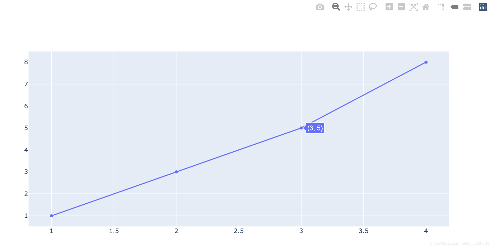

# 利用Plotly绘制第一张图
使用离线版本：`plotly.offline`

最简单的绘制方式：`iplot([数据])`，`plot`和`iplot`最大区别在于是不是创建一个新的网页来显示图表，后面会演示。

首先看看`iplot`模式。
```python
from plotly.offline import download_plotlyjs, init_notebook_mode, plot, iplot
```

```python
dic1 = {'x':[1,2,3,4],
        'y':[1,3,5,8]
       }
iplot([dic1])
# 可以试试plot([dic1])感受区别
```



可以看到，使用plotly绘制出来的图和matplotlib绘制的明显区别是：

1、图表中的数据可以显示出具体数值（可交互性）；

2、右上角有很多对图片细节进行查看的工具（扩展性）。