本案例用苹果和特斯拉股票做例子。
## 利用Pandas导入数据
```python
from plotly.offline import download_plotlyjs , init_notebook_mode,plot ,iplot
import plotly.graph_objects as go
import pandas as pd
```

```python
df = pd.read_csv('APPL.csv')
df.head()
```
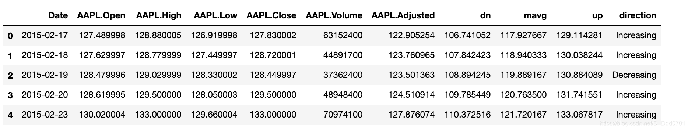
可以看到数据包含日期，开盘收盘成交量等数据。
## 绘制图表
利用`go`语句存放数据：

```python
trace1=go.Scatter(
    x=df['Date'],
    y=df['AAPL.Close']
)
```
```python
iplot([trace1])
```
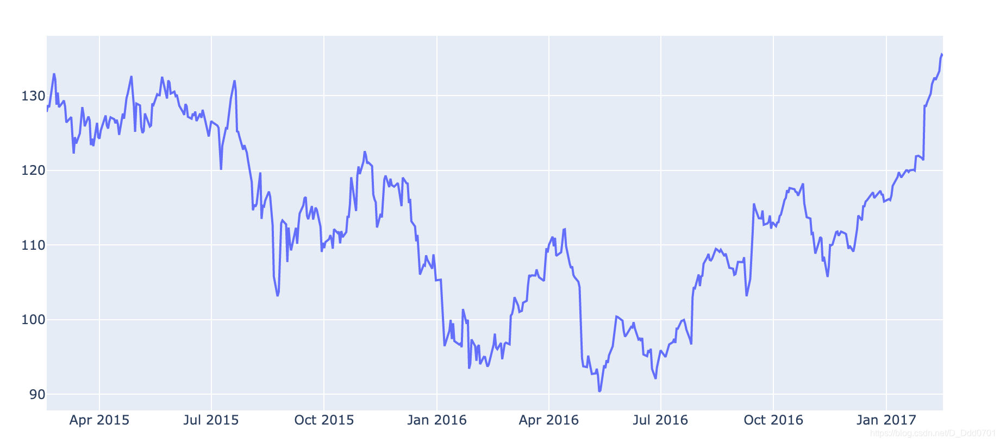
利用同样的方法绘制特斯拉。我们这里绘制特斯拉股票的最高价和最低价。
```python
df2 = pd.read_csv('Tesla.csv')
trace_a = go.Scatter(
         x = df2.date,
         y = df2.high,
         name = "Tesla High",
         line = dict(color = '#17BECF'),
         opacity =0.8

)
trace_b = go.Scatter(
         x = df2.date,
         y = df2.low,
         name = "Tesla Low",
         line = dict(color = '#7f7f7f'),
         opacity =0.8

)
data=[trace_a, trace_b]
iplot(data)
```
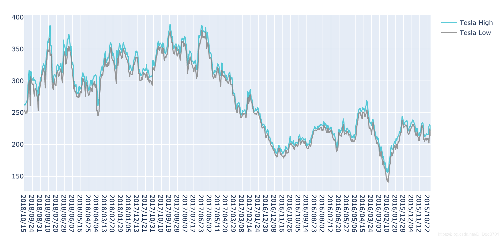
对布局做一些调整`Layout`：

```python
layout = dict(title = "Tesla stock High vs Low")
fig = dict(data = data,layout = layout)
iplot(fig)
```
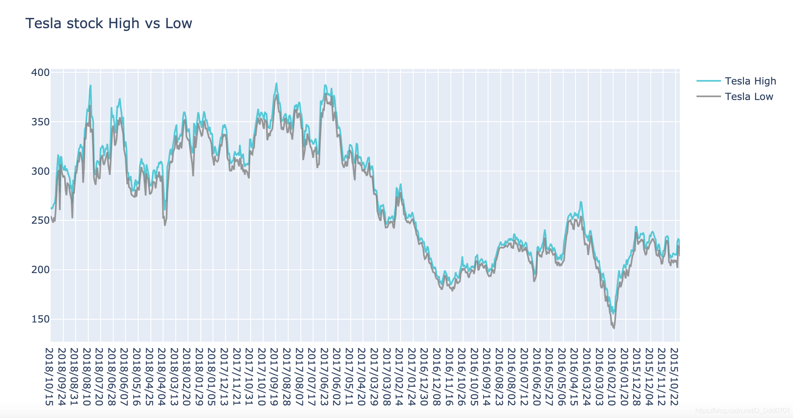
再加入一根收盘价线：
```python
trace_c = go.Scatter(
         x = df2.date,
         y = df2.close,
         name = "Tesla Close",
         line = dict(color = '#7f7f7f'),
         opacity =0.8
)
data =[trace_a,trace_b,trace_c]
```
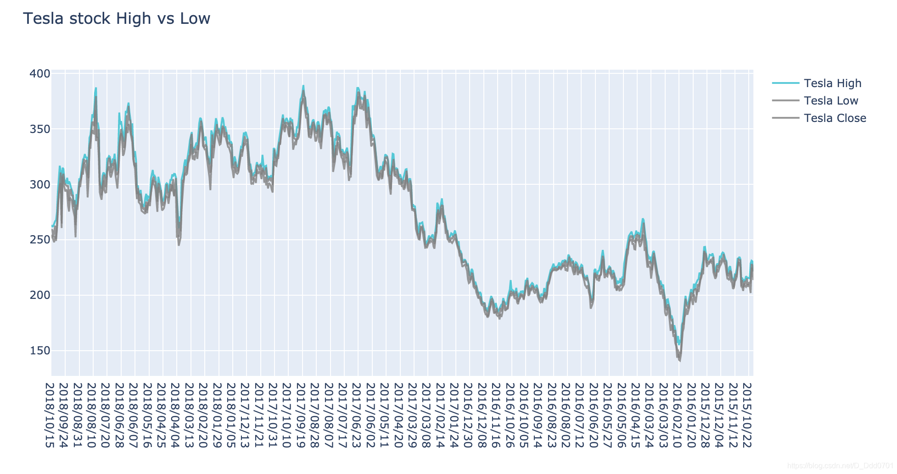
## 引入金融特性——范围选择器

```python
import plotly.express as px
fig = px.line(df2 , x='date',y='close') # 导入df2数据，x轴是date，y是close
fig.update_xaxes(rangeslider_visible=True) # 范围选择器
fig.show()
```
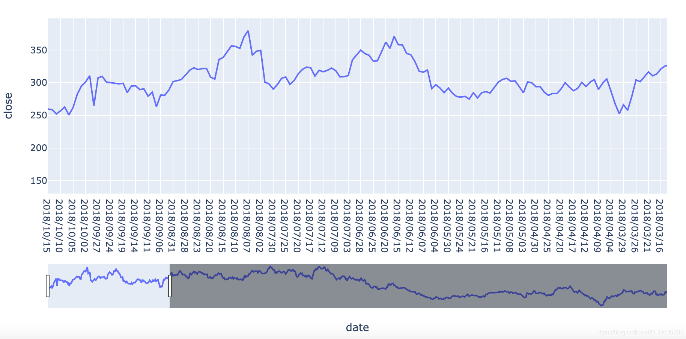
再看看苹果的：
```python
fig = px.line(df, x='Date', y='AAPL.High', title='Time Series with Rangeslider')
fig.update_xaxes(rangeslider_visible=True)
fig.show()
```
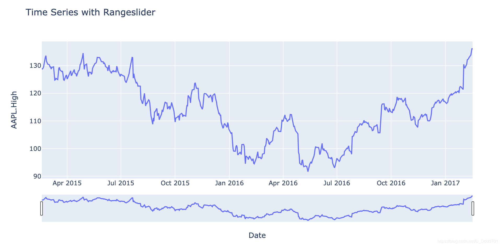
## 引入金融特性——日线，5日线等快捷键

```python
fig = px.line(df, x='Date', y='AAPL.High', title='Time Series with Rangeslider')

fig.update_xaxes(rangeslider_visible=True,
                 rangeselector = dict(
                 	buttons=list([
						dict(count=1,label="1d",step="day",stepmode="backward"),
                     	dict(count=5,label="5d",step="day",stepmode="backward"),
                     	dict(count=1,label="1m",step="month",stepmode="backward"),
                     	dict(count=3,label="3m",step="month",stepmode="backward"),
                     	dict(count=6,label="6m",step="month",stepmode="backward"),
                     	dict(count=1,label="1y",step="year",stepmode="backward"),
                     	dict(step="all")   #恢复到之前                  
                 ])
                 )                                               
                )
fig.show()
```
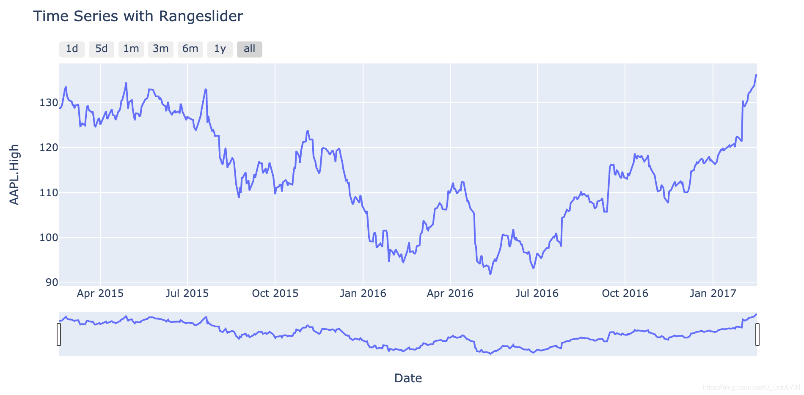
## 引入金融特性——蜡烛图
蜡烛图代码：

```python
go.Candlestick(
               x=日期,
               open=开盘价,
               high=最高价,
               low=最低价,
               close=收盘价
              )
```

```python
fig = go.Figure(data=[go.Candlestick(
                        x=df['Date'],
                        open=df['AAPL.Open'],
                        high=df['AAPL.High'],
                        low=df['AAPL.Low'],
                        close=df['AAPL.Close']
                        )
                     ]
                )
fig.update_xaxes(rangeslider_visible=True,
                 rangeselector = dict(
                     buttons=list([
                         dict(count=1,label="日",step="day",stepmode="backward"),
                         dict(count=5,label="五日",step="day",stepmode="backward"),
                         dict(count=1,label="月线",step="month",stepmode="backward"),
                         dict(count=3,label="季线",step="month",stepmode="backward"),
                         dict(count=6,label="半年线",step="month",stepmode="backward"),
                         dict(count=1,label="年线",step="year",stepmode="backward"),
                         dict(step="all")                    
                 ])
                 )               
                )
fig.show()
```
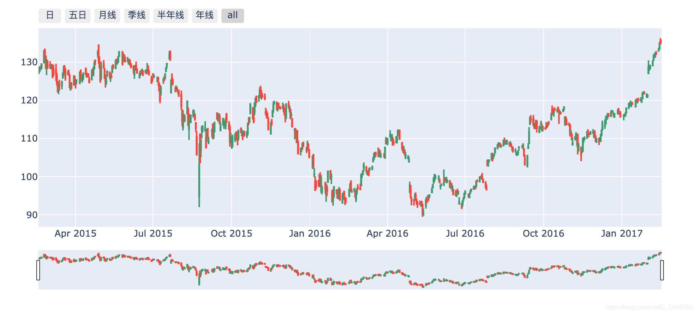
## 引入金融特性——指标

```python
import cufflinks as cf
cf.set_config_file(offline=True,world_readable=True) #设置offline=True和python关联
```
用cf自带模拟器生成k线数据：

```python
df= cf.datagen.ohlc()
df.head()
```
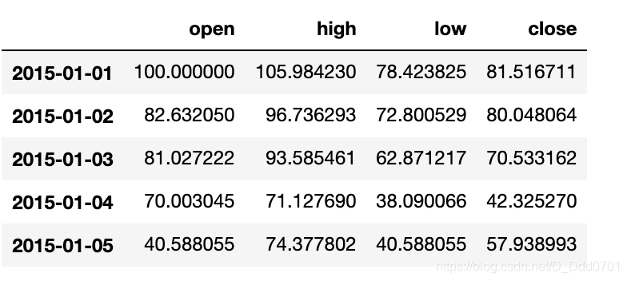
```python
qf=cf.QuantFig(df) # 把df内的数据变为金融数据
```
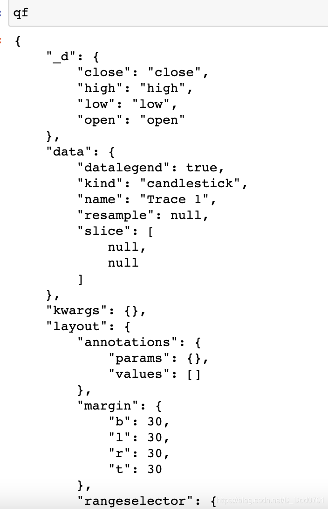
用`qf.iplot()`画K线图：
```python
qf.iplot()
```
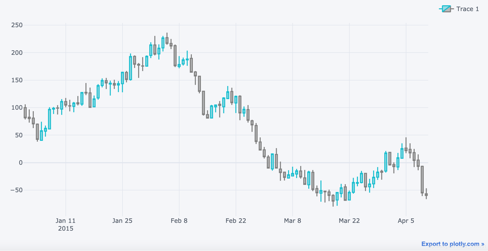
### 增加macd指标
增加macd指标：`qf.add_macd()`

```python
qf.add_macd()
qf.iplot()
```
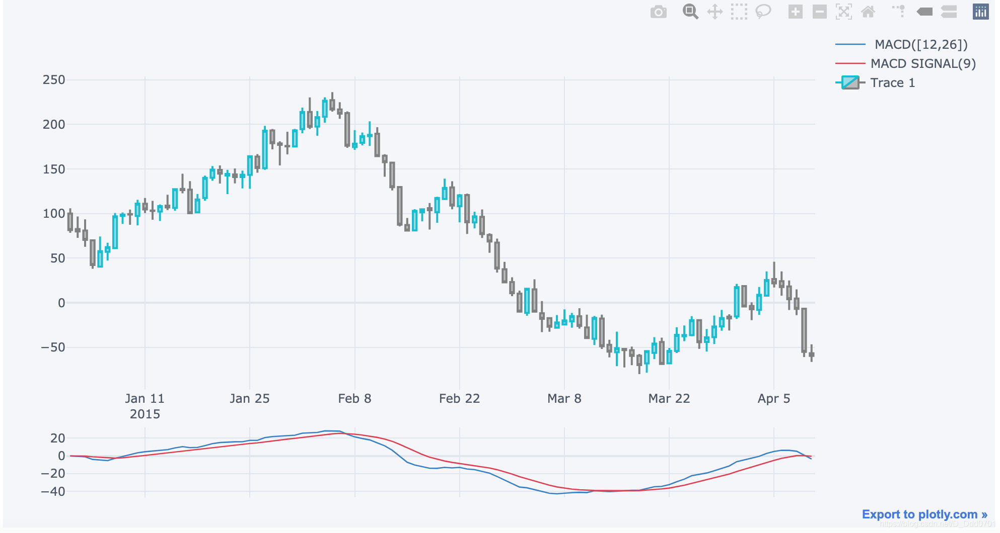
### 增加rsi指标
增加rsi指标：`qf.add_rsi()`
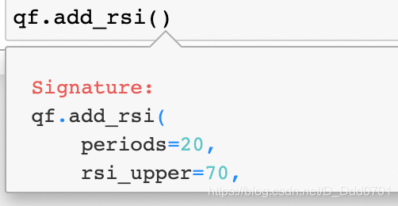
这里根据个人，输入数值：

```python
qf.add_rsi(6,80) #周期6天触发值80
qf.iplot()
```
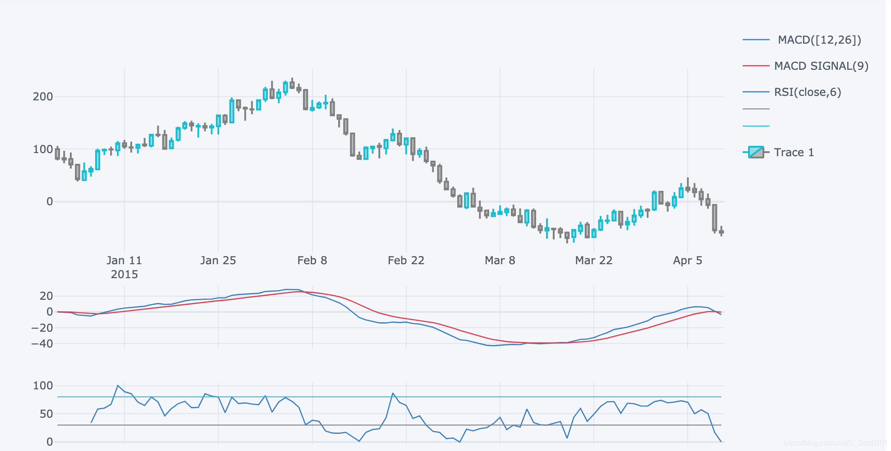
### 增加布林带通道
增加布林带通道：`qf.add_bollinger_bands()`

```python
qf.add_bollinger_bands()
qf.iplot()
```
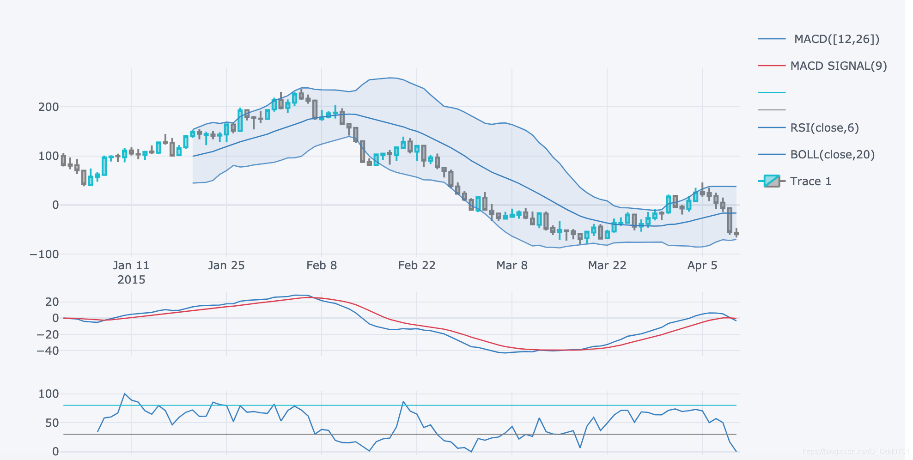
同样可以点击右上角关掉指标。