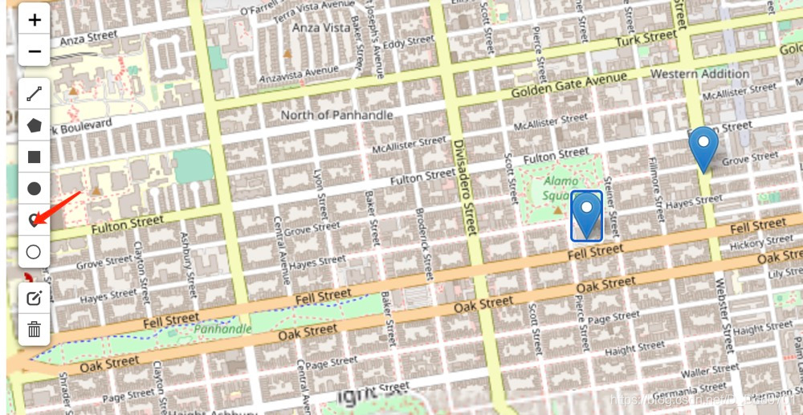
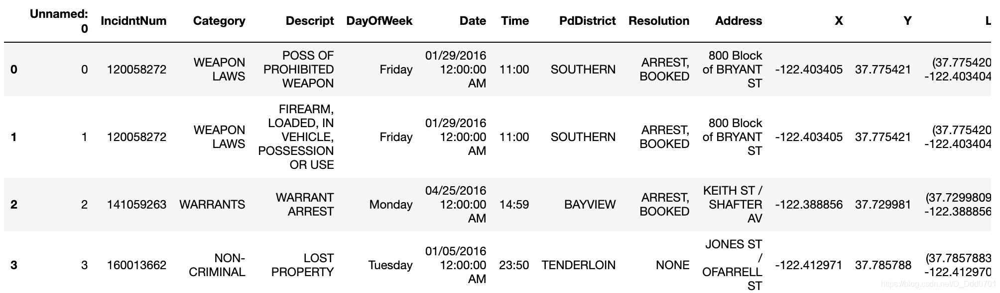
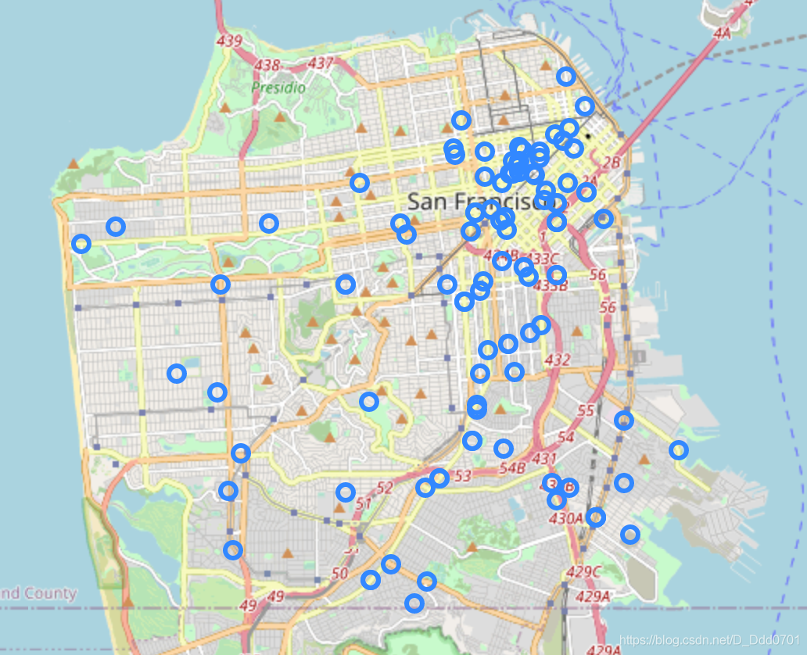
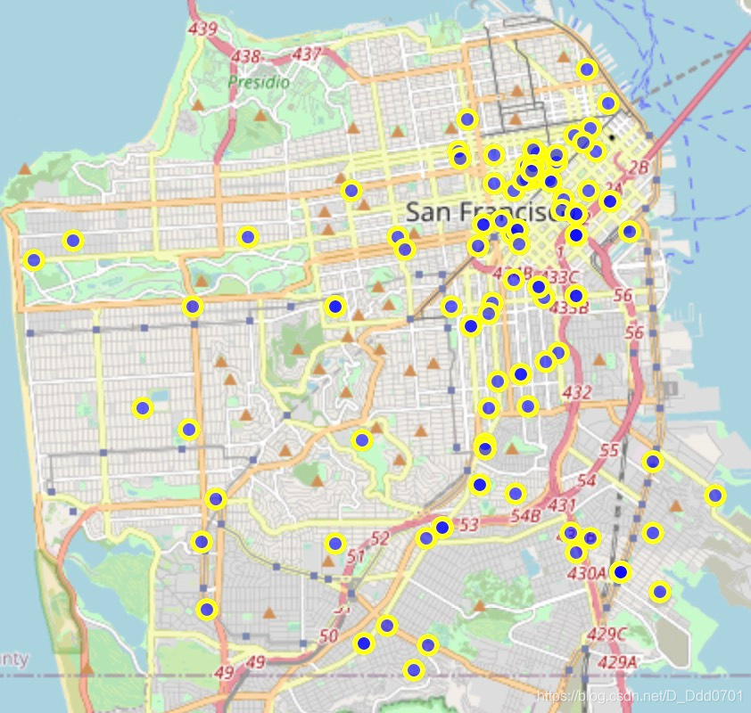
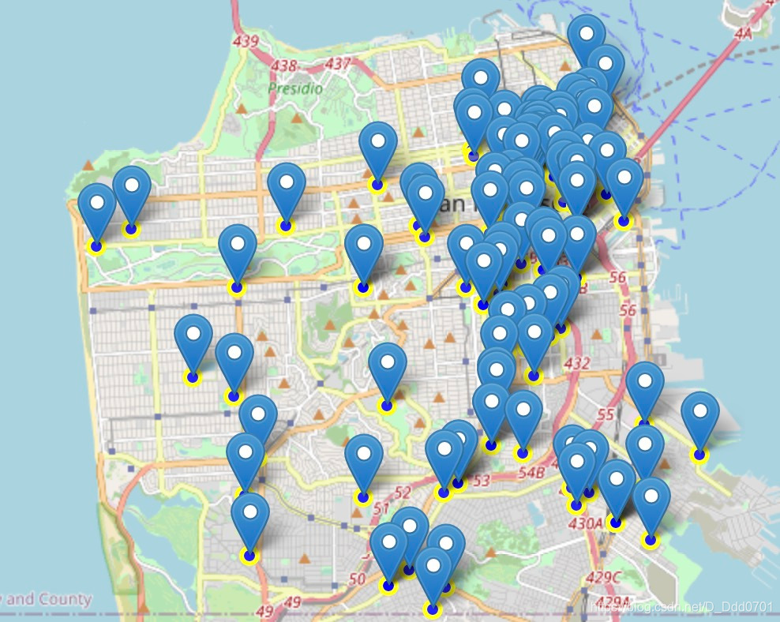
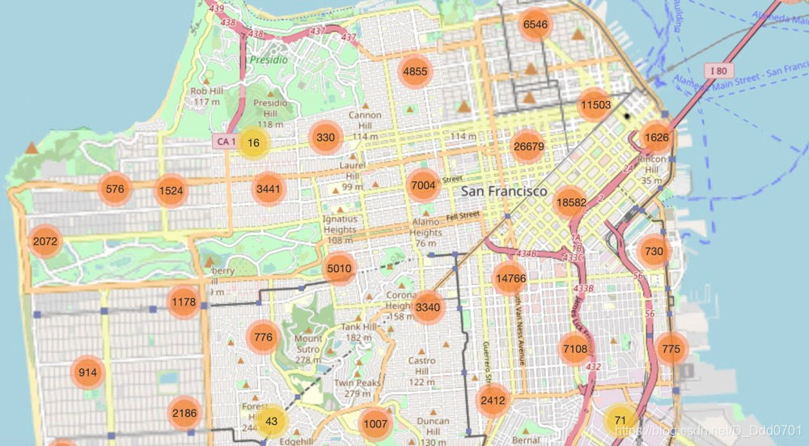

我们想绘制出类似坐标定位的图：



首先导入一个数据集：

```python
df = pd.read_csv('geo_pandas.txt')
```



我们取数据集前100行。

```python
limit=100
df = df.iloc[:limit,:]
```
我们可以用folium实现定位：

```python
lat = 37.77
long = -122.42
m2 = folium.Map(location=[lat,long],zoom_start=12)
```
如果想要绘制定位点的图：

```python
# 引入特征
incidents = folium.map.FeatureGroup()
# 组合经纬度
for lat, long in zip(df.Y, df.X):
    incidents.add_child(
        folium.CircleMarker(# 画小点点
            [lat,long],
            radius=5
        )
    )
m2.add_child(incidents)
```


还可以进一步美化：

```python
for lat, long in zip(df.Y, df.X):
    incidents.add_child(
        folium.CircleMarker(# 画小点点
            [lat,long],
            radius=5,
            fill = True, # 开启外圈填充
            fill_color = 'blue', # 外圈填充蓝色
            color = 'yellow', #内圈颜色黄色
            fill_opacity = 0.6 #透明度
        )
    
    )
m2.add_child(incidents)
```


我们还是希望可以像demo一样，有一个标签（箭头）。

```python
for lat, long in zip(df.Y, df.X):
    incidents.add_child(
        folium.CircleMarker(# 画小点点
            [lat,long],
            radius=5,
            fill = True, # 开启外圈填充
            fill_color = 'blue', # 外圈填充蓝色
            color = 'yellow', #内圈颜色黄色
            fill_opacity = 0.6 #透明度
        )
    
    )
lat1 = list(df.Y)
long1 = list(df.X)
label1 = list(df.Category)
for lat1, long1, label1 in zip(lat1, long1, label1):
    folium.Marker([lat1, long1],popup=label1).add_to(m2)
m2.add_child(incidents)
```


这里我们只显示了前面100行数据，如果全部显示一共有15万个数据，会密密麻麻非常难受，所以这里如果想要全部显示应该怎么办呢？我们可以采用一种聚类的方式。

```python
from folium.plugins import MarkerCluster
# 新建地图
m3 = folium.Map(location=[lat,long],zoom_start=12)
marker_cluster = MarkerCluster().add_to(m3)
lat1 = list(df.Y)
long1 = list(df.X)
label1 = list(df.Category)
for lat1, long1, label1 in zip(lat1, long1, label1):
    folium.Marker([lat1, long1],popup=label1).add_to(marker_cluster)
# 这里不add_to(m3)，而是add_to(聚类分组处理器)
```


随着滚轮放大缩小可以展示出具体和聚类的信息。