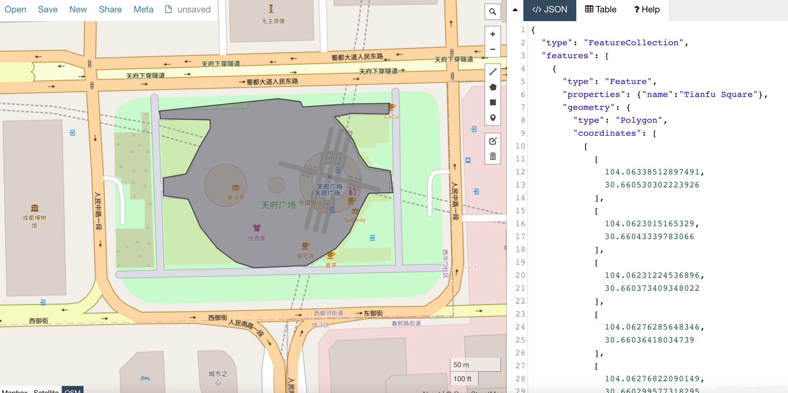

## 从geojson官网“圈地”
为了获取geojson数据，需要在geojson的官网去“圈地”。[geojson网址](http://geojson.io/)



找到自己想要的地方（以成都市中心天府广场举例），框定区域会在右侧形成geojson格式的数据，点击Sava储存为geojson格式就行。


## 利用folium库在jupyter notebook上“圈地”
首先需要安装`folium`这个第三方库，安装方式同其他三方库一致。
```python
from folium.plugins import Draw
import folium

m = folium.Map()
draw = Draw(export=True,filename="tianfu_square.geojson")
draw.add_to(m)
```


点击Export即可储存本地`geojson`格式文件。