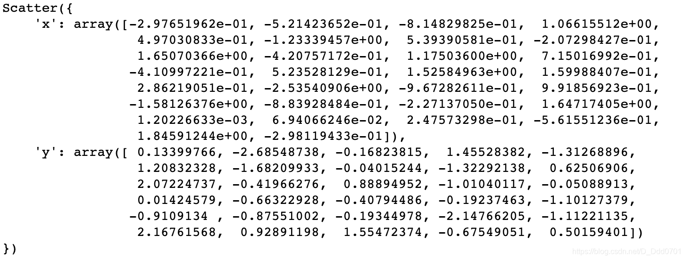
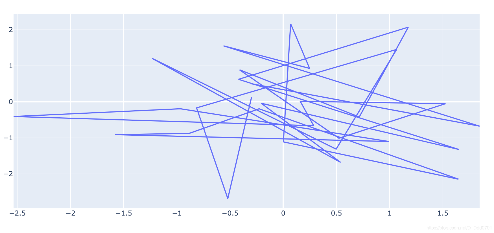
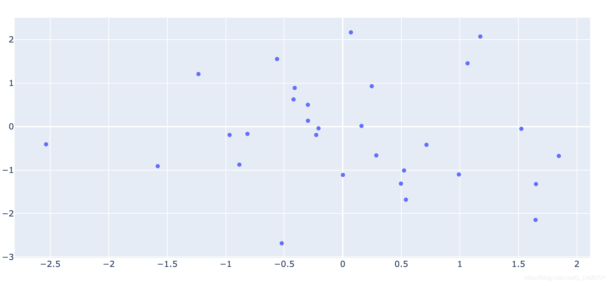

## 利用go.Scatter存放数据

```python
import plotly.graph_objects as go
import numpy as np
import random
x = np.random.randn(30)
y = np.random.randn(30)
go.Scatter(x=x,y=y)
```
当数据比较多，往往会先把数据存放在`go.Scatter`内，再集中调用。



## 调取go.Scatter数据绘制散点图

```python
iplot([go.Scatter(x=x,y=y)])
# iplot([数据])，注意这里数据是放在中括号内
```



这样的数据是非常乱的，实际上我们只需要绘制散点图，这里需要设置模式：`mode='markers'`

```python
iplot([go.Scatter(x=x,y=y,mode='markers')])
```

