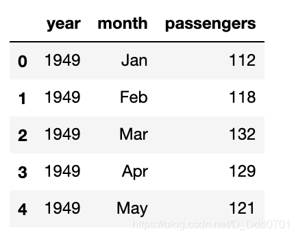
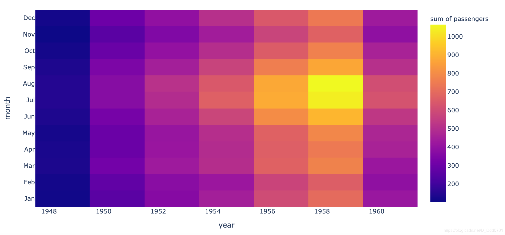
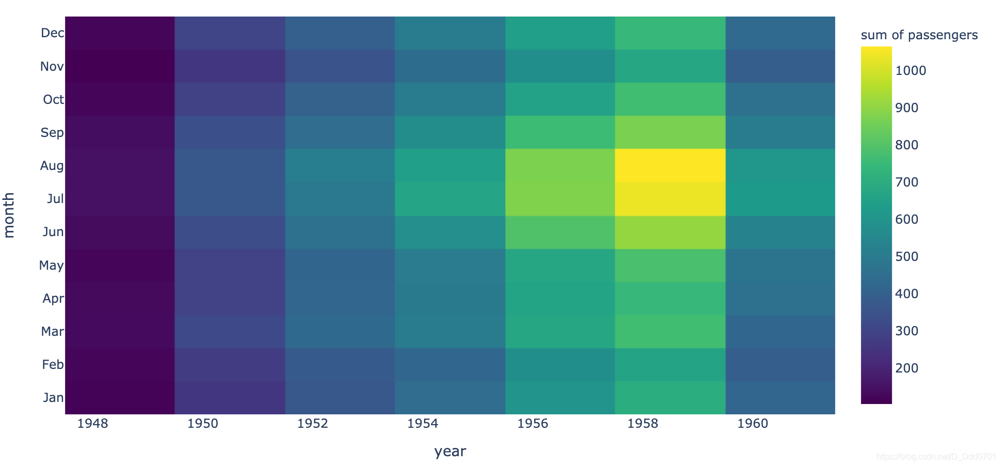
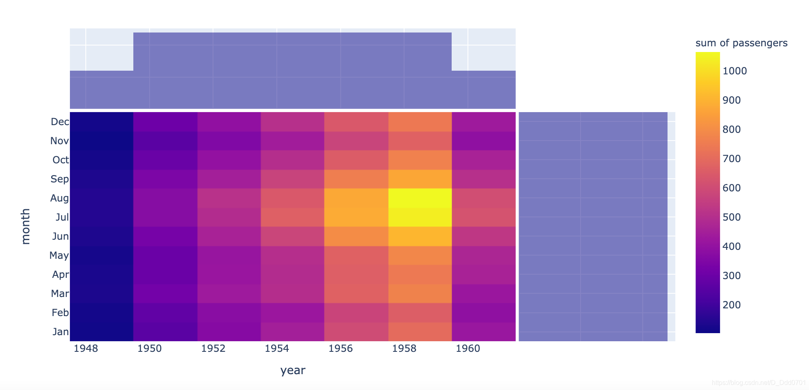
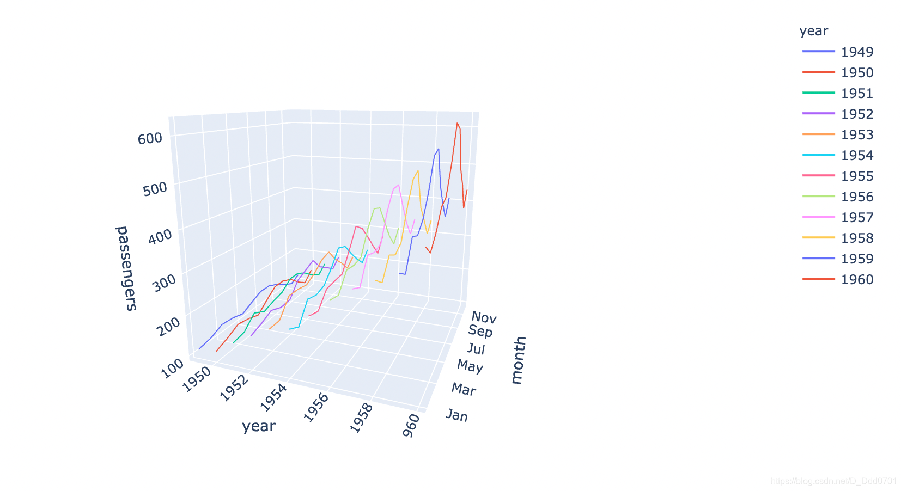
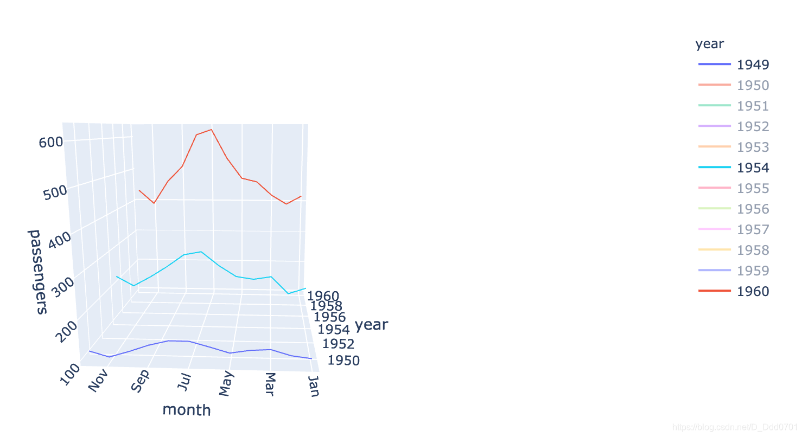

引入类库：
```python
import pandas as pd
import numpy as np
import chart_studio.plotly as py
import seaborn as sns
import plotly.express as px
%matplotlib inline #代表所有绘制的图表都内嵌在网页中
from plotly.offline import download_plotlyjs, init_notebook_mode, plot, iplot
init_notebook_mode(connected=True)
```
## 利用Pandas导入数据

```python
flights = sns.load_dataset("flights")
flights.head()
```
**这里使用的是`seaborn`自带数据库，可能会出现报错`IncompleteRead`，解决方法：**

**1、[csv文件下载地址](https://codechina.csdn.net/mirrors/mwaskom/seaborn-data/-/blob/master/flights.csv)，点击下载。**

**2、将下载后的fights.csv拷贝放入seaborn-data文件夹。**



查看数据类型：`flights.info()`


## 绘制热力图
热力图需要三个数据。
```python
fig = px.density_heatmap(flights, x ='year' , y ='month' , z= 'passengers')
```


换个颜色：`color_continuous_scale='配色器'`

可选：One of the following named colorscales:

            ['aggrnyl', 'agsunset', 'algae', 'amp', 'armyrose', 'balance',
             'blackbody', 'bluered', 'blues', 'blugrn', 'bluyl', 'brbg',
             'brwnyl', 'bugn', 'bupu', 'burg', 'burgyl', 'cividis', 'curl',
             'darkmint', 'deep', 'delta', 'dense', 'earth', 'edge', 'electric',
             'emrld', 'fall', 'geyser', 'gnbu', 'gray', 'greens', 'greys',
             'haline', 'hot', 'hsv', 'ice', 'icefire', 'inferno', 'jet',
             'magenta', 'magma', 'matter', 'mint', 'mrybm', 'mygbm', 'oranges',
             'orrd', 'oryel', 'oxy', 'peach', 'phase', 'picnic', 'pinkyl',
             'piyg', 'plasma', 'plotly3', 'portland', 'prgn', 'pubu', 'pubugn',
             'puor', 'purd', 'purp', 'purples', 'purpor', 'rainbow', 'rdbu',
             'rdgy', 'rdpu', 'rdylbu', 'rdylgn', 'redor', 'reds', 'solar',
             'spectral', 'speed', 'sunset', 'sunsetdark', 'teal', 'tealgrn',
             'tealrose', 'tempo', 'temps', 'thermal', 'tropic', 'turbid',
             'turbo', 'twilight', 'viridis', 'ylgn', 'ylgnbu', 'ylorbr',
             'ylorrd']

选择`viridis`试试。

```python
fig = px.density_heatmap(flights, x ='year' , y ='month' , z= 'passengers' , color_continuous_scale='viridis')
```


## 用histogram方式统计
对x和y轴包含数据总数进行统计计数，需要使用`marginal_x="histogram"   ,marginal_y="histogram"`

```python
fig = px.density_heatmap(flights, x ='year' , y ='month' , z= 'passengers' ,marginal_x="histogram"   ,marginal_y="histogram")
```


## 用3D折线图反应热力图

```python
fig = px.line_3d(flights , x ='year' , y ='month' , z= 'passengers' ,color='year') # color='year'表示每一年的数据用不同颜色
```



这和热力图反应的一致，随着年份增加，人数也在增加。7月数据一般最大的。



如果只看这么几年的数据，那么显示的变化规律会更加直观。