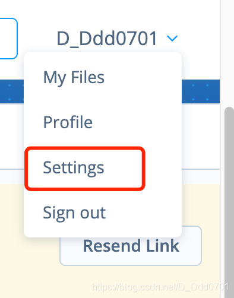
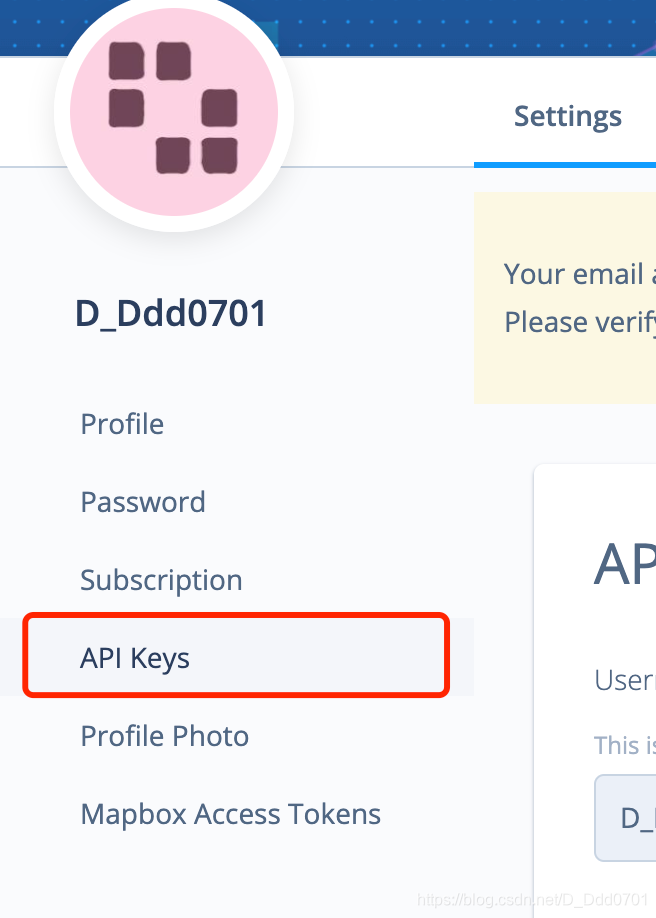
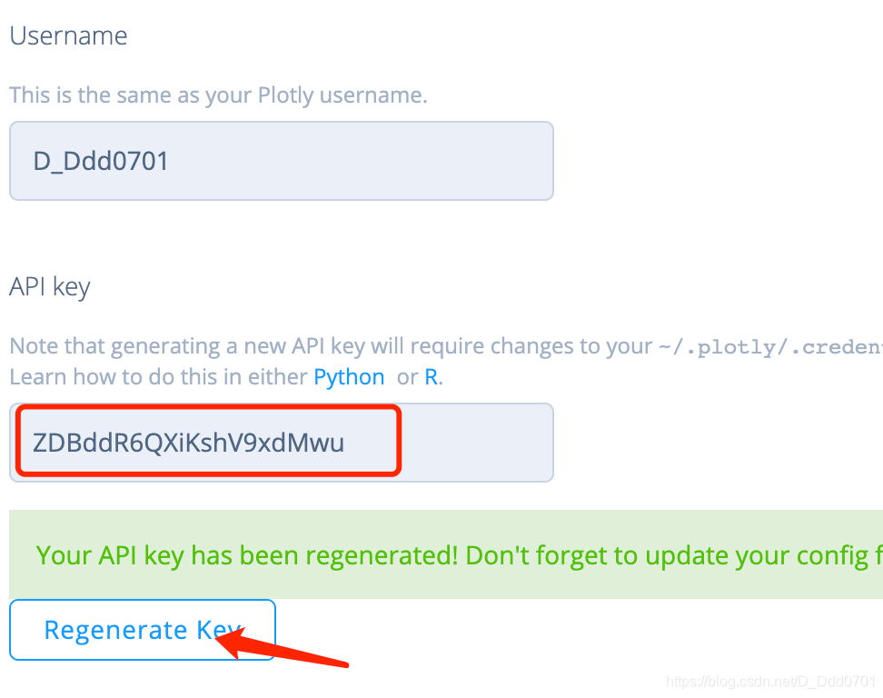
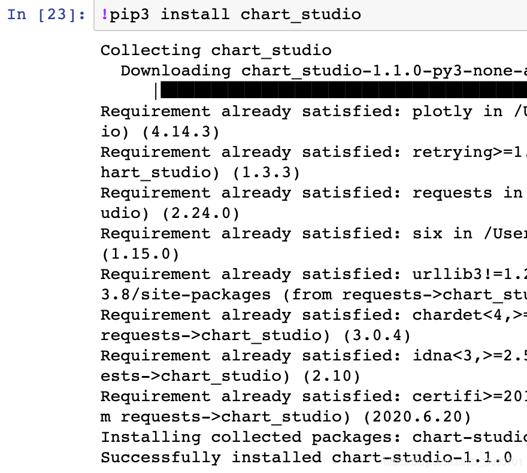
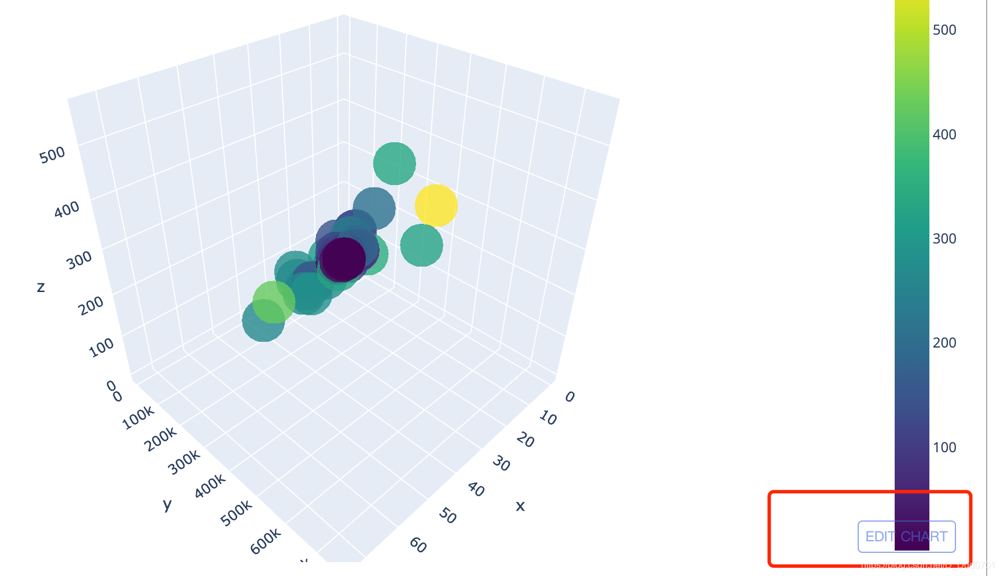
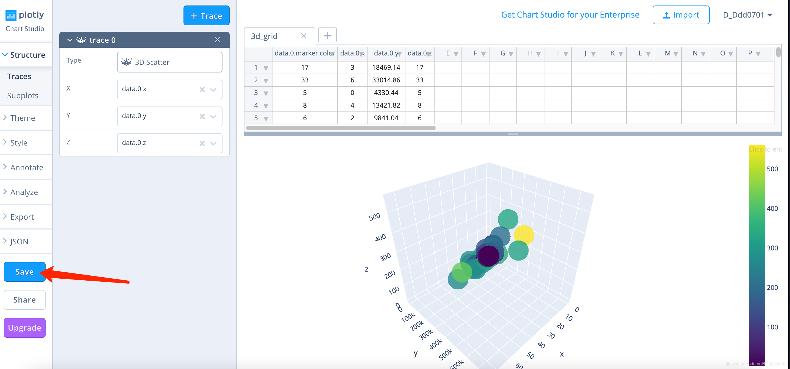
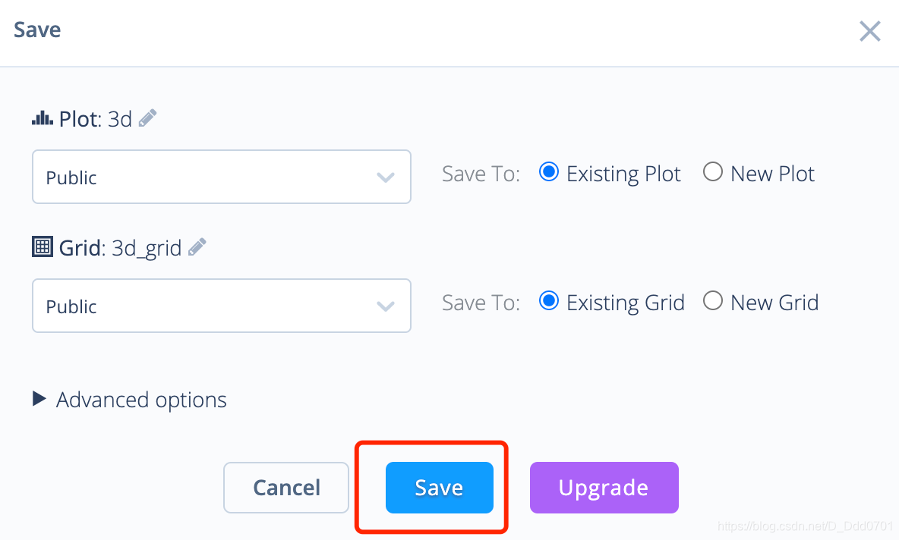
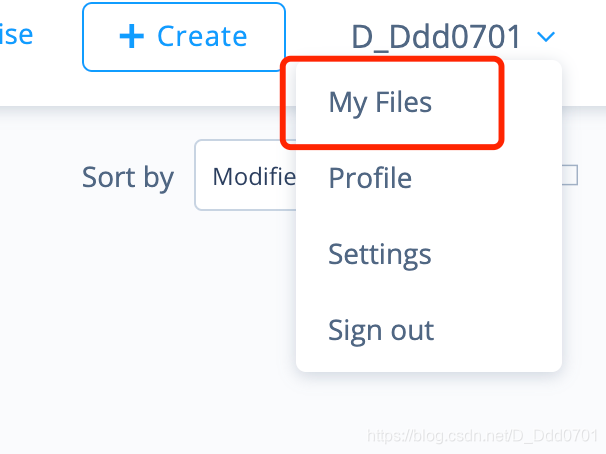
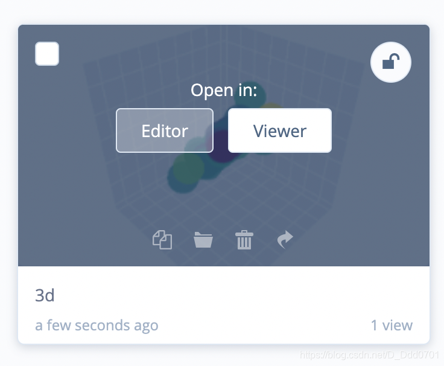

在网上互动可视化是plotly最强大的特点之一。

首先需要在plotly官网点击Sign Up注册账号：[plotly官网](https://chart-studio.plotly.com/feed/#/)

登陆完成之后点击Settings：



之后找到API接口：



生成临时密码：



安装`chart_studio`库：



开始上传图片：

```python
import chart_studio
import chart_studio.plotly as py
```

```python
chart_studio.tools.set_credentials_file(username='D_Ddd0701',api_key='ZDBddR6QXiKshV9xdMwu')
# 输入网站上注册的用户名和生成的API
init_notebook_mode(connected=True)
# 笔记本和线上做连接
# 把刚才的代码复制过来，加入py.iplot
fig = go.Figure(data=data , layout=layout)
py.iplot(fig,filename='3d')
```



点击右下角EDIT按钮，进入网页发现图片已经上传上去，点击Save储存。



确定内容后再次点击Save：



此时图片已经被上传到个人File内：



点击Viewer可以浏览，也可以点击Editor编辑。



同样，也可以去参观别人做的图学习一下别人怎么做的。
