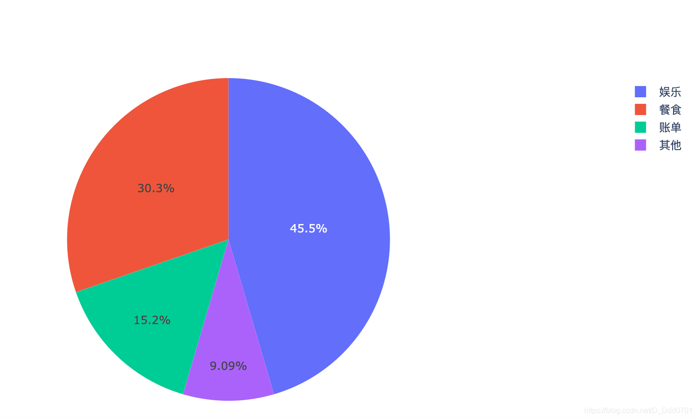
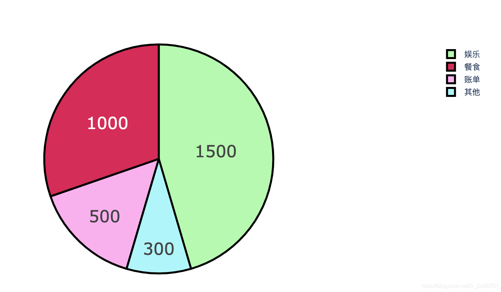
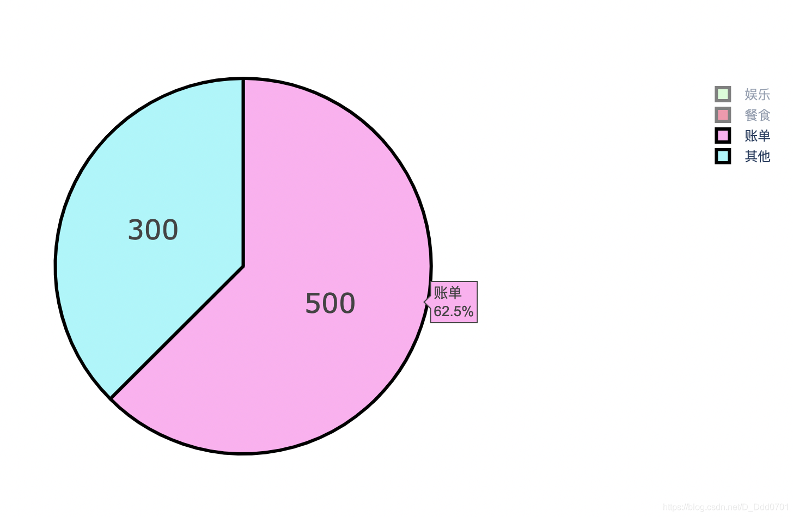

```python
groups=['餐食','账单','娱乐','其他']
amount=[1000,500,1500,300]
colors=['#d32c58','#f9b1ee','#b7f9b1','#b1f5f9']
trace=go.Pie(labels=groups, values=amount)
data=[trace]
iplot(data)
```


丰富一下细节：

```python
trace=go.Pie(labels=groups, values=amount, hoverinfo='label+percent', textinfo='value',
             textfont=dict(size=25), marker=dict(colors=colors,line=dict(color='#000000',width=3)))
# hoverinfo='label+percent':显示标签+百分比
# textinfo='value':饼图上文字显示value值
# textfont=dict(size=25):文字大小25号
# marker=dict(colors=colors,line=dict(color='#000000',width=3)):颜色用colors内的颜色，线条用黑色，宽度3。
data=[trace]
iplot(data)
```


也可以只显示需要的部分，并且百分比会重新计算：

