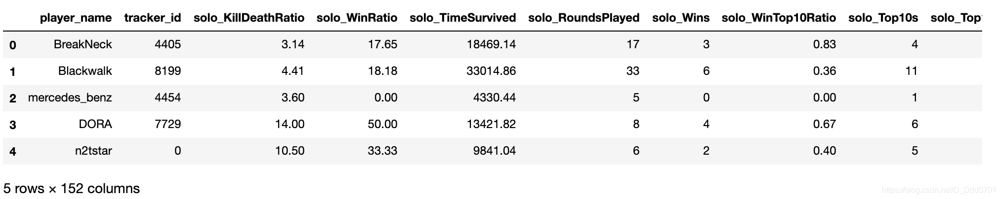
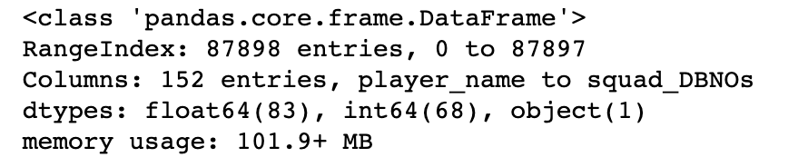
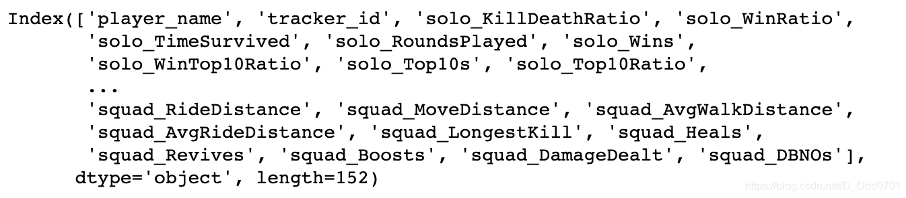
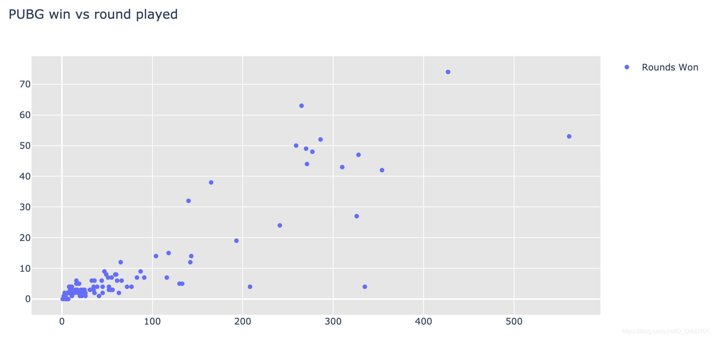
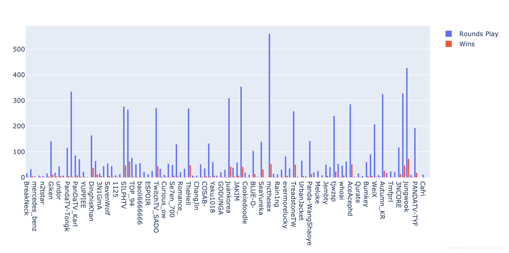

## 数据来源
网站：[kaggle](https://www.kaggle.com/leonardokarl/pubg-statisctic)
## 利用Pandas联动Plotly
### 数据读取
```python
from plotly.offline import download_plotlyjs , init_notebook_mode,plot ,iplot
import plotly.graph_objs as go
import pandas as pd
```
```python
pubg = pd.read_csv("PUBG.csv")
pubg.head()
```


**做可视化要求数据是数值类型，用`info`语句查看：**

```python
pubg.info()
```


查看字段：

```python
pubg.columns
```


### 处理数据结构

```python
df_pubg = pubg.apply(pd.to_numeric,errors = 'ignore')
# 所有的数据转化成数值类型，错误忽略
df_new_pubg = df_pubg.head(100)
```
### 绘制散点图
```python
trace = go.Scatter(x = df_new_pubg.solo_RoundsPlayed ,y = df_new_pubg.solo_Wins , name = 'Rounds Won' ,mode='markers')
```

```python
layout = go.Layout(title =" PUBG win vs round played " ,plot_bgcolor='rgb(230,230,230)' ,showlegend=True)
# 对输出内容进行设置
# plot_bgcolor:背景颜色
# showlegend=True:显示图示
```
```python
fig = go.Figure(data=[trace] , layout=layout)
# 把trace和layout组合在一张画布上
iplot(fig)
```


### 两组数据绘制柱状图

```python
trace1 = go.Bar(x=df_new_pubg.player_name, y=df_new_pubg.solo_RoundsPlayed, name='Rounds Play')
trace2 = go.Bar(x=df_new_pubg.player_name, y=df_new_pubg.solo_Wins, name='Wins')
layout = go.Layout(barmode='group')
fig = go.Figure(data=[trace1,trace2] , layout=layout)
iplot(fig)
```
