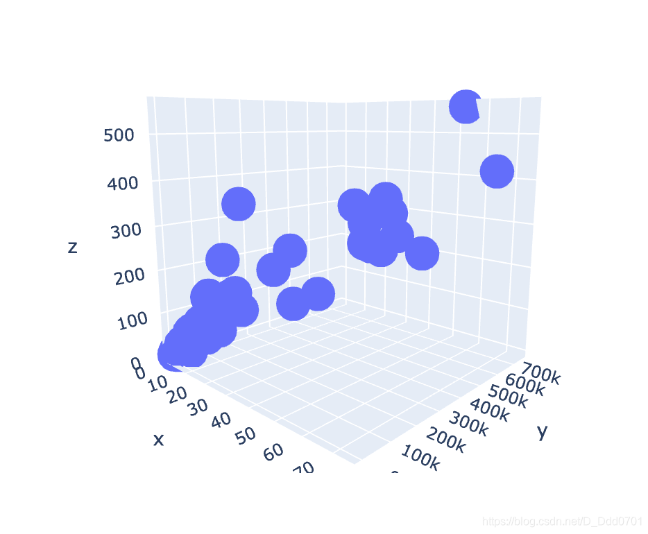
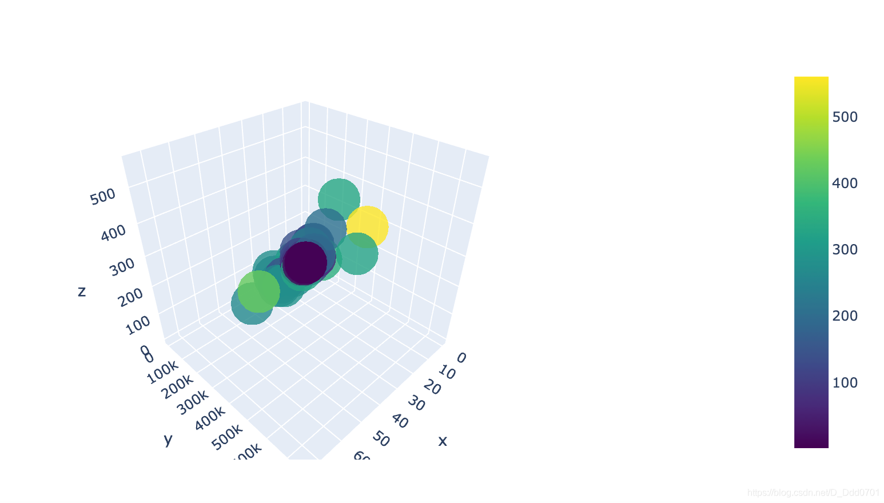
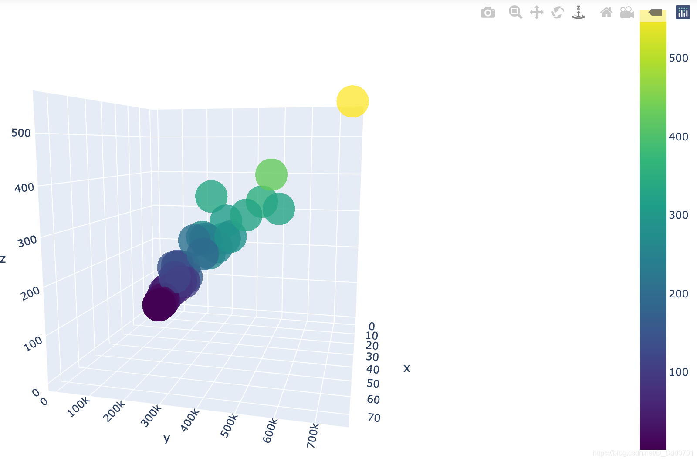
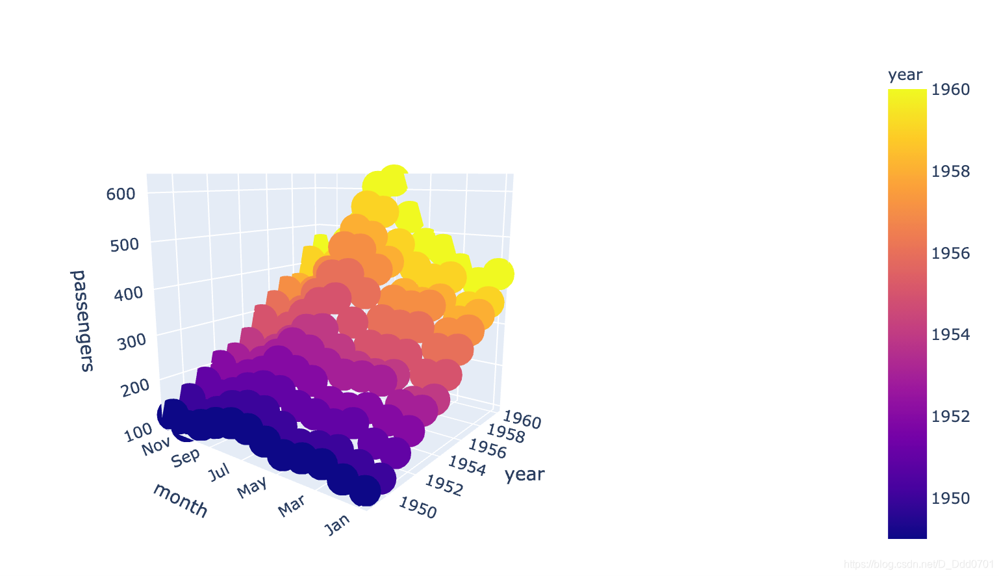

## 标准绘制过程
3d图就需要三个数据：

```python
x = df_new_pubg.solo_Wins
y = df_new_pubg.solo_TimeSurvived
z = df_new_pubg.solo_RoundsPlayed
```
利用`go`语句给`trace`赋值：

```python
trace1 = go.Scatter3d(
    x=x,
    y=y,
    z=z,
    mode='markers'
)
```

```python
data=[trace1]
fig=go.Figure(data=data)
iplot(fig)
```


对marker参数进行优化：

```python
trace1 = go.Scatter3d(
    x=x,
    y=y,
    z=z,
    mode='markers',
    marker=dict(
        size=12,
        color=z,
        colorscale='Viridis',
        # 采用Viridis调色板
        opacity=0.8, 
        showscale =True
        # 增加图示
    )
)
```


颜色越浅表面玩的次数越多。

再增加一个布局文件：

```python
layout = go.Layout(margin=dict(
    l=0,
    r=0,
    t=0,
    b=0
))
```

```python
fig = go.Figure(data=data , layout=layout)
iplot(fig,filename='3d')
```


## 用热力图航班数据绘制
```python
fig = px.scatter_3d(flights , x ='year' , y ='month' , z= 'passengers' ,color='year')
```


这个和折线图表现的结果类似。