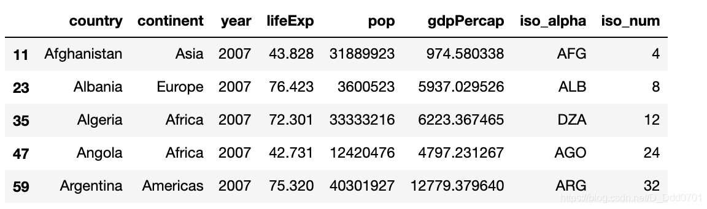
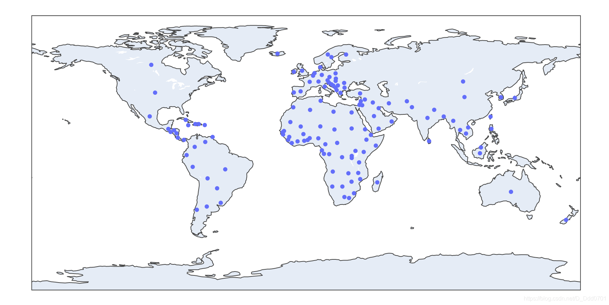
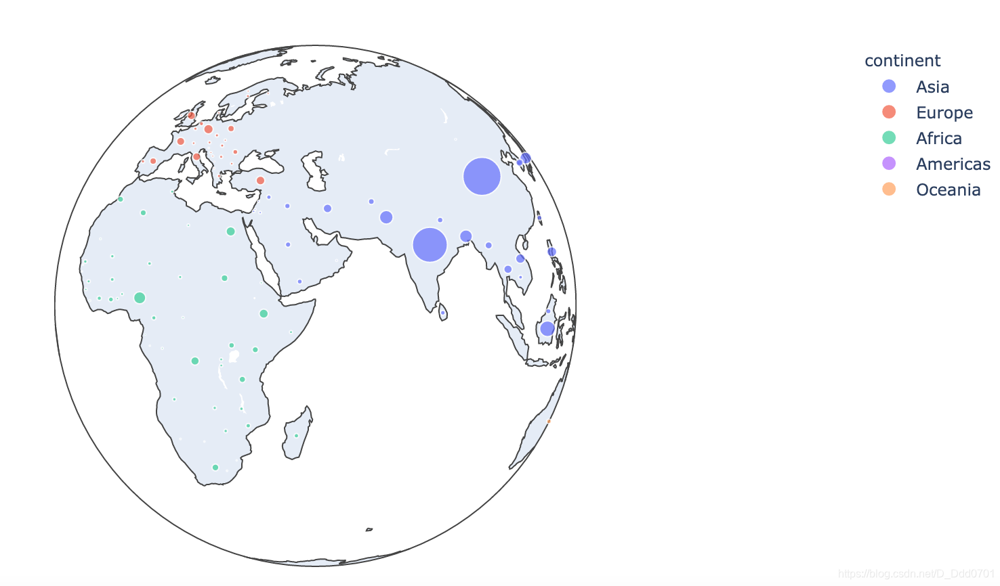

## 利用px自带数据库
使用自带数据库2007年gdp数据：

```python
df = px.data.gapminder().query("year == 2007")
df.head()
```


## 绘制地理信息图

```python
fig = px.scatter_geo(df,locations="iso_alpha")
# locations='iso_alpha'表示自动适配地理信息
```


为了让显示更加具有辨识度，增加其他参数：

```python
# color="continent"表示按洲不同颜色不同
# hover_name="lifeExp"表示显示数据集中lifeExp数值
# size='pop'表示用数据集中pop数据区别大小
# projection='orthographic'表示用地球投影模式
fig = px.scatter_geo(df,locations="iso_alpha",color="continent",hover_name="lifeExp",size='pop',projection='orthographic')
```


可以用的投影模式有：

            ['equirectangular', 'mercator', 'orthographic', 'natural
            earth', 'kavrayskiy7', 'miller', 'robinson', 'eckert4',
            'azimuthal equal area', 'azimuthal equidistant', 'conic
            equal area', 'conic conformal', 'conic equidistant',
            'gnomonic', 'stereographic', 'mollweide', 'hammer',
            'transverse mercator', 'albers usa', 'winkel tripel',
            'aitoff', 'sinusoidal']