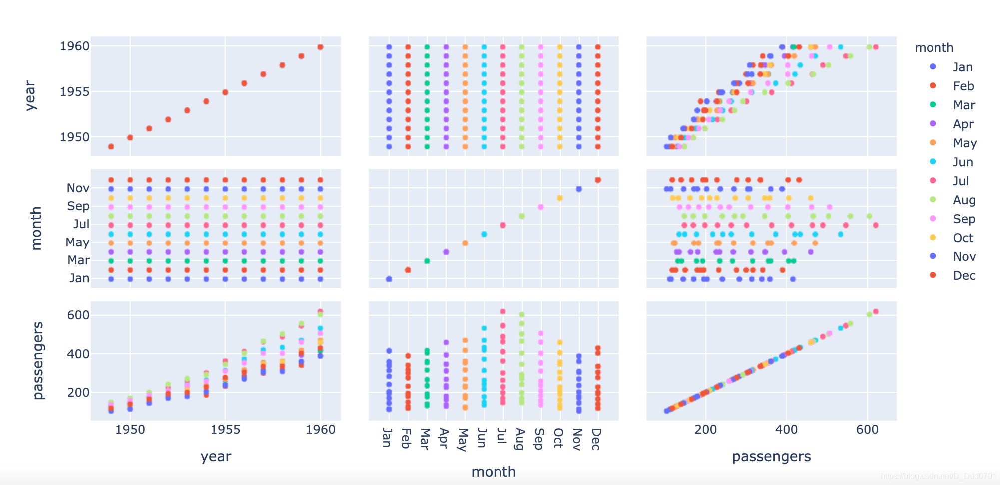
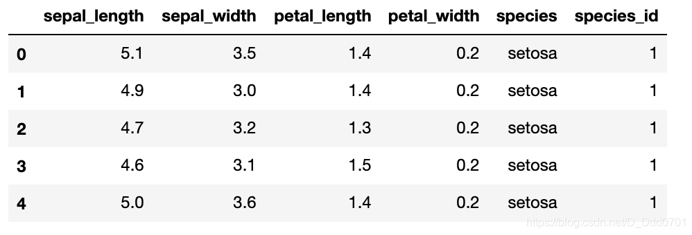
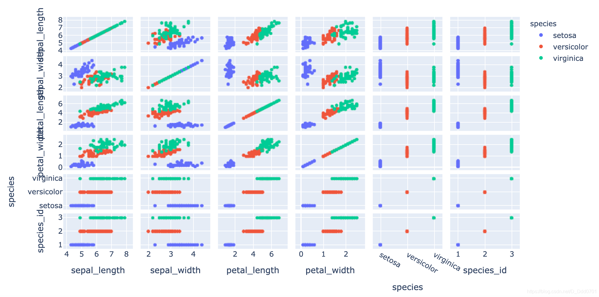
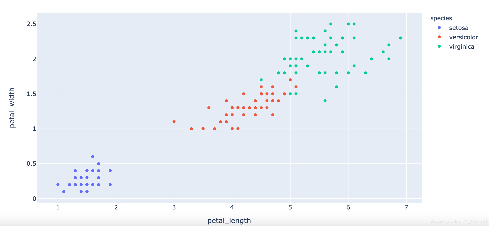
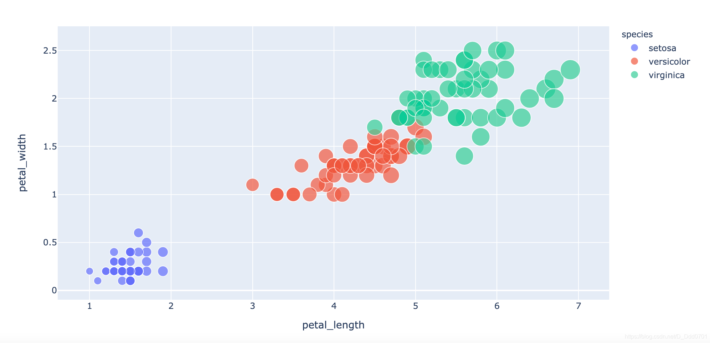
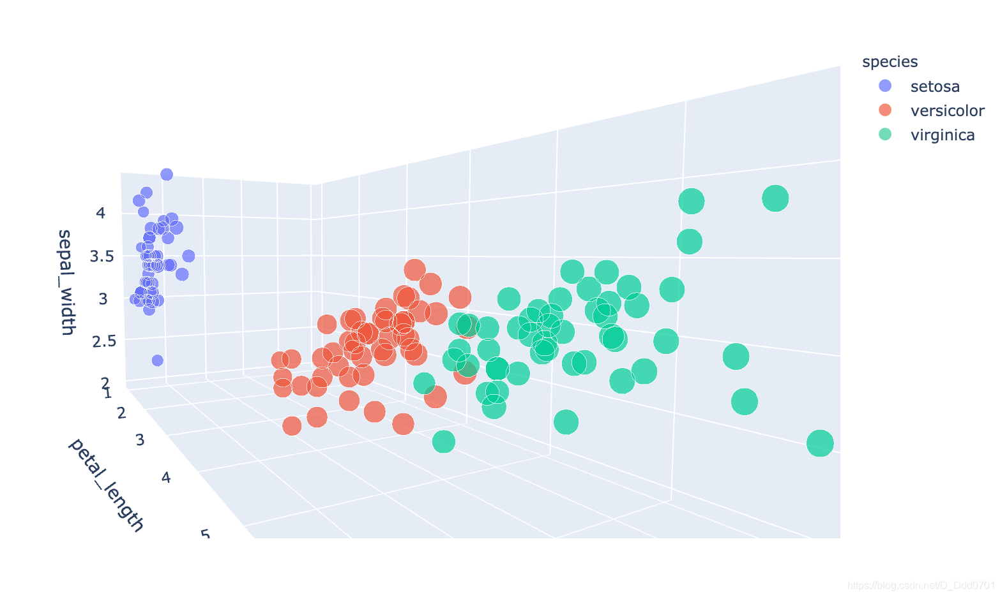

有些时候，我们希望用2D的图把3D图的信息展示出来，刚才案例的数据3D图涉及到x,y,z三组变量，如果用2D展示，则需要把xy，xz，yz的关系用三张图绘制出来。这里需要使用到`scatter_matrix`功能。

```python
fig = px.scatter_matrix(flights,color="month")
```


接下来我们用机器学习的经典数据Iris花卉数据集再做一次可视化分析。

Iris数据包括了三种鸢尾花的4个不同维度的属性值。我们希望通过数据集把三种种类的花分开。

```python
df = px.data.iris()
df.head()
```


用刚才的散点矩阵来分析一下：

```python
fig = px.scatter_matrix(df,color="species")
```


可以看到，使用petal_length和petal_width绘制分的是比较开的。

所以用这两个元素单独绘制一下散点图：

```python
fig  = px.scatter(df , x ='petal_length' , y='petal_width' , color='species' )
```


发现，这张图给的信息还不够多，所以我们再增加一个区分：`size='petal_length'`

```python
fig  = px.scatter(df , x ='petal_length' , y='petal_width' , color='species', size='petal_length')
```


**会发现setosa比较小，virginica比较大，这张图可以把蓝色分出来，红色和绿色中间有重叠，分开比较复杂。所以可以试一试3D。**

```python
fig  = px.scatter_3d(df , x ='petal_length' , y='petal_width' ,z='sepal_width' , color='species' ,size='petal_length')
```


3D图发现在空间上会存在某个切面可以把三者分开。