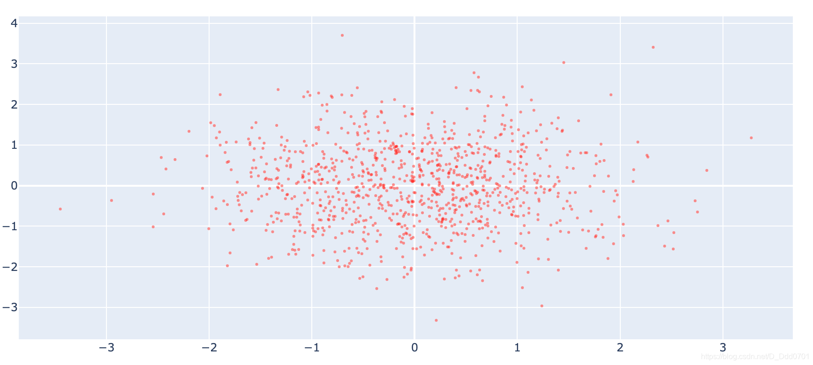

## go对象标准写法

```python
import plotly
import plotly.graph_objs as go
import numpy as np
from plotly.offline import download_plotlyjs , init_notebook_mode,plot ,iplot
```

```python
n =1000
x = np.random.randn(n)
y = np.random.randn(n)
```

```python
trace = go.Scatter(x=x, y=y, mode='markers', marker=dict(color='red',size=3,opacity=0.5))
data=[trace]
iplot(data)
```
go.Scatter语句的标准写法：

第一步、产生数据。

第二步、把数据放入go对象。将`go.Scatter()`赋值在一个变量内`例子用trace`，并且在go.Scatter内用`marker=dict()`调整细节，其中`color`表示颜色，`size`表示散点大小，`opacity`表示透明度。

第三步、创建一个`data`变量存放go对象。

第四步、（可选） `data`变量是一个数组列表，所以可以存放超过一个以上的go对象。

第五步、`iplot(data)`绘制。
