## 使用普通散点图
首先导入各种类库
```python
import pandas as pd
import numpy as np
import chart_studio.plotly as py
import cufflinks as cf
import seaborn as sns
import plotly.express as px
%matplotlib inline
from plotly.offline import download_plotlyjs, init_notebook_mode, plot, iplot
init_notebook_mode(connected=True)
```
导入px自带数据集：

```python
df_cnt = px.data.gapminder()
df_cnt.head()
```
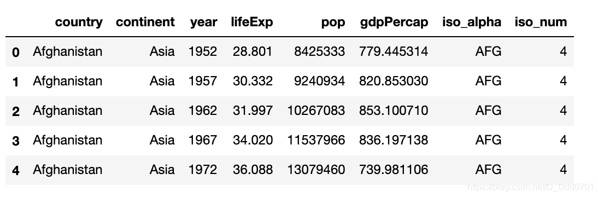
绘制散点图看一看gdpPercap和lifeExp的相关性：

```python
px.scatter(df_cnt,x='gdpPercap' , y = "lifeExp" )
```
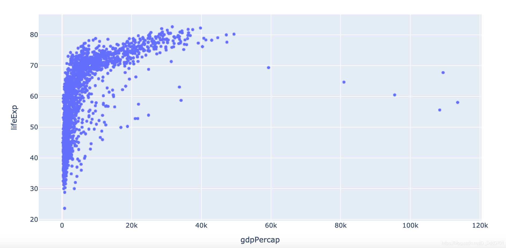
这里会发现数据叠在一起，不能分清楚各个国家之前情况如何，所以用颜色区分开：

```python
px.scatter(df_cnt,x='gdpPercap' , y = "lifeExp" ,color='continent')
```
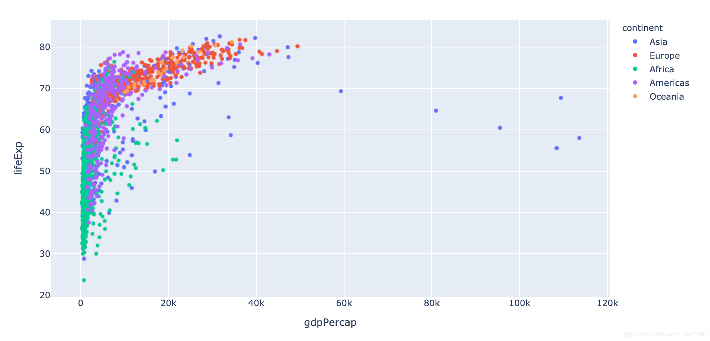
这里会发现还是不容易区分，所以可以使用之前用过的一个办法——用科学计数法。

```python
px.scatter(df_cnt,x='gdpPercap' , y = "lifeExp" ,color='continent' ,log_x =True)
```
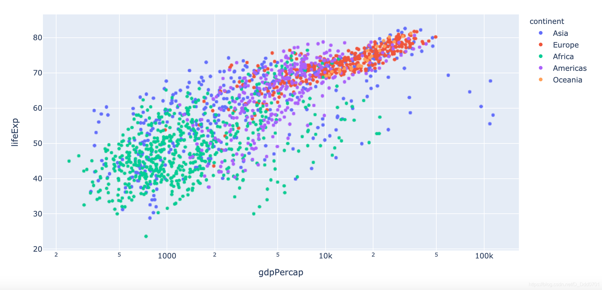
我们还想点到这个点上可以看到具体国家信息：

```python
px.scatter(df_cnt,x='gdpPercap' , y = "lifeExp" ,color='continent' ,log_x =True , hover_name="country")
```
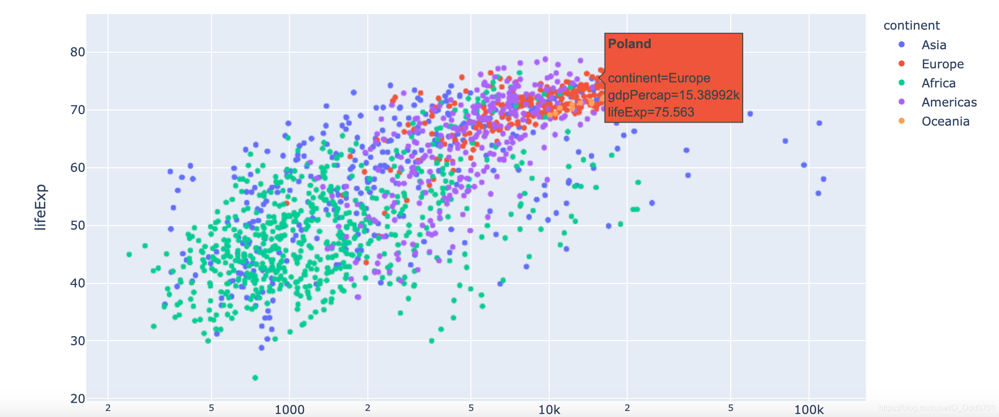
其实这张图依然比较杂乱，因为有几十年的数据，如果可以分开展示就会很好，这里就需要使用动态数据图。
## 使用动态散点图

```python
px.scatter(df_cnt,x='gdpPercap' , y = "lifeExp" ,color='continent' ,log_x =True , hover_name="country",
          animation_frame="year")
#animation_frame="year"表示按年播放
```
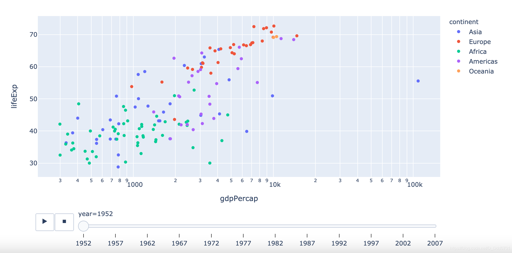
拖动下方滑块或者点击播放键可以播放每一年的数据情况。**但是会发现随着时间增加，点会溢出表格，这是因为没有设置动态y轴。**

一次性把动态x轴和动态y轴都加上：

```python
px.scatter(df_cnt,x='gdpPercap' , y = "lifeExp" ,color='continent' ,
           log_x =True , hover_name="country",animation_frame="year",range_x=[100,100000],
           range_y=[25,90])
```
这里还会存在一个问题，gdp实际的大小并不清晰，比如紫色和其他颜色到底gdp情况如何呢？所以可以调整`size`参数，用人口数量来区分。

```python
px.scatter(df_cnt,x='gdpPercap' , y = "lifeExp" ,color='continent' ,
           log_x =True , hover_name="country",animation_frame="year",range_x=[100,100000],
           range_y=[25,90],size='pop',size_max=60)
```
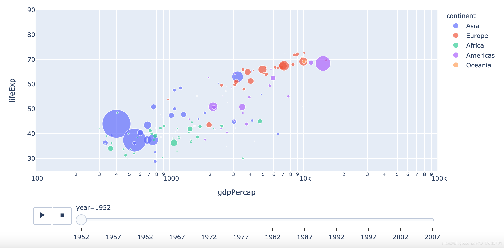
## 使用普通柱状图

```python
px.bar(df_cnt,x='continent' , y='pop')
```
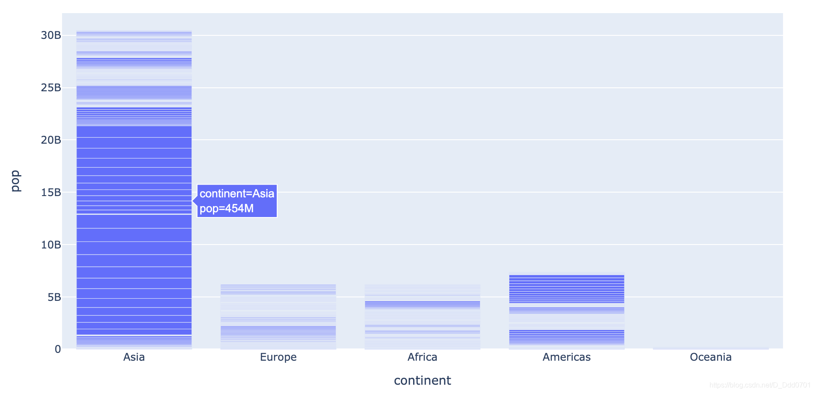
发现这里指上去不能看到这个柱子代表什么国家。所以增加`hover_name="country"`

```python
px.bar(df_cnt,x='continent' , y='pop',hover_name="country")
```
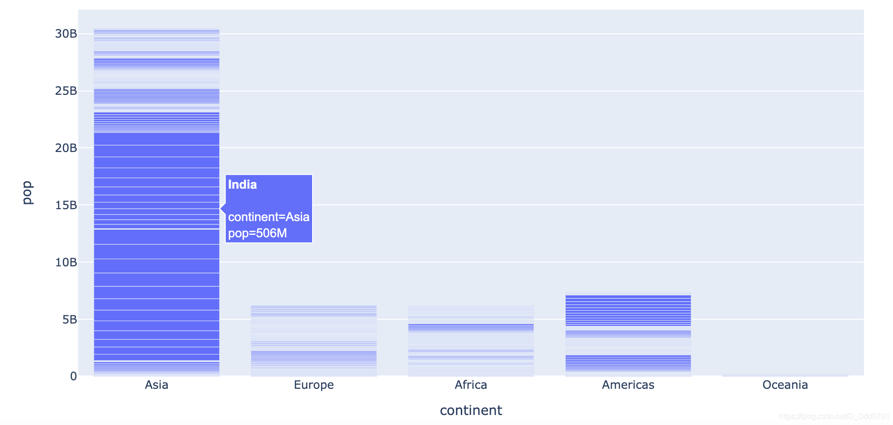
## 使用动态柱状图

```python
px.bar(df_cnt,x='continent' , y='pop' , hover_name='country' ,color='continent' ,
       animation_frame='year')
```
这里也会涉及到y轴显示问题，所以设计一下y轴范围：

```python
px.bar(df_cnt,x='continent' , y='pop' , hover_name='country' ,color='continent' ,
       animation_frame='year',range_y=[0,4000000000],animation_group='country')
# 这里的animation_group='country'类似MySQL中的groupby，表示按国家分组
```
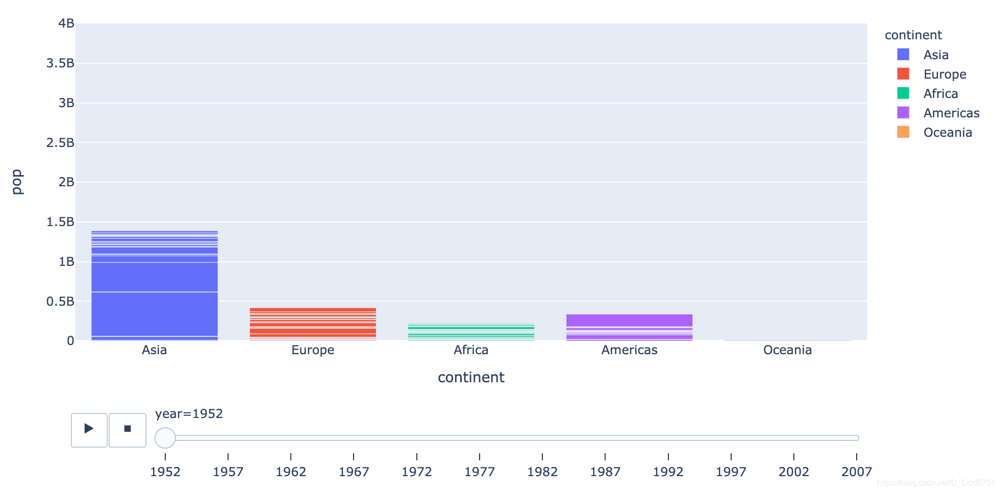
## 动态密度图

```python
fig = px.density_contour(df_cnt, x="gdpPercap", y="lifeExp", color="continent", marginal_y="histogram",
                        animation_frame='year', animation_group='country', range_y=[25,100])
```
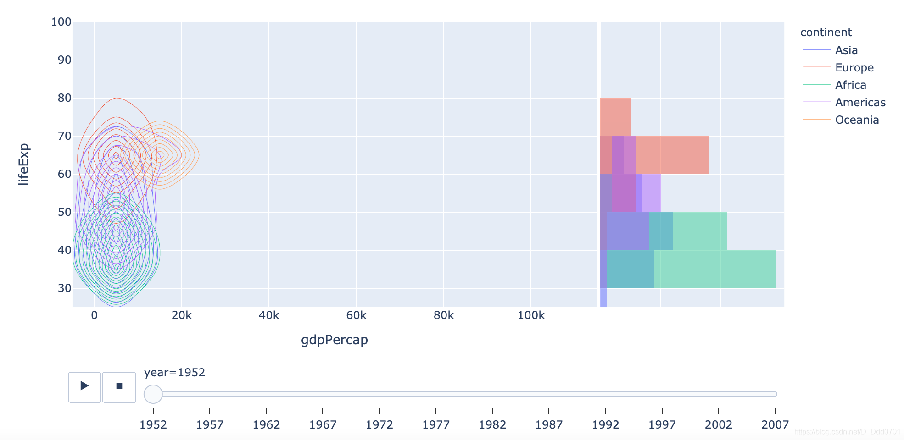
## 动态热力图

```python
fig = px.density_heatmap(df_cnt, x="gdpPercap", y="lifeExp", marginal_y="histogram",
                        animation_frame='year', animation_group='country', range_y=[25,100])
```
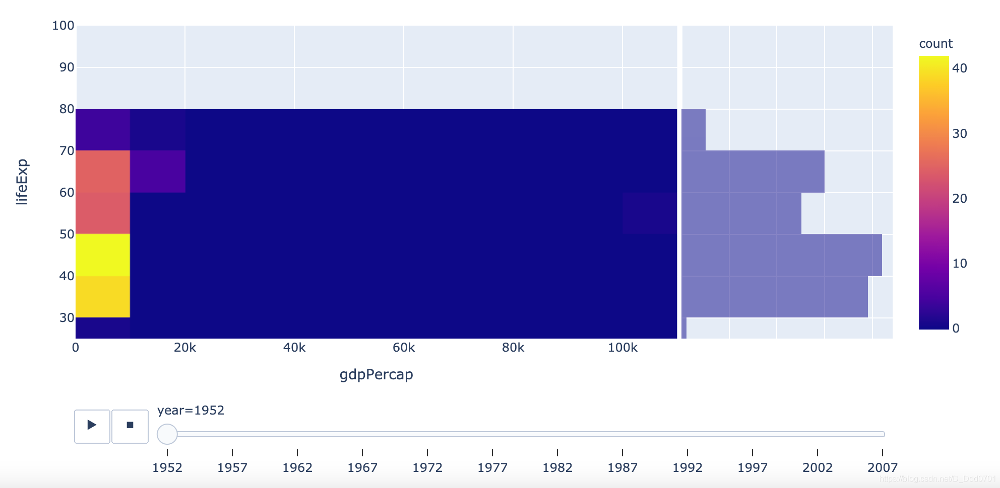
## 动态地理信息图

```python
gapminder = px.data.gapminder()
px.choropleth(gapminder,               
              locations="iso_alpha",               
              color="lifeExp",
              hover_name="country",  
              animation_frame="year",    
              color_continuous_scale='Plasma',  
              height=600             
)
```
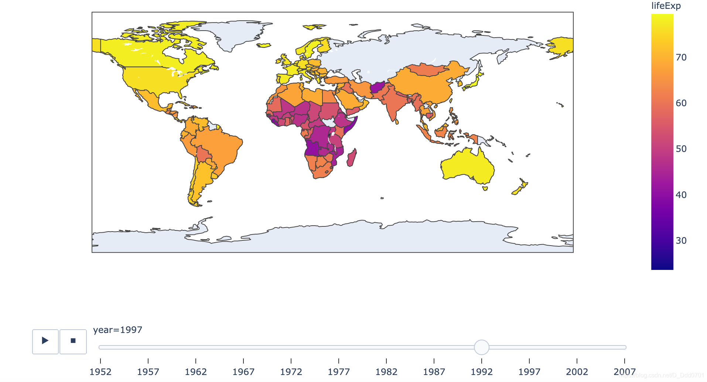
再用地图探究一下某地区犯罪率变化趋势：

```python
df = pd.read_csv('CrimeStatebyState_1960-2014.csv')
df.head()
```
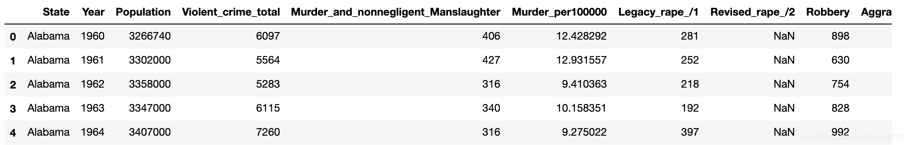
```python
px.choropleth(df, 
              locations = 'State_code',
              color="Murder_per100000", # 用每10万人犯罪数量区别
              animation_frame="Year",
              color_continuous_scale="oranges",
              locationmode='USA-states', # 自带国家边界的geojson数据
              scope="usa",
              range_color=(0, 20),
              title='Crime by State',
              height=600
             )
```
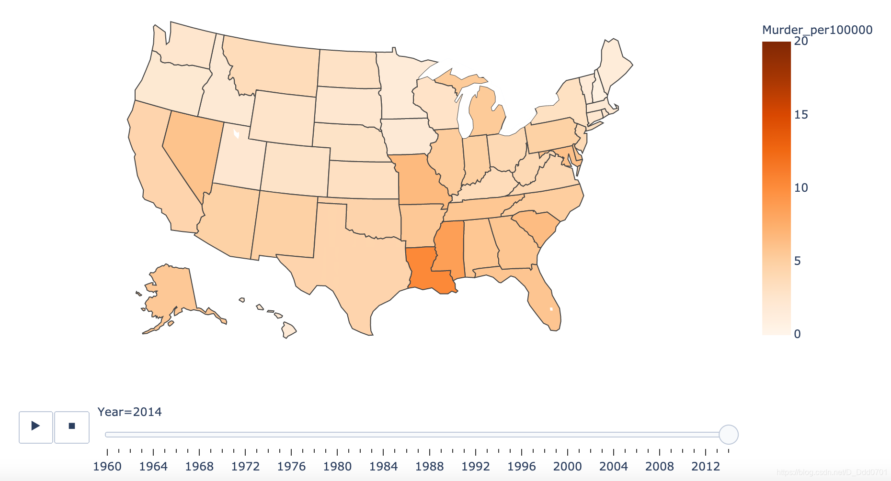