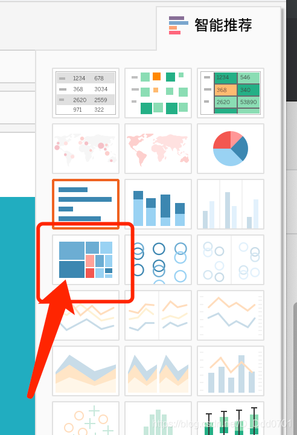
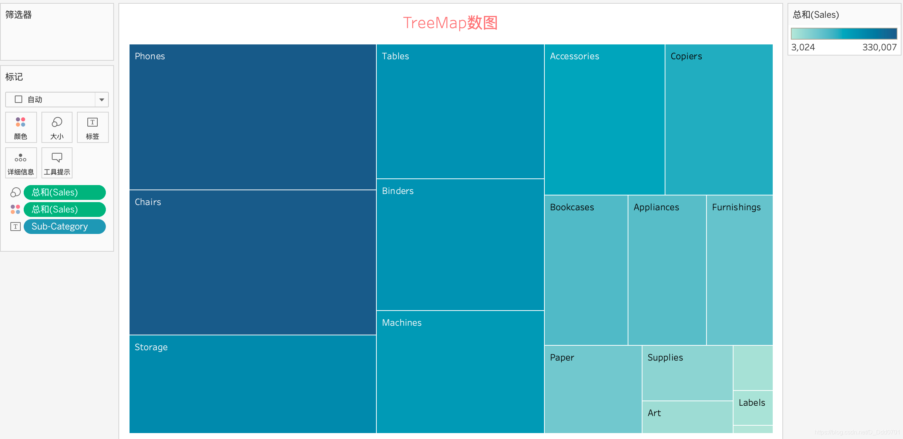
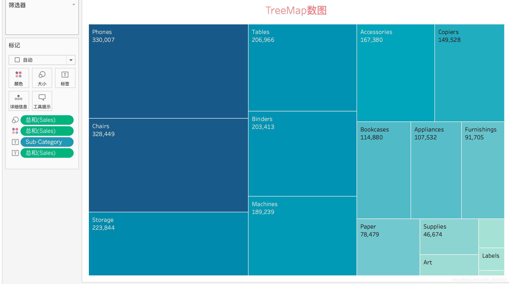
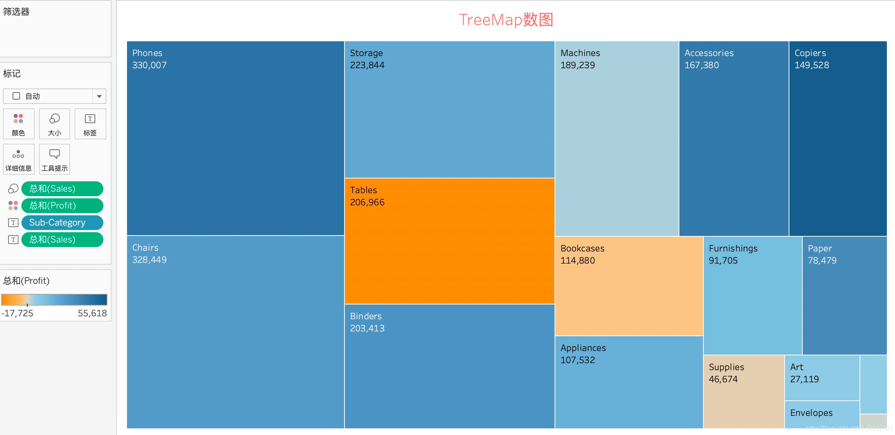
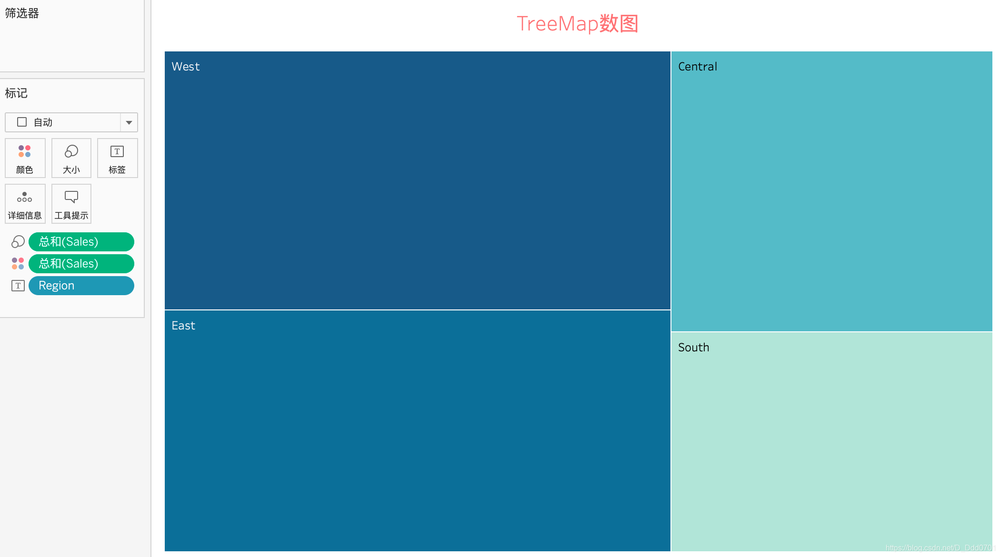
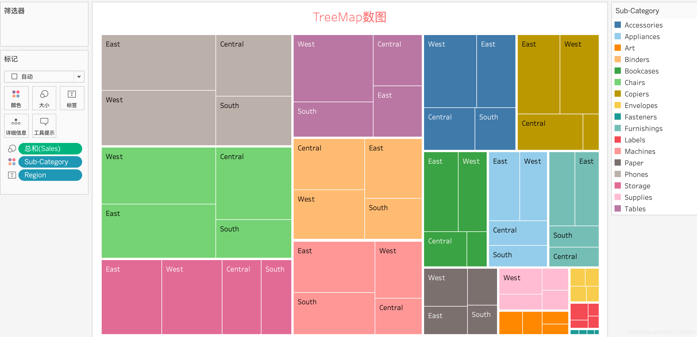
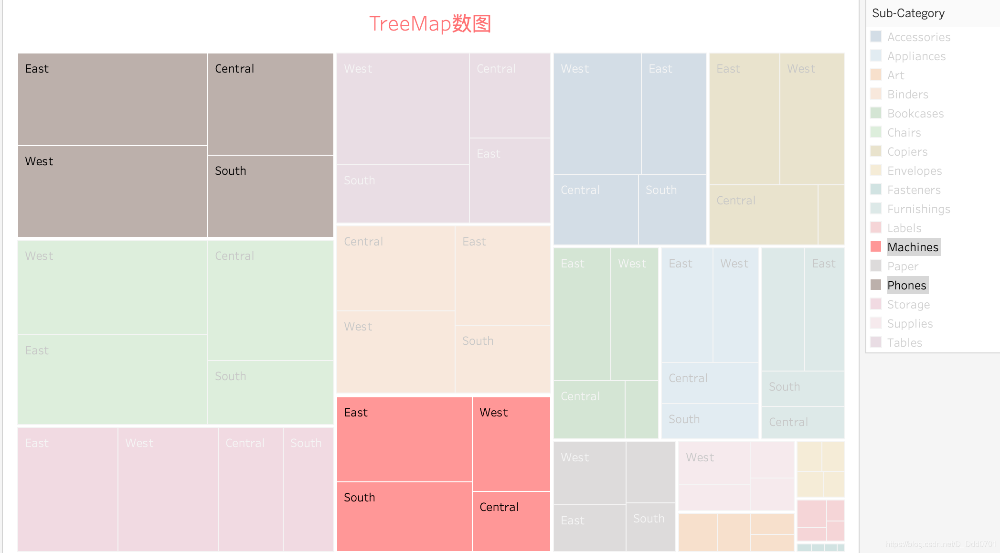

前文的饼图如果被切割的数据太多，会看着非常不舒服，这个时候就应该用数图。使用智能推荐可以绘制数图。

我们以Sub-Category和Sales为例：

最简单的数图就被绘制出来了，我们期望在这个图上显示出具体的销售额，就把Sales拖到标签即可：

除此之外，销售额情况知道了，每个品类的利润情况又如何在数图上反应出来呢？我们知道销售额不等于利润。对此，我们只需要将Profit拖到颜色就行了：

可以看到，销售额很大的Tables类利润其实为负值，而Phones类销售额和利润都是非常大的。通过颜色就能够区分每个品类的利润情况。

这样看数图的优势还并不是特别明显，我们换一个数量更大的例子，以Sales、Region举例：

我们在不同Region的基础上看一看各个子品类的销售情况，把Sub-Category拖到颜色内：

在这张图上，每个品类不同地区的销售额按从大到小排序，并且可以点击摘要来看某一些品类的情况：

显然Machines销售总额并不如Phones（面积代表总销售额），而且Machines销售第二多的地区是南方地区，Phones在南方地区销售额反而最小。如此，就能非常直观的展示出不同信息的差异。